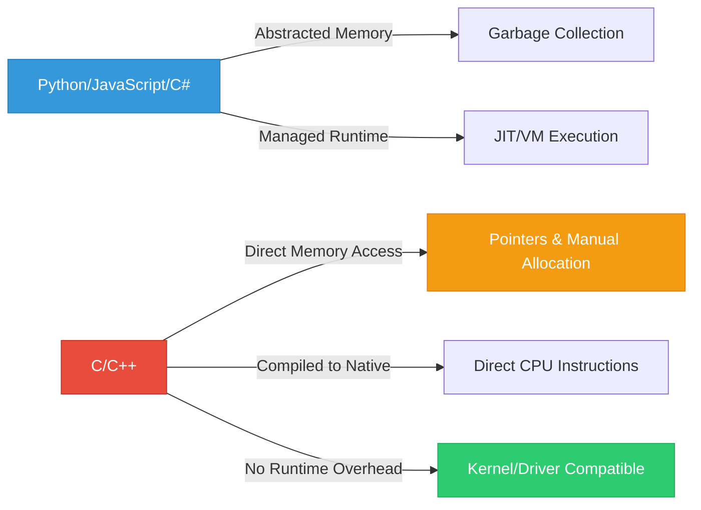
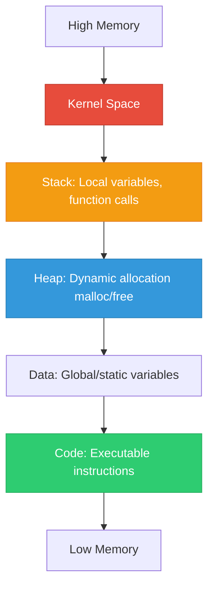
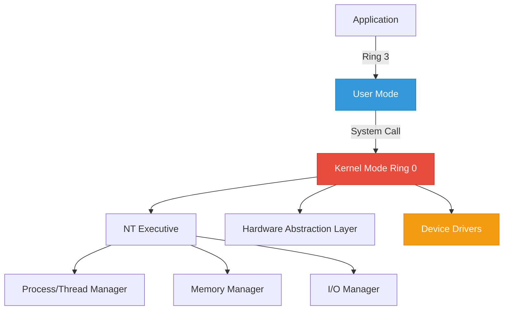

> {: .prompt-warning }
> **STRICTLY EDUCATIONAL & DEFENSIVE PURPOSE:** This guide is designed for security researchers, reverse engineers, defensive programmers, and students learning systems programming. It explains how C is used in operating systems, drivers, and security tooling. It does **not** provide weaponized code, evasion techniques, or offensive malware development instructions. All examples are safe, educational, and focused on understanding system internals, detection, and secure coding. Unauthorized development or deployment of malicious software violates computer fraud laws globally. Always operate within legal scope, use isolated labs, and prioritize defensive knowledge.

---

## Table of Contents
1. Why C? The Language of Systems & Security
2. Part I: C Fundamentals (Starting From Zero)
3. Part II: Memory, Pointers & Execution Flow
4. Part III: Advanced Data Structures (struct, enum, union, typedef)
5. Part IV: Windows API & System Programming
6. Part V: Kernel Mode & Driver Concepts
7. Part VI: Security Applications & Defensive Analysis
8. Part VII: Educational Examples & Safe Practice
9. Conclusion & Learning Path
10. References & Resources

---

## 1. Why C? The Language of Systems & Security

C is not just a programming language; it is the **foundation of modern operating systems, network stacks, embedded devices, and security tooling**. Windows, Linux, macOS, Android, iOS, routers, firewalls, and hypervisors are largely written in C. Understanding C is essential for:
- Reverse engineering binaries and malware samples
- Analyzing kernel drivers and system components
- Writing defensive tools, EDR agents, and detection logic
- Understanding memory corruption vulnerabilities (buffer overflows, use-after-free, etc.)
- Interacting with Windows API, NT kernel structures, and hardware abstractions

### C vs Higher-Level Languages


C gives you **direct control over memory, CPU registers, and system calls**. This power is why it's used for operating systems and drivers, but also why it's frequently targeted by attackers. Defenders must understand C to analyze threats, patch vulnerabilities, and build resilient systems.

---

## Part I: C Fundamentals (Starting From Zero)

### 1.1 What is a Program?
A program is a set of instructions that a CPU executes. C programs are:
1. Written in `.c` files
2. Compiled into machine code (`.exe`, `.sys`, `.dll`)
3. Loaded into memory by the OS
4. Executed by the CPU

### 1.2 Your First C Program
```c
#include <stdio.h>

int main() {
    printf("Hello, Security Student!\n");
    return 0;
}
```
**Explanation:**
- `#include <stdio.h>`: Includes standard input/output library
- `int main()`: Entry point of every C program
- `printf()`: Prints text to console
- `return 0;`: Indicates successful execution

**Compile & Run (Windows):**
```cmd
cl /W4 /O2 hello.c
hello.exe
```
**Output:**
```text
Hello, Security Student!
```

### 1.3 Variables & Data Types
C is **statically typed**. You must declare types before use.

| Type | Size (x64) | Range | Security Relevance |
|------|------------|-------|-------------------|
| `char` | 1 byte | -128 to 127 | Strings, buffers, shellcode |
| `short` | 2 bytes | -32,768 to 32,767 | Network protocols, structs |
| `int` | 4 bytes | -2B to 2B | Counters, flags, API params |
| `long` | 4/8 bytes | Platform dependent | Legacy APIs |
| `long long` | 8 bytes | ±9×10¹⁸ | File sizes, timestamps |
| `float` | 4 bytes | ~7 decimal digits | Rare in security |
| `double` | 8 bytes | ~15 decimal digits | Rare in security |
| `void*` | 8 bytes | Memory address | Pointers, API handles |

**Example:**
```c
#include <stdio.h>

int main() {
    int age = 25;
    char grade = 'A';
    float score = 95.5f;
    
    printf("Age: %d, Grade: %c, Score: %.1f\n", age, grade, score);
    return 0;
}
```

### 1.4 Control Flow
```c
#include <stdio.h>

int main() {
    int access_level = 2;
    
    if (access_level == 1) {
        printf("User access\n");
    } else if (access_level == 2) {
        printf("Admin access\n");
    } else {
        printf("Denied\n");
    }
    
    for (int i = 0; i < 3; i++) {
        printf("Loop iteration: %d\n", i);
    }
    
    int count = 0;
    while (count < 2) {
        printf("While loop: %d\n", count);
        count++;
    }
    
    return 0;
}
```

### 1.5 Functions
Functions encapsulate logic. Security tools use functions for modularity.
```c
#include <stdio.h>

int add(int a, int b) {
    return a + b;
}

void print_status(int code) {
    if (code == 0) printf("SUCCESS\n");
    else printf("FAILURE: %d\n", code);
}

int main() {
    int result = add(5, 3);
    print_status(result > 0 ? 0 : 1);
    return 0;
}
```

---

## Part II: Memory, Pointers & Execution Flow

### 2.1 Memory Layout


### 2.2 Pointers: The Core of C
A pointer stores a **memory address**.
```c
#include <stdio.h>

int main() {
    int value = 42;
    int *ptr = &value;  // & gets address
    
    printf("Value: %d\n", value);
    printf("Address: %p\n", (void*)ptr);
    printf("Dereferenced: %d\n", *ptr);  // * gets value at address
    
    *ptr = 100;  // Modify through pointer
    printf("New Value: %d\n", value);
    return 0;
}
```
**Output:**
```text
Value: 42
Address: 0x7ffeed123456
Dereferenced: 42
New Value: 100
```

### 2.3 Pointer Arithmetic & Arrays
Arrays decay to pointers. Security researchers use this for buffer analysis.
```c
#include <stdio.h>

int main() {
    char buffer[] = "SECURITY";
    char *ptr = buffer;
    
    for (int i = 0; i < 8; i++) {
        printf("buffer[%d] = %c (addr: %p)\n", i, *(ptr + i), (void*)(ptr + i));
    }
    return 0;
}
```

### 2.4 Dynamic Memory Allocation
```c
#include <stdio.h>
#include <stdlib.h>

int main() {
    int *arr = (int*)malloc(5 * sizeof(int));
    if (!arr) {
        printf("Allocation failed\n");
        return 1;
    }
    
    for (int i = 0; i < 5; i++) arr[i] = i * 10;
    
    for (int i = 0; i < 5; i++) printf("%d ", arr[i]);
    printf("\n");
    
    free(arr);  // Critical: Prevent memory leaks
    arr = NULL; // Prevent use-after-free
    return 0;
}
```

> {: .prompt-tip }
> **Security Note:** `malloc`/`free` misuse causes heap corruption, use-after-free, and double-free vulnerabilities. Modern EDRs monitor heap allocations. Defenders use Application Verifier, PageHeap, and heap instrumentation to detect abuse.

---

## Part III: Advanced Data Structures

### 3.1 `struct`: Grouping Related Data
Structures map directly to memory layouts. OS kernels use them extensively.
```c
#include <stdio.h>
#include <stdint.h>

#pragma pack(push, 1)  // Disable padding for exact memory layout
typedef struct {
    uint32_t magic;      // 4 bytes
    uint16_t version;    // 2 bytes
    uint8_t  flags;      // 1 byte
    uint64_t timestamp;  // 8 bytes
} FileHeader;
#pragma pack(pop)

int main() {
    FileHeader hdr = {0x4D5A, 2, 0x01, 1709251200};
    printf("Size: %zu bytes\n", sizeof(hdr));
    printf("Magic: 0x%X\n", hdr.magic);
    return 0;
}
```
**Output:**
```text
Size: 15 bytes
Magic: 0x4D5A
```

### 3.2 `enum`: Named Constants
Enums improve readability and prevent magic numbers.
```c
typedef enum {
    STATUS_SUCCESS = 0,
    STATUS_ACCESS_DENIED = 0xC0000022,
    STATUS_INVALID_PARAMETER = 0xC000000D,
    STATUS_BUFFER_OVERFLOW = 0x80000005
} NTSTATUS;

void check_status(NTSTATUS status) {
    switch (status) {
        case STATUS_SUCCESS: printf("OK\n"); break;
        case STATUS_ACCESS_DENIED: printf("Denied\n"); break;
        default: printf("Error: 0x%08X\n", status);
    }
}
```

### 3.3 `union`: Shared Memory
Unions overlay different types in the same memory space. Used in protocol parsing.
```c
typedef union {
    uint32_t raw;
    struct {
        uint8_t b0, b1, b2, b3;
    } bytes;
} IPAddress;

int main() {
    IPAddress ip;
    ip.raw = 0xC0A80101;  // 192.168.1.1
    printf("%d.%d.%d.%d\n", ip.bytes.b3, ip.bytes.b2, ip.bytes.b1, ip.bytes.b0);
    return 0;
}
```

### 3.4 `typedef`: Type Aliases
Improves code clarity, especially for function pointers and complex types.
```c
typedef int (*ComparisonFunc)(const void*, const void*);
typedef struct _PROCESS_INFO {
    uint32_t pid;
    char name[64];
    uint64_t start_time;
} PROCESS_INFO, *PPROCESS_INFO;
```

### 3.5 Bitfields: Packing Flags
```c
typedef struct {
    uint32_t read : 1;
    uint32_t write : 1;
    uint32_t execute : 1;
    uint32_t reserved : 29;
} FilePermissions;
```

---

## Part IV: Windows API & System Programming

### 4.1 Win32 API Basics
Windows provides thousands of APIs for process, memory, file, and registry manipulation.

**Example: Process Enumeration**
```c
#include <windows.h>
#include <tlhelp32.h>
#include <stdio.h>

void ListProcesses() {
    HANDLE hSnap = CreateToolhelp32Snapshot(TH32CS_SNAPPROCESS, 0);
    if (hSnap == INVALID_HANDLE_VALUE) return;
    
    PROCESSENTRY32 pe = { .dwSize = sizeof(PROCESSENTRY32) };
    if (Process32First(hSnap, &pe)) {
        do {
            printf("PID: %5u | Name: %s\n", pe.th32ProcessID, pe.szExeFile);
        } while (Process32Next(hSnap, &pe));
    }
    CloseHandle(hSnap);
}

int main() {
    ListProcesses();
    return 0;
}
```

### 4.2 Memory Allocation APIs
| API | Purpose | Security Context |
|-----|---------|------------------|
| `VirtualAlloc` | Reserve/commit memory | Used for shellcode injection, PE loading |
| `VirtualProtect` | Change memory permissions | RX/RWX page manipulation |
| `WriteProcessMemory` | Write to another process | Code injection, patching |
| `CreateRemoteThread` | Execute in another process | Classic injection technique |

**Educational Example: Memory Permission Analysis**
```c
#include <windows.h>
#include <stdio.h>

void CheckMemoryProtection(void* addr) {
    MEMORY_BASIC_INFORMATION mbi;
    if (VirtualQuery(addr, &mbi, sizeof(mbi))) {
        printf("Base: %p | Size: %zu | Protect: 0x%X\n", 
               mbi.BaseAddress, mbi.RegionSize, mbi.Protect);
    }
}
```

### 4.3 DLL Loading & API Resolution
```c
#include <windows.h>
#include <stdio.h>

int main() {
    HMODULE hNtdll = LoadLibraryA("ntdll.dll");
    if (!hNtdll) return 1;
    
    typedef NTSTATUS (WINAPI *NtQuerySystemInformation_t)(
        ULONG, PVOID, ULONG, PULONG);
    
    NtQuerySystemInformation_t NtQuerySystemInformation = 
        (NtQuerySystemInformation_t)GetProcAddress(hNtdll, "NtQuerySystemInformation");
    
    if (NtQuerySystemInformation) {
        printf("NtQuerySystemInformation resolved at %p\n", (void*)NtQuerySystemInformation);
    }
    
    FreeLibrary(hNtdll);
    return 0;
}
```

---

## Part V: Kernel Mode & Driver Concepts

### 5.1 User Mode vs Kernel Mode


### 5.2 IRQL (Interrupt Request Level)
IRQL determines execution priority and allowed operations.
| IRQL | Name | Allowed Operations |
|------|------|-------------------|
| 0 | PASSIVE_LEVEL | Pageable memory, blocking calls |
| 1-2 | APC_LEVEL | APC delivery, non-pageable |
| 2 | DISPATCH_LEVEL | DPCs, spin locks, non-pageable |
| ≥27 | DIRQL | Hardware interrupts |

### 5.3 Driver Entry Point
```c
#include <ntddk.h>

NTSTATUS DriverEntry(PDRIVER_OBJECT DriverObject, PUNICODE_STRING RegistryPath) {
    UNREFERENCED_PARAMETER(RegistryPath);
    
    DriverObject->DriverUnload = DriverUnload;
    DbgPrint("[+] Driver loaded successfully\n");
    return STATUS_SUCCESS;
}

void DriverUnload(PDRIVER_OBJECT DriverObject) {
    UNREFERENCED_PARAMETER(DriverObject);
    DbgPrint("[-] Driver unloaded\n");
}
```

### 5.4 NT Structures (Educational Overview)
```c
typedef struct _EPROCESS {
    DISPATCHER_HEADER Header;
    LIST_ENTRY ProcessListEntry;
    LARGE_INTEGER CreateTime;
    LARGE_INTEGER ExitTime;
    // ... hundreds of fields
    PVOID UniqueProcessId;
    LIST_ENTRY ActiveProcessLinks;
    // ...
} EPROCESS, *PEPROCESS;
```
> {: .prompt-warning }
> **Note:** `_EPROCESS` is undocumented and version-dependent. Reverse engineers use WinDbg `dt nt!_EPROCESS` to inspect. Never hardcode offsets in production code.

---

## Part VI: Security Applications & Defensive Analysis

### 6.1 How Understanding C Helps Defenders
| Concept | Defensive Application |
|---------|----------------------|
| Pointers & Memory | Detect heap corruption, use-after-free, buffer overflows |
| Struct Alignment | Parse network protocols, file formats, PE headers safely |
| Windows API | Monitor suspicious calls (VirtualAlloc+WriteProcessMemory+CreateRemoteThread) |
| Kernel Structures | Analyze driver behavior, detect rootkits, validate IRQL usage |
| Compilation Flags | Enable ASLR, DEP, CFG, Control Flow Guard |

### 6.2 Common Vulnerability Patterns
```c
// VULNERABLE: Buffer overflow
void copy_input(char* input) {
    char buffer[64];
    strcpy(buffer, input);  // No bounds checking
}

// SECURE: Bounded copy
void copy_input_safe(char* input, size_t len) {
    char buffer[64];
    if (len >= sizeof(buffer)) return;
    memcpy(buffer, input, len);
    buffer[len] = '\0';
}
```

### 6.3 Detection Signatures (Conceptual)
- `VirtualAlloc` with `PAGE_EXECUTE_READWRITE`
- `NtCreateThreadEx` from non-system process
- Unusual `LoadLibrary` from temp directories
- Driver loading without valid signature
- IRQL violations in kernel callbacks

---

## Part VII: Educational Examples & Safe Practice

### Example 1: Safe Process Information Query
```c
#include <windows.h>
#include <winternl.h>
#include <stdio.h>

#pragma comment(lib, "ntdll.lib")

typedef NTSTATUS (NTAPI *NtQuerySystemInformation_t)(
    SYSTEM_INFORMATION_CLASS, PVOID, ULONG, PULONG);

int main() {
    HMODULE hNtdll = GetModuleHandleA("ntdll.dll");
    NtQuerySystemInformation_t NtQuerySystemInformation = 
        (NtQuerySystemInformation_t)GetProcAddress(hNtdll, "NtQuerySystemInformation");
    
    ULONG size = 0;
    NtQuerySystemInformation(SystemProcessInformation, NULL, 0, &size);
    
    PSYSTEM_PROCESS_INFORMATION spi = (PSYSTEM_PROCESS_INFORMATION)malloc(size);
    if (!spi) return 1;
    
    NTSTATUS status = NtQuerySystemInformation(SystemProcessInformation, spi, size, &size);
    if (NT_SUCCESS(status)) {
        PSYSTEM_PROCESS_INFORMATION current = spi;
        while (TRUE) {
            wprintf(L"PID: %5u | Name: %.*s\n", 
                    (ULONG)(ULONG_PTR)current->UniqueProcessId,
                    current->ImageName.Length / 2,
                    current->ImageName.Buffer);
            if (!current->NextEntryOffset) break;
            current = (PSYSTEM_PROCESS_INFORMATION)((BYTE*)current + current->NextEntryOffset);
        }
    }
    free(spi);
    return 0;
}
```

### Example 2: Memory Region Scanner (Educational)
```c
#include <windows.h>
#include <stdio.h>

void ScanMemoryRegions(HANDLE hProcess) {
    MEMORY_BASIC_INFORMATION mbi;
    void* addr = 0;
    
    while (VirtualQueryEx(hProcess, addr, &mbi, sizeof(mbi)) == sizeof(mbi)) {
        if (mbi.State == MEM_COMMIT && (mbi.Protect & PAGE_EXECUTE_READWRITE)) {
            printf("[!] RWX Region: %p - %p (%zu bytes)\n", 
                   mbi.BaseAddress, 
                   (BYTE*)mbi.BaseAddress + mbi.RegionSize,
                   mbi.RegionSize);
        }
        addr = (BYTE*)mbi.BaseAddress + mbi.RegionSize;
    }
}
```

### Example 3: Safe String Handling
```c
#include <stdio.h>
#include <string.h>
#include <stdlib.h>

char* safe_concat(const char* a, const char* b) {
    size_t len_a = strlen(a);
    size_t len_b = strlen(b);
    size_t total = len_a + len_b + 1;
    
    char* result = (char*)malloc(total);
    if (!result) return NULL;
    
    memcpy(result, a, len_a);
    memcpy(result + len_a, b, len_b);
    result[total - 1] = '\0';
    return result;
}
```

---

## Conclusion & Learning Path

C is the bedrock of systems programming and security engineering. Mastering it enables you to:
- Understand how operating systems and drivers work
- Analyze malware and reverse engineer binaries
- Write secure, efficient, and low-level code
- Detect and mitigate memory corruption vulnerabilities
- Contribute to defensive tooling and EDR development

### Recommended Learning Path
1. **C Fundamentals:** K&R C, C Primer Plus
2. **Windows API:** Windows via C/C++, MSDN Documentation
3. **Memory & Pointers:** Computer Systems: A Programmer's Perspective
4. **Kernel Concepts:** Windows Internals (Part 1 & 2)
5. **Security Applications:** Practical Malware Analysis, Rootkits and Bootkits
6. **Practice:** WinDbg, x64dbg, IDA Free, Ghidra, isolated VMs

> {: .prompt-tip }
> **Defensive Mindset:** The goal is not to write exploits, but to understand how systems work, how they break, and how to protect them. Use isolated labs, follow responsible disclosure, and prioritize defensive engineering.

---

## References & Resources

- [Microsoft Learn: C/C++ Documentation](https://learn.microsoft.com/en-us/cpp/)
- [Windows Internals, 7th Edition](https://www.microsoftpressstore.com/store/windows-internals-part-1-9780735684188)
- [Practical Malware Analysis](https://nostarch.com/malware)
- [Rootkits and Bootkits](https://nostarch.com/rootkits)
- [WinDbg Documentation](https://learn.microsoft.com/en-us/windows-hardware/drivers/debugger/)
- [OWASP Secure Coding Practices](https://owasp.org/www-project-secure-coding-practices-quick-reference-guide/)
- [CWE Top 25: Dangerous Software Weaknesses](https://cwe.mitre.org/top25/)
- [Microsoft Security Response Center](https://msrc.microsoft.com/)
- [National Vulnerability Database](https://nvd.nist.gov/)
- [EDR Bypass Research (Defensive Focus)](https://www.elastic.co/security-labs)

---

*Last updated: March 1, 2024*
*Author: Security Engineer & Systems Programming Instructor*
*License: MIT*

> {: .prompt-warning }
> **LEGAL & ETHICAL NOTICE:** This content is strictly for educational purposes, authorized security research, and defensive programming. Unauthorized development, testing, or deployment of malicious software violates computer fraud and abuse laws globally. Always operate within written scope, use isolated environments, and prioritize defensive security improvements. Knowledge is power; use it responsibly.
````
